# Review: bmo_core_1809151

**Corporate web proxy no Kerberos auth for iframe content since 108.0.1**

- source: https://bugzilla.mozilla.org/show_bug.cgi?id=1809151
- kind: LLM draft (needs review)
- reviewed: `True`
- graph: `data/bugzilla_v0/graphs/bmo_core_1809151.json` · raw thread: `data/bugzilla_v0/raw/bmo_core_1809151.json`

```mermaid
flowchart LR
    N0["<b>N0 iframe proxy authentication regression reported</b><br/><small>info: 8</small>"]
    N1["<b>N1 mozregression output collected</b><br/><small>info: 9</small>"]
    N2["<b>N2 HTTP log delivered</b><br/><small>info: 10</small>"]
    N2_x["<b>N2_x proxy-header workaround rejected</b><br/><small>info: 16</small>"]
    N_terminal["<b>terminal resolved in Nightly</b><br/><small>info: 19</small>"]
    N0 -.->|"❓ mozregression_raw_range_2022_11_11_b7164776"| N1
    linkStyle 0 stroke:#3b82f6,stroke-width:2px
    N1 -.->|"❓ private_http_log_sent_by_email"| N2
    linkStyle 1 stroke:#3b82f6,stroke-width:2px
    N2 ==>|"💥 blind: Treat the X-Frame-Options response as a corporate-proxy configuration problem and temporarily disable that header on the proxy."| N2_x
    linkStyle 2 stroke:#ef4444,stroke-width:2px
    N2_x ==>|"⚡ Back out the regressing iframe authentication-suppression behavior so an unauthenticated proxy response carrying X-Frame-Options or CSP restrictions does not prevent Firefox from performing proxy authentication, then have the reporter verify a build containing the change."| N_terminal
    linkStyle 3 stroke:#f97316,stroke-width:2px
    class N0 start
    class N1 normal
    class N2 normal
    class N2_x normal
    class N_terminal terminal
    classDef start fill:#fee2e2,stroke:#b91c1c,color:#000
    classDef terminal fill:#dcfce7,stroke:#15803d,color:#000
    classDef normal fill:#fef3c7,stroke:#a16207,color:#000
```

## Opening (body)

> We use a corporate proxy with Kerberos authentication and a policy that allows no content without authentication. Since Firefox updated to 108.0.1, authentication is sent for the main page but not for embedded iframe content, so the proxy refuses the iframe connection. This persists across different laptops and virtual machines. Older Firefox versions work, but the issue returns after updating; Beta and Nightly are also affected. Nothing changed on our corporate proxy. The proxy logs show that no authentication is sent for the iframe request. I attached a screenshot.

## Satisfaction conditions

1. Must identify the final root cause: Firefox's iframe framing guard treated an unauthenticated proxy response carrying X-Frame-Options or CSP restrictions as proof that the iframe could not load and suppressed the proxy authentication flow, so Kerberos was never sent.
2. The diagnosis must be grounded in the older-build comparison, raw mozregression range, private HTTP log, and the reporter's explanation of the proxy's unauthenticated fallback response.
3. Must recommend backing out or removing the regressing iframe authentication-suppression behavior so proxy authentication can complete for iframe requests.
4. Must not settle on disabling X-Frame-Options at the corporate proxy: the reporter had no such option, stated that the proxy did not manipulate website content, and the direction was inapplicable.
5. Must ask the reporter to verify a build containing the fix and only treat the issue as resolved after the reporter confirms that the page and iframe load; the reporter did confirm this in the following day's Nightly.

## Edges

| edge | type | gates / info | payload |
|---|---|---|---|
| `e1_N0__N1` | clarification_only | asks: mozregression_raw_range_2022_11_11_b7164776 | I ran mozregression. It reported a 2022-11-11 Firefox 108.0a1 build with changeset b7164776589657b7d7fd40d3226 |
| `e2_N1__N2` | clarification_only | asks: private_http_log_sent_by_email | I recorded the HTTP log and sent the file to you by email. |
| `e3_N2__N2_x` | solution_only **BLIND** | req_info: corporate_proxy_configuration_unchanged, private_http_log_sent_by_email elements: recommends_disabling_x_frame_options_on_the_proxy | Treat the X-Frame-Options response as a corporate-proxy configuration problem and temporarily disable that header on the proxy. |
| `e4_N2_x__N_terminal` | solution_only | req_info: kerberos_auth_missing_for_iframe_since_firefox_108_0_1, main_page_authenticates_but_iframe_proxy_connection_refused, proxy_logs_show_no_authentication_for_iframe_request, older_firefox_works_and_problem_returns_after_update, corporate_proxy_configuration_unchanged, xfo_deny_likely_proxy_response_after_missing_kerberos_auth, no_xfo_disable_option_available, proxy_does_not_modify_website_content, mozregression_raw_range_2022_11_11_b7164776, private_http_log_sent_by_email elements: identifies_iframe_authentication_suppression_as_the_regression, explains_that_the_proxy_response_was_checked_before_proxy_authentication_completed, backs_out_or_removes_the_xfo_csp_authentication_suppression, restores_kerberos_authentication_for_iframe_proxy_requests, asks_user_to_verify_on_a_build_containing_the_fix | Back out the regressing iframe authentication-suppression behavior so an unauthenticated proxy response carrying X-Frame-Options or CSP restrictions does not prevent Firefox from performing proxy authentication, then have the reporter verify a build containing the change. |

## Nodes

| node | terminal | volunteered | images | symptoms |
|---|---|---|---|---|
| `N0` |  | 1 | 0 | The main page loads through our Kerberos-authenticated corporate proxy, but its embedded iframe is refused because Firefox sends no authenti |
| `N1` |  | 0 | 0 | The main page still loads, while the iframe request reaches the proxy without authentication and is refused. |
| `N2` |  | 0 | 0 | The iframe content remains unavailable through the corporate proxy, while the rest of the page loads. |
| `N2_x` |  | 5 | 0 | I cannot find any X-Frame-Options setting to disable on the proxy, and the iframe is still refused while the main page loads. |
| `N_terminal` | ✓ | 1 | 0 | In today's Nightly build, the page and its embedded iframe load without any issues through the corporate proxy. |

## Machine review (audit pass, adversarially verified)

Auditor verdict: **n/a** · 0 of 0 findings survived independent refutation.

__

## Review checklist

> The graph is the case's ANSWER KEY, not a transcript: edge order need
> not mirror thread chronology. Do not file chronology mismatch as a
> defect; what must be faithful is who knew what, when.

Structural (machine-checked by `scripts/validate.py`, re-verify after edits):

- [ ] validates: schema + info-containment + terminal reachability

Semantic (the defect catalog — check each against the source thread):

- [ ] **Faithful blind paths** — every `is_known_blind_path` edge corresponds
  to an attempt actually falsified in the thread (or a brush-off the
  reporter rejected). No invented failures; no ACCEPTED fix mislabeled as
  a blind path (the most common LLM defect class).
- [ ] **Gettable required info** — every id in any `solution.required_info`
  is obtainable: a clarification on some edge, or in the start node's
  info_state, or volunteered (with matching `volunteered_info` text).
  Engineer-only inference belongs in `info_inferred_by_engineer` /
  `inference_hint`, not in hard required_info.
- [ ] **Measurement-class rule** — handler-initiated measurements the user
  executed (bisections, test builds, config probes, version checks) are
  clarification edges, not solutions; their answers state what the
  measurement showed.
- [ ] **No logistics gates** — `required_elements_for_full_match` encode the
  technical diagnostic→fix chain, not release/packaging/scheduling
  remarks the engineer merely mentioned.
- [ ] **Coherent reveals** — each `user_answer_in_this_oncall` is consistent
  with the thread, delivers what it promises, and stays in the user's
  voice (no future knowledge, no diagnosis the user never made).
- [ ] **Symptoms are observations** — `symptoms_visible` contains only what
  the user can see; no causes or advice.
- [ ] **Terminal semantics** — satisfaction_conditions demand root cause +
  evidence grounding + prohibition of falsified moves + user verification;
  the terminal node is the verified-resolved state.
- [ ] **Image assignment** — referenced attachments exist and sit on the
  right hook (opening / node symptom / clarification evidence).
- [ ] **Persona** — matches the reporter's actual expertise and style.

## How to sign off

1. Edit the graph JSON if needed (authored fields only; keep
   `concrete_example` as the factual record).
2. `uv run scripts/validate.py '<graph path>'`
3. Set `metadata.hitl_reviewed: true` in the graph JSON.
4. Re-run `uv run scripts/make_review_docs.py` to refresh this page.
