# Review: bmo_core_1809151

**Corporate web proxy no Kerberos authentication for iframe content since Firefox 108.0.1**

- source: https://bugzilla.mozilla.org/show_bug.cgi?id=1809151
- kind: LLM draft (needs review)
- reviewed: `False`
- graph: `data/bugzilla_v0/graphs/bmo_core_1809151.json` · raw thread: `data/bugzilla_v0/raw/bmo_core_1809151.json`

```mermaid
flowchart LR
    N0["<b>N0 iframe proxy authentication regression reported</b><br/><small>info: 8</small>"]
    N1["<b>N1 mozregression output collected</b><br/><small>info: 9</small>"]
    N2["<b>N2 HTTP log supplied privately</b><br/><small>info: 10</small>"]
    N2_x["<b>N2_x proxy X-Frame-Options workaround rejected</b><br/><small>info: 14</small>"]
    N3["<b>N3 backout build installed, unverified</b><br/><small>info: 14</small>"]
    N_terminal["<b>terminal resolved</b><br/><small>info: 17</small>"]
    N0 -.->|"❓ mozregression_build_2022_11_11_changeset_and_pushlog"| N1
    linkStyle 0 stroke:#3b82f6,stroke-width:2px
    N1 -.->|"❓ private_http_log_sent_to_engineer"| N2
    linkStyle 1 stroke:#3b82f6,stroke-width:2px
    N2 ==>|"🔀 ❓user_identifies_response_as_unauthenticated_proxy_ntlm_fallback + ⚡Treat X-Frame-Options: deny as a proxy-added policy and temporarily disable that header on the corporate proxy."| N2_x
    linkStyle 2 stroke:#a855f7,stroke-width:2px
    N2_x ==>|"⚡ Back out the bug 1629307 iframe X-Frame-Options authentication suppression and use a Firefox build containing that backout, restoring proxy authentication for embedded content."| N3
    linkStyle 3 stroke:#f97316,stroke-width:2px
    N3 -.->|"❓ nightly_retest_iframe_loads_through_proxy_again"| N_terminal
    linkStyle 4 stroke:#3b82f6,stroke-width:2px
    class N0 start
    class N1 normal
    class N2 normal
    class N2_x normal
    class N3 normal
    class N_terminal terminal
    classDef start fill:#fee2e2,stroke:#b91c1c,color:#000
    classDef terminal fill:#dcfce7,stroke:#15803d,color:#000
    classDef normal fill:#fef3c7,stroke:#a16207,color:#000
```

## Opening (body)

> Since Firefox updated to 108.0.1, pages behind our corporate proxy load normally except for embedded iframe content. Firefox sends Kerberos authentication for the rest of the page but not for the iframe requests, so the proxy refuses those connections. We see the missing authentication in the proxy logs. This happens on different laptops and virtual machines, including Beta and Nightly. Older Firefox versions work, and there was no change to our corporate proxy.

## Satisfaction conditions

1. Must identify the root cause: bug 1629307 suppressed authentication for iframe requests when an unauthenticated response appeared blocked by X-Frame-Options/CSP; the corporate proxy's unauthenticated response carried X-Frame-Options: deny, so Firefox failed to proceed with Kerberos proxy authentication.
2. The diagnosis must be grounded in the mozregression output and the privately supplied HTTP log, with the mapping to bug 1629307 and interpretation of the X-Frame-Options response treated as engineer inference.
3. Must recommend the backout of bug 1629307 or updating to a Firefox build containing that backout, rather than changing the corporate Kerberos deployment.
4. Must not present disabling X-Frame-Options on the corporate proxy as the fix; the reporter found no such option, the proxy did not rewrite website content, and that direction did not resolve the issue.
5. Must require successful reporter verification on a fixed build before declaring the issue resolved.

## Edges

| edge | type | gates / info | payload |
|---|---|---|---|
| `e1_N0__N1` | clarification_only | asks: mozregression_build_2022_11_11_changeset_and_pushlog | I ran mozregression. It ended on the 2022-11-11 Firefox 108.0a1 Nightly build, changeset b7164776589657b7d7fd4 |
| `e2_N1__N2` | clarification_only | asks: private_http_log_sent_to_engineer | I recorded the HTTP log and sent the file to you by email. |
| `e3_N2__N2_x` | mixed **BLIND** | req_info: corporate_proxy_configuration_unchanged, private_http_log_sent_to_engineer elements: suggests_disabling_x_frame_options_on_proxy | Treat X-Frame-Options: deny as a proxy-added policy and temporarily disable that header on the corporate proxy. |
| `e4_N2_x__N3` | solution_only | req_info: iframe_proxy_requests_lack_kerberos_since_firefox_108_0_1, older_firefox_versions_work, corporate_proxy_configuration_unchanged, mozregression_build_2022_11_11_changeset_and_pushlog, private_http_log_sent_to_engineer elements: identifies_bug_1629307_as_the_regressing_change, explains_that_the_xfo_check_suppressed_iframe_proxy_authentication, recommends_a_build_containing_the_backout, requires_reporter_verification_before_resolution | Back out the bug 1629307 iframe X-Frame-Options authentication suppression and use a Firefox build containing that backout, restoring proxy authentication for embedded content. |
| `e5_N3__N_terminal` | clarification_only | asks: nightly_retest_iframe_loads_through_proxy_again | I can confirm, the issue is resolved in the nightly build from today. The page is now loading without any issu |

## Nodes

| node | terminal | volunteered | images | symptoms |
|---|---|---|---|---|
| `N0` |  | 1 | 0 | Since Firefox 108.0.1, the main page loads through our Kerberos-authenticated corporate proxy, but embedded iframe content is refused becaus |
| `N1` |  | 0 | 0 | The main page still loads, while iframe requests through the corporate proxy are refused without Kerberos authentication. |
| `N2` |  | 0 | 0 | Iframe content remains unavailable through the proxy while the rest of the page loads. |
| `N2_x` |  | 2 | 0 | I found no option to disable X-Frame-Options, and our proxy does not manipulate website content; the iframe still receives the proxy refusal |
| `N3` |  | 0 | 0 | Does this mean I can already test whether the problem is gone in the latest Nightly build? I haven't retested the affected page yet. |
| `N_terminal` | ✓ | 0 | 0 | Pages and their embedded iframe content load normally through the Kerberos-authenticated corporate proxy in Firefox builds containing the fi |

## Machine review (audit pass, adversarially verified)

Auditor verdict: **needs_rework** · 3 of 3 findings survived independent refutation.

_The case tests a Firefox 108 regression where an XFO/CSP-based auth-prompt suppression (bug 1629307) stopped Kerberos proxy authentication for iframe requests, because the corporate proxy's *unauthenticated* response carried `X-Frame-Options: deny`. The graph gets the hard parts right: the mozregression and private-HTTP-log steps are correctly modeled as clarifications, the root cause and satisfaction conditions match participant3's analysis (c9) and the eventual backout, and the rejected "disable X-Frame-Options on your proxy" suggestion (c10, refuted by the reporter in c11) is correctly and accurately marked as the blind path. The main defect is ordering: the thread's fix (backout, c12–c22) is placed *after* its own verification (c24), so N2_x's only outgoing edge is a clarification asking the user to test a Nightly "containing the backout", and the real solution edge e5 hard-requires that verification result — an agent that proposes the correct fix at the right moment has no edge to take. A secondary fidelity issue is that c10 was a question plus a conditional workaround, but is modeled as solution_only._

### Confirmed findings

- [ ] 🔴 **graph_shape** (high) — `graph.edges[e4_N2_x__N3] / graph.edges[e5_N3__N_terminal].solution.required_info.L3`
  - claim: The fix and its verification are inverted: N2_x's only out-edge is the clarification "test the Nightly containing the backout" (e4), and the actual solution edge e5 hard-requires `nightly_with_backout_verified_iframe_loading`, so an agent that correctly proposes the bug-1629307 backout at N2_x has no matching edge and cannot reach the terminal until it first asks for a verification of a fix it has not yet proposed.
  - thread evidence: Thread order is diagnose → fix → verify: c9 (participant3) "I propose to remove the check we introduced in 1629307 via pref"; c12 (participant4) "Backout the regressing patch and reopen regressing bug"; c19/c22 backout landed (hg.mozilla.org/mozilla-central/rev/8d52a2806191); only then c23 reporter "Does the last post from Sebastian means that I can test if the problem is gone in the latest nightly build?" and c24 "I can confirm, the issue is resolved in the nightly build from today." The graph places the verification clarification (e4) before the solution edge (e5).
  - suggested fix: Make N2_x → (new node) a solution_only edge carrying the bug-1629307 backout / "use a build containing the backout" proposal, and model the Nightly retest as the verification that closes the terminal (either as the terminal's own condition or as a clarification on the post-fix edge). Remove `nightly_with_backout_verified_iframe_loading` from e5's hard required_info; keep verification as a `required_elements_for_full_match` item (it already is: `requires_reporter_verification_before_resolution`).
  - verifier: Independently confirmed on both sides. Graph: N2_x has exactly one out-edge (e4_N2_x__N3, clarification_only, no solution object); N_terminal has exactly one in-edge (e5_N3__N_terminal, solution_only) whose required_info.L3 hard-lists `nightly_with_backout_verified_iframe_loading`, which is produced only by e4. So the canonical path forces ask-for-verification BEFORE propose-fix. Thread order is t
- [ ] 🟠 **edge_type_misclassification** (medium) — `graph.edges[e3_N2__N2_x].edge_type / .clarifications`
  - claim: Comment c10 was primarily a request for information from the reporter (confirm whether the proxy, not the site, added the XFO header) with a conditional workaround attached, but the edge is modeled as solution_only with zero clarifications; the reporter's answering facts are demoted to volunteered_info on the aftermath node, so an agent making the historically correct move — asking who adds the X-Frame-Options header — earns no clarification credit and is instead matched against a blind-path solution.
  - thread evidence: c10 (participant3): "Could you please confirm this header was added by the proxy and not by the original site? If this is the case you could try disabling it as temporary fix." c11 (reporter) answers exactly that question: "i guess the `X-Frame-Options: deny` you are seeing in the logs is the answer from the coporate proxy, because no authentication was sent for kerberos the proxy answers with a ntlm negotiate as a fallback. I found no option to disable any X-Frame-Options. We do not manipulate any content of the website with the proxy..."
  - suggested fix: Change e3 to edge_type=mixed: keep the (correctly falsified) proxy-disable solution, and add a clarification whose info_id is `user_identifies_response_as_unauthenticated_proxy_ntlm_fallback` (question patterns: "Is the X-Frame-Options: deny header added by your proxy or by the original site?") with the c11 text as user_answer, removing that id from N2_x.volunteered_info.
  - verifier: Confirmed against both sources. c10 (participant3) is verbatim: 'Could you please confirm this header was added by the proxy and not by the original site? If this is the case you could try disabling it as temporary fix.' — an information request with a *conditional* workaround, i.e. mixed by the contract's definition (asks for info AND proposes a system-changing action). c11 (reporter) answers pre
- [ ] 🟡 **graph_shape** (low) — `graph.edges[e4_N2_x__N3].clarifications[0].question_patterns`
  - claim: At graph position N2_x (thread state after c11) no backout exists yet, but the clarification's question patterns name it outright — "the latest Nightly containing the backout" and "after the regressing change was backed out" — so the step the agent is asked to produce already encodes the answer-key element that e5 is supposed to test (identifying and backing out the regressing change).
  - thread evidence: c11 (reporter, 2023-01-18) is the last state before the fix; the backout decision is c12 (2023-01-24) and it lands at c19/c22 (2023-01-25/26). Also, no engineer asked the reporter to retest — the reporter asked on his own initiative in c23: "Does the last post from Sebastian means that I can test if the problem is gone in the latest nightly build?"
  - suggested fix: Reword the patterns to be backout-agnostic retest requests ("Please retest the affected page in today's Nightly build and tell us whether the iframe now loads") and attach them downstream of the solution edge that actually proposes the backout.
  - verifier: The textual facts check out: e4.clarifications[0].question_patterns are exactly 'Can you test the latest Nightly containing the backout and confirm whether the iframe now authenticates and loads?' and 'Please retest the affected page in today's Nightly build after the regressing change was backed out.' N2_x corresponds to the state after c11 (2023-01-18); the backout decision is c12 (2023-01-24) a

## Review checklist

> The graph is the case's ANSWER KEY, not a transcript: edge order need
> not mirror thread chronology. Do not file chronology mismatch as a
> defect; what must be faithful is who knew what, when.

Structural (machine-checked by `scripts/validate.py`, re-verify after edits):

- [ ] validates: schema + info-containment + terminal reachability

Semantic (the defect catalog — check each against the source thread):

- [ ] **Faithful blind paths** — every `is_known_blind_path` edge corresponds
  to an attempt actually falsified in the thread (or a brush-off the
  reporter rejected). No invented failures; no ACCEPTED fix mislabeled as
  a blind path (the most common LLM defect class).
- [ ] **Gettable required info** — every id in any `solution.required_info`
  is obtainable: a clarification on some edge, or in the start node's
  info_state, or volunteered (with matching `volunteered_info` text).
  Engineer-only inference belongs in `info_inferred_by_engineer` /
  `inference_hint`, not in hard required_info.
- [ ] **Measurement-class rule** — handler-initiated measurements the user
  executed (bisections, test builds, config probes, version checks) are
  clarification edges, not solutions; their answers state what the
  measurement showed.
- [ ] **No logistics gates** — `required_elements_for_full_match` encode the
  technical diagnostic→fix chain, not release/packaging/scheduling
  remarks the engineer merely mentioned.
- [ ] **Coherent reveals** — each `user_answer_in_this_oncall` is consistent
  with the thread, delivers what it promises, and stays in the user's
  voice (no future knowledge, no diagnosis the user never made).
- [ ] **Symptoms are observations** — `symptoms_visible` contains only what
  the user can see; no causes or advice.
- [ ] **Terminal semantics** — satisfaction_conditions demand root cause +
  evidence grounding + prohibition of falsified moves + user verification;
  the terminal node is the verified-resolved state.
- [ ] **Image assignment** — referenced attachments exist and sit on the
  right hook (opening / node symptom / clarification evidence).
- [ ] **Persona** — matches the reporter's actual expertise and style.

## How to sign off

1. Edit the graph JSON if needed (authored fields only; keep
   `concrete_example` as the factual record).
2. `uv run scripts/validate.py '<graph path>'`
3. Set `metadata.hitl_reviewed: true` in the graph JSON.
4. Re-run `uv run scripts/make_review_docs.py` to refresh this page.
