# Review: bmo_core_1809151

**Corporate web proxy no Kerberos authentication for iframe content since Firefox 108.0.1**

- source: https://bugzilla.mozilla.org/show_bug.cgi?id=1809151
- kind: LLM draft (needs review)
- reviewed: `False`
- graph: `data/bugzilla_v0/graphs/bmo_core_1809151.json` · raw thread: `data/bugzilla_v0/raw/bmo_core_1809151.json`

```mermaid
flowchart LR
    N0["<b>N0 iframe proxy authentication regression reported</b><br/><small>info: 8</small>"]
    N1["<b>N1 mozregression output collected</b><br/><small>info: 9</small>"]
    N2["<b>N2 HTTP log supplied privately</b><br/><small>info: 10</small>"]
    N2_x["<b>N2_x proxy X-Frame-Options workaround rejected</b><br/><small>info: 14</small>"]
    N3["<b>N3 backout build installed, unverified</b><br/><small>info: 14</small>"]
    N_terminal["<b>terminal resolved</b><br/><small>info: 17</small>"]
    N0 -.->|"❓ mozregression_build_2022_11_11_changeset_and_pushlog"| N1
    linkStyle 0 stroke:#3b82f6,stroke-width:2px
    N1 -.->|"❓ private_http_log_sent_to_engineer"| N2
    linkStyle 1 stroke:#3b82f6,stroke-width:2px
    N2 ==>|"🔀 ❓user_identifies_response_as_unauthenticated_proxy_ntlm_fallback + ⚡Treat X-Frame-Options: deny as a proxy-added policy and temporarily disable that header on the corporate proxy."| N2_x
    linkStyle 2 stroke:#a855f7,stroke-width:2px
    N2_x ==>|"⚡ Back out the bug 1629307 iframe X-Frame-Options authentication suppression and use a Firefox build containing that backout, restoring proxy authentication for embedded content."| N3
    linkStyle 3 stroke:#f97316,stroke-width:2px
    N3 -.->|"❓ nightly_retest_iframe_loads_through_proxy_again"| N_terminal
    linkStyle 4 stroke:#3b82f6,stroke-width:2px
    class N0 start
    class N1 normal
    class N2 normal
    class N2_x normal
    class N3 normal
    class N_terminal terminal
    classDef start fill:#fee2e2,stroke:#b91c1c,color:#000
    classDef terminal fill:#dcfce7,stroke:#15803d,color:#000
    classDef normal fill:#fef3c7,stroke:#a16207,color:#000
```

## Opening (body)

> Since Firefox updated to 108.0.1, pages behind our corporate proxy load normally except for embedded iframe content. Firefox sends Kerberos authentication for the rest of the page but not for the iframe requests, so the proxy refuses those connections. We see the missing authentication in the proxy logs. This happens on different laptops and virtual machines, including Beta and Nightly. Older Firefox versions work, and there was no change to our corporate proxy.

## Satisfaction conditions

1. Must identify the root cause: bug 1629307 suppressed authentication for iframe requests when an unauthenticated response appeared blocked by X-Frame-Options/CSP; the corporate proxy's unauthenticated response carried X-Frame-Options: deny, so Firefox failed to proceed with Kerberos proxy authentication.
2. The diagnosis must be grounded in the mozregression output and the privately supplied HTTP log, with the mapping to bug 1629307 and interpretation of the X-Frame-Options response treated as engineer inference.
3. Must recommend the backout of bug 1629307 or updating to a Firefox build containing that backout, rather than changing the corporate Kerberos deployment.
4. Must not present disabling X-Frame-Options on the corporate proxy as the fix; the reporter found no such option, the proxy did not rewrite website content, and that direction did not resolve the issue.
5. Must require successful reporter verification on a fixed build before declaring the issue resolved.

## Edges

| edge | type | gates / info | payload |
|---|---|---|---|
| `e1_N0__N1` | clarification_only | asks: mozregression_build_2022_11_11_changeset_and_pushlog | I ran mozregression. It ended on the 2022-11-11 Firefox 108.0a1 Nightly build, changeset b7164776589657b7d7fd4 |
| `e2_N1__N2` | clarification_only | asks: private_http_log_sent_to_engineer | I recorded the HTTP log and sent the file to you by email. |
| `e3_N2__N2_x` | mixed **BLIND** | req_info: corporate_proxy_configuration_unchanged, private_http_log_sent_to_engineer elements: suggests_disabling_x_frame_options_on_proxy | Treat X-Frame-Options: deny as a proxy-added policy and temporarily disable that header on the corporate proxy. |
| `e4_N2_x__N3` | solution_only | req_info: iframe_proxy_requests_lack_kerberos_since_firefox_108_0_1, older_firefox_versions_work, corporate_proxy_configuration_unchanged, mozregression_build_2022_11_11_changeset_and_pushlog, private_http_log_sent_to_engineer elements: identifies_bug_1629307_as_the_regressing_change, explains_that_the_xfo_check_suppressed_iframe_proxy_authentication, recommends_a_build_containing_the_backout, requires_reporter_verification_before_resolution | Back out the bug 1629307 iframe X-Frame-Options authentication suppression and use a Firefox build containing that backout, restoring proxy authentication for embedded content. |
| `e5_N3__N_terminal` | clarification_only | asks: nightly_retest_iframe_loads_through_proxy_again | I can confirm, the issue is resolved in the nightly build from today. The page is now loading without any issu |

## Nodes

| node | terminal | volunteered | images | symptoms |
|---|---|---|---|---|
| `N0` |  | 1 | 0 | Since Firefox 108.0.1, the main page loads through our Kerberos-authenticated corporate proxy, but embedded iframe content is refused becaus |
| `N1` |  | 0 | 0 | The main page still loads, while iframe requests through the corporate proxy are refused without Kerberos authentication. |
| `N2` |  | 0 | 0 | Iframe content remains unavailable through the proxy while the rest of the page loads. |
| `N2_x` |  | 2 | 0 | I found no option to disable X-Frame-Options, and our proxy does not manipulate website content; the iframe still receives the proxy refusal |
| `N3` |  | 0 | 0 | Does this mean I can already test whether the problem is gone in the latest Nightly build? I haven't retested the affected page yet. |
| `N_terminal` | ✓ | 0 | 0 | In today's Nightly the page loads completely again — the embedded iframe content comes through the corporate proxy without the refusal error |

## Machine review (audit pass, adversarially verified)

Auditor verdict: **minor_issues** · 1 of 3 findings survived independent refutation.

_The case tests whether an agent can drive an enterprise Kerberos-proxy iframe-auth regression from opening report → mozregression bisection → private HTTP log → the falsified "disable X-Frame-Options on your proxy" detour → identifying bug 1629307's XFO auth-suppression as the regressor → backout + reporter verification. The graph is a faithful rendering of the thread: comment provenance is exact (e3=c9–c11, e5=c23–c24), the bisection answer carries only raw mozregression output and never names bug 1629307, the engineer-only readings of the private log are correctly quarantined in info_inferred_by_engineer/inference_hint rather than required_info, the one blind path is a genuinely rejected proposal, and the root cause and satisfaction conditions match the engineer's own analysis in c9. Only three low-severity fidelity/labelling nits remain; none inverts scoring._

### Confirmed findings

- [ ] 🟡 **terminal_semantics** (low) — `graph.nodes.N_terminal.symptoms_visible[0]`
  - claim: The terminal symptom is phrased with engineering/fix-status framing ("in Firefox builds containing the fix") instead of the plain observation the reporter actually made.
  - thread evidence: Comment index 24 (reporter): "I can confirm, the issue is resolved in the nightly build from today. The page is now loading without any issues again!" — the reporter never characterises the build as "containing the fix"; SEMANTIC RULE 2 in src/graph_bench/pipeline/prompts.py says the terminal node states the observable end state, never engineering status.
  - suggested fix: Rewrite as the user's observation, e.g. "In today's Nightly the page loads completely again — the embedded iframe content comes through the corporate proxy without the refusal error."
  - verifier: The rule citation checks out verbatim in prompts.py rule 2: "Aftermath nodes state the post-attempt OBSERVATION ...; the terminal node states the observable end state, never release management or engineering status." N_terminal.symptoms_visible[0] reads "Pages and their embedded iframe content load normally through the Kerberos-authenticated corporate proxy in Firefox builds containing the fix." T

### Refuted claims (auditor was wrong — do not act on these)

- ~~symptom_contains_diagnosis~~: N3's symptoms_visible is a procedural question rather than an observable state, and it contradicts the node's own label and system-state assertion that the fixed build is already installed.
  - why refuted: The cited defect class is not present: SEMANTIC RULE 2 forbids "diagnoses, causes, advice, or verdicts on an approach" in symptoms_visible, and N3's text contains none of those. It is c23 verbatim in the reporter's first-person voice ("Does the last post from Sebastian means that I can test if the problem is gone in th
- ~~measurement_class_violation~~: The header-origin fact is graded L2_inferable although it is proxy-internal knowledge only the reporter holds and it was surfaced solely because the handler asked for it, which should make it L3_specific.
  - why refuted: The reviewer's reading of the level rule proves too much. prompts.py rule 1 defines "L2 = inferable from evidence already surfaced; L3 = must be asked for or measured", and the sentence the reviewer quotes is specifically about "A fact visible in an artifact but only surfaced after a handler told the reporter to go che

## Review checklist

> The graph is the case's ANSWER KEY, not a transcript: edge order need
> not mirror thread chronology. Do not file chronology mismatch as a
> defect; what must be faithful is who knew what, when.

Structural (machine-checked by `scripts/validate.py`, re-verify after edits):

- [ ] validates: schema + info-containment + terminal reachability

Semantic (the defect catalog — check each against the source thread):

- [ ] **Faithful blind paths** — every `is_known_blind_path` edge corresponds
  to an attempt actually falsified in the thread (or a brush-off the
  reporter rejected). No invented failures; no ACCEPTED fix mislabeled as
  a blind path (the most common LLM defect class).
- [ ] **Gettable required info** — every id in any `solution.required_info`
  is obtainable: a clarification on some edge, or in the start node's
  info_state, or volunteered (with matching `volunteered_info` text).
  Engineer-only inference belongs in `info_inferred_by_engineer` /
  `inference_hint`, not in hard required_info.
- [ ] **Measurement-class rule** — handler-initiated measurements the user
  executed (bisections, test builds, config probes, version checks) are
  clarification edges, not solutions; their answers state what the
  measurement showed.
- [ ] **No logistics gates** — `required_elements_for_full_match` encode the
  technical diagnostic→fix chain, not release/packaging/scheduling
  remarks the engineer merely mentioned.
- [ ] **Coherent reveals** — each `user_answer_in_this_oncall` is consistent
  with the thread, delivers what it promises, and stays in the user's
  voice (no future knowledge, no diagnosis the user never made).
- [ ] **Symptoms are observations** — `symptoms_visible` contains only what
  the user can see; no causes or advice.
- [ ] **Terminal semantics** — satisfaction_conditions demand root cause +
  evidence grounding + prohibition of falsified moves + user verification;
  the terminal node is the verified-resolved state.
- [ ] **Image assignment** — referenced attachments exist and sit on the
  right hook (opening / node symptom / clarification evidence).
- [ ] **Persona** — matches the reporter's actual expertise and style.

## How to sign off

1. Edit the graph JSON if needed (authored fields only; keep
   `concrete_example` as the factual record).
2. `uv run scripts/validate.py '<graph path>'`
3. Set `metadata.hitl_reviewed: true` in the graph JSON.
4. Re-run `uv run scripts/make_review_docs.py` to refresh this page.
