# Review: bmo_core_1809151

**Corporate web proxy does not send Kerberos authentication for iframe content since Firefox 108.0.1**

- source: https://bugzilla.participant7.org/show_bug.cgi?id=1809151
- kind: LLM draft (needs review)
- reviewed: `False`
- graph: `data/bugzilla_v0/graphs/bmo_core_1809151.json` · raw thread: `data/bugzilla_v0/raw/bmo_core_1809151.json`

```mermaid
flowchart LR
    N0["<b>N0 iframe proxy-auth regression reported</b><br/><small>info: 7</small>"]
    N1["<b>N1 regression range collected</b><br/><small>info: 8</small>"]
    N2["<b>N2 HTTP log identifies regressing behavior</b><br/><small>info: 11</small>"]
    N3["<b>N3 proxy response distinguished from site policy</b><br/><small>info: 16</small>"]
    N4["<b>N4 backout verified in Nightly</b><br/><small>info: 17</small>"]
    N_terminal["<b>terminal resolved</b><br/><small>info: 18</small>"]
    N0 -.->|"❓ mozregression_points_to_2022_11_11_changeset_b7164776589657b7"| N1
    linkStyle 0 stroke:#3b82f6,stroke-width:2px
    N1 -.->|"❓ private_http_log_sent_to_necko"| N2
    linkStyle 1 stroke:#3b82f6,stroke-width:2px
    N2 -.->|"❓ xfo_deny_is_proxy_unauthenticated_response_not_origin_policy, proxy_does_not_modify_site_content, no_proxy_option_found_to_disable_x_frame_options"| N3
    linkStyle 2 stroke:#3b82f6,stroke-width:2px
    N3 -.->|"❓ nightly_with_bug_1629307_backout_verified_fixed"| N4
    linkStyle 3 stroke:#3b82f6,stroke-width:2px
    N4 ==>|"⚡ Back out bug 1629307, which incorrectly suppressed proxy authentication for iframe requests after interpreting the proxy's unauthenticated X-Frame-Options response as proof that the iframe could not load, then uplift the verified backout to supported beta and release branches."| N_terminal
    linkStyle 4 stroke:#f97316,stroke-width:2px
    class N0 start
    class N1 normal
    class N2 normal
    class N3 normal
    class N4 normal
    class N_terminal terminal
    classDef start fill:#fee2e2,stroke:#b91c1c,color:#000
    classDef terminal fill:#dcfce7,stroke:#15803d,color:#000
    classDef normal fill:#fef3c7,stroke:#a16207,color:#000
```

## Opening (body)

> We use a corporate proxy with Kerberos authentication, where content is unavailable without authentication. Since updating Firefox to 108.0.1, pages load normally except for embedded iframe content. Firefox sends authentication for the rest of the page but not for the iframe request, so the proxy refuses the connection; our proxy logs also show that no authentication was sent. This happens consistently on different laptops and virtual machines. Older Firefox versions work, while beta and Nightly are also affected. There were no changes to our corporate proxy. Embedded iframe content should be authenticated through the proxy and load normally.

## Satisfaction conditions

1. Must identify the true root cause: bug 1629307 suppressed authentication for iframe requests when an X-Frame-Options/CSP check suggested the frame could not load; in this environment, the X-Frame-Options: deny response came from the corporate proxy only after Kerberos authentication was absent, causing Firefox to suppress the authentication needed to escape that response.
2. Must ground the diagnosis in the collected evidence: the Firefox-only regression and unchanged proxy, the mozregression range, the private HTTP log containing X-Frame-Options: deny, and the reporter's explanation that this was the proxy's unauthenticated fallback response rather than an origin policy.
3. Must not settle on disabling X-Frame-Options or changing the corporate proxy as the resolution: the reporter found no such option, the proxy does not manipulate authenticated site content, and the regression was fixed by backing out Firefox bug 1629307.
4. Must propose or describe backing out the regressing bug 1629307 and carrying the backout to the affected release channels.
5. Must require the reporter's successful test of a Nightly containing the backout before declaring the issue resolved, and should include the Firefox 110.0b6 and 109.0.1 rollout.

## Edges

| edge | type | gates / info | payload |
|---|---|---|---|
| `e1_N0__N1` | clarification_only | asks: mozregression_points_to_2022_11_11_changeset_b7164776589657b7 | I ran mozregression. It selected the 2022-11-11 Firefox 108.0a1 build at changeset b7164776589657b7d7fd40d3226 |
| `e2_N1__N2` | clarification_only | asks: private_http_log_sent_to_necko | I recorded the HTTP log and sent the file by email to participant9. |
| `e3_N2__N3` | clarification_only | asks: xfo_deny_is_proxy_unauthenticated_response_not_origin_policy, proxy_does_not_modify_site_content, no_proxy_option_found_to_disable_x_frame_options | The X-Frame-Options: deny response is from the corporate proxy after Firefox fails to send Kerberos authentica / No. We only scan for malicious content and do not manipulate the website content. / I found no option to disable X-Frame-Options. |
| `e4_N3__N4` | clarification_only | asks: nightly_with_bug_1629307_backout_verified_fixed | I tested today's Nightly and can confirm that the issue is resolved. The page and its iframe now load without  |
| `e5_N4__N_terminal` | solution_only | req_info: iframe_proxy_kerberos_auth_missing_since_108_0_1, top_level_page_authenticates_but_iframe_fails, corporate_proxy_configuration_unchanged, xfo_deny_is_proxy_unauthenticated_response_not_origin_policy, proxy_does_not_modify_site_content, mozregression_points_to_2022_11_11_changeset_b7164776589657b7, private_http_log_sent_to_necko, http_log_contains_x_frame_options_deny_response, nightly_with_bug_1629307_backout_verified_fixed elements: identifies_bug_1629307_as_the_regressing_change, explains_that_proxy_xfo_response_was_misclassified_before_authentication_completed, backs_out_the_regressing_auth_suppression, mentions_reporter_verification_in_nightly, mentions_release_and_beta_uplift | Back out bug 1629307, which incorrectly suppressed proxy authentication for iframe requests after interpreting the proxy's unauthenticated X-Frame-Options response as proof that the iframe could not load, then uplift the verified backout to supported beta and release branches. |

## Nodes

| node | terminal | volunteered | images | symptoms |
|---|---|---|---|---|
| `N0` |  | 7 | 0 | Since Firefox 108.0.1, the main page loads through the Kerberos-authenticated corporate proxy, but embedded iframe content shows that the pr |
| `N1` |  | 0 | 0 | The iframe still fails to load through the proxy while the rest of the page loads. |
| `N2` |  | 0 | 0 | The iframe remains unavailable, and the corporate proxy continues to refuse its request while the surrounding page loads. |
| `N3` |  | 0 | 0 | The iframe still shows the proxy refusal, and no setting is available to disable X-Frame-Options on the corporate proxy. |
| `N4` |  | 0 | 0 | In the latest Nightly containing the backout, the page and its iframe load without any issues through the corporate proxy. |
| `N_terminal` | ✓ | 0 | 0 | The verified backout is available for Firefox 109.0.1 and Firefox 110.0b6, restoring authenticated iframe loading in the affected enterprise |

## Machine review (audit pass, adversarially verified)

Auditor verdict: **needs_rework** · 3 of 5 findings survived independent refutation.

_The case tests whether an agent can drive an enterprise Kerberos-proxy iframe-auth regression from report → mozregression range → private HTTP log → distinguishing a proxy-generated X-Frame-Options: deny from an origin policy → backing out Firefox bug 1629307, with reporter verification in Nightly. The graph is broadly faithful to the thread: the clarification chain mirrors comments 1–11, the measurement-class edges (mozregression, HTTP log, Nightly test) are correctly clarification_only, and the root cause in satisfaction_conditions matches participant3's comment 9 analysis. Two structural problems would corrupt scoring: one hard required_info id is ungettable (it exists only as engineer log-reading), and the canonical chain asks the user to verify a Nightly containing the backout BEFORE any edge proposes the backout, inverting the thread's actual order and making the historically correct move (propose backout at N3) off-path. Release-uplift bookkeeping is also baked into the full-match requirements._

### Confirmed findings

- [ ] 🟠 **required_but_ungettable** (medium) — `n/a`
  - claim: [required_but_ungettable / high] edges[e5_N4__N_terminal].solution.required_info.L3 -> http_log_contains_x_frame_options_deny_response is hard-required but never asked, never in N0's info_state, and never volunteered — it only appears silently in N2/N3/N4 info_state.
  - thread evidence: None
  - suggested fix: None
  - verifier: Confirmed mechanically and from the thread. I enumerated all clarification info_ids across e1-e5: {mozregression_points_to_..., private_http_log_sent_to_necko, xfo_deny_is_proxy_unauthenticated_response_not_origin_policy, proxy_does_not_modify_site_content, no_proxy_option_found_to_disable_x_frame_options, nightly_with_bug_1629307_backout_verified_fixed}. N0.info_state and the only volunteered_inf
- [ ] 🟡 **symptom_not_user_observable** (low) — `n/a`
  - claim: [symptom_contains_diagnosis / medium] N_terminal.symptoms_visible[0] states release-channel availability ('The verified backout is available for Firefox 109.0.1 and Firefox 110.0b6, restoring authenticated iframe loading...') instead of an observable phenomenon in the reporter's words.
  - thread evidence: None
  - suggested fix: None
  - verifier: Confirmed. The contract restricts symptoms_visible to observable phenomena in the user's words, never a cause or a recommendation. The reporter's only post-fix observation is c24: 'I can confirm, the issue is resolved in the nightly build from today. The page is now loading without any issues again!' The 109.0.1 / 110.0b6 facts come solely from participant7 (c25 'Approved for 110.0b6.', c27 'Appro
- [ ] 🟡 **unfaithful_reveal** (low) — `n/a`
  - claim: [unfaithful_reveal / low] e3 clarification[0].user_answer_in_this_oncall asserts the XFO: deny attribution to the proxy as established fact, dropping the reporter's hedge.
  - thread evidence: None
  - suggested fix: None
  - verifier: Directly verifiable and confirmed. Source c11 (reporter): 'i guess the `X-Frame-Options: deny` you are seeing in the logs is the answer from the coporate proxy, because no authentication was sent for kerberos the proxy answers with a ntlm negotiate as a fallback.' The graph renders it flatly: 'The X-Frame-Options: deny response is from the corporate proxy after Firefox fails to send Kerberos authe

### Refuted claims (auditor was wrong — do not act on these)

- ~~graph_shape~~: [graph_shape / medium] e4 makes the user verify a Nightly containing the backout before e5 proposes the backout, and that verification is a hard prerequisite of the very solution proposing it — a circular chain contradic
  - why refuted: The reviewer's chronology is accurate (c12 2023-01-24 backout decision; c22 2023-01-26 09:50 land; c23/c24 13:14/13:35 reporter verifies), but chronology-mismatch is not by itself a defect: the contract states explicitly that a task graph encodes the ANSWER KEY, not a transcript. Two contract provisions sanction this s
- ~~logistics_gate~~: [logistics_gate / medium] required_elements_for_full_match 'mentions_release_and_beta_uplift' plus approach_keywords 'release_uplift','109_0_1','110_0b6' impose release-management scheduling on the agent, denying full cr
  - why refuted: The quoted comments are accurate (c15 participant6 'Will we also want to back out on the release branch?', c18 participant2 'Yes, I think we should. Ed, could you request release and beta uplift?', c25 'Approved for 110.0b6.', c27 'Approved for 109.0.1'), but they undercut rather than support the claim: uplift is discu

## Review checklist

Structural (machine-checked by `scripts/validate.py`, re-verify after edits):

- [ ] validates: schema + info-containment + terminal reachability

Semantic (the defect catalog — check each against the source thread):

- [ ] **Faithful blind paths** — every `is_known_blind_path` edge corresponds
  to an attempt actually falsified in the thread (or a brush-off the
  reporter rejected). No invented failures; no ACCEPTED fix mislabeled as
  a blind path (the most common LLM defect class).
- [ ] **Gettable required info** — every id in any `solution.required_info`
  is obtainable: a clarification on some edge, or in the start node's
  info_state, or volunteered (with matching `volunteered_info` text).
  Engineer-only inference belongs in `info_inferred_by_engineer` /
  `inference_hint`, not in hard required_info.
- [ ] **Measurement-class rule** — handler-initiated measurements the user
  executed (bisections, test builds, config probes, version checks) are
  clarification edges, not solutions; their answers state what the
  measurement showed.
- [ ] **No logistics gates** — `required_elements_for_full_match` encode the
  technical diagnostic→fix chain, not release/packaging/scheduling
  remarks the engineer merely mentioned.
- [ ] **Coherent reveals** — each `user_answer_in_this_oncall` is consistent
  with the thread, delivers what it promises, and stays in the user's
  voice (no future knowledge, no diagnosis the user never made).
- [ ] **Symptoms are observations** — `symptoms_visible` contains only what
  the user can see; no causes or advice.
- [ ] **Terminal semantics** — satisfaction_conditions demand root cause +
  evidence grounding + prohibition of falsified moves + user verification;
  the terminal node is the verified-resolved state.
- [ ] **Image assignment** — referenced attachments exist and sit on the
  right hook (opening / node symptom / clarification evidence).
- [ ] **Persona** — matches the reporter's actual expertise and style.

## How to sign off

1. Edit the graph JSON if needed (authored fields only; keep
   `concrete_example` as the factual record).
2. `uv run scripts/validate.py '<graph path>'`
3. Set `metadata.hitl_reviewed: true` in the graph JSON.
4. Re-run `uv run scripts/make_review_docs.py` to refresh this page.
