# Review: bmo_core_1839669

**Google Images search reproducibly causes tab crash**

- source: https://bugzilla.mozilla.org/show_bug.cgi?id=1839669
- kind: LLM draft (needs review)
- reviewed: `False`
- graph: `data/bugzilla_v0/graphs/bmo_core_1839669.json` · raw thread: `data/bugzilla_v0/raw/bmo_core_1839669.json`

```mermaid
flowchart LR
    N0["<b>N0 reproducible Google Images crash reported</b><br/><small>info: 5</small>"]
    N1["<b>N1 browser-version and operating-system scope established</b><br/><small>info: 10</small>"]
    N2["<b>N2 standalone reproducer and host details collected</b><br/><small>info: 12</small>"]
    N3["<b>N3 candidate fix distinguished by paired builds</b><br/><small>info: 13</small>"]
    N_terminal["<b>terminal resolved</b><br/><small>info: 14</small>"]
    N0 -.->|"❓ debian10_affected_near_identical_debian11_unaffected"| N1
    linkStyle 0 stroke:#3b82f6,stroke-width:2px
    N1 -.->|"❓ standalone_large_osr_frame_test_crashes, affected_machine_kernel_4_19_and_stack_ulimit_8192"| N2
    linkStyle 1 stroke:#3b82f6,stroke-width:2px
    N2 -.->|"❓ candidate_build1_ok_build2_crashes"| N3
    linkStyle 2 stroke:#3b82f6,stroke-width:2px
    N3 ==>|"⚡ Fix Baseline JIT stack probing on older Linux kernels by using the stack-pointer register while probing large OSR frames, then have the user verify Google Images and the standalone reproducer on a Firefox build containing the landed patch."| N_terminal
    linkStyle 3 stroke:#f97316,stroke-width:2px
    class N0 start
    class N1 normal
    class N2 normal
    class N3 normal
    class N_terminal terminal
    classDef start fill:#fee2e2,stroke:#b91c1c,color:#000
    classDef terminal fill:#dcfce7,stroke:#15803d,color:#000
    classDef normal fill:#fef3c7,stroke:#a16207,color:#000
```

## Opening (body)

> I am using Firefox 115.0b7 compiled from source on Debian GNU/Linux 10 with a fresh profile and no add-ons. Every Google Images search crashes the tab reproducibly: the results appear briefly and are replaced by “Gah. Your tab just crashed.” stderr says the content process exited on signal 11 at process_util_posix.cc:264. I included the corresponding crash-report URL and would like to know what else I can do to diagnose this.

## Satisfaction conditions

1. Must identify the root cause: Google Images triggered a Baseline Interpreter OSR frame of more than 150 KiB, and Firefox's stack probes accessed memory too far from RSP for older x86 Linux kernels to extend the stack, causing a segmentation fault.
2. The diagnosis must be grounded in the cross-version and cross-system evidence, the standalone reproducer, the affected older kernel, and the paired candidate-build result.
3. The fix must use the stack-pointer register while probing the large JIT stack frame so probes remain within the older kernel's permitted distance from RSP.
4. Must not treat process_util_posix.cc:264 as the crash cause, blame the reporter's custom build, or propose safe mode, add-on removal, or a fresh profile as the resolution; those directions were contradicted by the collected evidence.
5. Must ask the user to verify Google Images or the standalone reproducer on a Firefox build containing the landed fix before declaring the issue resolved.

## Edges

| edge | type | gates / info | payload |
|---|---|---|---|
| `e1_N0__N1` | clarification_only | asks: debian10_affected_near_identical_debian11_unaffected | It happens on my Debian 10 machine, but I cannot reproduce it on a near-identical Debian 11 machine. I also tr |
| `e2_N1__N2` | clarification_only | asks: standalone_large_osr_frame_test_crashes, affected_machine_kernel_4_19_and_stack_ulimit_8192 | I opened the standalone test and the tab crashed. It is just a bare script, so there was nothing else rendered / One affected Debian Buster machine reports kernel 4.19.0-17-amd64, and the soft stack limit is 8192 KiB. |
| `e3_N2__N3` | clarification_only | asks: candidate_build1_ok_build2_crashes | With all other Firefox instances closed, build 1 runs the test and says “ok”; build 2 crashes the tab. Other a |
| `e4_N3__N_terminal` | solution_only | req_info: firefox_111_114_115_116_all_crash, safe_mode_and_mozilla_prebuilt_builds_still_crash, debug_stack_mentions_enterbaseline_interpreter_at_branch, crash_started_without_system_software_update, debian10_affected_near_identical_debian11_unaffected, standalone_large_osr_frame_test_crashes, affected_machine_kernel_4_19_and_stack_ulimit_8192, candidate_build1_ok_build2_crashes elements: identifies_large_baseline_osr_stack_frame_as_trigger, explains_old_linux_kernel_stack_growth_distance_limit, uses_stack_pointer_register_for_stack_probes, does_not_treat_process_util_posix_warning_as_crash_cause, asks_user_to_verify_on_a_build_containing_the_fix | Fix Baseline JIT stack probing on older Linux kernels by using the stack-pointer register while probing large OSR frames, then have the user verify Google Images and the standalone reproducer on a Firefox build containing the landed patch. |

## Nodes

| node | terminal | volunteered | images | symptoms |
|---|---|---|---|---|
| `N0` |  | 1 | 0 | Every Google Images results page briefly displays its results and then changes to “Gah. Your tab just crashed.” When the tab crashes, stderr |
| `N1` |  | 4 | 0 | Google Images crashes in normal and troubleshooting modes, with fresh profiles and with both Mozilla-provided and locally compiled Firefox b |
| `N2` |  | 0 | 0 | The standalone browser test also crashes its tab on an affected older Linux system. Google Images continues to crash regardless of profile,  |
| `N3` |  | 0 | 0 | The standalone JavaScript test says “ok” in candidate build 1, while candidate build 2 crashes the tab. |
| `N_terminal` | ✓ | 1 | 0 | Google Images results and the standalone test open without a tab crash in a Firefox build containing the fix. |

## Machine review (audit pass, adversarially verified)

Auditor verdict: **minor_issues** · 1 of 1 findings survived independent refutation.

_Wave-1 sampling audit: Firefox JIT OSR crash (Debian). Single medium, but the deepest finding of the round: volunteered_info on clarification-entered nodes was never voiced by the runtime (describe_symptoms only fires on solution/mixed arrivals), silencing four required facts — a runtime-vs-DSL semantics gap affecting 19/68 graphs. Fixed in the runtime (clarification arrivals now voice first-arrival volunteered_info per rule 4b), not by re-authoring._

### Confirmed findings

- [ ] 🟠 **runtime_semantics_gap** (medium) — `N1.volunteered_info + e4.required_info`
  - claim: Four reporter-volunteered facts (cross-version scope, safe-mode result, no-update onset, crash stack) were required by the terminal solution but unspeakable on the clarification-only path.
  - thread evidence: None
  - suggested fix: None
  - verifier: 

## Review checklist

> The graph is the case's ANSWER KEY, not a transcript: edge order need
> not mirror thread chronology. Do not file chronology mismatch as a
> defect; what must be faithful is who knew what, when.

Structural (machine-checked by `scripts/validate.py`, re-verify after edits):

- [ ] validates: schema + info-containment + terminal reachability

Semantic (the defect catalog — check each against the source thread):

- [ ] **Faithful blind paths** — every `is_known_blind_path` edge corresponds
  to an attempt actually falsified in the thread (or a brush-off the
  reporter rejected). No invented failures; no ACCEPTED fix mislabeled as
  a blind path (the most common LLM defect class).
- [ ] **Gettable required info** — every id in any `solution.required_info`
  is obtainable: a clarification on some edge, or in the start node's
  info_state, or volunteered (with matching `volunteered_info` text).
  Engineer-only inference belongs in `info_inferred_by_engineer` /
  `inference_hint`, not in hard required_info.
- [ ] **Measurement-class rule** — handler-initiated measurements the user
  executed (bisections, test builds, config probes, version checks) are
  clarification edges, not solutions; their answers state what the
  measurement showed.
- [ ] **No logistics gates** — `required_elements_for_full_match` encode the
  technical diagnostic→fix chain, not release/packaging/scheduling
  remarks the engineer merely mentioned.
- [ ] **Coherent reveals** — each `user_answer_in_this_oncall` is consistent
  with the thread, delivers what it promises, and stays in the user's
  voice (no future knowledge, no diagnosis the user never made).
- [ ] **Symptoms are observations** — `symptoms_visible` contains only what
  the user can see; no causes or advice.
- [ ] **Terminal semantics** — satisfaction_conditions demand root cause +
  evidence grounding + prohibition of falsified moves + user verification;
  the terminal node is the verified-resolved state.
- [ ] **Image assignment** — referenced attachments exist and sit on the
  right hook (opening / node symptom / clarification evidence).
- [ ] **Persona** — matches the reporter's actual expertise and style.

## How to sign off

1. Edit the graph JSON if needed (authored fields only; keep
   `concrete_example` as the factual record).
2. `uv run scripts/validate.py '<graph path>'`
3. Set `metadata.hitl_reviewed: true` in the graph JSON.
4. Re-run `uv run scripts/make_review_docs.py` to refresh this page.
