# Review: bmo_core_1839669

**Google Images search reproducibly causes tab crash**

- source: https://bugzilla.mozilla.org/show_bug.cgi?id=1839669
- kind: LLM draft (needs review)
- reviewed: `True`
- graph: `data/bugzilla_v0/graphs/bmo_core_1839669.json` · raw thread: `data/bugzilla_v0/raw/bmo_core_1839669.json`

```mermaid
flowchart LR
    N0["<b>N0 reproducible Google Images tab crash reported</b><br/><small>info: 6</small>"]
    N1["<b>N1 browser regression and profile causes excluded</b><br/><small>info: 10</small>"]
    N2["<b>N2 old-kernel JIT stack-probe diagnosis established</b><br/><small>info: 14</small>"]
    N3["<b>N3 crash reproduced independently of Google</b><br/><small>info: 15</small>"]
    N4["<b>N4 candidate build differential confirmed</b><br/><small>info: 16</small>"]
    N_terminal["<b>terminal fix shipped and independently verified, original reporter not retested</b><br/><small>info: 17</small>"]
    N0 -.->|"❓ same_crash_safe_mode_and_official_114_115_116_builds, firefox111_previously_worked_but_now_crashes, debian10_crashes_while_near_identical_debian11_does_not"| N1
    linkStyle 0 stroke:#3b82f6,stroke-width:2px
    N1 ==>|"⚡ Diagnose the crash as Firefox JIT stack probing that attempts a very large OSR stack frame without moving RSP, conflicting with the stack-growth rules of older Linux kernels."| N2
    linkStyle 1 stroke:#f97316,stroke-width:2px
    N2 -.->|"❓ standalone_browser_test_reproduces_tab_crash"| N3
    linkStyle 2 stroke:#3b82f6,stroke-width:2px
    N3 -.->|"❓ candidate_build_one_ok_build_two_crashes"| N4
    linkStyle 3 stroke:#3b82f6,stroke-width:2px
    N4 ==>|"⚡ Change the Linux JIT stack-probing loop to use the stack pointer register while probing, so each probe remains within the distance older kernels permit, then provide a Firefox build containing that change and ask the affected user to verify it."| N_terminal
    linkStyle 4 stroke:#f97316,stroke-width:2px
    class N0 start
    class N1 normal
    class N2 normal
    class N3 normal
    class N4 normal
    class N_terminal terminal
    classDef start fill:#fee2e2,stroke:#b91c1c,color:#000
    classDef terminal fill:#dcfce7,stroke:#15803d,color:#000
    classDef normal fill:#fef3c7,stroke:#a16207,color:#000
```

## Opening (body)

> I'm using Firefox 115.0b7 compiled from source on Debian GNU/Linux 10 with a fresh profile and no add-ons. Every Google Images search reproducibly crashes the tab: results appear very briefly and are replaced by “Gah. Your tab just crashed.” stderr says the content process exited on signal 11, and I included the corresponding crash-report URL. Please advise what else I can do to diagnose this.

## Satisfaction conditions

1. Must identify the accepted root cause: a Google Images script created a very large JIT OSR stack frame, and Firefox probed that frame without updating RSP; older Linux kernels reject stack accesses more than roughly 64 KB from the current stack pointer, causing the content-process segfault.
2. The diagnosis must be grounded in the cross-version and cross-system evidence, the standalone reproducer, and the two-build differential rather than inferred from the Google Images symptom alone.
3. The technical fix must use the stack pointer register while performing the stack probes so the probes remain compatible with older Linux kernel stack-growth rules.
4. Must not attribute the crash to the reporter's custom build, profile, add-ons, troubleshooting-mode settings, or the process_util_posix.cc warning; those directions are contradicted by the collected evidence, and that warning only reports that another process crashed.
5. Must not treat Google's temporary page change as a complete browser-side resolution because the standalone test still reproduces the Firefox crash independently of Google.
6. Must ask the original reporter to verify Google Images or the standalone test on a Firefox build containing the fix before declaring the reporter's own system resolved; the thread only contains final fixed-build confirmation from a separate tester.

## Edges

| edge | type | gates / info | payload |
|---|---|---|---|
| `e1_N0__N1` | clarification_only | asks: same_crash_safe_mode_and_official_114_115_116_builds, firefox111_previously_worked_but_now_crashes, debian10_crashes_while_near_identical_debian11_does_not | Yes. I get the same crash in troubleshooting mode and with official Mozilla builds: stable 114.0.2, Developer  / Firefox 111.0.1 also crashes now, even though I know I previously used that version for Google Images without  / On near-identical machines it occurs on Debian 10 Buster but not on Debian 11 Bullseye. |
| `e2_N1__N2` | solution_only | req_info: same_crash_safe_mode_and_official_114_115_116_builds, firefox111_previously_worked_but_now_crashes, debian10_crashes_while_near_identical_debian11_does_not, debug_stack_mentions_enterbaseline_interpreter_at_branch, stderr_content_process_exited_signal11 elements: identifies_large_jit_osr_stack_frame, identifies_old_linux_kernel_stack_growth_restriction, explains_stack_probes_are_too_far_from_rsp, states_process_util_warning_is_not_the_crash_cause | Diagnose the crash as Firefox JIT stack probing that attempts a very large OSR stack frame without moving RSP, conflicting with the stack-growth rules of older Linux kernels. |
| `e3_N2__N3` | clarification_only | asks: standalone_browser_test_reproduces_tab_crash | I opened the standalone test on my affected Debian 10 system, and the tab crashes there too. |
| `e4_N3__N4` | clarification_only | asks: candidate_build_one_ok_build_two_crashes | Build 1 runs the JavaScript test and says “ok” without crashing. Build 2 crashes the tab. |
| `e5_N4__N_terminal` | solution_only | req_info: debian10_crashes_while_near_identical_debian11_does_not, same_crash_safe_mode_and_official_114_115_116_builds, standalone_browser_test_reproduces_tab_crash, candidate_build_one_ok_build_two_crashes elements: uses_stack_pointer_register_during_stack_probes, keeps_probes_within_old_kernel_rsp_distance_limit, recommends_a_firefox_build_containing_the_change, asks_user_to_verify_on_a_build_containing_the_fix | Change the Linux JIT stack-probing loop to use the stack pointer register while probing, so each probe remains within the distance older kernels permit, then provide a Firefox build containing that change and ask the affected user to verify it. |

## Nodes

| node | terminal | volunteered | images | symptoms |
|---|---|---|---|---|
| `N0` |  | 1 | 0 | Every Google Images results page briefly displays images and is then replaced by “Gah. Your tab just crashed.” When it crashes, stderr says  |
| `N1` |  | 1 | 0 | Google Images crashes the tab in official stable, beta, Nightly, and an older Firefox build, including with fresh profiles and troubleshooti |
| `N2` |  | 0 | 0 | Google Images still crashes the tab on the affected Linux system. |
| `N3` |  | 0 | 0 | Opening the provided standalone browser test also crashes the tab on the affected system. |
| `N4` |  | 0 | 0 | With the provided standalone test, build 1 displays “ok” without crashing, while build 2 crashes the tab. |
| `N_terminal` | ✓ | 1 | 0 | As a separate tester, I reproduced the Google Images tab crash with Firefox 114.0.2 on Debian 10 and Debian 9 virtual machines; on those sam |

## Machine review (audit pass, adversarially verified)

Auditor verdict: **n/a** · 0 of 0 findings survived independent refutation.

__

## Review checklist

> The graph is the case's ANSWER KEY, not a transcript: edge order need
> not mirror thread chronology. Do not file chronology mismatch as a
> defect; what must be faithful is who knew what, when.

Structural (machine-checked by `scripts/validate.py`, re-verify after edits):

- [ ] validates: schema + info-containment + terminal reachability

Semantic (the defect catalog — check each against the source thread):

- [ ] **Faithful blind paths** — every `is_known_blind_path` edge corresponds
  to an attempt actually falsified in the thread (or a brush-off the
  reporter rejected). No invented failures; no ACCEPTED fix mislabeled as
  a blind path (the most common LLM defect class).
- [ ] **Gettable required info** — every id in any `solution.required_info`
  is obtainable: a clarification on some edge, or in the start node's
  info_state, or volunteered (with matching `volunteered_info` text).
  Engineer-only inference belongs in `info_inferred_by_engineer` /
  `inference_hint`, not in hard required_info.
- [ ] **Measurement-class rule** — handler-initiated measurements the user
  executed (bisections, test builds, config probes, version checks) are
  clarification edges, not solutions; their answers state what the
  measurement showed.
- [ ] **No logistics gates** — `required_elements_for_full_match` encode the
  technical diagnostic→fix chain, not release/packaging/scheduling
  remarks the engineer merely mentioned.
- [ ] **Coherent reveals** — each `user_answer_in_this_oncall` is consistent
  with the thread, delivers what it promises, and stays in the user's
  voice (no future knowledge, no diagnosis the user never made).
- [ ] **Symptoms are observations** — `symptoms_visible` contains only what
  the user can see; no causes or advice.
- [ ] **Terminal semantics** — satisfaction_conditions demand root cause +
  evidence grounding + prohibition of falsified moves + user verification;
  the terminal node is the verified-resolved state.
- [ ] **Image assignment** — referenced attachments exist and sit on the
  right hook (opening / node symptom / clarification evidence).
- [ ] **Persona** — matches the reporter's actual expertise and style.

## How to sign off

1. Edit the graph JSON if needed (authored fields only; keep
   `concrete_example` as the factual record).
2. `uv run scripts/validate.py '<graph path>'`
3. Set `metadata.hitl_reviewed: true` in the graph JSON.
4. Re-run `uv run scripts/make_review_docs.py` to refresh this page.
