# Review: bmo_core_1843229

**Silently crash on GetQuotaObjectForFile**

- source: https://bugzilla.mozilla.org/show_bug.cgi?id=1843229
- kind: LLM draft (needs review)
- reviewed: `False`
- graph: `data/bugzilla_v0/graphs/bmo_core_1843229.json` · raw thread: `data/bugzilla_v0/raw/bmo_core_1843229.json`

```mermaid
flowchart LR
    N0["<b>N0 silent upload crash reported</b><br/><small>info: 7</small>"]
    N1["<b>N1 debugger capture and memory behavior collected</b><br/><small>info: 10</small>"]
    N2["<b>N2 private-browsing isolation reproduced</b><br/><small>info: 13</small>"]
    N3["<b>N3 quota-boundary file behavior observed</b><br/><small>info: 17</small>"]
    N_terminal["<b>terminal storage cast fixed</b><br/><small>info: 20</small>"]
    N0 -.->|"❓ child_process_memory_growth_and_upload_stall, attached_windbg_catches_invalid_dereference_on_indexeddb_thread, firefox_115_0_2_esr_still_crashes_same_function"| N1
    linkStyle 0 stroke:#3b82f6,stroke-width:2px
    N1 -.->|"❓ clean_profile_normal_mode_uploads_complete, clean_profile_private_mode_crashes_on_sixth_file, firefox_115_0_3_esr_reproduces_private_only_crash"| N2
    linkStyle 1 stroke:#3b82f6,stroke-width:2px
    N2 -.->|"❓ system_drive_space_remains_when_crash_occurs, private_uploads_worked_before_firefox_115"| N3
    linkStyle 2 stroke:#3b82f6,stroke-width:2px
    N3 ==>|"⚡ Fix GetQuotaObjectForFile so it does not statically cast an ObfuscatingVFS-backed sqlite file as a QuotaVFS file when encrypted Private Browsing IndexedDB reaches its quota path, and ask the reporter to verify a build containing the landed fix with the same large private upload."| N_terminal
    linkStyle 3 stroke:#f97316,stroke-width:2px
    class N0 start
    class N1 normal
    class N2 normal
    class N3 normal
    class N_terminal terminal
    classDef start fill:#fee2e2,stroke:#b91c1c,color:#000
    classDef terminal fill:#dcfce7,stroke:#15803d,color:#000
    classDef normal fill:#fef3c7,stroke:#a16207,color:#000
```

## Opening (body)

> I am using 64-bit Firefox 115.0.2 on Windows 7 SP1. While uploading 16 videos totaling about 64 GB to YouTube in Private Browsing, Firefox silently crashes after a while. There is no crash reporter window and about:crashes has no recent entry. Restarting and retrying produces the same crash; Firefox 114 did not have this issue. I disabled HTTP/3 to get full upload speed. WinDbg consistently shows access violation 0xc0000005 in xul.dll at mozilla::storage::GetQuotaObjectForFile, QuotaVFS.cpp line 616, while dereferencing what looks like invalid memory. Process Explorer is always running, and I do not know whether that interferes with crash reporting. I primarily want the browser crash fixed.

## Satisfaction conditions

1. Must identify the root cause: Private Browsing IndexedDB uses ObfuscatingVFS over QuotaVFS, but GetQuotaObjectForFile performed a static cast that only works when IndexedDB uses QuotaVFS directly, causing an invalid dereference when the private quota path was exercised.
2. The diagnosis must be grounded in the collected evidence: the IndexedDB-thread WinDbg stack, normal-versus-private clean-profile comparison, approximately 9.9 GB of private IndexedDB files, disappearance of the sixth file, and remaining system disk space.
3. Must fix the VFS handling or forwarding rather than treating system disk exhaustion, Process Explorer, or the missing crash reporter as the cause of the browser crash.
4. Must not present the reporter's speculation about a freed file or object as established fact; the confirmed engineering defect is the wrong cast involving ObfuscatingVFS and QuotaVFS.
5. Must ask the reporter to verify the same large Private Browsing upload on a build containing the fix before declaring user-confirmed resolution; the original thread contains no post-fix reporter verification.

## Edges

| edge | type | gates / info | payload |
|---|---|---|---|
| `e1_N0__N1` | clarification_only | asks: child_process_memory_growth_and_upload_stall, attached_windbg_catches_invalid_dereference_on_indexeddb_thread, firefox_115_0_2_esr_still_crashes_same_function | Usually a child process leaks memory. When it reaches about 17 GB, the upload can stop transferring bytes and  / Starting Firefox under WinDbg watched only an empty stub process, so I attached to the active process instead. / Firefox switched itself to 115.0.2 ESR. The crash is still there in the same function; only the xul.dll offset |
| `e2_N1__N2` | clarification_only | asks: clean_profile_normal_mode_uploads_complete, clean_profile_private_mode_crashes_on_sixth_file, firefox_115_0_3_esr_reproduces_private_only_crash | I started a clean profile, with the significant change that HTTP/3 is disabled. I uploaded thirty 2 GB videos  / With the same clean profile and files in Private Browsing, Firefox crashes when it tries to upload the sixth 2 / I reproduced the comparison on Firefox 115.0.3 ESR. The private run crashes with 0xc0000005 in xul.dll; the no |
| `e3_N2__N3` | clarification_only | asks: system_drive_space_remains_when_crash_occurs, private_uploads_worked_before_firefox_115 | I initially had 20.3 GB free. In another run there was 10.4 GB free shortly before the crash, and immediately  / They worked in Private Browsing before Firefox 115. There could be crashes from overflowing RAM, but this repe |
| `e4_N3__terminal` | solution_only | req_info: opening_windbg_points_to_getquotaobjectforfile_access_violation, attached_windbg_catches_invalid_dereference_on_indexeddb_thread, private_idb_files_reach_about_9_9gb, sixth_private_idb_file_appears_then_disappears_before_crash, clean_profile_normal_mode_uploads_complete, clean_profile_private_mode_crashes_on_sixth_file, system_drive_space_remains_when_crash_occurs, private_uploads_worked_before_firefox_115 elements: identifies_invalid_static_cast_between_obfuscatingvfs_and_quotavfs, connects_failure_to_private_browsing_indexeddb_quota_path, fixes_or_forwards_getquotaobjectforfile_for_the_wrapped_vfs, does_not_treat_missing_crash_reporter_as_the_crash_root_cause, asks_user_to_verify_on_a_build_containing_the_fix | Fix GetQuotaObjectForFile so it does not statically cast an ObfuscatingVFS-backed sqlite file as a QuotaVFS file when encrypted Private Browsing IndexedDB reaches its quota path, and ask the reporter to verify a build containing the landed fix with the same large private upload. |

## Nodes

| node | terminal | volunteered | images | symptoms |
|---|---|---|---|---|
| `N0` |  | 2 | 0 | While I upload many large videos to YouTube in Private Browsing, Firefox 115.0.2 silently closes after a while. No crash reporter window app |
| `N1` |  | 0 | 0 | During a large upload, a child process can grow to around 17 GB and then repeatedly drop and regain several gigabytes while network transfer |
| `N2` |  | 0 | 0 | In a clean Firefox 115.0.3 ESR profile, two normal-browsing batches of fifteen 2 GB videos complete without a crash. With the same profile a |
| `N3` |  | 2 | 0 | The crash happens with about 10.4 GB still free on the system drive, and immediately afterward free space rises to about 14.4 GB. The Privat |
| `N_terminal` | ✓ | 0 | 0 | In a build containing the storage fix, a large Private Browsing upload can pass the previous approximately 10 GB boundary without the whole  |

## Review checklist

> The graph is the case's ANSWER KEY, not a transcript: edge order need
> not mirror thread chronology. Do not file chronology mismatch as a
> defect; what must be faithful is who knew what, when.

Structural (machine-checked by `scripts/validate.py`, re-verify after edits):

- [ ] validates: schema + info-containment + terminal reachability

Semantic (the defect catalog — check each against the source thread):

- [ ] **Faithful blind paths** — every `is_known_blind_path` edge corresponds
  to an attempt actually falsified in the thread (or a brush-off the
  reporter rejected). No invented failures; no ACCEPTED fix mislabeled as
  a blind path (the most common LLM defect class).
- [ ] **Gettable required info** — every id in any `solution.required_info`
  is obtainable: a clarification on some edge, or in the start node's
  info_state, or volunteered (with matching `volunteered_info` text).
  Engineer-only inference belongs in `info_inferred_by_engineer` /
  `inference_hint`, not in hard required_info.
- [ ] **Measurement-class rule** — handler-initiated measurements the user
  executed (bisections, test builds, config probes, version checks) are
  clarification edges, not solutions; their answers state what the
  measurement showed.
- [ ] **No logistics gates** — `required_elements_for_full_match` encode the
  technical diagnostic→fix chain, not release/packaging/scheduling
  remarks the engineer merely mentioned.
- [ ] **Coherent reveals** — each `user_answer_in_this_oncall` is consistent
  with the thread, delivers what it promises, and stays in the user's
  voice (no future knowledge, no diagnosis the user never made).
- [ ] **Symptoms are observations** — `symptoms_visible` contains only what
  the user can see; no causes or advice.
- [ ] **Terminal semantics** — satisfaction_conditions demand root cause +
  evidence grounding + prohibition of falsified moves + user verification;
  the terminal node is the verified-resolved state.
- [ ] **Image assignment** — referenced attachments exist and sit on the
  right hook (opening / node symptom / clarification evidence).
- [ ] **Persona** — matches the reporter's actual expertise and style.

## How to sign off

1. Edit the graph JSON if needed (authored fields only; keep
   `concrete_example` as the factual record).
2. `uv run scripts/validate.py '<graph path>'`
3. Set `metadata.hitl_reviewed: true` in the graph JSON.
4. Re-run `uv run scripts/make_review_docs.py` to refresh this page.
