# Review: bmo_core_1843229

**Silently crash on GetQuotaObjectForFile**

- source: https://bugzilla.mozilla.org/show_bug.cgi?id=1843229
- kind: LLM draft (needs review)
- reviewed: `True`
- graph: `data/bugzilla_v0/graphs/bmo_core_1843229.json` · raw thread: `data/bugzilla_v0/raw/bmo_core_1843229.json`

```mermaid
flowchart LR
    N0["<b>N0 silent Private Browsing crash reported</b><br/><small>info: 7</small>"]
    N1["<b>N1 crash isolated to Private Browsing</b><br/><small>info: 9</small>"]
    N2["<b>N2 disk capacity and prior behavior established</b><br/><small>info: 12</small>"]
    N3["<b>N3 quota-boundary behavior and wrong cast identified</b><br/><small>info: 15</small>"]
    N_terminal["<b>N_terminal fix landed without reporter retest</b><br/><small>info: 16</small>"]
    N0 -.->|"❓ clean_profile_private_vs_normal_reproduction"| N1
    linkStyle 0 stroke:#3b82f6,stroke-width:2px
    N1 -.->|"❓ system_drive_free_space_before_crash, private_upload_worked_before_firefox115"| N2
    linkStyle 1 stroke:#3b82f6,stroke-width:2px
    N2 ==>|"⚡ Diagnose the access violation as an invalid VFS cast: the direct QuotaVFS assumption is unsafe when Private Browsing IndexedDB uses ObfuscatingVFS and forwards operations to QuotaVFS."| N3
    linkStyle 2 stroke:#f97316,stroke-width:2px
    N3 ==>|"⚡ Fix the Private Browsing IndexedDB crash by removing the invalid VFS cast and obtaining quota objects through the correct QuotaVFS/ObfuscatingVFS interface, then ask the reporter to verify a build containing the landed change."| N_terminal
    linkStyle 3 stroke:#f97316,stroke-width:2px
    class N0 start
    class N1 normal
    class N2 normal
    class N3 normal
    class N_terminal terminal
    classDef start fill:#fee2e2,stroke:#b91c1c,color:#000
    classDef terminal fill:#dcfce7,stroke:#15803d,color:#000
    classDef normal fill:#fef3c7,stroke:#a16207,color:#000
```

## Opening (body)

> I am using 64-bit Firefox 115 on Windows 7 SP1. While uploading 16 videos totaling about 64 GB to YouTube in Private Browsing, the whole browser silently crashes after a while. There is no crash reporter window and about:crashes has no recent entry. Retrying produced three crashes before I completed the upload. This did not happen the same way in Firefox 114. I disabled HTTP/3 to get full upload speed. Every crash has access violation 0xc0000005 in xul.dll at GetQuotaObjectForFile in QuotaVFS.cpp; WinDbg shows the fault while dereferencing a pointer at line 616. I want the crash fixed; the expected result is that Firefox does not crash.

## Satisfaction conditions

1. Must identify the final accepted root cause: Private Browsing IndexedDB uses ObfuscatingVFS, which forwards to QuotaVFS, and GetQuotaObjectForFile performed an invalid cast that could dereference the wrong object.
2. The diagnosis must be grounded in the collected evidence: the repeatable Private-versus-normal comparison, the GetQuotaObjectForFile access violation, available disk space, and the approximately 10 GB private IndexedDB boundary behavior.
3. Must not treat ordinary disk exhaustion, the crash reporter failure, or the reporter's tentative freed-object theory as the root cause; freeing disk space alone is not the code fix established by the thread.
4. The corrective action must replace the unsafe cast with VFS-safe quota-object access for the ObfuscatingVFS-to-QuotaVFS path.
5. Must ask the reporter to retest the same workload on a build containing the fix and must not declare the issue user-verified, because the thread contains no affected-user confirmation after landing.

## Edges

| edge | type | gates / info | payload |
|---|---|---|---|
| `e1_N0__N1` | clarification_only | asks: clean_profile_private_vs_normal_reproduction | I tested with a clean profile where the significant change was disabling HTTP/3. In normal browsing I uploaded |
| `e2_N1__N2` | clarification_only | asks: system_drive_free_space_before_crash, private_upload_worked_before_firefox115 | I had 20.3 GB free on the system drive. The crash happened after less than 11 GB had been uploaded in Private  / The upload worked in Private Browsing before Firefox 115. Older versions could have tab crashes when RAM overf |
| `e3_N2__N3` | solution_only | req_info: access_violation_in_getquotaobjectforfile, windbg_points_to_invalid_pointer_dereference, clean_profile_private_vs_normal_reproduction elements: identifies_invalid_cast_between_obfuscatingvfs_and_quotavfs, connects_private_browsing_to_the_obfuscating_vfs_path | Diagnose the access violation as an invalid VFS cast: the direct QuotaVFS assumption is unsafe when Private Browsing IndexedDB uses ObfuscatingVFS and forwards operations to QuotaVFS. |
| `e4_N3__N_terminal` | solution_only | req_info: access_violation_in_getquotaobjectforfile, private_idb_files_total_near_ten_gb, sixth_private_idb_file_disappears_before_crash, private_upload_worked_before_firefox115, clean_profile_private_vs_normal_reproduction, system_drive_free_space_before_crash elements: replaces_the_invalid_vfs_cast_with_safe_vfs_specific_quota_access, explains_that_the_quota_boundary_exposes_the_private_browsing_vfs_bug, asks_user_to_verify_on_a_build_containing_the_fix, does_not_declare_reporter_verified_resolution_without_a_retest | Fix the Private Browsing IndexedDB crash by removing the invalid VFS cast and obtaining quota objects through the correct QuotaVFS/ObfuscatingVFS interface, then ask the reporter to verify a build containing the landed change. |

## Nodes

| node | terminal | volunteered | images | symptoms |
|---|---|---|---|---|
| `N0` |  | 2 | 0 | While I upload many large videos to YouTube in Private Browsing, Firefox 115 silently exits after a while. No crash reporter window appears, |
| `N1` |  | 1 | 0 | With a clean profile, two normal-browsing batches of 15 two-gigabyte videos finish without a crash. With the same files in Private Browsing, |
| `N2` |  | 1 | 0 | The crash occurs with free space still available on the system drive. Large uploads in Private Browsing worked in Firefox versions before 11 |
| `N3` |  | 2 | 0 | In the private IndexedDB storage directory, five files grow to about 9.9 GB in total. When the sixth upload starts, a sixth file appears and |
| `N_terminal` | ✓ | 0 | 0 | I have not reported a retest on my own system with a build containing the landed fix, so I cannot yet confirm that the large Private Browsin |

## Machine review (audit pass, adversarially verified)

Auditor verdict: **n/a** · 0 of 0 findings survived independent refutation.

__

## Review checklist

> The graph is the case's ANSWER KEY, not a transcript: edge order need
> not mirror thread chronology. Do not file chronology mismatch as a
> defect; what must be faithful is who knew what, when.

Structural (machine-checked by `scripts/validate.py`, re-verify after edits):

- [ ] validates: schema + info-containment + terminal reachability

Semantic (the defect catalog — check each against the source thread):

- [ ] **Faithful blind paths** — every `is_known_blind_path` edge corresponds
  to an attempt actually falsified in the thread (or a brush-off the
  reporter rejected). No invented failures; no ACCEPTED fix mislabeled as
  a blind path (the most common LLM defect class).
- [ ] **Gettable required info** — every id in any `solution.required_info`
  is obtainable: a clarification on some edge, or in the start node's
  info_state, or volunteered (with matching `volunteered_info` text).
  Engineer-only inference belongs in `info_inferred_by_engineer` /
  `inference_hint`, not in hard required_info.
- [ ] **Measurement-class rule** — handler-initiated measurements the user
  executed (bisections, test builds, config probes, version checks) are
  clarification edges, not solutions; their answers state what the
  measurement showed.
- [ ] **No logistics gates** — `required_elements_for_full_match` encode the
  technical diagnostic→fix chain, not release/packaging/scheduling
  remarks the engineer merely mentioned.
- [ ] **Coherent reveals** — each `user_answer_in_this_oncall` is consistent
  with the thread, delivers what it promises, and stays in the user's
  voice (no future knowledge, no diagnosis the user never made).
- [ ] **Symptoms are observations** — `symptoms_visible` contains only what
  the user can see; no causes or advice.
- [ ] **Terminal semantics** — satisfaction_conditions demand root cause +
  evidence grounding + prohibition of falsified moves + user verification;
  the terminal node is the verified-resolved state.
- [ ] **Image assignment** — referenced attachments exist and sit on the
  right hook (opening / node symptom / clarification evidence).
- [ ] **Persona** — matches the reporter's actual expertise and style.

## How to sign off

1. Edit the graph JSON if needed (authored fields only; keep
   `concrete_example` as the factual record).
2. `uv run scripts/validate.py '<graph path>'`
3. Set `metadata.hitl_reviewed: true` in the graph JSON.
4. Re-run `uv run scripts/make_review_docs.py` to refresh this page.
