# Review: bmo_core_1851570

**Proxy with basic authentication not working since Firefox 114+**

- source: https://bugzilla.mozilla.org/show_bug.cgi?id=1851570
- kind: LLM draft (needs review)
- reviewed: `False`
- graph: `data/bugzilla_v0/graphs/bmo_core_1851570.json` · raw thread: `data/bugzilla_v0/raw/bmo_core_1851570.json`

```mermaid
flowchart LR
    N0["<b>N0 authenticated HTTPS proxy timeout reported</b><br/><small>info: 7</small>"]
    N1["<b>N1 regression output collected</b><br/><small>info: 9</small>"]
    N2["<b>N2 corrected network log captured</b><br/><small>info: 10</small>"]
    N3["<b>N3 expected authentication configuration clarified</b><br/><small>info: 11</small>"]
    N4["<b>N4 Firefox and Chrome traffic captured</b><br/><small>info: 12</small>"]
    N_terminal["<b>terminal authenticated HTTPS proxy connection restored</b><br/><small>info: 15</small>"]
    N0 -.->|"❓ mozregression_output_names_bug_1289186_change"| N1
    linkStyle 0 stroke:#3b82f6,stroke-width:2px
    N1 -.->|"❓ corrected_network_log_captured_during_30_second_timeout"| N2
    linkStyle 1 stroke:#3b82f6,stroke-width:2px
    N2 -.->|"❓ proxy_uses_basic_auth_not_client_certificate_auth"| N3
    linkStyle 2 stroke:#3b82f6,stroke-width:2px
    N3 -.->|"❓ firefox_and_chrome_packet_captures_shared"| N4
    linkStyle 3 stroke:#3b82f6,stroke-width:2px
    N4 ==>|"⚡ Fix the nested TLS tunnel state machine so necko is notified when client-auth certificate selection finishes and actively drives the TLS handshake again, then have the reporter retest an affected HTTPS proxy before declaring the issue resolved."| N_terminal
    linkStyle 4 stroke:#f97316,stroke-width:2px
    class N0 start
    class N1 normal
    class N2 normal
    class N3 normal
    class N4 normal
    class N_terminal terminal
    classDef start fill:#fee2e2,stroke:#b91c1c,color:#000
    classDef terminal fill:#dcfce7,stroke:#15803d,color:#000
    classDef normal fill:#fef3c7,stroke:#a16207,color:#000
```

## Opening (body)

> Starting with Firefox 114, I cannot use HTTPS proxy servers that require basic authentication. I configured the proxy through FoxyProxy, SwitchyOmega, and SmartProxy, but connections to websites time out with NS_ERROR_NET_TIMEOUT instead of asking for a username and password or using the credentials saved by the add-on. The same add-ons and proxy work in Chrome, and a proxy that does not require authentication works in Firefox. This worked in Firefox 113 but not in Firefox 114 through 117. My other testing suggests this may be specific to the proxy using HTTPS rather than basic authentication itself, because I could not use any HTTPS proxy configured through an add-on or PAC file.

## Satisfaction conditions

1. Must identify the true root cause: Bug 1289186 changed certificate-verification and client-auth-selection ordering for the TLS connection inside an HTTPS proxy tunnel, and necko did not redrive or poll the handshake after client-auth selection completed, causing a 30-second timeout.
2. Must ground the diagnosis in the collected evidence: mozregression output naming Bug 1289186, the corrected network log showing a successful proxy CONNECT followed by a TLS-handshake timeout, the basic-auth-only configuration, and the Firefox-versus-Chrome captures.
3. Must not treat missing proxy credentials, the proxy add-on, the trusted company CA, or a genuinely required client certificate as the primary fix: the proxy CONNECT and basic authentication had already succeeded, and no client certificate was expected.
4. The fix must notify necko when client-auth selection completes and drive or poll the nested TLS handshake again rather than merely changing saved basic-auth credentials.
5. Must ask the reporter to retest a build containing the fix with the same authenticated HTTPS proxy and must not declare user-confirmed resolution before that verification.

## Edges

| edge | type | gates / info | payload |
|---|---|---|---|
| `e1_N0__N1` | clarification_only | asks: mozregression_output_names_bug_1289186_change | I ran mozregression. Its final output says: 'Found commit message: Bug 1289186 - wait for the server certifica |
| `e2_N1__N2` | clarification_only | asks: corrected_network_log_captured_during_30_second_timeout | I created a clean Firefox profile, configured FoxyProxy with the authenticated HTTPS proxy, enabled the reques |
| `e3_N2__N3` | clarification_only | asks: proxy_uses_basic_auth_not_client_certificate_auth | No, the connection should not use a client authentication certificate. There is only basic username and passwo |
| `e4_N3__N4` | clarification_only | asks: firefox_and_chrome_packet_captures_shared | I made two captures and e-mailed them: one where Firefox times out through the proxy and one where Chrome work |
| `e5_N4__N_terminal` | solution_only | req_info: https_proxy_times_out_since_firefox_114, same_authenticated_proxy_works_in_chrome, unauthenticated_proxy_works_in_firefox, worked_in_firefox_113, failure_may_be_specific_to_https_proxy_protocol, mozregression_output_names_bug_1289186_change, corrected_network_log_captured_during_30_second_timeout, proxy_uses_basic_auth_not_client_certificate_auth, firefox_and_chrome_packet_captures_shared elements: identifies_that_proxy_basic_auth_and_connect_already_succeed, identifies_tls_handshake_stall_after_certificate_verification_and_client_auth_selection, proposes_notifying_necko_and_redriving_or_polling_the_tls_handshake, asks_user_to_verify_on_a_build_containing_the_fix | Fix the nested TLS tunnel state machine so necko is notified when client-auth certificate selection finishes and actively drives the TLS handshake again, then have the reporter retest an affected HTTPS proxy before declaring the issue resolved. |

## Nodes

| node | terminal | volunteered | images | symptoms |
|---|---|---|---|---|
| `N0` |  | 0 | 0 | When I use an HTTPS proxy that requires basic authentication in Firefox 114 through 117, every website eventually fails with NS_ERROR_NET_TI |
| `N1` |  | 1 | 0 | The authenticated HTTPS proxy still times out in current Firefox builds, while builds before the regression point work. |
| `N2` |  | 0 | 0 | In a clean Firefox profile, opening a website through the authenticated HTTPS proxy waits for about 30 seconds and then times out. |
| `N3` |  | 0 | 0 | The HTTPS proxy connection still times out even though it is only supposed to use a username and password, not a client authentication certi |
| `N4` |  | 0 | 0 | With the same proxy, Firefox times out while Chrome connects successfully after asking for the proxy username and password. Firefox does not |
| `N_terminal` | ✓ | 0 | 0 | After updating to a build containing the networking fix, my authenticated HTTPS proxy can complete the connection instead of timing out duri |

## Review checklist

> The graph is the case's ANSWER KEY, not a transcript: edge order need
> not mirror thread chronology. Do not file chronology mismatch as a
> defect; what must be faithful is who knew what, when.

Structural (machine-checked by `scripts/validate.py`, re-verify after edits):

- [ ] validates: schema + info-containment + terminal reachability

Semantic (the defect catalog — check each against the source thread):

- [ ] **Faithful blind paths** — every `is_known_blind_path` edge corresponds
  to an attempt actually falsified in the thread (or a brush-off the
  reporter rejected). No invented failures; no ACCEPTED fix mislabeled as
  a blind path (the most common LLM defect class).
- [ ] **Gettable required info** — every id in any `solution.required_info`
  is obtainable: a clarification on some edge, or in the start node's
  info_state, or volunteered (with matching `volunteered_info` text).
  Engineer-only inference belongs in `info_inferred_by_engineer` /
  `inference_hint`, not in hard required_info.
- [ ] **Measurement-class rule** — handler-initiated measurements the user
  executed (bisections, test builds, config probes, version checks) are
  clarification edges, not solutions; their answers state what the
  measurement showed.
- [ ] **No logistics gates** — `required_elements_for_full_match` encode the
  technical diagnostic→fix chain, not release/packaging/scheduling
  remarks the engineer merely mentioned.
- [ ] **Coherent reveals** — each `user_answer_in_this_oncall` is consistent
  with the thread, delivers what it promises, and stays in the user's
  voice (no future knowledge, no diagnosis the user never made).
- [ ] **Symptoms are observations** — `symptoms_visible` contains only what
  the user can see; no causes or advice.
- [ ] **Terminal semantics** — satisfaction_conditions demand root cause +
  evidence grounding + prohibition of falsified moves + user verification;
  the terminal node is the verified-resolved state.
- [ ] **Image assignment** — referenced attachments exist and sit on the
  right hook (opening / node symptom / clarification evidence).
- [ ] **Persona** — matches the reporter's actual expertise and style.

## How to sign off

1. Edit the graph JSON if needed (authored fields only; keep
   `concrete_example` as the factual record).
2. `uv run scripts/validate.py '<graph path>'`
3. Set `metadata.hitl_reviewed: true` in the graph JSON.
4. Re-run `uv run scripts/make_review_docs.py` to refresh this page.
