# Review: bmo_core_1851570

**Proxy with basic authentication not working since Firefox 114+**

- source: https://bugzilla.mozilla.org/show_bug.cgi?id=1851570
- kind: LLM draft (needs review)
- reviewed: `True`
- graph: `data/bugzilla_v0/graphs/bmo_core_1851570.json` · raw thread: `data/bugzilla_v0/raw/bmo_core_1851570.json`

```mermaid
flowchart LR
    N0["<b>N0 authenticated HTTPS proxy timeout reported</b><br/><small>info: 8</small>"]
    N1["<b>N1 regression output collected</b><br/><small>info: 10</small>"]
    N2["<b>N2 requested network and TLS log collected</b><br/><small>info: 12</small>"]
    N3["<b>N3 expected authentication configuration clarified</b><br/><small>info: 13</small>"]
    N4["<b>N4 comparative packet captures collected</b><br/><small>info: 15</small>"]
    N_terminal["<b>terminal patch landed without reporter verification</b><br/><small>info: 21</small>"]
    N0 -.->|"❓ mozregression_output_names_certificate_verification_client_auth_change"| N1
    linkStyle 0 stroke:#3b82f6,stroke-width:2px
    N1 -.->|"❓ requested_network_tls_log_emailed"| N2
    linkStyle 1 stroke:#3b82f6,stroke-width:2px
    N2 -.->|"❓ configuration_requires_only_proxy_basic_auth_not_client_certificate"| N3
    linkStyle 2 stroke:#3b82f6,stroke-width:2px
    N3 -.->|"❓ firefox_and_chrome_packet_captures_emailed"| N4
    linkStyle 3 stroke:#3b82f6,stroke-width:2px
    N4 ==>|"⚡ Fix the stalled tunneled TLS connection by notifying Necko when the asynchronous certificate-selection step completes and driving the TLS handshake again, rather than changing proxy Basic-auth credentials or requiring the user to install a client certificate."| N_terminal
    linkStyle 4 stroke:#f97316,stroke-width:2px
    class N0 start
    class N1 normal
    class N2 normal
    class N3 normal
    class N4 normal
    class N_terminal terminal
    classDef start fill:#fee2e2,stroke:#b91c1c,color:#000
    classDef terminal fill:#dcfce7,stroke:#15803d,color:#000
    classDef normal fill:#fef3c7,stroke:#a16207,color:#000
```

## Opening (body)

> I am using Firefox 117 on Linux. Starting with Firefox 114, HTTPS proxy servers requiring Basic authentication no longer work for me. I have tried FoxyProxy, SwitchyOmega, SmartProxy, and a PAC file. Requests to any website time out with NS_ERROR_NET_TIMEOUT instead of using the credentials saved in the add-on or asking for a username and password. The same proxy works in Chrome after its authentication prompt, and an unauthenticated proxy works in Firefox. This worked in Firefox 113. My additional testing suggests the HTTPS proxy protocol may be the distinguishing factor, rather than Basic authentication alone.

## Satisfaction conditions

1. Must identify the accepted root cause: proxy Basic authentication succeeds, but the tunneled TLS handshake stalls after server-certificate verification and asynchronous certificate selection because the lower transport is not polled or driven again.
2. The diagnosis must be grounded in the collected regression output, corrected network/TLS log, expected no-client-certificate configuration, and comparative browser evidence rather than inferred from the timeout alone.
3. The technical fix must notify Necko when certificate selection completes and resume or drive the TLS handshake and transport polling.
4. Must not prescribe installing a client-authentication certificate or merely changing the proxy username/password as the fix; the reporter's configuration requires only Basic authentication and the log shows that stage succeeded.
5. Must ask the affected reporter to verify a build containing the fix and must not declare the issue user-verified at this thread snapshot, because no reporter retest was posted after the patch landed.

## Edges

| edge | type | gates / info | payload |
|---|---|---|---|
| `e1_N0__N1` | clarification_only | asks: mozregression_output_names_certificate_verification_client_auth_change | I ran mozregression. Its final output prints: 'Bug 1289186 - wait for the server certificate to verify success |
| `e2_N1__N2` | clarification_only | asks: requested_network_tls_log_emailed | I created a clean Firefox profile, configured FoxyProxy with the authenticated HTTPS proxy, enabled the reques |
| `e3_N2__N3` | clarification_only | asks: configuration_requires_only_proxy_basic_auth_not_client_certificate | No. The connection should not use a client authentication certificate. There is only Basic authentication for  |
| `e4_N3__N4` | clarification_only | asks: firefox_and_chrome_packet_captures_emailed | I made and e-mailed two captures: Firefox using the proxy and timing out, and Chrome using the same proxy succ |
| `e5_N4__N_terminal` | solution_only | req_info: authenticated_https_proxy_times_out_since_firefox_114, firefox_113_saved_addon_credentials_worked, mozregression_output_names_certificate_verification_client_auth_change, requested_network_tls_log_emailed, configuration_requires_only_proxy_basic_auth_not_client_certificate, firefox_and_chrome_packet_captures_emailed elements: recognizes_that_proxy_basic_auth_completed_before_the_timeout, identifies_the_stall_in_the_tunneled_tls_handshake_after_certificate_verification_and_async_selection, notifies_necko_when_selection_completes_and_drives_or_polls_the_handshake_again, does_not_treat_a_missing_client_certificate_as_the_user_configuration_error, asks_user_to_verify_on_a_build_containing_the_fix | Fix the stalled tunneled TLS connection by notifying Necko when the asynchronous certificate-selection step completes and driving the TLS handshake again, rather than changing proxy Basic-auth credentials or requiring the user to install a client certificate. |

## Nodes

| node | terminal | volunteered | images | symptoms |
|---|---|---|---|---|
| `N0` |  | 0 | 0 | When I enable an HTTPS proxy requiring Basic authentication in Firefox 114 or later, every website eventually fails with NS_ERROR_NET_TIMEOU |
| `N1` |  | 1 | 0 | The authenticated HTTPS proxy still times out in the bad builds selected by mozregression. |
| `N2` |  | 1 | 0 | In a clean Firefox profile, opening a site through the authenticated HTTPS proxy still waits for about 30 seconds and then times out. |
| `N3` |  | 0 | 0 | The HTTPS proxy connection still times out even though this setup is intended to use only a proxy username and password. |
| `N4` |  | 1 | 0 | With the same proxy, Firefox times out whether the add-on password is filled in or empty, while Chrome displays a Basic authentication promp |
| `N_terminal` | ✓ | 0 | 0 | I have not reported a retest on a build containing the landed change; the last behavior I personally reported was that Firefox timed out whi |

## Machine review (audit pass, adversarially verified)

Auditor verdict: **n/a** · 0 of 0 findings survived independent refutation.

__

## Review checklist

> The graph is the case's ANSWER KEY, not a transcript: edge order need
> not mirror thread chronology. Do not file chronology mismatch as a
> defect; what must be faithful is who knew what, when.

Structural (machine-checked by `scripts/validate.py`, re-verify after edits):

- [ ] validates: schema + info-containment + terminal reachability

Semantic (the defect catalog — check each against the source thread):

- [ ] **Faithful blind paths** — every `is_known_blind_path` edge corresponds
  to an attempt actually falsified in the thread (or a brush-off the
  reporter rejected). No invented failures; no ACCEPTED fix mislabeled as
  a blind path (the most common LLM defect class).
- [ ] **Gettable required info** — every id in any `solution.required_info`
  is obtainable: a clarification on some edge, or in the start node's
  info_state, or volunteered (with matching `volunteered_info` text).
  Engineer-only inference belongs in `info_inferred_by_engineer` /
  `inference_hint`, not in hard required_info.
- [ ] **Measurement-class rule** — handler-initiated measurements the user
  executed (bisections, test builds, config probes, version checks) are
  clarification edges, not solutions; their answers state what the
  measurement showed.
- [ ] **No logistics gates** — `required_elements_for_full_match` encode the
  technical diagnostic→fix chain, not release/packaging/scheduling
  remarks the engineer merely mentioned.
- [ ] **Coherent reveals** — each `user_answer_in_this_oncall` is consistent
  with the thread, delivers what it promises, and stays in the user's
  voice (no future knowledge, no diagnosis the user never made).
- [ ] **Symptoms are observations** — `symptoms_visible` contains only what
  the user can see; no causes or advice.
- [ ] **Terminal semantics** — satisfaction_conditions demand root cause +
  evidence grounding + prohibition of falsified moves + user verification;
  the terminal node is the verified-resolved state.
- [ ] **Image assignment** — referenced attachments exist and sit on the
  right hook (opening / node symptom / clarification evidence).
- [ ] **Persona** — matches the reporter's actual expertise and style.

## How to sign off

1. Edit the graph JSON if needed (authored fields only; keep
   `concrete_example` as the factual record).
2. `uv run scripts/validate.py '<graph path>'`
3. Set `metadata.hitl_reviewed: true` in the graph JSON.
4. Re-run `uv run scripts/make_review_docs.py` to refresh this page.
