# Review: bmo_core_1871969

**signal 4 on freebsd arm64 due to missing cache synchronisation**

- source: https://bugzilla.mozilla.org/show_bug.cgi?id=1871969
- kind: LLM draft (needs review)
- reviewed: `True`
- graph: `data/bugzilla_v0/graphs/bmo_core_1871969.json` · raw thread: `data/bugzilla_v0/raw/bmo_core_1871969.json`

```mermaid
flowchart LR
    N0["<b>N0 FreeBSD ARM64 JIT signal reported</b><br/><small>info: 5</small>"]
    N1["<b>N1 unrelated MAP_FIXED issue separated</b><br/><small>info: 6</small>"]
    N2["<b>N2 cache diagnosis confirmed and initial patch tested</b><br/><small>info: 9</small>"]
    N3["<b>N3 platform guards and final patch refined</b><br/><small>info: 11</small>"]
    N_terminal["<b>terminal resolved</b><br/><small>info: 12</small>"]
    N0 -.->|"❓ map_fixed_aslr_issue_is_separate"| N1
    linkStyle 0 stroke:#3b82f6,stroke-width:2px
    N1 ==>|"🔀 ❓initial_cache_invalidation_patch_tested_on_122_build2, initial_patch_adds_freebsd_cache_sync_and_unsupported_arm64_guard + ⚡Confirm the reporter's cache-coherency diagnosis and add FreeBSD ARM64 to the real instruction-cache invalidation path, while keeping the unrelated MAP_FIXED/ASLR issue out of this fix."| N2
    linkStyle 1 stroke:#a855f7,stroke-width:2px
    N2 -.->|"❓ openbsd_always_write_protects_and_mprotect_is_assumed_to_sync_cache, final_patch_getcachetype_does_not_error_out"| N3
    linkStyle 2 stroke:#3b82f6,stroke-width:2px
    N3 ==>|"⚡ Land the refined FreeBSD ARM64 instruction-cache invalidation fix, prevent unsupported native ARM64 systems from silently using the simulator no-op path, and have the reporter verify a build containing the fix before treating the signal 4 crash as resolved."| N_terminal
    linkStyle 3 stroke:#f97316,stroke-width:2px
    class N0 start
    class N1 normal
    class N2 normal
    class N3 normal
    class N_terminal terminal
    classDef start fill:#fee2e2,stroke:#b91c1c,color:#000
    classDef terminal fill:#dcfce7,stroke:#15803d,color:#000
    classDef normal fill:#fef3c7,stroke:#a16207,color:#000
```

## Opening (body)

> On FreeBSD ARM64, running Firefox versions newer than 115 with content-process write protection disabled, using W+X pages without an mprotect call between writing and executing JIT code, kills Firefox with signal 4. JIT code should be ready to execute. The ARM64 cache synchronization code in MozCpu-vixl.cpp should also run when __FreeBSD__ is defined; the related FreeBSD investigation is linked.

## Satisfaction conditions

1. Must identify the root cause: FreeBSD native ARM64 fell outside the implemented JIT instruction-cache invalidation branches, leaving stale instructions after generated code was written; the later W+X behavior exposed the defect because mprotect transitions no longer masked it.
2. The diagnosis must be grounded in the FreeBSD ARM64 signal 4 behavior, the W+X/no-mprotect condition, the affected platform conditionals, and the reporter's patch testing.
3. Must fix MozCpu-vixl.cpp so FreeBSD ARM64 executes instruction-cache invalidation and must avoid silently treating an unsupported native AArch64 host as a simulator.
4. Must not present the downstream MAP_FIXED/ASLR change as the fix for this signal 4 crash; the reporter explicitly identified it as a separate issue.
5. Must ask the reporter to retest an affected JIT workload on a build containing the fix and must not declare resolution until Firefox executes the JIT code without signal 4.

## Edges

| edge | type | gates / info | payload |
|---|---|---|---|
| `e1_N0__N1` | clarification_only | asks: map_fixed_aslr_issue_is_separate | No. MAP_FIXED solves running with ASLR on FreeBSD and is another story I still have to investigate. It is unre |
| `e2_N1__N2` | mixed | req_info: freebsd_arm64_jit_signal4_after_firefox115, content_process_code_write_protection_off_uses_wx_without_mprotect, proposed_enable_arm64_cache_sync_for_freebsd, map_fixed_aslr_issue_is_separate elements: recognizes_missing_instruction_cache_invalidation, adds_freebsd_to_native_arm64_cache_sync_path, does_not_conflate_map_fixed_with_signal4_fix | Confirm the reporter's cache-coherency diagnosis and add FreeBSD ARM64 to the real instruction-cache invalidation path, while keeping the unrelated MAP_FIXED/ASLR issue out of this fix. |
| `e3_N2__N3` | clarification_only | asks: openbsd_always_write_protects_and_mprotect_is_assumed_to_sync_cache, final_patch_getcachetype_does_not_error_out | OpenBSD always write-protects JIT code, so I assume its mprotect behaves the same way with regard to the cache / I first attached cacheinvalidation2.patch using the same strategy for CPU::GetCacheType(), then attached cache |
| `e4_N3__N_terminal` | solution_only | req_info: freebsd_arm64_jit_signal4_after_firefox115, content_process_code_write_protection_off_uses_wx_without_mprotect, proposed_enable_arm64_cache_sync_for_freebsd, map_fixed_aslr_issue_is_separate, initial_cache_invalidation_patch_tested_on_122_build2, initial_patch_adds_freebsd_cache_sync_and_unsupported_arm64_guard, openbsd_always_write_protects_and_mprotect_is_assumed_to_sync_cache, final_patch_getcachetype_does_not_error_out elements: lands_or_recommends_the_freebsd_arm64_cache_invalidation_change, explains_stale_instruction_cache_as_the_signal4_mechanism, prevents_native_aarch64_from_silently_using_simulator_noop, does_not_error_out_in_getcachetype, keeps_map_fixed_out_of_this_fix, asks_user_to_verify_on_a_build_containing_the_fix | Land the refined FreeBSD ARM64 instruction-cache invalidation fix, prevent unsupported native ARM64 systems from silently using the simulator no-op path, and have the reporter verify a build containing the fix before treating the signal 4 crash as resolved. |

## Nodes

| node | terminal | volunteered | images | symptoms |
|---|---|---|---|---|
| `N0` |  | 0 | 0 | On FreeBSD ARM64, JIT code in Firefox versions newer than 115 kills Firefox with signal 4 when content-process code write protection is off  |
| `N1` |  | 0 | 0 | The unpatched FreeBSD ARM64 build still exits with signal 4 when it tries to execute JIT code under the W+X configuration. |
| `N2` |  | 0 | 0 | The original unpatched Firefox configuration still produces signal 4 on FreeBSD ARM64; I tested my cache-invalidation patch against Firefox  |
| `N3` |  | 0 | 0 | Without the patch, FreeBSD ARM64 JIT execution still ends in signal 4 under the W+X configuration. |
| `N_terminal` | ✓ | 0 | 0 | On a Firefox build containing the fix, FreeBSD ARM64 JIT code executes without Firefox being killed by signal 4. |

## Machine review (audit pass, adversarially verified)

Auditor verdict: **n/a** · 0 of 0 findings survived independent refutation.

__

## Review checklist

> The graph is the case's ANSWER KEY, not a transcript: edge order need
> not mirror thread chronology. Do not file chronology mismatch as a
> defect; what must be faithful is who knew what, when.

Structural (machine-checked by `scripts/validate.py`, re-verify after edits):

- [ ] validates: schema + info-containment + terminal reachability

Semantic (the defect catalog — check each against the source thread):

- [ ] **Faithful blind paths** — every `is_known_blind_path` edge corresponds
  to an attempt actually falsified in the thread (or a brush-off the
  reporter rejected). No invented failures; no ACCEPTED fix mislabeled as
  a blind path (the most common LLM defect class).
- [ ] **Gettable required info** — every id in any `solution.required_info`
  is obtainable: a clarification on some edge, or in the start node's
  info_state, or volunteered (with matching `volunteered_info` text).
  Engineer-only inference belongs in `info_inferred_by_engineer` /
  `inference_hint`, not in hard required_info.
- [ ] **Measurement-class rule** — handler-initiated measurements the user
  executed (bisections, test builds, config probes, version checks) are
  clarification edges, not solutions; their answers state what the
  measurement showed.
- [ ] **No logistics gates** — `required_elements_for_full_match` encode the
  technical diagnostic→fix chain, not release/packaging/scheduling
  remarks the engineer merely mentioned.
- [ ] **Coherent reveals** — each `user_answer_in_this_oncall` is consistent
  with the thread, delivers what it promises, and stays in the user's
  voice (no future knowledge, no diagnosis the user never made).
- [ ] **Symptoms are observations** — `symptoms_visible` contains only what
  the user can see; no causes or advice.
- [ ] **Terminal semantics** — satisfaction_conditions demand root cause +
  evidence grounding + prohibition of falsified moves + user verification;
  the terminal node is the verified-resolved state.
- [ ] **Image assignment** — referenced attachments exist and sit on the
  right hook (opening / node symptom / clarification evidence).
- [ ] **Persona** — matches the reporter's actual expertise and style.

## How to sign off

1. Edit the graph JSON if needed (authored fields only; keep
   `concrete_example` as the factual record).
2. `uv run scripts/validate.py '<graph path>'`
3. Set `metadata.hitl_reviewed: true` in the graph JSON.
4. Re-run `uv run scripts/make_review_docs.py` to refresh this page.
