# Review: bmo_core_1871969

**signal 4 on freebsd arm64 due to missing cache synchronisation**

- source: https://bugzilla.mozilla.org/show_bug.cgi?id=1871969
- kind: LLM draft (needs review)
- reviewed: `True`
- graph: `data/bugzilla_v0/graphs/bmo_core_1871969.json` · raw thread: `data/bugzilla_v0/raw/bmo_core_1871969.json`

```mermaid
flowchart LR
    N0["<b>N0 FreeBSD arm64 JIT crash reported</b><br/><small>info: 4</small>"]
    N1["<b>N1 unrelated ASLR issue separated</b><br/><small>info: 5</small>"]
    N2["<b>N2 cache-invalidation diagnosis established</b><br/><small>info: 8</small>"]
    N3["<b>N3 candidate patch authored and tested</b><br/><small>info: 12</small>"]
    N4["<b>N4 final patch revision ready</b><br/><small>info: 15</small>"]
    N_terminal["<b>terminal patch landed without reporter retest</b><br/><small>info: 16</small>"]
    N0 -.->|"❓ map_fixed_aslr_issue_is_unrelated"| N1
    linkStyle 0 stroke:#3b82f6,stroke-width:2px
    N1 ==>|"⚡ Diagnose the FreeBSD arm64 crash as stale JIT instructions caused by missing instruction-cache invalidation after the move away from mprotect transitions, while keeping the separate MAP_FIXED/ASLR work out of this fix."| N2
    linkStyle 1 stroke:#f97316,stroke-width:2px
    N2 ==>|"🔀 ❓reporter_wants_to_author_upstream_patch + ⚡Implement the FreeBSD arm64 instruction-cache invalidation path and prevent unsupported native arm64 platforms from silently entering the non-arm64 simulator fallback."| N3
    linkStyle 2 stroke:#a855f7,stroke-width:2px
    N3 ==>|"⚡ Revise the candidate patch after review so the related CPU cache-type guards are handled consistently without retaining an inappropriate compile-time error in GetCacheType."| N4
    linkStyle 3 stroke:#f97316,stroke-width:2px
    N4 ==>|"⚡ Land the reviewed FreeBSD instruction-cache invalidation patch, then ask the affected reporter to retest a build containing it before declaring the runtime failure resolved."| N_terminal
    linkStyle 4 stroke:#f97316,stroke-width:2px
    class N0 start
    class N1 normal
    class N2 normal
    class N3 normal
    class N4 normal
    class N_terminal terminal
    classDef start fill:#fee2e2,stroke:#b91c1c,color:#000
    classDef terminal fill:#dcfce7,stroke:#15803d,color:#000
    classDef normal fill:#fef3c7,stroke:#a16207,color:#000
```

## Opening (body)

> I run Firefox newer than 115 on FreeBSD arm64. With write-protected code disabled for content processes, JIT code kills Firefox with signal 4. FreeBSD needs to execute the cache-synchronization code in MozCpu-vixl.cpp so that newly written JIT code is ready to execute.

## Satisfaction conditions

1. Must identify the accepted root cause: native FreeBSD arm64 was omitted from the JIT instruction-cache invalidation path, so after content-process JIT pages changed to remain writable and executable, stale instructions could be executed and Firefox exited with signal 4.
2. Must ground the diagnosis in the reported FreeBSD arm64 behavior, the change away from mprotect transitions, and the candidate patch test rather than treating signal 4 as a generic crash.
3. Must recommend the upstream technical fix: execute the native arm64 instruction-cache synchronization path on FreeBSD and avoid silently treating an unhandled native-aarch64 host as a simulator.
4. Must not fold the separate FreeBSD MAP_FIXED/ASLR work into the signal 4 fix; the reporter explicitly identified it as another issue.
5. Must ask the affected reporter to retest a build containing the landed fix and must not claim user-verified resolution, because the thread ends after landing without such a retest.

## Edges

| edge | type | gates / info | payload |
|---|---|---|---|
| `e1_N0__N1` | clarification_only | asks: map_fixed_aslr_issue_is_unrelated | The MAP_FIXED change solves running with ASLR on FreeBSD and is another story that I still have to investigate |
| `e2_N1__N2` | solution_only | req_info: freebsd_arm64_jit_signal4_after_firefox115, write_protected_jit_code_disabled_uses_wx_pages, missing_freebsd_instruction_cache_sync, map_fixed_aslr_issue_is_unrelated elements: identifies_missing_instruction_cache_invalidation_on_freebsd_arm64, explains_that_mprotect_previously_masked_the_problem, keeps_map_fixed_aslr_work_separate | Diagnose the FreeBSD arm64 crash as stale JIT instructions caused by missing instruction-cache invalidation after the move away from mprotect transitions, while keeping the separate MAP_FIXED/ASLR work out of this fix. |
| `e3_N2__N3` | mixed | req_info: proposed_enable_cache_sync_for_freebsd, openbsd_fix_likely_created_aarch64_fallthrough elements: enables_instruction_cache_invalidation_for_freebsd, prevents_unhandled_native_aarch64_from_silently_using_simulator_noop, respects_platform_specific_cache_maintenance_constraints | Implement the FreeBSD arm64 instruction-cache invalidation path and prevent unsupported native arm64 platforms from silently entering the non-arm64 simulator fallback. |
| `e4_N3__N4` | solution_only | req_info: candidate_patch_authored_against_tip, candidate_patch_tested_on_122_build2, openbsd_excluded_from_compile_error elements: updates_related_cache_type_platform_guards, does_not_leave_compile_error_in_getcachetype, preserves_freebsd_instruction_cache_invalidation | Revise the candidate patch after review so the related CPU cache-type guards are handled consistently without retaining an inappropriate compile-time error in GetCacheType. |
| `e5_N4__N_terminal` | solution_only | req_info: freebsd_arm64_jit_signal4_after_firefox115, write_protected_jit_code_disabled_uses_wx_pages, missing_freebsd_instruction_cache_sync, map_fixed_aslr_issue_is_unrelated, candidate_patch_tested_on_122_build2, stale_arm_instruction_cache_explains_signal4, mprotect_previously_masked_missing_cache_sync, openbsd_fix_likely_created_aarch64_fallthrough elements: lands_freebsd_instruction_cache_invalidation, keeps_unrelated_map_fixed_change_out_of_the_fix, asks_user_to_verify_on_a_build_containing_the_fix, does_not_claim_reporter_verified_resolution_without_a_retest | Land the reviewed FreeBSD instruction-cache invalidation patch, then ask the affected reporter to retest a build containing it before declaring the runtime failure resolved. |

## Nodes

| node | terminal | volunteered | images | symptoms |
|---|---|---|---|---|
| `N0` |  | 3 | 0 | On FreeBSD arm64, running JIT code in Firefox newer than 115 kills Firefox with signal 4 when content-process code pages remain writable and |
| `N1` |  | 0 | 0 | Firefox still exits with signal 4 when JIT code executes on the affected FreeBSD arm64 configuration. |
| `N2` |  | 0 | 0 | Firefox still exits with signal 4 when JIT code executes on the affected FreeBSD arm64 configuration. |
| `N3` |  | 3 | 0 | I was able to build and test my candidate source patch with Firefox 122 build2 on FreeBSD. |
| `N4` |  | 2 | 0 | The revised candidate patch is ready for upstream integration; I have not reported testing an upstream build containing the landed change. |
| `N_terminal` | ✓ | 0 | 0 | The FreeBSD instruction-cache invalidation patch has landed upstream, but I have not reported retesting the original JIT workload on an upst |

## Machine review (audit pass, adversarially verified)

Auditor verdict: **n/a** · 0 of 0 findings survived independent refutation.

__

## Review checklist

> The graph is the case's ANSWER KEY, not a transcript: edge order need
> not mirror thread chronology. Do not file chronology mismatch as a
> defect; what must be faithful is who knew what, when.

Structural (machine-checked by `scripts/validate.py`, re-verify after edits):

- [ ] validates: schema + info-containment + terminal reachability

Semantic (the defect catalog — check each against the source thread):

- [ ] **Faithful blind paths** — every `is_known_blind_path` edge corresponds
  to an attempt actually falsified in the thread (or a brush-off the
  reporter rejected). No invented failures; no ACCEPTED fix mislabeled as
  a blind path (the most common LLM defect class).
- [ ] **Gettable required info** — every id in any `solution.required_info`
  is obtainable: a clarification on some edge, or in the start node's
  info_state, or volunteered (with matching `volunteered_info` text).
  Engineer-only inference belongs in `info_inferred_by_engineer` /
  `inference_hint`, not in hard required_info.
- [ ] **Measurement-class rule** — handler-initiated measurements the user
  executed (bisections, test builds, config probes, version checks) are
  clarification edges, not solutions; their answers state what the
  measurement showed.
- [ ] **No logistics gates** — `required_elements_for_full_match` encode the
  technical diagnostic→fix chain, not release/packaging/scheduling
  remarks the engineer merely mentioned.
- [ ] **Coherent reveals** — each `user_answer_in_this_oncall` is consistent
  with the thread, delivers what it promises, and stays in the user's
  voice (no future knowledge, no diagnosis the user never made).
- [ ] **Symptoms are observations** — `symptoms_visible` contains only what
  the user can see; no causes or advice.
- [ ] **Terminal semantics** — satisfaction_conditions demand root cause +
  evidence grounding + prohibition of falsified moves + user verification;
  the terminal node is the verified-resolved state.
- [ ] **Image assignment** — referenced attachments exist and sit on the
  right hook (opening / node symptom / clarification evidence).
- [ ] **Persona** — matches the reporter's actual expertise and style.

## How to sign off

1. Edit the graph JSON if needed (authored fields only; keep
   `concrete_example` as the factual record).
2. `uv run scripts/validate.py '<graph path>'`
3. Set `metadata.hitl_reviewed: true` in the graph JSON.
4. Re-run `uv run scripts/make_review_docs.py` to refresh this page.
