# Review: bmo_core_1884349

**Firefox randomly stops loading any page after long use on Linux**

- source: https://bugzilla.mozilla.org/show_bug.cgi?id=1884349
- kind: LLM draft (needs review)
- reviewed: `True`
- graph: `data/bugzilla_v0/graphs/bmo_core_1884349.json` · raw thread: `data/bugzilla_v0/raw/bmo_core_1884349.json`

```mermaid
flowchart LR
    N0["<b>N0 random Linux networking stall reported</b><br/><small>info: 6</small>"]
    N1["<b>N1 Troubleshooting Mode reproduction</b><br/><small>info: 10</small>"]
    N2["<b>N2 proxy and connection-limit evidence collected</b><br/><small>info: 18</small>"]
    N3["<b>N3 repeated network changes and retained sockets observed</b><br/><small>info: 23</small>"]
    N4["<b>N4 minimal reproduction and regression evidence available</b><br/><small>info: 28</small>"]
    N_terminal["<b>terminal patch landed without reporter verification</b><br/><small>info: 31</small>"]
    N0 -.->|"❓ troubleshooting_mode_still_stalls"| N1
    linkStyle 0 stroke:#3b82f6,stroke-width:2px
    N1 -.->|"❓ no_proxy_test_still_stalls, max_connections_is_900, full_http_log_impractical_due_delayed_stall_and_log_size"| N2
    linkStyle 1 stroke:#3b82f6,stroke-width:2px
    N2 -.->|"❓ reduced_max_connections_one_hour_no_repro"| N3
    linkStyle 2 stroke:#3b82f6,stroke-width:2px
    N3 -.->|"❓ all_interfaces_down_still_addresses_left"| N4
    linkStyle 3 stroke:#3b82f6,stroke-width:2px
    N4 ==>|"⚡ Fix the Linux networking stall by marking pending HTTP connections as non-reusable when handling a network change, so they close after their final transaction instead of remaining in the pending pool; then ask the affected reporter to verify a build containing the change."| N_terminal
    linkStyle 4 stroke:#f97316,stroke-width:2px
    class N0 start
    class N1 normal
    class N2 normal
    class N3 normal
    class N4 normal
    class N_terminal terminal
    classDef start fill:#fee2e2,stroke:#b91c1c,color:#000
    classDef terminal fill:#dcfce7,stroke:#15803d,color:#000
    classDef normal fill:#fef3c7,stroke:#a16207,color:#000
```

## Opening (body)

> I use Firefox 125 on Linux. After Firefox has been running for a long time, networking randomly stalls and I cannot open any page, although Chrome can open the same page normally. Restarting Firefox makes it work again. I do not know what triggers it. I shared profiles captured with the Networking and HTTP/3 presets. I have only encountered this on Linux, not Windows.

## Satisfaction conditions

1. Must identify the accepted root cause: after network changes, HTTP connections moved to the pending list could remain reusable instead of being torn down, allowing stale connections to accumulate and eventually stall networking.
2. Must ground the diagnosis in the collected evidence: frequent network-change events, retained sockets after interfaces were disconnected, the fresh Linux reproduction, the raw regression result, and the preference-toggle observation.
3. The technical fix must mark the pending connections with DontReuse so they close after their final transaction.
4. Must not settle on extensions, proxy configuration, or merely reducing network.http.max-connections as the fix; the stall reproduced in Troubleshooting Mode and without proxy use, and lowering the limit did not make it readily reproducible.
5. Must ask the affected reporter to verify a build containing the fix and must not claim user-confirmed resolution, because the thread ends without a reporter retest.

## Edges

| edge | type | gates / info | payload |
|---|---|---|---|
| `e1_N0__N1` | clarification_only | asks: troubleshooting_mode_still_stalls | I confirmed today that it still happens in Troubleshooting Mode. If I wait around ten minutes it may start wor |
| `e2_N1__N2` | clarification_only | asks: no_proxy_test_still_stalls, max_connections_is_900, full_http_log_impractical_due_delayed_stall_and_log_size | The problem still happened after I disabled proxy use. Before that Firefox was set to use system proxy setting / network.http.max-connections is set to 900. I think that is the default value. / I do not think a log from startup is practical. In my memory it never happens during the first four hours, and |
| `e3_N2__N3` | clarification_only | asks: reduced_max_connections_one_hour_no_repro | I tested a reduced network.http.max-connections value for about one hour, but it did not make the issue easier |
| `e4_N3__N4` | clarification_only | asks: all_interfaces_down_still_addresses_left | I stopped Docker and brought down all the interfaces, but some IP addresses were still left. I attached a scre |
| `e5_N4__N_terminal` | solution_only | req_info: random_network_stall_linux_after_long_use, firefox_restart_restores_networking, failed_docker_restart_triggered_network_change_every_minute, fresh_linux_mint_vm_repro_stale_socket, mozregression_raw_points_to_bug1706377, pref_move_pending_false_socket_clears_within_60_seconds, http_log_and_video_shared, troubleshooting_mode_still_stalls, no_proxy_test_still_stalls, max_connections_is_900, all_interfaces_down_still_addresses_left elements: identifies_pending_connections_surviving_network_changes_as_the_socket_leak, marks_pending_connections_non_reusable_with_DontReuse, explains_that_connections_close_after_the_last_transaction, asks_user_to_verify_on_a_build_containing_the_fix, does_not_declare_reporter_verified_resolution | Fix the Linux networking stall by marking pending HTTP connections as non-reusable when handling a network change, so they close after their final transaction instead of remaining in the pending pool; then ask the affected reporter to verify a build containing the change. |

## Nodes

| node | terminal | volunteered | images | symptoms |
|---|---|---|---|---|
| `N0` |  | 1 | 0 | After Firefox has been running for a long time on Linux, networking randomly stalls and I cannot open any page, while Chrome can open the sa |
| `N1` |  | 3 | 0 | The same page-loading stall occurs in Troubleshooting Mode. If I wait around ten minutes, it may start working by itself, although I usually |
| `N2` |  | 5 | 0 | The problem still occurs after I select no proxy. During the stall, the page I try to open remains unloaded. |
| `N3` |  | 4 | 1 | Reducing network.http.max-connections did not reproduce the stall during my one-hour test. After disabling Wi-Fi, about:networking still lis |
| `N4` |  | 4 | 0 | Even after I stop Docker and bring down all interfaces, some addresses remain listed. On a fresh Linux Mint virtual machine, opening cloudfl |
| `N_terminal` | ✓ | 0 | 0 | A maintainer reports that the pending-connection change has landed, but I have not retested a build containing it on my affected office Linu |

## Machine review (audit pass, adversarially verified)

Auditor verdict: **n/a** · 0 of 0 findings survived independent refutation.

__

## Review checklist

> The graph is the case's ANSWER KEY, not a transcript: edge order need
> not mirror thread chronology. Do not file chronology mismatch as a
> defect; what must be faithful is who knew what, when.

Structural (machine-checked by `scripts/validate.py`, re-verify after edits):

- [ ] validates: schema + info-containment + terminal reachability

Semantic (the defect catalog — check each against the source thread):

- [ ] **Faithful blind paths** — every `is_known_blind_path` edge corresponds
  to an attempt actually falsified in the thread (or a brush-off the
  reporter rejected). No invented failures; no ACCEPTED fix mislabeled as
  a blind path (the most common LLM defect class).
- [ ] **Gettable required info** — every id in any `solution.required_info`
  is obtainable: a clarification on some edge, or in the start node's
  info_state, or volunteered (with matching `volunteered_info` text).
  Engineer-only inference belongs in `info_inferred_by_engineer` /
  `inference_hint`, not in hard required_info.
- [ ] **Measurement-class rule** — handler-initiated measurements the user
  executed (bisections, test builds, config probes, version checks) are
  clarification edges, not solutions; their answers state what the
  measurement showed.
- [ ] **No logistics gates** — `required_elements_for_full_match` encode the
  technical diagnostic→fix chain, not release/packaging/scheduling
  remarks the engineer merely mentioned.
- [ ] **Coherent reveals** — each `user_answer_in_this_oncall` is consistent
  with the thread, delivers what it promises, and stays in the user's
  voice (no future knowledge, no diagnosis the user never made).
- [ ] **Symptoms are observations** — `symptoms_visible` contains only what
  the user can see; no causes or advice.
- [ ] **Terminal semantics** — satisfaction_conditions demand root cause +
  evidence grounding + prohibition of falsified moves + user verification;
  the terminal node is the verified-resolved state.
- [ ] **Image assignment** — referenced attachments exist and sit on the
  right hook (opening / node symptom / clarification evidence).
- [ ] **Persona** — matches the reporter's actual expertise and style.

## How to sign off

1. Edit the graph JSON if needed (authored fields only; keep
   `concrete_example` as the factual record).
2. `uv run scripts/validate.py '<graph path>'`
3. Set `metadata.hitl_reviewed: true` in the graph JSON.
4. Re-run `uv run scripts/make_review_docs.py` to refresh this page.
