# Review: bmo_core_1884349

**Firefox on Linux randomly stops loading all pages after repeated network changes**

- source: https://bugzilla.mozilla.org/show_bug.cgi?id=1884349
- kind: LLM draft (needs review)
- reviewed: `True`
- graph: `data/bugzilla_v0/graphs/bmo_core_1884349.json` · raw thread: `data/bugzilla_v0/raw/bmo_core_1884349.json`

```mermaid
flowchart LR
    N0["<b>N0 random Linux networking stall reported</b><br/><small>info: 6</small>"]
    N1["<b>N1 extension theory excluded</b><br/><small>info: 10</small>"]
    N2["<b>N2 no-proxy stall with complex network environment</b><br/><small>info: 15</small>"]
    N2_x["<b>N2_x reduced connection-limit probe</b><br/><small>info: 16</small>"]
    N3["<b>N3 repeated network changes and retained sockets observed</b><br/><small>info: 19</small>"]
    N4["<b>N4 retained sockets reproduced with interfaces down</b><br/><small>info: 21</small>"]
    N5["<b>N5 regression and pending-list behavior isolated</b><br/><small>info: 24</small>"]
    N_terminal["<b>terminal resolved</b><br/><small>info: 27</small>"]
    N0 -.->|"❓ stall_reproduces_in_troubleshooting_mode"| N1
    linkStyle 0 stroke:#3b82f6,stroke-width:2px
    N1 -.->|"❓ stall_reproduces_with_no_proxy_setting, network_http_max_connections_is_900, captured_stall_http_log_shared"| N2
    linkStyle 1 stroke:#3b82f6,stroke-width:2px
    N2 -.->|"❓ reduced_max_connections_one_hour_no_reproduction"| N2_x
    linkStyle 2 stroke:#3b82f6,stroke-width:2px
    N2_x -.->|"❓ sockets_remain_listed_after_wifi_disconnect"| N3
    linkStyle 3 stroke:#3b82f6,stroke-width:2px
    N3 -.->|"❓ socket_entries_remain_after_all_interfaces_down, minimal_disconnect_reproduction_log_shared"| N4
    linkStyle 4 stroke:#3b82f6,stroke-width:2px
    N4 -.->|"❓ fresh_linux_mint_vm_reproduces_retained_socket, mozregression_output_names_bug_1706377, move_to_pending_pref_false_releases_connection_within_60_seconds"| N5
    linkStyle 5 stroke:#3b82f6,stroke-width:2px
    N5 ==>|"⚡ Fix the regression in the HTTP connection manager by marking connections moved to the pending list after a network change as non-reusable, allowing them to close after their final transaction instead of accumulating toward the global connection limit."| N_terminal
    linkStyle 6 stroke:#f97316,stroke-width:2px
    class N0 start
    class N1 normal
    class N2 normal
    class N2_x normal
    class N3 normal
    class N4 normal
    class N5 normal
    class N_terminal terminal
    classDef start fill:#fee2e2,stroke:#b91c1c,color:#000
    classDef terminal fill:#dcfce7,stroke:#15803d,color:#000
    classDef normal fill:#fef3c7,stroke:#a16207,color:#000
```

## Opening (body)

> I use Firefox 125 on Linux for a long time, and at random its networking stalls so I cannot open any page. Chrome can still open the same page, and restarting Firefox makes it work again. I do not know what triggers it. I captured profiles with the Networking and HTTP/3 presets. I think this only happens on Linux; I have not encountered it on Windows.

## Satisfaction conditions

1. Must identify the root cause as the Bug 1706377 regression in network-change handling: HTTP/2 connections moved to the pending list remained reusable and could accumulate across frequent network changes until Firefox reached its connection limit.
2. Diagnosis must be grounded in the retained sockets after interface disconnects, the clean Linux reproduction, the mozregression result, and the move_to_pending_list_after_network_change preference probe.
3. The fix must mark the pending connections non-reusable with DontReuse() so they close after their final transaction.
4. Must not settle on extensions, proxy configuration, or permanently reducing network.http.max-connections as the fix; the issue reproduced in Troubleshooting Mode, with No proxy, and a reduced limit did not provide a usable resolution.
5. Must ask the reporter to verify on a build containing the fix that sockets close after network changes and normal page loading continues before declaring the issue resolved.

## Edges

| edge | type | gates / info | payload |
|---|---|---|---|
| `e1_N0__N1` | clarification_only | asks: stall_reproduces_in_troubleshooting_mode | Yes. It took a while because it happens randomly, but I confirmed the issue still occurs in Troubleshooting Mo |
| `e2_N1__N2` | clarification_only | asks: stall_reproduces_with_no_proxy_setting, network_http_max_connections_is_900, captured_stall_http_log_shared | Yes. The problem still happened after I changed the setting to No proxy. / network.http.max-connections is set to 900, which I think is the default. / I captured and attached a log from an occurrence. A few minutes of logging was already around 400 MB, so recor |
| `e3_N2__N2_x` | clarification_only | asks: reduced_max_connections_one_hour_no_reproduction | I tested a reduced value for about one hour and did not reproduce the issue. It also made Firefox too hard to  |
| `e4_N2_x__N3` | clarification_only | asks: sockets_remain_listed_after_wifi_disconnect | When I disconnect the main Wi-Fi and refresh about:networking#sockets, some connections are still listed. I al |
| `e5_N3__N4` | clarification_only | asks: socket_entries_remain_after_all_interfaces_down, minimal_disconnect_reproduction_log_shared | I first disconnected only the main Wi-Fi while the Docker network was still running. In this test I believe I  / I enabled logging, opened cloudflare.com, disabled Wi-Fi, and refreshed cloudflare.com. I attached the resulti |
| `e6_N4__N5` | clarification_only | asks: fresh_linux_mint_vm_reproduces_retained_socket, mozregression_output_names_bug_1706377, move_to_pending_pref_false_releases_connection_within_60_seconds | Yes. On a fresh Linux Mint install in VirtualBox, I opened cloudflare.com, disconnected the internet, and abou / I ran mozregression, and it said the bug came from Bug 1706377. / With network.http.http2.move_to_pending_list_after_network_change set to false, about:networking initially sti |
| `e7_N5__N_terminal` | solution_only | req_info: random_all_pages_network_stall_after_long_linux_session, chrome_still_loads_same_pages, firefox_restart_restores_networking, failed_docker_container_caused_network_change_every_minute, sockets_remain_listed_after_wifi_disconnect, socket_entries_remain_after_all_interfaces_down, minimal_disconnect_reproduction_log_shared, fresh_linux_mint_vm_reproduces_retained_socket, mozregression_output_names_bug_1706377, move_to_pending_pref_false_releases_connection_within_60_seconds elements: identifies_bug_1706377_pending_list_behavior_as_the_regression, marks_pending_connections_non_reusable_with_dontreuse, explains_that_connections_close_after_the_last_transaction, connects_repeated_network_changes_to_connection_accumulation_and_eventual_stall, asks_user_to_verify_on_a_build_containing_the_fix | Fix the regression in the HTTP connection manager by marking connections moved to the pending list after a network change as non-reusable, allowing them to close after their final transaction instead of accumulating toward the global connection limit. |

## Nodes

| node | terminal | volunteered | images | symptoms |
|---|---|---|---|---|
| `N0` |  | 2 | 0 | After Firefox has been running for a long time on Linux, networking randomly stalls and I cannot open any page. Chrome can still open the sa |
| `N1` |  | 3 | 0 | The same all-pages stall occurs in Troubleshooting Mode even though I have no extensions installed. On one occurrence, pages started working |
| `N2` |  | 2 | 0 | The networking stall still occurs after setting Firefox to No proxy. When it happens, every tested page remains pending while other applicat |
| `N2_x` |  | 0 | 0 | With network.http.max-connections reduced, I did not encounter the random stall during a one-hour test, but the setting made normal browsing |
| `N3` |  | 2 | 0 | A failed Docker container was restarting repeatedly, and Firefox logged a network change about once per minute. After disconnecting the main |
| `N4` |  | 0 | 0 | Even after stopping Docker and bringing all network interfaces down, about:networking still lists some IP socket entries. Opening cloudflare |
| `N5` |  | 0 | 0 | On a fresh Linux Mint virtual machine, a socket remains listed after opening cloudflare.com and disconnecting the internet. With network.htt |
| `N_terminal` | ✓ | 0 | 0 | After updating to a build containing the networking fix, pending connections close after the network changes and Firefox continues loading p |

## Machine review (audit pass, adversarially verified)

Auditor verdict: **n/a** · 0 of 0 findings survived independent refutation.

__

## Review checklist

> The graph is the case's ANSWER KEY, not a transcript: edge order need
> not mirror thread chronology. Do not file chronology mismatch as a
> defect; what must be faithful is who knew what, when.

Structural (machine-checked by `scripts/validate.py`, re-verify after edits):

- [ ] validates: schema + info-containment + terminal reachability

Semantic (the defect catalog — check each against the source thread):

- [ ] **Faithful blind paths** — every `is_known_blind_path` edge corresponds
  to an attempt actually falsified in the thread (or a brush-off the
  reporter rejected). No invented failures; no ACCEPTED fix mislabeled as
  a blind path (the most common LLM defect class).
- [ ] **Gettable required info** — every id in any `solution.required_info`
  is obtainable: a clarification on some edge, or in the start node's
  info_state, or volunteered (with matching `volunteered_info` text).
  Engineer-only inference belongs in `info_inferred_by_engineer` /
  `inference_hint`, not in hard required_info.
- [ ] **Measurement-class rule** — handler-initiated measurements the user
  executed (bisections, test builds, config probes, version checks) are
  clarification edges, not solutions; their answers state what the
  measurement showed.
- [ ] **No logistics gates** — `required_elements_for_full_match` encode the
  technical diagnostic→fix chain, not release/packaging/scheduling
  remarks the engineer merely mentioned.
- [ ] **Coherent reveals** — each `user_answer_in_this_oncall` is consistent
  with the thread, delivers what it promises, and stays in the user's
  voice (no future knowledge, no diagnosis the user never made).
- [ ] **Symptoms are observations** — `symptoms_visible` contains only what
  the user can see; no causes or advice.
- [ ] **Terminal semantics** — satisfaction_conditions demand root cause +
  evidence grounding + prohibition of falsified moves + user verification;
  the terminal node is the verified-resolved state.
- [ ] **Image assignment** — referenced attachments exist and sit on the
  right hook (opening / node symptom / clarification evidence).
- [ ] **Persona** — matches the reporter's actual expertise and style.

## How to sign off

1. Edit the graph JSON if needed (authored fields only; keep
   `concrete_example` as the factual record).
2. `uv run scripts/validate.py '<graph path>'`
3. Set `metadata.hitl_reviewed: true` in the graph JSON.
4. Re-run `uv run scripts/make_review_docs.py` to refresh this page.
