# Review: bmo_core_1899813

**Implement Regular Expression Pattern Modifiers proposal**

- source: https://bugzilla.mozilla.org/show_bug.cgi?id=1899813
- kind: LLM draft (needs review)
- reviewed: `False`
- graph: `data/bugzilla_v0/graphs/bmo_core_1899813.json` · raw thread: `data/bugzilla_v0/raw/bmo_core_1899813.json`

```mermaid
flowchart LR
    N0["<b>N0 implementation work requested</b><br/><small>info: 4</small>"]
    N1["<b>N1 initial patches authored</b><br/><small>info: 5</small>"]
    N2["<b>N2 local and CI results differ</b><br/><small>info: 6</small>"]
    N2_x["<b>N2_x skip-list attempt aftermath</b><br/><small>info: 7</small>"]
    N3["<b>N3 exact CI failure collected</b><br/><small>info: 8</small>"]
    N4["<b>N4 preference landed separately</b><br/><small>info: 11</small>"]
    N_terminal["<b>terminal feature working in Nightly</b><br/><small>info: 12</small>"]
    N0 ==>|"⚡ Implement the requested SpiderMonkey integration by adding a preference wired to the existing irregexp option, updating the test262 feature-check configuration, and re-importing the tests."| N1
    linkStyle 0 stroke:#f97316,stroke-width:2px
    N1 -.->|"❓ local_tests_pass_but_autoland_ci_fails"| N2
    linkStyle 1 stroke:#3b82f6,stroke-width:2px
    N2 ==>|"💥 blind: Work around the failures by adding the currently failing regexp-modifier tests to `jstests.list` and landing the remaining subset."| N2_x
    linkStyle 2 stroke:#ef4444,stroke-width:2px
    N2_x -.->|"❓ ci_log_reports_repeated_flag_syntax_error"| N3
    linkStyle 3 stroke:#3b82f6,stroke-width:2px
    N3 ==>|"⚡ Separate the working preference integration from the unresolved test behavior: land the preference patch alone and investigate the repeated-flag failures in the dedicated follow-up instead of continuing to curate a passing test subset."| N4
    linkStyle 4 stroke:#f97316,stroke-width:2px
    N4 ==>|"⚡ Complete the experimental feature path by resolving the underlying repeated-flag behavior in its follow-up, retaining the landed preference, and asking an affected user to verify valid regexp modifiers in a current Nightly with the preference enabled."| N_terminal
    linkStyle 5 stroke:#f97316,stroke-width:2px
    class N0 start
    class N1 normal
    class N2 normal
    class N2_x normal
    class N3 normal
    class N4 normal
    class N_terminal terminal
    classDef start fill:#fee2e2,stroke:#b91c1c,color:#000
    classDef terminal fill:#dcfce7,stroke:#15803d,color:#000
    classDef normal fill:#fef3c7,stroke:#a16207,color:#000
```

## Opening (body)

> This is likely a good first bug for someone getting started on contributing to SpiderMonkey. The implementation is already contained in the upstream irregexp library and controlled by a JIT option. What's left is to add a preference that controls the feature, following the linked example, move `regexp-modifiers` in `js/src/tests/test262-update.py` to `FEATURE_CHECK_NEEDED`, and re-import the tests according to the SpiderMonkey test instructions.

## Satisfaction conditions

1. Must implement the requested integration around the existing upstream irregexp support: a SpiderMonkey preference controls the feature and the test262 import uses the feature-check path.
2. Must diagnose the automation failure from the collected evidence: the feature check is enabling regexp modifiers, but valid patterns encounter the separate `repeated flag in regexp modifier` syntax error.
3. Must not present adding each failing test to `jstests.list` as the final solution; that approach was attempted, additional CI failures remained, and the landing was backed out.
4. Must separate the clean preference landing from the underlying repeated-flag follow-up rather than repeatedly rebasing both as one blocked landing.
5. Must ask an affected user to verify representative regexp-modifier patterns in a current build with the experimental preference enabled before declaring the feature working.

## Edges

| edge | type | gates / info | payload |
|---|---|---|---|
| `e1_N0__N1` | solution_only | req_info: irregexp_pattern_modifiers_already_behind_jit_flag, need_preference_for_regexp_modifiers, need_feature_check_and_test262_reimport, spidermonkey_build_and_test_instructions_linked elements: adds_preference_for_existing_irregexp_option, moves_regexp_modifiers_to_feature_check_needed, reimports_and_runs_test262_tests | Implement the requested SpiderMonkey integration by adding a preference wired to the existing irregexp option, updating the test262 feature-check configuration, and re-importing the tests. |
| `e2_N1__N2` | clarification_only | asks: local_tests_pass_but_autoland_ci_fails | After rebasing, the tests pass locally for me. The autoland SpiderMonkey jobs do not: they report unexpected f |
| `e3_N2__N2_x` | solution_only **BLIND** | req_info: local_tests_pass_but_autoland_ci_fails elements: adds_observed_failures_to_jstests_skip_list | Work around the failures by adding the currently failing regexp-modifier tests to `jstests.list` and landing the remaining subset. |
| `e4_N2_x__N3` | clarification_only | asks: ci_log_reports_repeated_flag_syntax_error | The log says `SyntaxError: repeated flag in regexp modifier`. One failure points to `add-multiline-does-not-af |
| `e5_N3__N4` | solution_only | req_info: need_preference_for_regexp_modifiers, local_tests_pass_but_autoland_ci_fails, ci_log_reports_repeated_flag_syntax_error elements: lands_working_preference_patch_separately, moves_repeated_flag_investigation_to_dedicated_followup, does_not_treat_more_test_skips_as_the_final_fix | Separate the working preference integration from the unresolved test behavior: land the preference patch alone and investigate the repeated-flag failures in the dedicated follow-up instead of continuing to curate a passing test subset. |
| `e6_N4__N_terminal` | solution_only | req_info: irregexp_pattern_modifiers_already_behind_jit_flag, need_preference_for_regexp_modifiers, pref_patch_landed_separately, ci_log_reports_repeated_flag_syntax_error elements: fixes_underlying_valid_pattern_failure_instead_of_skipping_tests, keeps_feature_controlled_by_experimental_preference, asks_user_to_verify_on_a_build_containing_the_followup_fix | Complete the experimental feature path by resolving the underlying repeated-flag behavior in its follow-up, retaining the landed preference, and asking an affected user to verify valid regexp modifiers in a current Nightly with the preference enabled. |

## Nodes

| node | terminal | volunteered | images | symptoms |
|---|---|---|---|---|
| `N0` |  | 0 | 0 | The upstream regexp-modifier implementation exists, but SpiderMonkey still needs a preference for it and its passing test262 tests need to b |
| `N1` |  | 1 | 0 | I have one patch adding the preference and another patch adding the regexp-modifier tests. |
| `N2` |  | 0 | 0 | The patched tests pass when run locally, but the autoland SpiderMonkey jobs report regexp-modifier test failures. |
| `N2_x` |  | 1 | 0 | After adding the known local failures to the skip list, the combined landing still produced regexp-modifier failures in SpiderMonkey CI and  |
| `N3` |  | 0 | 0 | The CI log reports `SyntaxError: repeated flag in regexp modifier` for enabled regexp-modifier tests, including a pattern such as `(?m:es.$) |
| `N4` |  | 1 | 0 | The preference patch is now present, while enabling the full test set still exposes the repeated-flag syntax errors. |
| `N_terminal` | ✓ | 1 | 0 | With `javascript.options.experimental.regexp_modifiers` enabled in about:config, regexp pattern modifiers work as expected in the current Fi |

## Machine review (audit pass, adversarially verified)

Auditor verdict: **n/a** · 0 of 0 findings survived independent refutation.

__

## Review checklist

> The graph is the case's ANSWER KEY, not a transcript: edge order need
> not mirror thread chronology. Do not file chronology mismatch as a
> defect; what must be faithful is who knew what, when.

Structural (machine-checked by `scripts/validate.py`, re-verify after edits):

- [ ] validates: schema + info-containment + terminal reachability

Semantic (the defect catalog — check each against the source thread):

- [ ] **Faithful blind paths** — every `is_known_blind_path` edge corresponds
  to an attempt actually falsified in the thread (or a brush-off the
  reporter rejected). No invented failures; no ACCEPTED fix mislabeled as
  a blind path (the most common LLM defect class).
- [ ] **Gettable required info** — every id in any `solution.required_info`
  is obtainable: a clarification on some edge, or in the start node's
  info_state, or volunteered (with matching `volunteered_info` text).
  Engineer-only inference belongs in `info_inferred_by_engineer` /
  `inference_hint`, not in hard required_info.
- [ ] **Measurement-class rule** — handler-initiated measurements the user
  executed (bisections, test builds, config probes, version checks) are
  clarification edges, not solutions; their answers state what the
  measurement showed.
- [ ] **No logistics gates** — `required_elements_for_full_match` encode the
  technical diagnostic→fix chain, not release/packaging/scheduling
  remarks the engineer merely mentioned.
- [ ] **Coherent reveals** — each `user_answer_in_this_oncall` is consistent
  with the thread, delivers what it promises, and stays in the user's
  voice (no future knowledge, no diagnosis the user never made).
- [ ] **Symptoms are observations** — `symptoms_visible` contains only what
  the user can see; no causes or advice.
- [ ] **Terminal semantics** — satisfaction_conditions demand root cause +
  evidence grounding + prohibition of falsified moves + user verification;
  the terminal node is the verified-resolved state.
- [ ] **Image assignment** — referenced attachments exist and sit on the
  right hook (opening / node symptom / clarification evidence).
- [ ] **Persona** — matches the reporter's actual expertise and style.

## How to sign off

1. Edit the graph JSON if needed (authored fields only; keep
   `concrete_example` as the factual record).
2. `uv run scripts/validate.py '<graph path>'`
3. Set `metadata.hitl_reviewed: true` in the graph JSON.
4. Re-run `uv run scripts/make_review_docs.py` to refresh this page.
