# Review: bmo_core_1899813

**Implement Regular Expression Pattern Modifiers proposal**

- source: https://bugzilla.mozilla.org/show_bug.cgi?id=1899813
- kind: LLM draft (needs review)
- reviewed: `False`
- graph: `data/bugzilla_v0/graphs/bmo_core_1899813.json` · raw thread: `data/bugzilla_v0/raw/bmo_core_1899813.json`

```mermaid
flowchart LR
    N0["<b>N0 implementation task opened</b><br/><small>info: 3</small>"]
    N1["<b>N1 initial patches prepared</b><br/><small>info: 5</small>"]
    N2["<b>N2 rebased patches show local test regressions</b><br/><small>info: 7</small>"]
    N3["<b>N3 newly imported failures identified</b><br/><small>info: 8</small>"]
    N3_x["<b>N3_x combined landing backed out</b><br/><small>info: 10</small>"]
    N4["<b>N4 CI-specific parser failure isolated</b><br/><small>info: 12</small>"]
    N5["<b>N5 preference patch verified separately</b><br/><small>info: 13</small>"]
    N_terminal["<b>terminal preference landed and verified</b><br/><small>info: 15</small>"]
    N0 -.->|"❓ initial_pref_patch_submitted, initial_test_import_patch_submitted"| N1
    linkStyle 0 stroke:#3b82f6,stroke-width:2px
    N1 ==>|"⚡ Rebase both patches after the intervening SpiderMonkey changes, rerun the test262 import, rebuild, and execute the JavaScript test suite."| N2
    linkStyle 1 stroke:#f97316,stroke-width:2px
    N2 -.->|"❓ reviewer_run_lists_five_new_dotall_related_failures"| N3
    linkStyle 2 stroke:#3b82f6,stroke-width:2px
    N3 ==>|"💥 blind: Add the currently failing imported tests to `jstests.list`, confirm the remaining suite passes locally, and land the preference and test patches together."| N3_x
    linkStyle 3 stroke:#ef4444,stroke-width:2px
    N3_x -.->|"❓ ci_log_reports_repeated_flag_syntax_error, same_tests_pass_in_manual_local_runs"| N4
    linkStyle 4 stroke:#3b82f6,stroke-width:2px
    N4 -.->|"❓ pref_only_try_push_passes"| N5
    linkStyle 5 stroke:#3b82f6,stroke-width:2px
    N5 ==>|"⚡ Land the verified preference patch by itself, keep the experimental preference disabled by default, and move the CI-only repeated-flag parser failure and blocked test enabling to the dedicated follow-up bug instead of repeatedly expanding the skip list."| N_terminal
    linkStyle 6 stroke:#f97316,stroke-width:2px
    class N0 start
    class N1 normal
    class N2 normal
    class N3 normal
    class N3_x normal
    class N4 normal
    class N5 normal
    class N_terminal terminal
    classDef start fill:#fee2e2,stroke:#b91c1c,color:#000
    classDef terminal fill:#dcfce7,stroke:#15803d,color:#000
    classDef normal fill:#fef3c7,stroke:#a16207,color:#000
```

## Opening (body)

> This is likely a good first bug for someone getting started on contributing to SpiderMonkey. The implementation is already contained in the upstream irregexp library and controlled by a JitOptions flag. What's left is to add a preference controlling the feature, using the linked patch as an example, move the `regexp-modifiers` test262 feature to `FEATURE_CHECK_NEEDED`, and re-import the tests using the documented procedure.

## Satisfaction conditions

1. Must identify the technical cause of the blocked combined landing: CI reached the enabled irregexp pattern-modifier parser but rejected valid repeated/additive flag cases with `SyntaxError: repeated flag in regexp modifier`; this was not merely a broken feature-check configuration.
2. The conclusion must be grounded in the exact CI syntax-error output, the fact that the same tests passed locally, and the successful preference-only try push.
3. Must land the verified `javascript.options.experimental.regexp_modifiers` preference separately, disabled by default, while deferring the failing test activation and underlying parser issue to the dedicated follow-up.
4. Must not treat adding successive CI failures to `jstests.list` and landing both patches as the fix; that approach was tried and the combined push was backed out after further failures.
5. Must ask for verification in a build containing the landed change with the preference enabled, and must not declare resolution until the feature is observed working there.

## Edges

| edge | type | gates / info | payload |
|---|---|---|---|
| `e1_N0__N1` | clarification_only | asks: initial_pref_patch_submitted, initial_test_import_patch_submitted | I've submitted a patch titled `Add pref for regexp pattern modifiers`. / Yes, I also submitted a separate patch titled `Add tests for the regexp pattern modifiers`. |
| `e2_N1__N2` | solution_only | req_info: initial_pref_patch_submitted, initial_test_import_patch_submitted elements: rebases_after_intervening_changes, reruns_test262_import, reruns_jstests | Rebase both patches after the intervening SpiderMonkey changes, rerun the test262 import, rebuild, and execute the JavaScript test suite. |
| `e3_N2__N3` | clarification_only | asks: reviewer_run_lists_five_new_dotall_related_failures | After applying the rebased patches and rerunning the import, I get five additional failures: `add-dotAll.js`,  |
| `e4_N3__N3_x` | solution_only **BLIND** | req_info: reviewer_run_lists_five_new_dotall_related_failures elements: adds_known_failures_to_skip_list, lands_pref_and_tests_together | Add the currently failing imported tests to `jstests.list`, confirm the remaining suite passes locally, and land the preference and test patches together. |
| `e5_N3_x__N4` | clarification_only | asks: ci_log_reports_repeated_flag_syntax_error, same_tests_pass_in_manual_local_runs | The CI log says `SyntaxError: repeated flag in regexp modifier` at `(?m:es.$)`, with the failure coming from ` / No. I ran the failing tests manually and they passed locally; the reporter also applied the patches and saw th |
| `e6_N4__N5` | clarification_only | asks: pref_only_try_push_passes | Yes. The first patch applies cleanly, and the preference-only try push at revision `b2e4ab0544a81cc0c830def8ef |
| `e7_N5__N_terminal` | solution_only | req_info: irregexp_pattern_modifiers_implementation_already_upstream, pref_and_test262_import_work_remains, same_tests_pass_in_manual_local_runs, ci_log_reports_repeated_flag_syntax_error, pref_only_try_push_passes elements: lands_the_preference_patch_separately, keeps_experimental_preference_disabled_by_default, attributes_ci_failures_to_repeated_flag_parser_behavior_not_feature_check, defers_test_enabling_to_the_underlying_parser_followup, asks_user_to_verify_in_a_build_containing_the_landed_change_with_the_pref_enabled | Land the verified preference patch by itself, keep the experimental preference disabled by default, and move the CI-only repeated-flag parser failure and blocked test enabling to the dedicated follow-up bug instead of repeatedly expanding the skip list. |

## Nodes

| node | terminal | volunteered | images | symptoms |
|---|---|---|---|---|
| `N0` |  | 0 | 0 | The pattern-modifiers implementation is present in the imported irregexp code, but SpiderMonkey does not yet have the requested preference a |
| `N1` |  | 0 | 0 | I have separate patches adding the preference and importing the regexp-modifiers tests. |
| `N2` |  | 1 | 0 | After updating, running the test262 import, building, and running `./mach jstests`, I get a final `REGRESSIONS` result even on current revis |
| `N3` |  | 0 | 0 | The rebased test patch still has five newly imported regexp-modifiers tests that fail when run with `--enable-regexp-modifiers`. |
| `N3_x` |  | 2 | 0 | After I skipped the listed tests and confirmed a local pass, the combined autoland push still failed a SpiderMonkey CI job in `add-ignoreCas |
| `N4` |  | 0 | 0 | The CI log reports `SyntaxError: repeated flag in regexp modifier` for expressions such as `(?m:es.$)`, while the same tests pass in our loc |
| `N5` |  | 0 | 0 | The preference-only patch applies cleanly and its try push completes without the test-import failures. |
| `N_terminal` | ✓ | 1 | 0 | The `javascript.options.experimental.regexp_modifiers` preference is available, and with it enabled the pattern-modifier expressions work in |

## Review checklist

> The graph is the case's ANSWER KEY, not a transcript: edge order need
> not mirror thread chronology. Do not file chronology mismatch as a
> defect; what must be faithful is who knew what, when.

Structural (machine-checked by `scripts/validate.py`, re-verify after edits):

- [ ] validates: schema + info-containment + terminal reachability

Semantic (the defect catalog — check each against the source thread):

- [ ] **Faithful blind paths** — every `is_known_blind_path` edge corresponds
  to an attempt actually falsified in the thread (or a brush-off the
  reporter rejected). No invented failures; no ACCEPTED fix mislabeled as
  a blind path (the most common LLM defect class).
- [ ] **Gettable required info** — every id in any `solution.required_info`
  is obtainable: a clarification on some edge, or in the start node's
  info_state, or volunteered (with matching `volunteered_info` text).
  Engineer-only inference belongs in `info_inferred_by_engineer` /
  `inference_hint`, not in hard required_info.
- [ ] **Measurement-class rule** — handler-initiated measurements the user
  executed (bisections, test builds, config probes, version checks) are
  clarification edges, not solutions; their answers state what the
  measurement showed.
- [ ] **No logistics gates** — `required_elements_for_full_match` encode the
  technical diagnostic→fix chain, not release/packaging/scheduling
  remarks the engineer merely mentioned.
- [ ] **Coherent reveals** — each `user_answer_in_this_oncall` is consistent
  with the thread, delivers what it promises, and stays in the user's
  voice (no future knowledge, no diagnosis the user never made).
- [ ] **Symptoms are observations** — `symptoms_visible` contains only what
  the user can see; no causes or advice.
- [ ] **Terminal semantics** — satisfaction_conditions demand root cause +
  evidence grounding + prohibition of falsified moves + user verification;
  the terminal node is the verified-resolved state.
- [ ] **Image assignment** — referenced attachments exist and sit on the
  right hook (opening / node symptom / clarification evidence).
- [ ] **Persona** — matches the reporter's actual expertise and style.

## How to sign off

1. Edit the graph JSON if needed (authored fields only; keep
   `concrete_example` as the factual record).
2. `uv run scripts/validate.py '<graph path>'`
3. Set `metadata.hitl_reviewed: true` in the graph JSON.
4. Re-run `uv run scripts/make_review_docs.py` to refresh this page.
