# Review: bmo_core_1899813

**Implement Regular Expression Pattern Modifiers proposal**

- source: https://bugzilla.mozilla.org/show_bug.cgi?id=1899813
- kind: LLM draft (needs review)
- reviewed: `True`
- graph: `data/bugzilla_v0/graphs/bmo_core_1899813.json` · raw thread: `data/bugzilla_v0/raw/bmo_core_1899813.json`

```mermaid
flowchart LR
    N0["<b>N0 implementation work requested</b><br/><small>info: 4</small>"]
    N1["<b>N1 unexplained local regressions reported</b><br/><small>info: 5</small>"]
    N2["<b>N2 rebased patches pass locally with skips</b><br/><small>info: 7</small>"]
    N2_x["<b>N2_x combined landing breaks CI</b><br/><small>info: 8</small>"]
    N3["<b>N3 CI syntax failure isolated after backout</b><br/><small>info: 10</small>"]
    N4["<b>N4 preference landed while parser issue remains</b><br/><small>info: 12</small>"]
    N_terminal["<b>N_terminal pattern modifiers working in Nightly</b><br/><small>info: 14</small>"]
    N0 -.->|"❓ local_full_jstests_run_reports_regressions_without_test_names"| N1
    linkStyle 0 stroke:#3b82f6,stroke-width:2px
    N1 -.->|"❓ reimport_after_rebase_exposes_five_new_dotall_related_failures, rebased_tests_with_listed_skips_pass_locally"| N2
    linkStyle 1 stroke:#3b82f6,stroke-width:2px
    N2 ==>|"💥 blind: Land the preference and re-imported test patches together after adding the currently failing local cases to the test skip list."| N2_x
    linkStyle 2 stroke:#ef4444,stroke-width:2px
    N2_x ==>|"🔀 ❓ci_log_reports_repeated_flag_syntax_error + ⚡Back out the combined landing so the SpiderMonkey CI failures do not remain on the integration branch."| N3
    linkStyle 3 stroke:#a855f7,stroke-width:2px
    N3 ==>|"⚡ Land the clean preference patch separately, and stop trying to make the test patch green by continually expanding its skip list; investigate the common parser failure in the dedicated follow-up."| N4
    linkStyle 4 stroke:#f97316,stroke-width:2px
    N4 ==>|"⚡ Correct the underlying regexp-modifier parsing behavior so valid scoped modifiers are not rejected as repeated flags, then ask users to retest in a current build with the experimental preference enabled."| N_terminal
    linkStyle 5 stroke:#f97316,stroke-width:2px
    class N0 start
    class N1 normal
    class N2 normal
    class N2_x normal
    class N3 normal
    class N4 normal
    class N_terminal terminal
    classDef start fill:#fee2e2,stroke:#b91c1c,color:#000
    classDef terminal fill:#dcfce7,stroke:#15803d,color:#000
    classDef normal fill:#fef3c7,stroke:#a16207,color:#000
```

## Opening (body)

> This is likely a good first bug for someone getting started on contributing to SpiderMonkey. The implementation is already contained in the upstream irregexp library and controlled by a JitOptions flag. What's left is to add a preference controlling the feature, using the linked revision as an example, move the `regexp-modifiers` test262 feature to `FEATURE_CHECK_NEEDED`, and re-import the tests according to the SpiderMonkey test instructions.

## Satisfaction conditions

1. Must identify the accepted technical diagnosis: the feature check was enabling regexp modifiers, but the parser incorrectly rejected valid scoped modifier combinations with `SyntaxError: repeated flag in regexp modifier`.
2. Diagnosis must be grounded in the exact CI syntax error and the discrepancy between locally passing tests and SpiderMonkey CI, rather than assuming the feature-check configuration is the root cause.
3. Must preserve the clean preference implementation while treating the repeated-flag parser behavior as the underlying issue to fix before relying on the imported tests.
4. Must not present continually adding CI failures to `jstests.list` as the final solution; the combined skip-list-based landing was backed out after additional CI failures.
5. Must ask an affected user to retest a current build with the experimental preference enabled before declaring the feature working.
6. Resolution requires the observable verification surfaced in the thread: valid regexp pattern-modifier examples work in the updated Nightly build; release-channel exposure remains separate.

## Edges

| edge | type | gates / info | payload |
|---|---|---|---|
| `e1_N0__N1` | clarification_only | asks: local_full_jstests_run_reports_regressions_without_test_names | I'm running `hg pull`, updating to the latest head, `python js/src/tests/test262-update.py`, `./mach build`, a |
| `e2_N1__N2` | clarification_only | asks: reimport_after_rebase_exposes_five_new_dotall_related_failures, rebased_tests_with_listed_skips_pass_locally | After rebasing the second patch and rerunning the import, I see five additional failures: `add-dotAll.js`, `ad / I rebased the second patch, added the listed tests to the skip list, and confirmed that the tests pass locally |
| `e3_N2__N2_x` | solution_only **BLIND** | req_info: preference_still_needs_to_be_added, regexp_modifiers_test262_feature_needs_feature_check_and_reimport, reimport_after_rebase_exposes_five_new_dotall_related_failures, rebased_tests_with_listed_skips_pass_locally elements: lands_preference_and_test_changes_together, uses_skip_list_for_observed_local_failures | Land the preference and re-imported test patches together after adding the currently failing local cases to the test skip list. |
| `e4_N2_x__N3` | mixed | req_info: combined_pref_and_test_push_fails_spidermonkey_ci elements: backs_out_ci_breaking_combined_push | Back out the combined landing so the SpiderMonkey CI failures do not remain on the integration branch. |
| `e5_N3__N4` | solution_only | req_info: preference_still_needs_to_be_added, feature_controlled_by_existing_jitoptions_flag, ci_log_reports_repeated_flag_syntax_error, rebased_tests_with_listed_skips_pass_locally elements: lands_clean_preference_change_separately, recognizes_feature_check_is_enabling_the_feature, moves_repeated_flag_failure_to_underlying_parser_investigation, does_not_treat_more_skips_as_the_final_fix | Land the clean preference patch separately, and stop trying to make the test patch green by continually expanding its skip list; investigate the common parser failure in the dedicated follow-up. |
| `e6_N4__N_terminal` | solution_only | req_info: irregexp_pattern_modifiers_implementation_already_present, feature_controlled_by_existing_jitoptions_flag, ci_log_reports_repeated_flag_syntax_error elements: fixes_parser_rejection_of_valid_repeated_scoped_modifier_flags, keeps_feature_controlled_by_the_experimental_preference, asks_user_to_verify_on_a_build_containing_the_parser_fix | Correct the underlying regexp-modifier parsing behavior so valid scoped modifiers are not rejected as repeated flags, then ask users to retest in a current build with the experimental preference enabled. |

## Nodes

| node | terminal | volunteered | images | symptoms |
|---|---|---|---|---|
| `N0` |  | 0 | 0 |  |
| `N1` |  | 0 | 0 | After updating, running the test import, building, and running `./mach jstests`, my local run ends with `REGRESSIONS` but does not show test |
| `N2` |  | 0 | 0 | After rebasing and re-importing, five newly imported regexp-modifier tests fail unless they are skipped; with those tests on the skip list,  |
| `N2_x` |  | 1 | 0 | The combined preference and test push passes locally but the SpiderMonkey CI jobs fail, including `add-ignoreCase-affects-slash-upper-b.js`. |
| `N3` |  | 1 | 0 | The CI log rejects a regexp such as `(?m:es.$)` with `SyntaxError: repeated flag in regexp modifier`, although the same patches and tests pa |
| `N4` |  | 1 | 0 | The experimental preference is now present, but enabling it can still make valid examples such as `/(?i:a)/` throw `SyntaxError: repeated fl |
| `N_terminal` | ✓ | 2 | 0 | With the experimental preference enabled in the updated Nightly build, the regexp pattern-modifier examples now work as expected. |

## Machine review (audit pass, adversarially verified)

Auditor verdict: **n/a** · 0 of 0 findings survived independent refutation.

__

## Review checklist

> The graph is the case's ANSWER KEY, not a transcript: edge order need
> not mirror thread chronology. Do not file chronology mismatch as a
> defect; what must be faithful is who knew what, when.

Structural (machine-checked by `scripts/validate.py`, re-verify after edits):

- [ ] validates: schema + info-containment + terminal reachability

Semantic (the defect catalog — check each against the source thread):

- [ ] **Faithful blind paths** — every `is_known_blind_path` edge corresponds
  to an attempt actually falsified in the thread (or a brush-off the
  reporter rejected). No invented failures; no ACCEPTED fix mislabeled as
  a blind path (the most common LLM defect class).
- [ ] **Gettable required info** — every id in any `solution.required_info`
  is obtainable: a clarification on some edge, or in the start node's
  info_state, or volunteered (with matching `volunteered_info` text).
  Engineer-only inference belongs in `info_inferred_by_engineer` /
  `inference_hint`, not in hard required_info.
- [ ] **Measurement-class rule** — handler-initiated measurements the user
  executed (bisections, test builds, config probes, version checks) are
  clarification edges, not solutions; their answers state what the
  measurement showed.
- [ ] **No logistics gates** — `required_elements_for_full_match` encode the
  technical diagnostic→fix chain, not release/packaging/scheduling
  remarks the engineer merely mentioned.
- [ ] **Coherent reveals** — each `user_answer_in_this_oncall` is consistent
  with the thread, delivers what it promises, and stays in the user's
  voice (no future knowledge, no diagnosis the user never made).
- [ ] **Symptoms are observations** — `symptoms_visible` contains only what
  the user can see; no causes or advice.
- [ ] **Terminal semantics** — satisfaction_conditions demand root cause +
  evidence grounding + prohibition of falsified moves + user verification;
  the terminal node is the verified-resolved state.
- [ ] **Image assignment** — referenced attachments exist and sit on the
  right hook (opening / node symptom / clarification evidence).
- [ ] **Persona** — matches the reporter's actual expertise and style.

## How to sign off

1. Edit the graph JSON if needed (authored fields only; keep
   `concrete_example` as the factual record).
2. `uv run scripts/validate.py '<graph path>'`
3. Set `metadata.hitl_reviewed: true` in the graph JSON.
4. Re-run `uv run scripts/make_review_docs.py` to refresh this page.
