# Review: bmo_core_1904168

**DNS over HTTPS causes long buffering in YouTube**

- source: https://bugzilla.mozilla.org/show_bug.cgi?id=1904168
- kind: LLM draft (needs review)
- reviewed: `True`
- graph: `data/bugzilla_v0/graphs/bmo_core_1904168.json` · raw thread: `data/bugzilla_v0/raw/bmo_core_1904168.json`

```mermaid
flowchart LR
    N0["<b>N0 YouTube delay with DoH reported</b><br/><small>info: 7</small>"]
    N1["<b>N1 clean profiles and network log collected</b><br/><small>info: 14</small>"]
    N2["<b>N2 IPv6 availability correlation established</b><br/><small>info: 18</small>"]
    N3["<b>N3 candidate build verified and pref probe measured</b><br/><small>info: 21</small>"]
    N_terminal["<b>terminal resolved</b><br/><small>info: 24</small>"]
    N0 -.->|"❓ new_profile_only_doh_setting_reproduces, second_physical_machine_reproduces, windows_sandbox_does_not_reproduce, sandbox_extensions_do_not_trigger_issue, no_relevant_modified_preferences, initial_network_log_sent"| N1
    linkStyle 0 stroke:#3b82f6,stroke-width:2px
    N1 -.->|"❓ reporter_isps_do_not_support_ipv6"| N2
    linkStyle 1 stroke:#3b82f6,stroke-width:2px
    N2 -.->|"❓ provided_test_build_survives_dozen_hard_refreshes, retry_different_ip_family_pref_only_partial_improvement, followup_network_logs_shared"| N3
    linkStyle 2 stroke:#3b82f6,stroke-width:2px
    N3 ==>|"⚡ Correct Firefox's HTTP/3 fallback handling so that an unusable IPv6 attempt on an IPv4-only network can successfully fall back to the working connection, then have the user verify normal YouTube playback in a build containing the correction."| N_terminal
    linkStyle 3 stroke:#f97316,stroke-width:2px
    class N0 start
    class N1 normal
    class N2 normal
    class N3 normal
    class N_terminal terminal
    classDef start fill:#fee2e2,stroke:#b91c1c,color:#000
    classDef terminal fill:#dcfce7,stroke:#15803d,color:#000
    classDef normal fill:#fef3c7,stroke:#a16207,color:#000
```

## Opening (body)

> I am using Firefox 127 on Windows 10. If I set DNS over HTTPS to Max Protection with Cloudflare and hard-refresh a YouTube video, there is consistently a delay of at least 10 seconds, sometimes 30 seconds or more. The video can also freeze around the 20-second mark. The Network Monitor shows many NS_BINDING_ABORTED entries for videoplayback requests, which are absent when DNS over HTTPS is disabled. With DNS over HTTPS completely disabled, videos load nearly instantly and do not pause. Max Protection makes the problem completely consistent; Default or Increased Protection only trigger it sometimes. I attached a screenshot of the Network Monitor.

## Satisfaction conditions

1. Must identify the root cause from the networking evidence: Firefox attempted HTTP/3 to a YouTube IPv6 address on a network without usable IPv6, then failed to use the fallback connection because SpeculativeTransaction did not accept the NS_OK close reason as success.
2. Must ground the diagnosis in the clean-profile reproduction, lack of IPv6 on affected networks, networking logs, and the successful provided test build rather than blaming extensions, hardware acceleration, decoders, or Cloudflare alone.
3. Must recommend the fallback-handling correction or an update containing it; network.http.http3.retry_different_ip_family must not be presented as the complete fix because it still left roughly half of attempts failing.
4. Must not treat disabling DNS over HTTPS permanently as the technical resolution.
5. Must have the reporter verify repeated YouTube hard refreshes on a build containing the correction before declaring the issue resolved.

## Edges

| edge | type | gates / info | payload |
|---|---|---|---|
| `e1_N0__N1` | clarification_only | asks: new_profile_only_doh_setting_reproduces, second_physical_machine_reproduces, windows_sandbox_does_not_reproduce, sandbox_extensions_do_not_trigger_issue, no_relevant_modified_preferences, initial_network_log_sent | I tried a new profile and could reproduce it consistently. The only setting I changed was DNS over HTTPS to Ma / I tried it on my laptop as well and reproduced it there. I could not reproduce it in a Windows sandbox instanc / I couldn't reproduce the delay in the Windows sandbox. Installing and enabling uBlock Origin and Privacy Badge / No. I enabled uBlock Origin and Privacy Badger in the sandbox and still couldn't reproduce it. / I checked the modified preferences and didn't see anything important. In the new profile, the only setting I c / I captured the log. The first email address rejected both the attachment and my Drive link, but after you gave |
| `e2_N1__N2` | clarification_only | asks: reporter_isps_do_not_support_ipv6 | My ISPs do not support IPv6 either. |
| `e3_N2__N3` | clarification_only | asks: provided_test_build_survives_dozen_hard_refreshes, retry_different_ip_family_pref_only_partial_improvement, followup_network_logs_shared | I tried the build and it worked flawlessly. I hard-refreshed a couple dozen times and it didn't fail a single  / I enabled it in a new profile using Firefox 127.0.1. Max Protection seemed to fail less frequently, but it was / Here's a link with two logs: https://we.tl/t-SXzZXUWxpS. The link expires in seven days. |
| `e4_N3__N_terminal` | solution_only | req_info: doh_max_cloudflare_consistent_youtube_delay, network_monitor_videoplayback_ns_binding_aborted_with_doh, mobile_network_with_ipv6_avoids_delay, new_profile_only_doh_setting_reproduces, initial_network_log_sent, reporter_isps_do_not_support_ipv6, provided_test_build_survives_dozen_hard_refreshes, retry_different_ip_family_pref_only_partial_improvement, followup_network_logs_shared elements: identifies_unusable_ipv6_http3_attempt_on_ipv4_only_network, explains_that_the_created_fallback_connection_was_not_accepted, mentions_correcting_speculative_transaction_close_reason_handling, does_not_present_retry_different_ip_family_pref_as_complete_fix, asks_user_to_verify_repeated_hard_refreshes_on_a_build_containing_the_fix | Correct Firefox's HTTP/3 fallback handling so that an unusable IPv6 attempt on an IPv4-only network can successfully fall back to the working connection, then have the user verify normal YouTube playback in a build containing the correction. |

## Nodes

| node | terminal | volunteered | images | symptoms |
|---|---|---|---|---|
| `N0` |  | 1 | 0 | With DNS over HTTPS set to Max Protection using Cloudflare, a hard-refreshed YouTube video takes at least 10 seconds and sometimes more than |
| `N1` |  | 1 | 0 | I can reproduce the long YouTube delay in a new profile where the only setting I changed is DNS over HTTPS to Max Protection with Cloudflare |
| `N2` |  | 3 | 0 | My ISPs do not support IPv6, and the YouTube delay still occurs with Max Protection. The same behavior occurs on two other IPv4-only ISP con |
| `N3` |  | 0 | 0 | The provided test build played correctly through a couple dozen hard refreshes without a single failure. In Firefox 127.0.1 with a new profi |
| `N_terminal` | ✓ | 0 | 0 | With DNS over HTTPS enabled, YouTube videos start normally and continue playing without the long initial delay or the pause around 20 second |

## Machine review (audit pass, adversarially verified)

Auditor verdict: **n/a** · 0 of 0 findings survived independent refutation.

__

## Review checklist

> The graph is the case's ANSWER KEY, not a transcript: edge order need
> not mirror thread chronology. Do not file chronology mismatch as a
> defect; what must be faithful is who knew what, when.

Structural (machine-checked by `scripts/validate.py`, re-verify after edits):

- [ ] validates: schema + info-containment + terminal reachability

Semantic (the defect catalog — check each against the source thread):

- [ ] **Faithful blind paths** — every `is_known_blind_path` edge corresponds
  to an attempt actually falsified in the thread (or a brush-off the
  reporter rejected). No invented failures; no ACCEPTED fix mislabeled as
  a blind path (the most common LLM defect class).
- [ ] **Gettable required info** — every id in any `solution.required_info`
  is obtainable: a clarification on some edge, or in the start node's
  info_state, or volunteered (with matching `volunteered_info` text).
  Engineer-only inference belongs in `info_inferred_by_engineer` /
  `inference_hint`, not in hard required_info.
- [ ] **Measurement-class rule** — handler-initiated measurements the user
  executed (bisections, test builds, config probes, version checks) are
  clarification edges, not solutions; their answers state what the
  measurement showed.
- [ ] **No logistics gates** — `required_elements_for_full_match` encode the
  technical diagnostic→fix chain, not release/packaging/scheduling
  remarks the engineer merely mentioned.
- [ ] **Coherent reveals** — each `user_answer_in_this_oncall` is consistent
  with the thread, delivers what it promises, and stays in the user's
  voice (no future knowledge, no diagnosis the user never made).
- [ ] **Symptoms are observations** — `symptoms_visible` contains only what
  the user can see; no causes or advice.
- [ ] **Terminal semantics** — satisfaction_conditions demand root cause +
  evidence grounding + prohibition of falsified moves + user verification;
  the terminal node is the verified-resolved state.
- [ ] **Image assignment** — referenced attachments exist and sit on the
  right hook (opening / node symptom / clarification evidence).
- [ ] **Persona** — matches the reporter's actual expertise and style.

## How to sign off

1. Edit the graph JSON if needed (authored fields only; keep
   `concrete_example` as the factual record).
2. `uv run scripts/validate.py '<graph path>'`
3. Set `metadata.hitl_reviewed: true` in the graph JSON.
4. Re-run `uv run scripts/make_review_docs.py` to refresh this page.
