# Review: bmo_core_1904168

**DNS over HTTPS causes long buffering in YouTube**

- source: https://bugzilla.mozilla.org/show_bug.cgi?id=1904168
- kind: LLM draft (needs review)
- reviewed: `True`
- graph: `data/bugzilla_v0/graphs/bmo_core_1904168.json` · raw thread: `data/bugzilla_v0/raw/bmo_core_1904168.json`

```mermaid
flowchart LR
    N0["<b>N0 YouTube buffering with Max Protection reported</b><br/><small>info: 7</small>"]
    N1["<b>N1 clean-profile reproduction and network log collected</b><br/><small>info: 9</small>"]
    N2["<b>N2 behavior correlated with lack of IPv6</b><br/><small>info: 11</small>"]
    N3["<b>N3 alternate-IP-family preference only partially improves behavior</b><br/><small>info: 12</small>"]
    N4["<b>N4 candidate test build verified</b><br/><small>info: 14</small>"]
    N_terminal["<b>terminal fix landed after candidate-build verification</b><br/><small>info: 16</small>"]
    N0 -.->|"❓ clean_profile_and_laptop_reproduce_but_windows_sandbox_does_not, initial_network_log_sent"| N1
    linkStyle 0 stroke:#3b82f6,stroke-width:2px
    N1 -.->|"❓ ipv4_only_isps_reproduce_while_ipv6_mobile_connection_does_not"| N2
    linkStyle 1 stroke:#3b82f6,stroke-width:2px
    N2 -.->|"❓ retry_different_ip_family_pref_only_improves_success_to_about_half"| N3
    linkStyle 2 stroke:#3b82f6,stroke-width:2px
    N3 -.->|"❓ provided_test_build_survives_dozen_of_hard_refreshes, two_additional_network_logs_shared"| N4
    linkStyle 3 stroke:#3b82f6,stroke-width:2px
    N4 ==>|"⚡ Correct the HTTP/3 fallback-connection success handling so that a usable fallback is accepted when the speculative transaction closes with NS_OK, then ship that networking fix and ask the reporter to verify it in a build containing the landed change."| N_terminal
    linkStyle 4 stroke:#f97316,stroke-width:2px
    class N0 start
    class N1 normal
    class N2 normal
    class N3 normal
    class N4 normal
    class N_terminal terminal
    classDef start fill:#fee2e2,stroke:#b91c1c,color:#000
    classDef terminal fill:#dcfce7,stroke:#15803d,color:#000
    classDef normal fill:#fef3c7,stroke:#a16207,color:#000
```

## Opening (body)

> I'm using Firefox 127 on Windows 10. If I set DNS over HTTPS to Max Protection with Cloudflare and hard-refresh a YouTube video, loading is consistently delayed by at least 10 seconds and sometimes by 30 seconds or more. The video may also freeze around the 20-second mark. The Network Monitor shows many NS_BINDING_ABORTED entries for videoplayback requests that are absent when DNS over HTTPS is disabled. With DNS over HTTPS completely disabled, videos load nearly instantly and do not pause. Max Protection is the only setting that reproduces the delay consistently. I attached a screenshot of the Network Monitor.

## Satisfaction conditions

1. Must identify the final accepted root cause: on a connection without IPv6, the attempted HTTP/3 connection cannot be established, and Firefox starts but fails to accept a usable fallback because SpeculativeTransaction does not recognize the NS_OK close reason as success.
2. The diagnosis must be grounded in the clean-profile reproduction, the IPv4-only versus IPv6-capable network comparison, and the collected network logs rather than inferred from YouTube buffering alone.
3. Must fix the fallback-connection success handling so the usable fallback is accepted; disabling DNS over HTTPS may avoid the symptom but is not the technical resolution.
4. Must not treat network.http.http3.retry_different_ip_family as a complete fix, because the reporter still observed failures in roughly half of the tests with it enabled.
5. Must use the flawless provided-build test as pre-landing verification and ask the reporter to retest a build containing the landed fix; because no such post-landing reporter result appears in the thread, must not claim the reporter confirmed the shipped build.

## Edges

| edge | type | gates / info | payload |
|---|---|---|---|
| `e1_N0__N1` | clarification_only | asks: clean_profile_and_laptop_reproduce_but_windows_sandbox_does_not, initial_network_log_sent | I can reproduce it consistently in a new profile, and the only setting I changed was DNS over HTTPS to Max Pro / I captured the network log while reproducing the problem and sent it to the corrected email address. |
| `e2_N1__N2` | clarification_only | asks: ipv4_only_isps_reproduce_while_ipv6_mobile_connection_does_not | My ISP does not support IPv6 either. I reproduced the problem through two ISPs without IPv6, while connecting  |
| `e3_N2__N3` | clarification_only | asks: retry_different_ip_family_pref_only_improves_success_to_about_half | I enabled it in a new profile using Firefox 127.0.1. Max Protection seemed to fail less frequently, but it was |
| `e4_N3__N4` | clarification_only | asks: provided_test_build_survives_dozen_of_hard_refreshes, two_additional_network_logs_shared | I tried the build, and it worked flawlessly. I hard-refreshed a couple dozen times and it did not fail a singl / I uploaded two logs from the remaining behavior and shared the link. The link expires in seven days. |
| `e5_N4__N_terminal` | solution_only | req_info: doh_max_cloudflare_consistently_triggers_youtube_delay, network_monitor_shows_ns_binding_aborted_videoplayback_requests, ipv4_only_isps_reproduce_while_ipv6_mobile_connection_does_not, doh_disabled_loads_youtube_nearly_instantly, multiple_secure_dns_providers_show_similar_buffering, clean_profile_and_laptop_reproduce_but_windows_sandbox_does_not, initial_network_log_sent, retry_different_ip_family_pref_only_improves_success_to_about_half, provided_test_build_survives_dozen_of_hard_refreshes, two_additional_network_logs_shared elements: identifies_failed_http3_attempt_and_unaccepted_fallback_from_the_network_log, changes_speculative_transaction_success_handling_to_accept_the_fallback_close_reason, does_not_present_retry_different_ip_family_as_a_complete_fix, asks_user_to_verify_on_a_build_containing_the_fix | Correct the HTTP/3 fallback-connection success handling so that a usable fallback is accepted when the speculative transaction closes with NS_OK, then ship that networking fix and ask the reporter to verify it in a build containing the landed change. |

## Nodes

| node | terminal | volunteered | images | symptoms |
|---|---|---|---|---|
| `N0` |  | 1 | 0 | With DNS over HTTPS set to Max Protection using Cloudflare, hard-refreshing a YouTube video takes at least 10 seconds and sometimes more tha |
| `N1` |  | 0 | 0 | I can reproduce the long YouTube delay in a new profile where the only change is Max Protection with Cloudflare, and I can reproduce it on m |
| `N2` |  | 1 | 0 | My ISP does not support IPv6, and the delay reproduces on IPv4-only connections. When I use a phone connection that supports IPv6, YouTube w |
| `N3` |  | 0 | 0 | In a new Firefox 127.0.1 profile, enabling network.http.http3.retry_different_ip_family makes Max Protection fail less often, but loading su |
| `N4` |  | 0 | 0 | The provided test build loaded YouTube flawlessly through a couple dozen hard refreshes without a single failure. The regular Firefox 127.0. |
| `N_terminal` | ✓ | 0 | 0 | The provided test build loaded YouTube flawlessly with Max Protection through a couple dozen hard refreshes. A maintainer reports that the f |

## Machine review (audit pass, adversarially verified)

Auditor verdict: **n/a** · 0 of 0 findings survived independent refutation.

__

## Review checklist

> The graph is the case's ANSWER KEY, not a transcript: edge order need
> not mirror thread chronology. Do not file chronology mismatch as a
> defect; what must be faithful is who knew what, when.

Structural (machine-checked by `scripts/validate.py`, re-verify after edits):

- [ ] validates: schema + info-containment + terminal reachability

Semantic (the defect catalog — check each against the source thread):

- [ ] **Faithful blind paths** — every `is_known_blind_path` edge corresponds
  to an attempt actually falsified in the thread (or a brush-off the
  reporter rejected). No invented failures; no ACCEPTED fix mislabeled as
  a blind path (the most common LLM defect class).
- [ ] **Gettable required info** — every id in any `solution.required_info`
  is obtainable: a clarification on some edge, or in the start node's
  info_state, or volunteered (with matching `volunteered_info` text).
  Engineer-only inference belongs in `info_inferred_by_engineer` /
  `inference_hint`, not in hard required_info.
- [ ] **Measurement-class rule** — handler-initiated measurements the user
  executed (bisections, test builds, config probes, version checks) are
  clarification edges, not solutions; their answers state what the
  measurement showed.
- [ ] **No logistics gates** — `required_elements_for_full_match` encode the
  technical diagnostic→fix chain, not release/packaging/scheduling
  remarks the engineer merely mentioned.
- [ ] **Coherent reveals** — each `user_answer_in_this_oncall` is consistent
  with the thread, delivers what it promises, and stays in the user's
  voice (no future knowledge, no diagnosis the user never made).
- [ ] **Symptoms are observations** — `symptoms_visible` contains only what
  the user can see; no causes or advice.
- [ ] **Terminal semantics** — satisfaction_conditions demand root cause +
  evidence grounding + prohibition of falsified moves + user verification;
  the terminal node is the verified-resolved state.
- [ ] **Image assignment** — referenced attachments exist and sit on the
  right hook (opening / node symptom / clarification evidence).
- [ ] **Persona** — matches the reporter's actual expertise and style.

## How to sign off

1. Edit the graph JSON if needed (authored fields only; keep
   `concrete_example` as the factual record).
2. `uv run scripts/validate.py '<graph path>'`
3. Set `metadata.hitl_reviewed: true` in the graph JSON.
4. Re-run `uv run scripts/make_review_docs.py` to refresh this page.
