# Review: bmo_core_1909219

**Crash in nsHttpChannel::ContinueProcessResponse1 and ContinueProcessResponse3 on null mAuthProvider**

- source: https://bugzilla.mozilla.org/show_bug.cgi?id=1909219
- kind: LLM draft (needs review)
- reviewed: `False`
- graph: `data/bugzilla_v0/graphs/bmo_core_1909219.json` · raw thread: `data/bugzilla_v0/raw/bmo_core_1909219.json`

```mermaid
flowchart LR
    N0["<b>N0 release crash spike reported</b><br/><small>info: 5</small>"]
    N1["<b>N1 proxy and Autoconfig conditions surfaced</b><br/><small>info: 8</small>"]
    N2["<b>N2 redirect preference probe completed</b><br/><small>info: 11</small>"]
    N3["<b>N3 HTTP log collected</b><br/><small>info: 12</small>"]
    N_terminal["<b>terminal crash prevented in updated build</b><br/><small>info: 15</small>"]
    N0 -.->|"❓ crash_correlates_with_invalid_global_config_url, system_proxy_and_pac_configuration_present"| N1
    linkStyle 0 stroke:#3b82f6,stroke-width:2px
    N1 -.->|"❓ redirect_for_retries_false_still_crashes, redirect_for_retries_true_reset_to_false"| N2
    linkStyle 1 stroke:#3b82f6,stroke-width:2px
    N2 -.->|"❓ http_log_sent_from_affected_pc"| N3
    linkStyle 2 stroke:#3b82f6,stroke-width:2px
    N3 ==>|"🔀 ❓firefox_128_0_2_no_longer_crashes + ⚡Prevent the two nsHttpChannel response-processing crashes by checking mAuthProvider before dereferencing it and aborting response processing when it is null, while explicitly treating this as crash containment because the reason the provider becomes null remains unknown."| N_terminal
    linkStyle 3 stroke:#a855f7,stroke-width:2px
    class N0 start
    class N1 normal
    class N2 normal
    class N3 normal
    class N_terminal terminal
    classDef start fill:#fee2e2,stroke:#b91c1c,color:#000
    classDef terminal fill:#dcfce7,stroke:#15803d,color:#000
    classDef normal fill:#fef3c7,stroke:#a16207,color:#000
```

## Opening (body)

> I found a new Firefox release crash signature through the crash spike detector. The crash is an EXCEPTION_ACCESS_VIOLATION_READ in mozilla::net::nsHttpChannel::ContinueProcessResponse1; a similar ContinueProcessResponse3 signature may be the same issue. Looking at several reports, the crash occurs at `rv = mAuthProvider->CheckForSuperfluousAuth();`, so `mAuthProvider` may be null. This appears to be a possible release crash regression.

## Satisfaction conditions

1. Must identify the established immediate crash cause: nsHttpChannel dereferences a null mAuthProvider in the ContinueProcessResponse1 and ContinueProcessResponse3 response-processing paths.
2. Must ground the diagnosis in the crash line and collected configuration evidence, including the proxy/Autoconfig correlation and the fact that network.auth.use_redirect_for_retries=false still crashes.
3. Must recommend the actual containment fix: null-check mAuthProvider and abort or return before calling through it in both affected response paths.
4. Must not claim that changing network.auth.use_redirect_for_retries to false fixes the issue; the affected installation already had it false and still crashed.
5. Must not overstate bug 1741375, proxy DNS behavior, the invalid global configuration URL, or the PAC file as the proven root mechanism; the reason mAuthProvider becomes null remained unknown.
6. Must ask the user to verify on an updated build and treat the issue as resolved only after the user reports that Firefox 128.0.2 no longer crashes.

## Edges

| edge | type | gates / info | payload |
|---|---|---|---|
| `e1_N0__N1` | clarification_only | asks: crash_correlates_with_invalid_global_config_url, system_proxy_and_pac_configuration_present | On my installation, the difference is this line in `mozilla.cfg`: `lockPref("autoadmin.global_config_url", "ht / Firefox is forced to use the system proxy configuration. Windows Internet Settings downloads a 51 KB `config.p |
| `e2_N1__N2` | clarification_only | asks: redirect_for_retries_false_still_crashes, redirect_for_retries_true_reset_to_false | It was already false, and Firefox still crashed. I created crash report `3530d9e0-be3f-4a11-a143-ce0940240722` / I tried setting it to true and got crash report `754f3d8b-c383-4900-9c92-c2ffa0240722`, but after reporting th |
| `e3_N2__N3` | clarification_only | asks: http_log_sent_from_affected_pc | Log sent. It is from the first PC, the one associated with crash report `d8da664a-8543-4bb6-87c5-482a50240722` |
| `e4_N3__N_terminal` | mixed | req_info: release_crash_continueprocessresponse1_access_violation, similar_continueprocessresponse3_crash_signature, crash_line_checkforsuperfluousauth, reporter_suspects_null_mauthprovider, crash_correlates_with_invalid_global_config_url, system_proxy_and_pac_configuration_present, proxy_authentication_crash_reports, redirect_for_retries_false_still_crashes, http_log_sent_from_affected_pc elements: adds_null_checks_before_dereferencing_mauthprovider, covers_continueprocessresponse1_and_continueprocessresponse3_paths, aborts_or_returns_when_auth_provider_is_null, does_not_claim_the_underlying_null_state_was_explained, asks_user_to_verify_on_a_build_containing_the_fix | Prevent the two nsHttpChannel response-processing crashes by checking mAuthProvider before dereferencing it and aborting response processing when it is null, while explicitly treating this as crash containment because the reason the provider becomes null remains unknown. |

## Nodes

| node | terminal | volunteered | images | symptoms |
|---|---|---|---|---|
| `N0` |  | 4 | 0 | Firefox release crashes with EXCEPTION_ACCESS_VIOLATION_READ in nsHttpChannel::ContinueProcessResponse1; another group of reports crashes in |
| `N1` |  | 1 | 0 | Firefox starts crashing after restart when my Autoconfig includes an invalid autoadmin.global_config_url; removing that line lets it start.  |
| `N2` |  | 1 | 0 | Firefox still crashes with network.auth.use_redirect_for_retries set to false. When I tried setting the preference to true, Firefox crashed  |
| `N3` |  | 0 | 0 | The affected Firefox installation continues to crash with the invalid global configuration URL enabled. |
| `N_terminal` | ✓ | 1 | 0 | Firefox 128.0.2 no longer crashes with the affected configuration. |

## Review checklist

> The graph is the case's ANSWER KEY, not a transcript: edge order need
> not mirror thread chronology. Do not file chronology mismatch as a
> defect; what must be faithful is who knew what, when.

Structural (machine-checked by `scripts/validate.py`, re-verify after edits):

- [ ] validates: schema + info-containment + terminal reachability

Semantic (the defect catalog — check each against the source thread):

- [ ] **Faithful blind paths** — every `is_known_blind_path` edge corresponds
  to an attempt actually falsified in the thread (or a brush-off the
  reporter rejected). No invented failures; no ACCEPTED fix mislabeled as
  a blind path (the most common LLM defect class).
- [ ] **Gettable required info** — every id in any `solution.required_info`
  is obtainable: a clarification on some edge, or in the start node's
  info_state, or volunteered (with matching `volunteered_info` text).
  Engineer-only inference belongs in `info_inferred_by_engineer` /
  `inference_hint`, not in hard required_info.
- [ ] **Measurement-class rule** — handler-initiated measurements the user
  executed (bisections, test builds, config probes, version checks) are
  clarification edges, not solutions; their answers state what the
  measurement showed.
- [ ] **No logistics gates** — `required_elements_for_full_match` encode the
  technical diagnostic→fix chain, not release/packaging/scheduling
  remarks the engineer merely mentioned.
- [ ] **Coherent reveals** — each `user_answer_in_this_oncall` is consistent
  with the thread, delivers what it promises, and stays in the user's
  voice (no future knowledge, no diagnosis the user never made).
- [ ] **Symptoms are observations** — `symptoms_visible` contains only what
  the user can see; no causes or advice.
- [ ] **Terminal semantics** — satisfaction_conditions demand root cause +
  evidence grounding + prohibition of falsified moves + user verification;
  the terminal node is the verified-resolved state.
- [ ] **Image assignment** — referenced attachments exist and sit on the
  right hook (opening / node symptom / clarification evidence).
- [ ] **Persona** — matches the reporter's actual expertise and style.

## How to sign off

1. Edit the graph JSON if needed (authored fields only; keep
   `concrete_example` as the factual record).
2. `uv run scripts/validate.py '<graph path>'`
3. Set `metadata.hitl_reviewed: true` in the graph JSON.
4. Re-run `uv run scripts/make_review_docs.py` to refresh this page.
