# Review: bmo_core_1909219

**Crash in [@ mozilla::net::nsHttpChannel::ContinueProcessResponse1] and ContinueProcessResponse3 on null mAuthProvider**

- source: https://bugzilla.mozilla.org/show_bug.cgi?id=1909219
- kind: LLM draft (needs review)
- reviewed: `True`
- graph: `data/bugzilla_v0/graphs/bmo_core_1909219.json` · raw thread: `data/bugzilla_v0/raw/bmo_core_1909219.json`

```mermaid
flowchart LR
    N0["<b>N0 release null-access crash reported</b><br/><small>info: 6</small>"]
    N1["<b>N1 proxy and enterprise autoconfig reproduction established</b><br/><small>info: 8</small>"]
    N2["<b>N2 redirect-for-retries preference probed</b><br/><small>info: 9</small>"]
    N3["<b>N3 HTTP crash log collected</b><br/><small>info: 10</small>"]
    N_terminal["<b>terminal crash stopped after null-guard update</b><br/><small>info: 13</small>"]
    N0 -.->|"❓ enterprise_autoconfig_invalid_url_with_system_proxy_reproduces_crash, other_crash_comments_proxy_auth_or_proxy_configuration"| N1
    linkStyle 0 stroke:#3b82f6,stroke-width:2px
    N1 -.->|"❓ network_auth_redirect_pref_false_still_crashes"| N2
    linkStyle 1 stroke:#3b82f6,stroke-width:2px
    N2 -.->|"❓ http_log_sent_from_first_reproduction_pc"| N3
    linkStyle 2 stroke:#3b82f6,stroke-width:2px
    N3 ==>|"⚡ Prevent the release crash by guarding mAuthProvider before it is dereferenced in the affected response-continuation paths and aborting response processing safely when it is null, while explicitly treating this as a crash-stop workaround because the reason the provider becomes null is still unknown."| N_terminal
    linkStyle 3 stroke:#f97316,stroke-width:2px
    class N0 start
    class N1 normal
    class N2 normal
    class N3 normal
    class N_terminal terminal
    classDef start fill:#fee2e2,stroke:#b91c1c,color:#000
    classDef terminal fill:#dcfce7,stroke:#15803d,color:#000
    classDef normal fill:#fef3c7,stroke:#a16207,color:#000
```

## Opening (body)

> I found a new release crash signature through the crash spike detector: EXCEPTION_ACCESS_VIOLATION_READ in mozilla::net::nsHttpChannel::ContinueProcessResponse1. A similar ContinueProcessResponse3 signature may be the same issue. Looking at about half a dozen reports, the crash is on `rv = mAuthProvider->CheckForSuperfluousAuth();`, so I suspect `mAuthProvider` may be null.

## Satisfaction conditions

1. Must identify the accepted immediate cause: ContinueProcessResponse1 and ContinueProcessResponse3 can dereference a null mAuthProvider; the underlying reason it becomes null remains unknown.
2. The diagnosis must be grounded in the crash line and collected affected-user evidence, including the reproducible proxy/enterprise-Autoconfig setup, preference probe, and HTTP-log collection; it must not invent unpublished findings from the privately sent log.
3. The technical remedy must add null guards around the affected mAuthProvider uses and abort safely when it is absent, while describing this accurately as a crash-stop workaround rather than a complete causal fix.
4. Must not recommend network.auth.use_redirect_for_retries=false as the resolution: the affected setup already had it false and still crashed.
5. Must ask an affected user to verify a build containing the fix and must not declare resolution until the user reports that the crash no longer occurs.

## Edges

| edge | type | gates / info | payload |
|---|---|---|---|
| `e1_N0__N1` | clarification_only | asks: enterprise_autoconfig_invalid_url_with_system_proxy_reproduces_crash, other_crash_comments_proxy_auth_or_proxy_configuration | I can reproduce it with Firefox set to use the system proxy configuration, which is also forced by our Autocon / I found one crash comment describing saved proxy authentication with the option not to prompt again, followed  |
| `e2_N1__N2` | clarification_only | asks: network_auth_redirect_pref_false_still_crashes | I already had that option set to false and created another crash report with it false. I also tried setting it |
| `e3_N2__N3` | clarification_only | asks: http_log_sent_from_first_reproduction_pc | Log sent. It is from the first PC, whose crash report was d8da664a-8543-4bb6-87c5-482a50240722; the two prefer |
| `e4_N3__N_terminal` | solution_only | req_info: release_crash_spike_continue_process_response1, half_dozen_reports_crash_at_check_for_superfluous_auth, similar_continue_process_response3_signature_observed, enterprise_autoconfig_invalid_url_with_system_proxy_reproduces_crash, other_crash_comments_proxy_auth_or_proxy_configuration, network_auth_redirect_pref_false_still_crashes, http_log_sent_from_first_reproduction_pc elements: identifies_null_mAuthProvider_dereference_as_the_immediate_crash_cause, adds_null_guards_before_auth_provider_use_and_aborts_safely, covers_both_continue_process_response_crash_paths, states_that_the_underlying_reason_mAuthProvider_is_null_remains_unknown, does_not_treat_the_redirect_for_retries_pref_flip_as_the_fix, asks_user_to_verify_on_a_build_containing_the_fix_before_declaring_resolution | Prevent the release crash by guarding mAuthProvider before it is dereferenced in the affected response-continuation paths and aborting response processing safely when it is null, while explicitly treating this as a crash-stop workaround because the reason the provider becomes null is still unknown. |

## Nodes

| node | terminal | volunteered | images | symptoms |
|---|---|---|---|---|
| `N0` |  | 0 | 0 | I am seeing release crash reports with EXCEPTION_ACCESS_VIOLATION_READ in ContinueProcessResponse1, with the failing line calling CheckForSu |
| `N1` |  | 0 | 0 | On my affected enterprise setup, including the invalid autoadmin.global_config_url in mozilla.cfg and restarting twice makes Firefox downloa |
| `N2` |  | 0 | 0 | Firefox still crashes with network.auth.use_redirect_for_retries set to false; when I tried setting it to true, it was back to false after t |
| `N3` |  | 0 | 0 | Firefox still crashes in the reproducible proxy and autoconfig setup while HTTP file logging is enabled. |
| `N_terminal` | ✓ | 1 | 0 | Firefox 128.0.2 is not crashing anymore. |

## Machine review (audit pass, adversarially verified)

Auditor verdict: **n/a** · 0 of 0 findings survived independent refutation.

__

## Review checklist

> The graph is the case's ANSWER KEY, not a transcript: edge order need
> not mirror thread chronology. Do not file chronology mismatch as a
> defect; what must be faithful is who knew what, when.

Structural (machine-checked by `scripts/validate.py`, re-verify after edits):

- [ ] validates: schema + info-containment + terminal reachability

Semantic (the defect catalog — check each against the source thread):

- [ ] **Faithful blind paths** — every `is_known_blind_path` edge corresponds
  to an attempt actually falsified in the thread (or a brush-off the
  reporter rejected). No invented failures; no ACCEPTED fix mislabeled as
  a blind path (the most common LLM defect class).
- [ ] **Gettable required info** — every id in any `solution.required_info`
  is obtainable: a clarification on some edge, or in the start node's
  info_state, or volunteered (with matching `volunteered_info` text).
  Engineer-only inference belongs in `info_inferred_by_engineer` /
  `inference_hint`, not in hard required_info.
- [ ] **Measurement-class rule** — handler-initiated measurements the user
  executed (bisections, test builds, config probes, version checks) are
  clarification edges, not solutions; their answers state what the
  measurement showed.
- [ ] **No logistics gates** — `required_elements_for_full_match` encode the
  technical diagnostic→fix chain, not release/packaging/scheduling
  remarks the engineer merely mentioned.
- [ ] **Coherent reveals** — each `user_answer_in_this_oncall` is consistent
  with the thread, delivers what it promises, and stays in the user's
  voice (no future knowledge, no diagnosis the user never made).
- [ ] **Symptoms are observations** — `symptoms_visible` contains only what
  the user can see; no causes or advice.
- [ ] **Terminal semantics** — satisfaction_conditions demand root cause +
  evidence grounding + prohibition of falsified moves + user verification;
  the terminal node is the verified-resolved state.
- [ ] **Image assignment** — referenced attachments exist and sit on the
  right hook (opening / node symptom / clarification evidence).
- [ ] **Persona** — matches the reporter's actual expertise and style.

## How to sign off

1. Edit the graph JSON if needed (authored fields only; keep
   `concrete_example` as the factual record).
2. `uv run scripts/validate.py '<graph path>'`
3. Set `metadata.hitl_reviewed: true` in the graph JSON.
4. Re-run `uv run scripts/make_review_docs.py` to refresh this page.
