# Review: bmo_core_1910991

**HTTP/3 connections do not survive network change, leading to resource loading failures**

- source: https://bugzilla.mozilla.org/show_bug.cgi?id=1910991
- kind: LLM draft (needs review)
- reviewed: `True`
- graph: `data/bugzilla_v0/graphs/bmo_core_1910991.json` · raw thread: `data/bugzilla_v0/raw/bmo_core_1910991.json`

```mermaid
flowchart LR
    N0["<b>N0 HTTP/3 network-change handling gap reported</b><br/><small>info: 4</small>"]
    N1["<b>N1 failure reproduced on Cloudflare HTTP/3</b><br/><small>info: 8</small>"]
    N2["<b>N2 server and IP-change boundary established</b><br/><small>info: 11</small>"]
    N3["<b>N3 ECH probe collected</b><br/><small>info: 13</small>"]
    N4["<b>N4 successful and failing connection-selection logs compared</b><br/><small>info: 14</small>"]
    N_terminal["<b>terminal reporter verified Fenix behavior</b><br/><small>info: 18</small>"]
    N0 -.->|"❓ cloudflare_h3_new_request_fails_after_network_change"| N1
    linkStyle 0 stroke:#3b82f6,stroke-width:2px
    N1 -.->|"❓ cloudflare_fails_while_google_h3_continues, failures_correlate_with_ip_change, same_ip_network_cycles_continue_working"| N2
    linkStyle 1 stroke:#3b82f6,stroke-width:2px
    N2 -.->|"❓ ech_disabled_same_failure"| N3
    linkStyle 2 stroke:#3b82f6,stroke-width:2px
    N3 -.->|"❓ nshttp_log_new_conn_success_active_reuse_failure"| N4
    linkStyle 3 stroke:#3b82f6,stroke-width:2px
    N4 ==>|"🔀 ❓reporter_verified_fenix_request_no_longer_fails + ⚡On a network change, stop reusing the existing HTTP/3 connection by moving it to the pending list, so a subsequent transaction establishes a new QUIC connection; add regression coverage and verify the original scenario in a build containing the change."| N_terminal
    linkStyle 4 stroke:#a855f7,stroke-width:2px
    class N0 start
    class N1 normal
    class N2 normal
    class N3 normal
    class N4 normal
    class N_terminal terminal
    classDef start fill:#fee2e2,stroke:#b91c1c,color:#000
    classDef terminal fill:#dcfce7,stroke:#15803d,color:#000
    classDef normal fill:#fef3c7,stroke:#a16207,color:#000
```

## Opening (body)

> Firefox already moves HTTP/2 connections to the pending list after a network change so subsequent transactions use a new connection, but HTTP/3 connections are not handled the same way in ConnectionEntry::VerifyTraffic. QUIC supports connection migration, and my intent is to handle interface changes gracefully so an HTTP/3 request can complete when a user moves between networks such as Wi-Fi and cellular.

## Satisfaction conditions

1. Must identify the accepted root cause: after an IP-changing network transition, Firefox reused the pre-change HTTP/3 connection even though the Cloudflare path did not support active connection migration, so subsequent packets received no response.
2. The diagnosis must be grounded in the collected evidence: Cloudflare failed while Google Cloud continued working, failures correlated with an IP change, disabling ECH preserved the failure, and the nsHttp log associated success with no active connection and failure with reuse of an active experienced connection.
3. The immediate fix must move existing HTTP/3 connections to the pending list on network change so later requests establish a new QUIC connection; it must not claim that the fix implemented QUIC active connection migration.
4. Must not attribute the issue to ECH or recommend disabling ECH as the fix, because the reporter reproduced the same failure with the ECH configuration disabled.
5. Must ask the reporter to verify the original network-switch request in a build containing the change and must not declare the issue resolved until that verification succeeds.

## Edges

| edge | type | gates / info | payload |
|---|---|---|---|
| `e1_N0__N1` | clarification_only | asks: cloudflare_h3_new_request_fails_after_network_change | I load https://<redacted-host>/connection_reuse over HTTP/3, switch to another access point, wait for the chan |
| `e2_N1__N2` | clarification_only | asks: cloudflare_fails_while_google_h3_continues, failures_correlate_with_ip_change, same_ip_network_cycles_continue_working | I deployed the same simple test to Cloudflare and Google Cloud. Both use HTTP/3. After switching between Wi-Fi / I'm only seeing requests fail after a network change where my IP changes. If I disable and re-enable Wi-Fi, or / Yes. Disabling and re-enabling the same Wi-Fi, or returning to the original access point, lets the next reques |
| `e3_N2__N3` | clarification_only | asks: ech_disabled_same_failure | With network.dns.http3_echconfig.enabled set to false, I can still reproduce the failed request. Oddly, in my  |
| `e4_N3__N4` | clarification_only | asks: nshttp_log_new_conn_success_active_reuse_failure | In https://<redacted-host>/3U8H8Ri, other-image1.jpg succeeds and other-image2.jpg fails. For the first load,  |
| `e5_N4__N_terminal` | mixed | req_info: http3_connections_not_yet_handled_same_way, cloudflare_h3_new_request_fails_after_network_change, cloudflare_fails_while_google_h3_continues, failures_correlate_with_ip_change, ech_disabled_same_failure, nshttp_log_new_conn_success_active_reuse_failure elements: identifies_reuse_of_the_prechange_http3_connection_as_the_failure_path, moves_existing_http3_connections_to_the_pending_list_on_network_change, ensures_subsequent_requests_create_a_new_quic_connection, adds_regression_coverage_for_http3_network_changes, asks_user_to_verify_on_a_build_containing_the_fix_before_declaring_resolution | On a network change, stop reusing the existing HTTP/3 connection by moving it to the pending list, so a subsequent transaction establishes a new QUIC connection; add regression coverage and verify the original scenario in a build containing the change. |

## Nodes

| node | terminal | volunteered | images | symptoms |
|---|---|---|---|---|
| `N0` |  | 0 | 0 |  |
| `N1` |  | 3 | 0 | After I load a Cloudflare-hosted site over HTTP/3 and switch networks, pressing “Load New Image” makes the image request fail. On other Clou |
| `N2` |  | 0 | 0 | After switching between Wi-Fi and cellular, requests continue normally on my Google Cloud HTTP/3 test site but fail on the Cloudflare-hosted |
| `N3` |  | 1 | 0 | With network.dns.http3_echconfig.enabled set to false, I can still reproduce the failed Cloudflare request after changing networks. In some  |
| `N4` |  | 0 | 0 | In the captured run, other-image1.jpg loads successfully after the first network change, but other-image2.jpg fails after the next change. T |
| `N_terminal` | ✓ | 0 | 0 | After revisiting the original Fenix scenario, I can switch networks and press “Load New Image”; the new request no longer fails. |

## Machine review (audit pass, adversarially verified)

Auditor verdict: **n/a** · 0 of 0 findings survived independent refutation.

__

## Review checklist

> The graph is the case's ANSWER KEY, not a transcript: edge order need
> not mirror thread chronology. Do not file chronology mismatch as a
> defect; what must be faithful is who knew what, when.

Structural (machine-checked by `scripts/validate.py`, re-verify after edits):

- [ ] validates: schema + info-containment + terminal reachability

Semantic (the defect catalog — check each against the source thread):

- [ ] **Faithful blind paths** — every `is_known_blind_path` edge corresponds
  to an attempt actually falsified in the thread (or a brush-off the
  reporter rejected). No invented failures; no ACCEPTED fix mislabeled as
  a blind path (the most common LLM defect class).
- [ ] **Gettable required info** — every id in any `solution.required_info`
  is obtainable: a clarification on some edge, or in the start node's
  info_state, or volunteered (with matching `volunteered_info` text).
  Engineer-only inference belongs in `info_inferred_by_engineer` /
  `inference_hint`, not in hard required_info.
- [ ] **Measurement-class rule** — handler-initiated measurements the user
  executed (bisections, test builds, config probes, version checks) are
  clarification edges, not solutions; their answers state what the
  measurement showed.
- [ ] **No logistics gates** — `required_elements_for_full_match` encode the
  technical diagnostic→fix chain, not release/packaging/scheduling
  remarks the engineer merely mentioned.
- [ ] **Coherent reveals** — each `user_answer_in_this_oncall` is consistent
  with the thread, delivers what it promises, and stays in the user's
  voice (no future knowledge, no diagnosis the user never made).
- [ ] **Symptoms are observations** — `symptoms_visible` contains only what
  the user can see; no causes or advice.
- [ ] **Terminal semantics** — satisfaction_conditions demand root cause +
  evidence grounding + prohibition of falsified moves + user verification;
  the terminal node is the verified-resolved state.
- [ ] **Image assignment** — referenced attachments exist and sit on the
  right hook (opening / node symptom / clarification evidence).
- [ ] **Persona** — matches the reporter's actual expertise and style.

## How to sign off

1. Edit the graph JSON if needed (authored fields only; keep
   `concrete_example` as the factual record).
2. `uv run scripts/validate.py '<graph path>'`
3. Set `metadata.hitl_reviewed: true` in the graph JSON.
4. Re-run `uv run scripts/make_review_docs.py` to refresh this page.
