# Review: bmo_core_1910991

**HTTP/3 connections do not survive network change, leading to resource loading failures**

- source: https://bugzilla.mozilla.org/show_bug.cgi?id=1910991
- kind: LLM draft (needs review)
- reviewed: `True`
- graph: `data/bugzilla_v0/graphs/bmo_core_1910991.json` · raw thread: `data/bugzilla_v0/raw/bmo_core_1910991.json`

```mermaid
flowchart LR
    N0["<b>N0 HTTP/3 network-change handling gap reported</b><br/><small>info: 4</small>"]
    N1["<b>N1 failure reproduced across Firefox platforms</b><br/><small>info: 7</small>"]
    N2["<b>N2 failure scoped to Cloudflare and IP changes</b><br/><small>info: 9</small>"]
    N2_x["<b>N2_x ECH config probe: failure still reproduces</b><br/><small>info: 10</small>"]
    N3["<b>N3 stale HTTP/3 connection reuse captured</b><br/><small>info: 12</small>"]
    N_terminal["<b>terminal resolved</b><br/><small>info: 15</small>"]
    N0 -.->|"❓ cloudflare_h3_new_request_fails_after_network_change, failure_reproduced_on_desktop_and_android, site_interaction_can_silently_fail_or_fall_back_to_h2"| N1
    linkStyle 0 stroke:#3b82f6,stroke-width:2px
    N1 -.->|"❓ cloudflare_fails_while_google_cloud_h3_succeeds, failure_requires_ip_address_change"| N2
    linkStyle 1 stroke:#3b82f6,stroke-width:2px
    N2 -.->|"❓ ech_disabled_still_reproduces_failure"| N2_x
    linkStyle 2 stroke:#3b82f6,stroke-width:2px
    N2_x -.->|"❓ packet_capture_shows_prechange_dcid_reused_after_ip_change, http_log_success_uses_new_connection_failure_reuses_active_connection"| N3
    linkStyle 3 stroke:#3b82f6,stroke-width:2px
    N3 ==>|"⚡ On a network-change notification, move HTTP/3 connections to the pending list so subsequent transactions establish a new QUIC connection instead of reusing a connection bound to the previous path; cover this behavior with a Firefox test and ask the reporter to verify it in a build containing the landed change."| N_terminal
    linkStyle 4 stroke:#f97316,stroke-width:2px
    class N0 start
    class N1 normal
    class N2 normal
    class N2_x normal
    class N3 normal
    class N_terminal terminal
    classDef start fill:#fee2e2,stroke:#b91c1c,color:#000
    classDef terminal fill:#dcfce7,stroke:#15803d,color:#000
    classDef normal fill:#fef3c7,stroke:#a16207,color:#000
```

## Opening (body)

> In bug 1706377, logic was added to move HTTP/2 connections to the pending list on a network change so subsequent transactions can complete gracefully, but ConnectionEntry::VerifyTraffic does not yet do this for HTTP/3. QUIC supports connection migration through connection IDs, although I may have used the wrong terminology initially. My goal is to handle transitions such as Wi-Fi to cellular gracefully and allow an HTTP/3 request already in progress to complete after the client changes network interfaces, without repeating its handshake or download.

## Satisfaction conditions

1. Must identify the root cause: after an IP-changing network transition, Firefox reused the experienced HTTP/3 connection and its pre-change QUIC path/DCID, but Cloudflare did not support active migration and stopped returning packets.
2. The diagnosis must be grounded in the provider comparison, the IP-change control, the packet capture, and the nsHttp contrast between successful new-connection requests and failed active-connection reuse.
3. Must propose the implemented mitigation: move HTTP/3 connections to the pending list on network change so the next transaction establishes a new QUIC connection, with test coverage for that behavior.
4. Must not describe the shipped change as implementation of active QUIC connection migration; it deliberately creates a new connection instead.
5. Must not recommend disabling ECH as the fix because the failure was reproduced with HTTP/3 ECH configuration disabled.
6. Must ask the reporter to verify the original network-change scenario in a build containing the landed change and treat the issue as resolved only after the new image request succeeds.

## Edges

| edge | type | gates / info | payload |
|---|---|---|---|
| `e1_N0__N1` | clarification_only | asks: cloudflare_h3_new_request_fails_after_network_change, failure_reproduced_on_desktop_and_android, site_interaction_can_silently_fail_or_fall_back_to_h2 | I made https://connectionreuse.pages.dev/connection_reuse. I load it over HTTP/3, switch to another access poi / I see it on desktop and Android, including Firefox 131 Release. / On Cloudflare's site I can change networks and then click “Learn More,” but nothing happens. Sometimes my test |
| `e2_N1__N2` | clarification_only | asks: cloudflare_fails_while_google_cloud_h3_succeeds, failure_requires_ip_address_change | I deployed the same test to Cloudflare and Google Cloud. After switching from Wi-Fi to cellular, I can keep ma / I'm only seeing the requests fail when the network change also changes my IP. Disabling and re-enabling Wi-Fi  |
| `e3_N2__N2_x` | clarification_only | asks: ech_disabled_still_reproduces_failure | When I set network.dns.http3_echconfig.enabled to false, I can still reproduce the bug: the request on the Clo |
| `e4_N2_x__N3` | clarification_only | asks: packet_capture_shows_prechange_dcid_reused_after_ip_change, http_log_success_uses_new_connection_failure_reuses_active_connection | With network.trr.mode=5, network.dns.native_https_query=false, network.http.http3.enable_kyber=false, network. / In https://share.firefox.dev/3U8H8Ri, other-image1.jpg succeeds and the log says “did not find an active conne |
| `e5_N3__N_terminal` | solution_only | req_info: http3_connections_not_in_verifytraffic_network_change_logic, goal_http3_requests_survive_interface_change, cloudflare_h3_new_request_fails_after_network_change, cloudflare_fails_while_google_cloud_h3_succeeds, failure_requires_ip_address_change, packet_capture_shows_prechange_dcid_reused_after_ip_change, http_log_success_uses_new_connection_failure_reuses_active_connection elements: identifies_reuse_of_the_prechange_http3_connection_as_the_failure_path, moves_http3_connections_to_pending_after_network_change, ensures_the_next_transaction_creates_a_new_quic_connection, does_not_claim_that_the_patch_implements_active_quic_migration, adds_or_mentions_a_test_for_http3_network_change_handling, asks_user_to_verify_on_a_build_containing_the_fix | On a network-change notification, move HTTP/3 connections to the pending list so subsequent transactions establish a new QUIC connection instead of reusing a connection bound to the previous path; cover this behavior with a Firefox test and ask the reporter to verify it in a build containing the landed change. |

## Nodes

| node | terminal | volunteered | images | symptoms |
|---|---|---|---|---|
| `N0` |  | 0 | 0 |  |
| `N1` |  | 0 | 0 | After I load the Cloudflare test page over HTTP/3, change networks, and press “Load New Image,” the image request fails. On other Cloudflare |
| `N2` |  | 0 | 0 | After an IP-changing network transition, my new requests still fail on the Cloudflare-hosted HTTP/3 test page, while the same test keeps wor |
| `N2_x` |  | 0 | 0 | With the ECH config pref switched off, my requests on the Cloudflare HTTP/3 test page still fail after a network change that changes my IP. |
| `N3` |  | 0 | 0 | On one run my first image loads after the network change, but after another change my second image fails. When my request succeeds the HTTP  |
| `N_terminal` | ✓ | 1 | 0 | After changing networks in Fenix, pressing “Load New Image” now loads the new image instead of leaving the request failed. |

## Machine review (audit pass, adversarially verified)

Auditor verdict: **minor_issues** · 4 of 4 findings survived independent refutation.

_Wave-1 sampling audit: Firefox HTTP/3 network-change failures. One medium: the reporter's ECH config-toggle probe was modeled as a blind solution edge (measurement-class violation), creating a spurious system state and killing the canonical spine for the first half of the dialogue. Repaired: probe converted to a clarification; canonical map N0→N2 restored (verified via precompute)._

### Confirmed findings

- [ ] 🟠 **measurement_class** (medium) — `e3_N2__N2_x + S1b`
  - claim: Config-toggle probe typed solution_only+blind; converted to clarification_only, S1b removed, canonical spine restored.
  - thread evidence: None
  - suggested fix: None
  - verifier: 
- [ ] 🟡 **counterfactual** (low) — `e2 counterfactual[0]`
  - claim: solution_should_change=true though the landed fix is unconditional; flipped to false.
  - thread evidence: None
  - suggested fix: None
  - verifier: 
- [ ] 🟡 **unfaithful_voice** (low) — `e4 answer`
  - claim: "The listed mozregression preferences" had no antecedent; prefs inlined from the thread.
  - thread evidence: None
  - suggested fix: None
  - verifier: 
- [ ] 🟡 **unfaithful_voice** (low) — `N2/N3 symptoms`
  - claim: Impersonal report prose; first-personed.
  - thread evidence: None
  - suggested fix: None
  - verifier: 

## Review checklist

> The graph is the case's ANSWER KEY, not a transcript: edge order need
> not mirror thread chronology. Do not file chronology mismatch as a
> defect; what must be faithful is who knew what, when.

Structural (machine-checked by `scripts/validate.py`, re-verify after edits):

- [ ] validates: schema + info-containment + terminal reachability

Semantic (the defect catalog — check each against the source thread):

- [ ] **Faithful blind paths** — every `is_known_blind_path` edge corresponds
  to an attempt actually falsified in the thread (or a brush-off the
  reporter rejected). No invented failures; no ACCEPTED fix mislabeled as
  a blind path (the most common LLM defect class).
- [ ] **Gettable required info** — every id in any `solution.required_info`
  is obtainable: a clarification on some edge, or in the start node's
  info_state, or volunteered (with matching `volunteered_info` text).
  Engineer-only inference belongs in `info_inferred_by_engineer` /
  `inference_hint`, not in hard required_info.
- [ ] **Measurement-class rule** — handler-initiated measurements the user
  executed (bisections, test builds, config probes, version checks) are
  clarification edges, not solutions; their answers state what the
  measurement showed.
- [ ] **No logistics gates** — `required_elements_for_full_match` encode the
  technical diagnostic→fix chain, not release/packaging/scheduling
  remarks the engineer merely mentioned.
- [ ] **Coherent reveals** — each `user_answer_in_this_oncall` is consistent
  with the thread, delivers what it promises, and stays in the user's
  voice (no future knowledge, no diagnosis the user never made).
- [ ] **Symptoms are observations** — `symptoms_visible` contains only what
  the user can see; no causes or advice.
- [ ] **Terminal semantics** — satisfaction_conditions demand root cause +
  evidence grounding + prohibition of falsified moves + user verification;
  the terminal node is the verified-resolved state.
- [ ] **Image assignment** — referenced attachments exist and sit on the
  right hook (opening / node symptom / clarification evidence).
- [ ] **Persona** — matches the reporter's actual expertise and style.

## How to sign off

1. Edit the graph JSON if needed (authored fields only; keep
   `concrete_example` as the factual record).
2. `uv run scripts/validate.py '<graph path>'`
3. Set `metadata.hitl_reviewed: true` in the graph JSON.
4. Re-run `uv run scripts/make_review_docs.py` to refresh this page.
