# Review: bmo_core_1934271

**Microsoft SSO integration on macOS fails for SAML use cases**

- source: https://bugzilla.mozilla.org/show_bug.cgi?id=1934271
- kind: LLM draft (needs review)
- reviewed: `True`
- graph: `data/bugzilla_v0/graphs/bmo_core_1934271.json` · raw thread: `data/bugzilla_v0/raw/bmo_core_1934271.json`

```mermaid
flowchart LR
    N0["<b>N0 SAML SSO failure reported</b><br/><small>info: 8</small>"]
    N1_x["<b>N1_x authority-list change aftermath</b><br/><small>info: 9</small>"]
    N2["<b>N2 HTTP logging isolates missing SSO invocation</b><br/><small>info: 12</small>"]
    N3["<b>N3 signed test build verified</b><br/><small>info: 13</small>"]
    N_terminal["<b>terminal SAML SSO working in release</b><br/><small>info: 15</small>"]
    N0 ==>|"💥 blind: Expand network.microsoft-sso-authority-list with the Microsoft autologon and device-login domains so the existing macOS SSO integration will handle the SAML flow."| N1_x
    linkStyle 0 stroke:#ef4444,stroke-width:2px
    N1_x -.->|"❓ fresh_profile_log_saml_has_no_macos_sso_messages_but_oidc_does"| N2
    linkStyle 1 stroke:#3b82f6,stroke-width:2px
    N2 -.->|"❓ signed_test_build_fixes_both_saml_apps_and_preserves_oidc"| N3
    linkStyle 2 stroke:#3b82f6,stroke-width:2px
    N3 ==>|"⚡ Remove the nonempty query/path gating from the macOS Microsoft Entra SSO activation path so queryless SAML POST endpoints such as /TENANT/saml2 invoke the operating-system SSO API, while retaining authority validation and confirming OIDC still works."| N_terminal
    linkStyle 3 stroke:#f97316,stroke-width:2px
    N0 ==>|"🚀 Fix the macOS Entra SSO request eligibility logic so SAML POST endpoints without query arguments can invoke Company Portal SSO, then have the reporter verify affected SAML applications and OIDC on a build containing the change. (skip 5)"| N_terminal
    linkStyle 4 stroke:#0ea5e9,stroke-width:2px
    class N0 start
    class N1_x normal
    class N2 normal
    class N3 normal
    class N_terminal terminal
    classDef start fill:#fee2e2,stroke:#b91c1c,color:#000
    classDef terminal fill:#dcfce7,stroke:#15803d,color:#000
    classDef normal fill:#fef3c7,stroke:#a16207,color:#000
```

## Opening (body)

> I am using Firefox 133 on a macOS device that is enrolled through Microsoft Company Portal and shown as compliant. With network.http.microsoft-entra-sso.enabled enabled, visiting either a public or internal application connected to Entra ID through SAML shows a Microsoft login prompt. After credentials and MFA, I am told that I cannot access the resource; the details say the device is unregistered and its identifier is unavailable. On the same machine, an OpenID Connect integration succeeds and Entra's sign-in log recognizes the device as managed and compliant. I expected Company Portal SSO to avoid the prompt and allow the SAML login. I attached screenshots comparing the successful OIDC flow with the failing public and internal SAML applications.

## Satisfaction conditions

1. Must identify the accepted root cause: the macOS Entra SSO path required a nonempty URI query, so a queryless SAML POST to a tenant /saml2 endpoint never invoked MicrosoftEntraSSOUtils, while OIDC authorize URLs with query arguments did.
2. The diagnosis must be grounded in the collected contrast: no macOSSingleSignOn messages during the failing SAML attempt, normal SSO credential acquisition during OIDC, and successful SSO invocation for the same /saml2 endpoint in the signed test build.
3. Must fix the request eligibility logic by removing the nonempty query/path check for eligible Microsoft authority requests, rather than treating the authority-list domains as the solution.
4. Must not recommend adding <redacted-host> and <redacted-host> to network.microsoft-sso-authority-list as the fix; that persistent change was tried and both SAML failures remained.
5. Must preserve the working OIDC flow and have the reporter verify both affected SAML applications on a build containing the fix before treating the issue as resolved.
6. Resolution may be declared only after the reporter's own confirmation that the previously affected sites work in an updated release.

## Edges

| edge | type | gates / info | payload |
|---|---|---|---|
| `e1_N0__N1_x` | solution_only **BLIND** | req_info: saml_login_prompts_then_conditional_access_denied, saml_device_state_unregistered_identifier_unavailable elements: mentions_adding_microsoft_domains_to_the_sso_authority_list | Expand network.microsoft-sso-authority-list with the Microsoft autologon and device-login domains so the existing macOS SSO integration will handle the SAML flow. |
| `e2_N1_x__N2` | clarification_only | asks: fresh_profile_log_saml_has_no_macos_sso_messages_but_oidc_does | I recorded both from a fresh Firefox profile. The SAML login log has no mention of macOSSingleSignOn at all. T |
| `e3_N2__N3` | clarification_only | asks: signed_test_build_fixes_both_saml_apps_and_preserves_oidc | Tested. Both SAML2 applications that previously failed now work through SSO. The log invokes MicrosoftEntraSSO |
| `e4_N3__N_terminal` | solution_only | req_info: oidc_same_machine_passes_device_compliance, authority_domains_added_same_saml_failure, saml_posts_to_tenant_saml2_endpoint_without_query, fresh_profile_log_saml_has_no_macos_sso_messages_but_oidc_does, signed_test_build_fixes_both_saml_apps_and_preserves_oidc elements: identifies_nonempty_query_gating_as_the_reason_saml_never_reached_macos_sso, removes_the_query_or_path_check_for_eligible_entra_sso_requests, supports_queryless_tenant_saml2_post_endpoints, preserves_authority_validation_and_oidc_behavior, asks_user_to_verify_on_a_build_containing_the_fix | Remove the nonempty query/path gating from the macOS Microsoft Entra SSO activation path so queryless SAML POST endpoints such as /TENANT/saml2 invoke the operating-system SSO API, while retaining authority validation and confirming OIDC still works. |
| `e5_N0__N_terminal` | solution_only | req_info: saml_login_prompts_then_conditional_access_denied, saml_device_state_unregistered_identifier_unavailable, oidc_same_machine_passes_device_compliance, public_and_internal_saml_apps_affected elements: identifies_the_query_requirement_as_incompatible_with_saml_post_endpoints, removes_the_nonempty_query_gate_from_macos_entra_sso, asks_user_to_verify_on_a_build_containing_the_fix, checks_that_oidc_remains_working | Fix the macOS Entra SSO request eligibility logic so SAML POST endpoints without query arguments can invoke Company Portal SSO, then have the reporter verify affected SAML applications and OIDC on a build containing the change. |

## Nodes

| node | terminal | volunteered | images | symptoms |
|---|---|---|---|---|
| `N0` |  | 3 | 4 | On my Company Portal-enrolled and compliant Mac, both public and internal SAML applications prompt for Microsoft credentials and then reject |
| `N1_x` |  | 1 | 0 | After adding <redacted-host> and <redacted-host> to the Microsoft SSO authority list, both SAML applications still show the login prompt and |
| `N2` |  | 2 | 0 | The SAML applications still prompt and reject my compliant device. In a fresh-profile recording, the SAML attempt produces no macOSSingleSig |
| `N3` |  | 0 | 0 | Both previously failing SAML applications sign in through SSO in the signed test build, and OIDC still works. The test-build log now invokes |
| `N_terminal` | ✓ | 1 | 0 | After updating Firefox, the previously affected SAML sites now authenticate properly through Entra SSO. |

## Machine review (audit pass, adversarially verified)

Auditor verdict: **n/a** · 0 of 0 findings survived independent refutation.

__

## Review checklist

> The graph is the case's ANSWER KEY, not a transcript: edge order need
> not mirror thread chronology. Do not file chronology mismatch as a
> defect; what must be faithful is who knew what, when.

Structural (machine-checked by `scripts/validate.py`, re-verify after edits):

- [ ] validates: schema + info-containment + terminal reachability

Semantic (the defect catalog — check each against the source thread):

- [ ] **Faithful blind paths** — every `is_known_blind_path` edge corresponds
  to an attempt actually falsified in the thread (or a brush-off the
  reporter rejected). No invented failures; no ACCEPTED fix mislabeled as
  a blind path (the most common LLM defect class).
- [ ] **Gettable required info** — every id in any `solution.required_info`
  is obtainable: a clarification on some edge, or in the start node's
  info_state, or volunteered (with matching `volunteered_info` text).
  Engineer-only inference belongs in `info_inferred_by_engineer` /
  `inference_hint`, not in hard required_info.
- [ ] **Measurement-class rule** — handler-initiated measurements the user
  executed (bisections, test builds, config probes, version checks) are
  clarification edges, not solutions; their answers state what the
  measurement showed.
- [ ] **No logistics gates** — `required_elements_for_full_match` encode the
  technical diagnostic→fix chain, not release/packaging/scheduling
  remarks the engineer merely mentioned.
- [ ] **Coherent reveals** — each `user_answer_in_this_oncall` is consistent
  with the thread, delivers what it promises, and stays in the user's
  voice (no future knowledge, no diagnosis the user never made).
- [ ] **Symptoms are observations** — `symptoms_visible` contains only what
  the user can see; no causes or advice.
- [ ] **Terminal semantics** — satisfaction_conditions demand root cause +
  evidence grounding + prohibition of falsified moves + user verification;
  the terminal node is the verified-resolved state.
- [ ] **Image assignment** — referenced attachments exist and sit on the
  right hook (opening / node symptom / clarification evidence).
- [ ] **Persona** — matches the reporter's actual expertise and style.

## How to sign off

1. Edit the graph JSON if needed (authored fields only; keep
   `concrete_example` as the factual record).
2. `uv run scripts/validate.py '<graph path>'`
3. Set `metadata.hitl_reviewed: true` in the graph JSON.
4. Re-run `uv run scripts/make_review_docs.py` to refresh this page.
