# Review: bmo_core_1934271

**Microsoft SSO integration on macOS fails for SAML use cases**

- source: https://bugzilla.mozilla.org/show_bug.cgi?id=1934271
- kind: LLM draft (needs review)
- reviewed: `False`
- graph: `data/bugzilla_v0/graphs/bmo_core_1934271.json` · raw thread: `data/bugzilla_v0/raw/bmo_core_1934271.json`

```mermaid
flowchart LR
    N0["<b>N0 SAML SSO failure reported</b><br/><small>info: 7</small>"]
    N1["<b>N1 contrasting HTTP logs collected</b><br/><small>info: 10</small>"]
    N2["<b>N2 candidate patch verified</b><br/><small>info: 12</small>"]
    N3["<b>N3 URI restriction reviewed</b><br/><small>info: 13</small>"]
    N_terminal["<b>terminal resolved in Firefox 134</b><br/><small>info: 16</small>"]
    N0 -.->|"❓ saml_log_has_no_macos_sso_activity_while_oidc_log_does"| N1
    linkStyle 0 stroke:#3b82f6,stroke-width:2px
    N1 -.->|"❓ signed_test_build_makes_both_saml_apps_work_and_preserves_oidc"| N2
    linkStyle 1 stroke:#3b82f6,stroke-width:2px
    N2 -.->|"❓ reporter_questions_path_query_restriction_and_edge_cases"| N3
    linkStyle 2 stroke:#3b82f6,stroke-width:2px
    N3 ==>|"⚡ Remove the macOS Entra SSO query-emptiness gate so document and subdocument requests to queryless SAML endpoints invoke the native SSO API, while retaining the existing authority and preference checks and allowing invalid root URLs to fall through after the API returns an error."| N_terminal
    linkStyle 3 stroke:#f97316,stroke-width:2px
    class N0 start
    class N1 normal
    class N2 normal
    class N3 normal
    class N_terminal terminal
    classDef start fill:#fee2e2,stroke:#b91c1c,color:#000
    classDef terminal fill:#dcfce7,stroke:#15803d,color:#000
    classDef normal fill:#fef3c7,stroke:#a16207,color:#000
```

## Opening (body)

> I am using Firefox 133 on macOS with a Company Portal-managed device that is marked compliant. I enabled network.http.microsoft-entra-sso.enabled, but Entra ID SAML applications show a Microsoft login prompt and, after credentials and MFA, reject access because the device is reported as unregistered with no device identifier. On the same machine, OpenID Connect applications successfully use Company Portal SSO and receive the managed and compliant device state. Both a public SAML application and an internal SAML application fail. Manually adding autologon.microsoftazuread-sso.com and device.login.microsoftonline.com to network.microsoft-sso-authority-list does not change the failures.

## Satisfaction conditions

1. Must identify the root cause: the macOS Entra SSO path in nsHttpChannel required a non-empty URI query, so queryless SAML POSTs to /TENANT/saml2 never invoked MicrosoftEntraSSOUtils and therefore did not receive Company Portal device credentials.
2. The diagnosis must be grounded in the contrasting SAML and OIDC logs and the successful signed test build, not inferred from the access-denied page alone.
3. The technical fix must remove the query-emptiness check for macOS Entra SSO so SAML endpoints can reach the native SSO API; invalid root URLs can safely fall through when that API returns an error.
4. Must not recommend adding Microsoft domains to network.microsoft-sso-authority-list as the resolution, because those additions were already tried without changing the failure.
5. Must ask the reporter to verify the affected SAML sites on a normal build containing the landed fix and must not declare resolution until that verification; the reporter confirmed success in Firefox 134.

## Edges

| edge | type | gates / info | payload |
|---|---|---|---|
| `e1_N0__N1` | clarification_only | asks: saml_log_has_no_macos_sso_activity_while_oidc_log_does | I recorded both from a fresh Firefox profile. The SAML log has no mention of macOSSingleSignOn. In the OIDC lo |
| `e2_N1__N2` | clarification_only | asks: signed_test_build_makes_both_saml_apps_work_and_preserves_oidc | Tested. Both SAML2 applications that previously failed now work through SSO. The log now contains AddMicrosoft |
| `e3_N2__N3` | clarification_only | asks: reporter_questions_path_query_restriction_and_edge_cases | I am concerned that a path-based replacement is still too restrictive. GetPathQueryRef appears to contain at l |
| `e4_N3__N_terminal` | solution_only | req_info: oidc_sso_succeeds_with_managed_compliant_device_state, manual_sso_authority_list_additions_no_effect, saml_endpoint_post_url_has_path_but_no_query, reporter_questions_path_query_restriction_and_edge_cases, saml_log_has_no_macos_sso_activity_while_oidc_log_does, signed_test_build_makes_both_saml_apps_work_and_preserves_oidc elements: identifies_non_empty_query_check_as_the_saml_blocker, removes_query_requirement_for_macos_entra_sso, explains_queryless_saml_endpoint_must_reach_native_sso_api, does_not_treat_authority_list_changes_as_the_fix, asks_user_to_verify_on_a_build_containing_the_fix | Remove the macOS Entra SSO query-emptiness gate so document and subdocument requests to queryless SAML endpoints invoke the native SSO API, while retaining the existing authority and preference checks and allowing invalid root URLs to fall through after the API returns an error. |

## Nodes

| node | terminal | volunteered | images | symptoms |
|---|---|---|---|---|
| `N0` |  | 4 | 3 | When I open an Entra ID SAML application, I get a Microsoft login prompt and then, after credentials and MFA, a message saying I cannot acce |
| `N1` |  | 2 | 0 | The SAML login still reports my device as unregistered. My SAML recording contains no macOSSingleSignOn messages, while the OIDC recording i |
| `N2` |  | 1 | 0 | Both previously failing SAML applications work through SSO in the signed test build. The test-build log invokes macOSSingleSignOn for the /t |
| `N3` |  | 0 | 0 | The installed Firefox 133 build still fails for the SAML applications, while the signed test build authenticates both of them successfully. |
| `N_terminal` | ✓ | 1 | 0 | After updating to Firefox 134, my previously affected SAML sites authenticate properly through Company Portal SSO. |

## Review checklist

> The graph is the case's ANSWER KEY, not a transcript: edge order need
> not mirror thread chronology. Do not file chronology mismatch as a
> defect; what must be faithful is who knew what, when.

Structural (machine-checked by `scripts/validate.py`, re-verify after edits):

- [ ] validates: schema + info-containment + terminal reachability

Semantic (the defect catalog — check each against the source thread):

- [ ] **Faithful blind paths** — every `is_known_blind_path` edge corresponds
  to an attempt actually falsified in the thread (or a brush-off the
  reporter rejected). No invented failures; no ACCEPTED fix mislabeled as
  a blind path (the most common LLM defect class).
- [ ] **Gettable required info** — every id in any `solution.required_info`
  is obtainable: a clarification on some edge, or in the start node's
  info_state, or volunteered (with matching `volunteered_info` text).
  Engineer-only inference belongs in `info_inferred_by_engineer` /
  `inference_hint`, not in hard required_info.
- [ ] **Measurement-class rule** — handler-initiated measurements the user
  executed (bisections, test builds, config probes, version checks) are
  clarification edges, not solutions; their answers state what the
  measurement showed.
- [ ] **No logistics gates** — `required_elements_for_full_match` encode the
  technical diagnostic→fix chain, not release/packaging/scheduling
  remarks the engineer merely mentioned.
- [ ] **Coherent reveals** — each `user_answer_in_this_oncall` is consistent
  with the thread, delivers what it promises, and stays in the user's
  voice (no future knowledge, no diagnosis the user never made).
- [ ] **Symptoms are observations** — `symptoms_visible` contains only what
  the user can see; no causes or advice.
- [ ] **Terminal semantics** — satisfaction_conditions demand root cause +
  evidence grounding + prohibition of falsified moves + user verification;
  the terminal node is the verified-resolved state.
- [ ] **Image assignment** — referenced attachments exist and sit on the
  right hook (opening / node symptom / clarification evidence).
- [ ] **Persona** — matches the reporter's actual expertise and style.

## How to sign off

1. Edit the graph JSON if needed (authored fields only; keep
   `concrete_example` as the factual record).
2. `uv run scripts/validate.py '<graph path>'`
3. Set `metadata.hitl_reviewed: true` in the graph JSON.
4. Re-run `uv run scripts/make_review_docs.py` to refresh this page.
