# Review: gh_ClickHouse_ClickHouse_54483

**[kafka] increase on memory after upgrade clickhouse from version 23.1 to version 23.8.1.2992**

- source: https://github.com/ClickHouse/ClickHouse/issues/54483
- kind: LLM draft (needs review)
- reviewed: `False`
- graph: `data/github_v0/graphs/gh_ClickHouse_ClickHouse_54483.json` · raw thread: `data/github_v0/raw/gh_ClickHouse_ClickHouse_54483.json`

```mermaid
flowchart LR
    N0["<b>N0 post-upgrade memory increase reported</b><br/><small>info: 2</small>"]
    N1["<b>N1 process growth distinguished from one query run</b><br/><small>info: 9</small>"]
    N2_x["<b>N2_x newer patch release aftermath</b><br/><small>info: 10</small>"]
    N3["<b>N3 growth narrowed to Kafka ingestion workload</b><br/><small>info: 14</small>"]
    N4_x["<b>N4_x first statistics-setting attempt aftermath</b><br/><small>info: 15</small>"]
    N5["<b>N5 common memory consumers measured</b><br/><small>info: 17</small>"]
    N_terminal["<b>terminal memory growth stopped after Kafka configuration correction</b><br/><small>info: 19</small>"]
    N0 -.->|"❓ wide_limit_by_query_and_schema_shared, time_column_is_datetime, in_list_size_between_1_and_500, manual_query_uses_about_200mb_despite_2gb_query_log_entry, resident_memory_measured_at_27366715392_bytes"| N1
    linkStyle 0 stroke:#3b82f6,stroke-width:2px
    N1 ==>|"💥 blind: Treat the behavior as a patch-level issue in the initial 23.8 build and upgrade to the newer 23.8.2.7 release."| N2_x
    linkStyle 1 stroke:#ef4444,stroke-width:2px
    N2_x -.->|"❓ kafka_only_workload_reproduces_growth, queries_target_individual_shards_not_replicas, os_kernel_linux_3_10_0_1106el7"| N3
    linkStyle 2 stroke:#3b82f6,stroke-width:2px
    N3 ==>|"💥 blind: Disable Kafka statistics collection by setting its statistics interval to zero in the server's Kafka configuration group."| N4_x
    linkStyle 3 stroke:#ef4444,stroke-width:2px
    N4_x -.->|"❓ active_merges_use_about_533mb_clusterwide, memory_breakdown_shows_115gb_tracked_and_7_3gb_processes"| N5
    linkStyle 4 stroke:#3b82f6,stroke-width:2px
    N5 ==>|"⚡ Correctly disable the implicated Kafka statistics collection in a nested Kafka configuration block, restart ClickHouse, and verify that resident memory remains stable before declaring the incident resolved."| N_terminal
    linkStyle 5 stroke:#f97316,stroke-width:2px
    class N0 start
    class N1 normal
    class N2_x normal
    class N3 normal
    class N4_x normal
    class N5 normal
    class N_terminal terminal
    classDef start fill:#fee2e2,stroke:#b91c1c,color:#000
    classDef terminal fill:#dcfce7,stroke:#15803d,color:#000
    classDef normal fill:#fef3c7,stroke:#a16207,color:#000
```

## Opening (body)

> After upgrading ClickHouse from version 23.1 to version 23.8.1.2992, we observed a significant increase in memory usage. The same queries that used to consume about 500 MB now appear to use about 2.27 GB. Is there a recommended solution, or should I revert to the previous version?

## Satisfaction conditions

1. Must identify the accepted cause at the level established by the thread: the post-upgrade memory growth on the reporter's Kafka-ingestion deployment is tied to Kafka statistics collection, not to the wide SELECT alone.
2. The diagnosis must be grounded in the collected evidence: manual execution of the copied query used only about 200 MB, Kafka-only ingestion reproduced growth in an affected environment, merge memory was far below total growth, and disabling Kafka statistics correctly stopped the observed climb.
3. Must configure the statistics interval as zero inside the Kafka configuration group, restart ClickHouse, and monitor MemoryResident over time rather than relying on MemoryTracking or an isolated query_log memory value.
4. Must not present upgrading to another 23.8 patch release or the first ineffective statistics-setting attempt as the resolution; both were followed by continued growth.
5. Must ask the reporter to verify stable resident memory after restart before declaring resolution; the thread's successful verification was 16 hours on the reporter's own system.

## Edges

| edge | type | gates / info | payload |
|---|---|---|---|
| `e1_N0__N1` | clarification_only | asks: wide_limit_by_query_and_schema_shared, time_column_is_datetime, in_list_size_between_1_and_500, manual_query_uses_about_200mb_despite_2gb_query_log_entry, resident_memory_measured_at_27366715392_bytes | The table is a ReplicatedMergeTree with about 40 columns, partitioned by toYYYYMMDD(Time) and ordered by (col_ / Time is DateTime. / It can be anywhere from 1 to 500 values. / I copied the same query that query_log reported at about 2 GB. When I ran it manually, it used only around 200 / MemoryResident reports 27366715392 bytes. I changed my dashboard to read MemoryResident from system.asynchrono |
| `e2_N1__N2_x` | solution_only **BLIND** | req_info: memory_increase_after_upgrade_23_1_to_23_8_1 elements: recommends_newer_23_8_patch_release | Treat the behavior as a patch-level issue in the initial 23.8 build and upgrade to the newer 23.8.2.7 release. |
| `e3_N2_x__N3` | clarification_only | asks: kafka_only_workload_reproduces_growth, queries_target_individual_shards_not_replicas, os_kernel_linux_3_10_0_1106el7 | In an affected environment we disabled client queries and left only message ingestion through a Kafka-engine t / I query each shard individually. I do not read from the replica and do not use a Distributed table for these S / Linux 3.10.0-1106el7.x86_64. |
| `e4_N3__N4_x` | solution_only **BLIND** | req_info: kafka_engine_is_used_for_ingestion, manual_query_uses_about_200mb_despite_2gb_query_log_entry, kafka_only_workload_reproduces_growth elements: sets_kafka_statistics_interval_to_zero | Disable Kafka statistics collection by setting its statistics interval to zero in the server's Kafka configuration group. |
| `e5_N4_x__N5` | clarification_only | asks: active_merges_use_about_533mb_clusterwide, memory_breakdown_shows_115gb_tracked_and_7_3gb_processes | The sum of memory_usage from system.merges across the cluster is about 533 MB. / The breakdown reports memory_tracked 115359475865, memory_caches 2037539552, memory_processes 7369822433, memo |
| `e6_N5__N_terminal` | solution_only | req_info: memory_increase_after_upgrade_23_1_to_23_8_1, kafka_engine_is_used_for_ingestion, restart_releases_accumulated_memory, manual_query_uses_about_200mb_despite_2gb_query_log_entry, kafka_only_workload_reproduces_growth, first_kafka_statistics_setting_attempt_did_not_stop_growth, active_merges_use_about_533mb_clusterwide elements: identifies_kafka_statistics_collection_as_the_implicated_regression, uses_correctly_nested_kafka_statistics_interval_zero_configuration, restarts_clickhouse_after_configuration_change, asks_user_to_verify_memoryresident_stability_over_time, does_not_treat_patch_upgrade_alone_as_the_fix | Correctly disable the implicated Kafka statistics collection in a nested Kafka configuration block, restart ClickHouse, and verify that resident memory remains stable before declaring the incident resolved. |

## Nodes

| node | terminal | volunteered | images | symptoms |
|---|---|---|---|---|
| `N0` |  | 0 | 0 | After upgrading from ClickHouse 23.1 to 23.8.1.2992, the same queries that previously showed about 500 MB of memory usage now show about 2.2 |
| `N1` |  | 2 | 0 | The server's resident memory keeps increasing after the upgrade and drops after I restart ClickHouse. A query_log entry can report about 2 G |
| `N2_x` |  | 1 | 0 | Resident memory still increases after upgrading to 23.8.2.7. |
| `N3` |  | 1 | 0 | Memory continues growing while Kafka ingestion is active, including in an affected environment where client queries were disabled. I query e |
| `N4_x` |  | 1 | 0 | After my first attempt to apply the suggested Kafka statistics setting, resident memory continued to increase. |
| `N5` |  | 0 | 0 | The server still accumulates resident memory, while active merges account for only about 533 MB across the cluster. |
| `N_terminal` | ✓ | 1 | 0 | After placing the Kafka statistics setting in a correctly structured config.d/kafka.xml file and restarting ClickHouse, memory remained norm |

## Machine review (audit pass, adversarially verified)

Auditor verdict: **n/a** · 0 of 0 findings survived independent refutation.

__

## Review checklist

> The graph is the case's ANSWER KEY, not a transcript: edge order need
> not mirror thread chronology. Do not file chronology mismatch as a
> defect; what must be faithful is who knew what, when.

Structural (machine-checked by `scripts/validate.py`, re-verify after edits):

- [ ] validates: schema + info-containment + terminal reachability

Semantic (the defect catalog — check each against the source thread):

- [ ] **Faithful blind paths** — every `is_known_blind_path` edge corresponds
  to an attempt actually falsified in the thread (or a brush-off the
  reporter rejected). No invented failures; no ACCEPTED fix mislabeled as
  a blind path (the most common LLM defect class).
- [ ] **Gettable required info** — every id in any `solution.required_info`
  is obtainable: a clarification on some edge, or in the start node's
  info_state, or volunteered (with matching `volunteered_info` text).
  Engineer-only inference belongs in `info_inferred_by_engineer` /
  `inference_hint`, not in hard required_info.
- [ ] **Measurement-class rule** — handler-initiated measurements the user
  executed (bisections, test builds, config probes, version checks) are
  clarification edges, not solutions; their answers state what the
  measurement showed.
- [ ] **No logistics gates** — `required_elements_for_full_match` encode the
  technical diagnostic→fix chain, not release/packaging/scheduling
  remarks the engineer merely mentioned.
- [ ] **Coherent reveals** — each `user_answer_in_this_oncall` is consistent
  with the thread, delivers what it promises, and stays in the user's
  voice (no future knowledge, no diagnosis the user never made).
- [ ] **Symptoms are observations** — `symptoms_visible` contains only what
  the user can see; no causes or advice.
- [ ] **Terminal semantics** — satisfaction_conditions demand root cause +
  evidence grounding + prohibition of falsified moves + user verification;
  the terminal node is the verified-resolved state.
- [ ] **Image assignment** — referenced attachments exist and sit on the
  right hook (opening / node symptom / clarification evidence).
- [ ] **Persona** — matches the reporter's actual expertise and style.

## How to sign off

1. Edit the graph JSON if needed (authored fields only; keep
   `concrete_example` as the factual record).
2. `uv run scripts/validate.py '<graph path>'`
3. Set `metadata.hitl_reviewed: true` in the graph JSON.
4. Re-run `uv run scripts/make_review_docs.py` to refresh this page.
