# Review: gh_ClickHouse_ClickHouse_54483

**[kafka] increase on memory after upgrade clickhouse from version 23.1 to version 23.8.1.2992**

- source: https://github.com/ClickHouse/ClickHouse/issues/54483
- kind: LLM draft (needs review)
- reviewed: `True`
- graph: `data/github_v0/graphs/gh_ClickHouse_ClickHouse_54483.json` · raw thread: `data/github_v0/raw/gh_ClickHouse_ClickHouse_54483.json`

```mermaid
flowchart LR
    N0["<b>N0 memory growth after upgrade reported</b><br/><small>info: 2</small>"]
    N1["<b>N1 workload and accounting discrepancy established</b><br/><small>info: 8</small>"]
    N2["<b>N2 resident-memory growth confirmed</b><br/><small>info: 14</small>"]
    N2_down_x["<b>N2_down_x downgrade aftermath</b><br/><small>info: 15</small>"]
    N2_x["<b>N2_x PREWHERE and point-upgrade aftermath</b><br/><small>info: 16</small>"]
    N3["<b>N3 Kafka ingestion path isolated</b><br/><small>info: 21</small>"]
    N3_x["<b>N3_x ineffective Kafka setting placement aftermath</b><br/><small>info: 22</small>"]
    N_terminal["<b>terminal Kafka statistics workaround verified</b><br/><small>info: 24</small>"]
    N0 -.->|"❓ wide_replicated_mergetree_query_reproduction, time_column_is_datetime, in_filter_contains_between_1_and_500_values, limit_syntax_is_10000_by_col1"| N1
    linkStyle 0 stroke:#3b82f6,stroke-width:2px
    N1 -.->|"❓ memory_resident_measured_at_27366715392_bytes, trace_run_peak_near_169mib, query_log_row_reports_2211076703_bytes, queries_address_local_shards_individually, no_selects_read_from_replicas"| N2
    linkStyle 1 stroke:#3b82f6,stroke-width:2px
    N2 ==>|"💥 blind: Revert the server to the previously used 23.1 release to avoid the memory growth."| N2_down_x
    linkStyle 2 stroke:#ef4444,stroke-width:2px
    N2_down_x ==>|"💥 blind: Return to the 23.8 line, upgrade to the suggested point release, and disable the two PREWHERE-related profile settings."| N2_x
    linkStyle 3 stroke:#ef4444,stroke-width:2px
    N2_x -.->|"❓ memory_growth_reproduces_with_only_kafka_ingestion_active, kafka_engine_uses_materialized_views_to_mergetree, active_merges_use_only_533mb, memory_growth_continues_when_merges_are_disabled, os_kernel_linux_3_10_0_1106_el7"| N3
    linkStyle 4 stroke:#3b82f6,stroke-width:2px
    N3 ==>|"💥 blind: Attempt to disable the Kafka statistics functionality using the initially suggested dotted setting element."| N3_x
    linkStyle 5 stroke:#ef4444,stroke-width:2px
    N3_x ==>|"⚡ Disable Kafka statistics collection with the correctly nested server configuration, restart ClickHouse, monitor resident memory, and move to a build containing the corresponding Kafka memory fix when available."| N_terminal
    linkStyle 6 stroke:#f97316,stroke-width:2px
    class N0 start
    class N1 normal
    class N2 normal
    class N2_down_x normal
    class N2_x normal
    class N3 normal
    class N3_x normal
    class N_terminal terminal
    classDef start fill:#fee2e2,stroke:#b91c1c,color:#000
    classDef terminal fill:#dcfce7,stroke:#15803d,color:#000
    classDef normal fill:#fef3c7,stroke:#a16207,color:#000
```

## Opening (body)

> After upgrading ClickHouse from version 23.1 to 23.8.1.2992, I observed a significant increase in memory usage. The same queries that used about 500 MB on the older version are now reported as using 2.27 GB. Is there a recommended solution, or should I revert to the previous version?

## Satisfaction conditions

1. Must identify the accepted cause as the Kafka statistics functionality active during Kafka ingestion, grounded in the Kafka-only reproduction and the stable result after correctly disabling its interval.
2. Must distinguish the server-wide resident-memory growth from the representative SELECT: the manual trace was near 169 MiB while MemoryResident reached roughly 27 GB.
3. Must recommend the correctly nested Kafka configuration with statistics_interval_ms set to 0 as the immediate workaround, or a build containing the corresponding Kafka memory fix.
4. Must not recommend downgrading to 23.1 as the resolution because the attempted downgrade produced a severe memory-limit exception and carries storage-format compatibility risk.
5. Must not present the PREWHERE settings, the 23.8.2.7 point upgrade alone, merge suppression, or the ineffective dotted configuration element as the fix; each was falsified in the thread.
6. Must ask the user to restart after applying the configuration and verify that MemoryResident remains stable before declaring the issue resolved.

## Edges

| edge | type | gates / info | payload |
|---|---|---|---|
| `e1_N0__N1` | clarification_only | asks: wide_replicated_mergetree_query_reproduction, time_column_is_datetime, in_filter_contains_between_1_and_500_values, limit_syntax_is_10000_by_col1 | The table is a wide ReplicatedMergeTree with roughly 40 columns, partitioned by day and ordered by col_1 and c / TIME is DateTime. / It can contain anywhere from 1 to 500 values. / Yes, the intended syntax is LIMIT 10000 BY col_1. |
| `e2_N1__N2` | clarification_only | asks: memory_resident_measured_at_27366715392_bytes, trace_run_peak_near_169mib, query_log_row_reports_2211076703_bytes, queries_address_local_shards_individually, no_selects_read_from_replicas | MemoryResident is 27366715392 bytes. / I ran it with trace logging and shared the paste. The output says 'Peak memory usage: 169.51 MiB.' / The QueryFinish row shows 37466 ms, 492869339 read rows, 33817289575 read bytes, 1135 result rows, and memory_ / I do not use Distributed tables for these SELECTs. I query each shard individually. / No, I do not read from the replica. |
| `e3_N2__N2_down_x` | solution_only **BLIND** | req_info: memory_increase_after_upgrade_23_1_to_23_8_1 elements: recommends_downgrading_to_the_previous_release | Revert the server to the previously used 23.1 release to avoid the memory growth. |
| `e4_N2_down_x__N2_x` | solution_only **BLIND** | req_info: memory_increase_after_upgrade_23_1_to_23_8_1, query_log_high_memory_but_manual_run_near_200mb, trace_run_peak_near_169mib elements: upgrades_within_the_23_8_line, disables_the_two_prewhere_settings | Return to the 23.8 line, upgrade to the suggested point release, and disable the two PREWHERE-related profile settings. |
| `e5_N2_x__N3` | clarification_only | asks: memory_growth_reproduces_with_only_kafka_ingestion_active, kafka_engine_uses_materialized_views_to_mergetree, active_merges_use_only_533mb, memory_growth_continues_when_merges_are_disabled, os_kernel_linux_3_10_0_1106_el7 | Yes. With client queries disabled and only Kafka consumption left running, memory still increases linearly. / The Kafka engine consumes messages and materialized views write them into MergeTree-family tables. Another mat / The sum from system.merges is 533 MB. / We disabled merges experimentally on one machine, and memory continued increasing as before. / Linux 3.10.0-1106.el7.x86_64. |
| `e6_N3__N3_x` | solution_only **BLIND** | req_info: memory_growth_reproduces_with_only_kafka_ingestion_active elements: uses_the_initial_dotted_kafka_statistics_setting | Attempt to disable the Kafka statistics functionality using the initially suggested dotted setting element. |
| `e7_N3_x__N_terminal` | solution_only | req_info: memory_increase_after_upgrade_23_1_to_23_8_1, query_log_high_memory_but_manual_run_near_200mb, memory_resident_measured_at_27366715392_bytes, memory_growth_reproduces_with_only_kafka_ingestion_active, active_merges_use_only_533mb, memory_growth_continues_when_merges_are_disabled, initial_dotted_kafka_statistics_setting_no_effect elements: identifies_kafka_statistics_collection_as_the_cause, places_statistics_interval_ms_zero_inside_the_kafka_group, restarts_clickhouse_after_the_configuration_change, monitors_memoryresident_instead_of_relying_only_on_query_memory, asks_user_to_verify_that_resident_memory_remains_stable | Disable Kafka statistics collection with the correctly nested server configuration, restart ClickHouse, monitor resident memory, and move to a build containing the corresponding Kafka memory fix when available. |

## Nodes

| node | terminal | volunteered | images | symptoms |
|---|---|---|---|---|
| `N0` |  | 0 | 0 | After upgrading from ClickHouse 23.1 to 23.8.1.2992, the same queries that were reported around 500 MB are now reported around 2.27 GB. |
| `N1` |  | 2 | 0 | The query log contains runs near 2 GB, while manually executing the same query uses only about 200 to 236 MB. The query runs thousands of ti |
| `N2` |  | 1 | 0 | MemoryResident reached 27366715392 bytes and keeps rising over time. A restart releases the accumulated memory, after which it begins rising |
| `N2_down_x` |  | 1 | 0 | After downgrading to 23.1, a query fails with 'memory limit exceeded would use 512 TiB' while executing an aggregating transform. |
| `N2_x` |  | 1 | 0 | After returning to 23.8, upgrading to 23.8.2.7, and disabling the suggested PREWHERE settings, resident memory still rises until ClickHouse  |
| `N3` |  | 0 | 0 | Resident memory continues to increase when client queries are disabled and only Kafka ingestion through materialized views remains active. T |
| `N3_x` |  | 1 | 0 | After applying the initially suggested Kafka statistics setting, memory still continues to rise. |
| `N_terminal` | ✓ | 1 | 0 | After placing statistics_interval_ms=0 inside the Kafka configuration group and restarting ClickHouse, resident memory remains stable for at |

## Machine review (audit pass, adversarially verified)

Auditor verdict: **n/a** · 0 of 0 findings survived independent refutation.

__

## Review checklist

> The graph is the case's ANSWER KEY, not a transcript: edge order need
> not mirror thread chronology. Do not file chronology mismatch as a
> defect; what must be faithful is who knew what, when.

Structural (machine-checked by `scripts/validate.py`, re-verify after edits):

- [ ] validates: schema + info-containment + terminal reachability

Semantic (the defect catalog — check each against the source thread):

- [ ] **Faithful blind paths** — every `is_known_blind_path` edge corresponds
  to an attempt actually falsified in the thread (or a brush-off the
  reporter rejected). No invented failures; no ACCEPTED fix mislabeled as
  a blind path (the most common LLM defect class).
- [ ] **Gettable required info** — every id in any `solution.required_info`
  is obtainable: a clarification on some edge, or in the start node's
  info_state, or volunteered (with matching `volunteered_info` text).
  Engineer-only inference belongs in `info_inferred_by_engineer` /
  `inference_hint`, not in hard required_info.
- [ ] **Measurement-class rule** — handler-initiated measurements the user
  executed (bisections, test builds, config probes, version checks) are
  clarification edges, not solutions; their answers state what the
  measurement showed.
- [ ] **No logistics gates** — `required_elements_for_full_match` encode the
  technical diagnostic→fix chain, not release/packaging/scheduling
  remarks the engineer merely mentioned.
- [ ] **Coherent reveals** — each `user_answer_in_this_oncall` is consistent
  with the thread, delivers what it promises, and stays in the user's
  voice (no future knowledge, no diagnosis the user never made).
- [ ] **Symptoms are observations** — `symptoms_visible` contains only what
  the user can see; no causes or advice.
- [ ] **Terminal semantics** — satisfaction_conditions demand root cause +
  evidence grounding + prohibition of falsified moves + user verification;
  the terminal node is the verified-resolved state.
- [ ] **Image assignment** — referenced attachments exist and sit on the
  right hook (opening / node symptom / clarification evidence).
- [ ] **Persona** — matches the reporter's actual expertise and style.

## How to sign off

1. Edit the graph JSON if needed (authored fields only; keep
   `concrete_example` as the factual record).
2. `uv run scripts/validate.py '<graph path>'`
3. Set `metadata.hitl_reviewed: true` in the graph JSON.
4. Re-run `uv run scripts/make_review_docs.py` to refresh this page.
