# Review: gh_ClickHouse_ClickHouse_54483

**[kafka] increase on memory after upgrade clickhouse from version 23.1 to version 23.8.1.2992**

- source: https://github.com/ClickHouse/ClickHouse/issues/54483
- kind: LLM draft (needs review)
- reviewed: `True`
- graph: `data/github_v0/graphs/gh_ClickHouse_ClickHouse_54483.json` · raw thread: `data/github_v0/raw/gh_ClickHouse_ClickHouse_54483.json`

```mermaid
flowchart LR
    N0["<b>N0 memory increase reported after upgrade</b><br/><small>info: 2</small>"]
    N1["<b>N1 query workload characterized</b><br/><small>info: 6</small>"]
    N2["<b>N2 process RSS growth established</b><br/><small>info: 11</small>"]
    N2_x["<b>N2_x upgrade attempt aftermath</b><br/><small>info: 12</small>"]
    N3["<b>N3 growth narrowed to Kafka ingestion activity</b><br/><small>info: 14</small>"]
    N4["<b>N4 first configuration probe inconclusive</b><br/><small>info: 15</small>"]
    N_terminal["<b>terminal Kafka statistics disabled and RSS stable</b><br/><small>info: 17</small>"]
    N0 -.->|"❓ wide_replicated_mergetree_query_reproduction, time_column_is_datetime, limit_10000_by_col_1_confirmed, in_list_contains_between_1_and_500_values"| N1
    linkStyle 0 stroke:#3b82f6,stroke-width:2px
    N1 -.->|"❓ memory_resident_measured_at_27366715392_bytes, manual_query_uses_about_200mb_despite_2gb_log_entry, queries_sent_directly_to_each_shard"| N2
    linkStyle 1 stroke:#3b82f6,stroke-width:2px
    N2 ==>|"💥 blind: Treat the issue as already corrected in the next 23.8 maintenance build and upgrade to 23.8.2.7."| N2_x
    linkStyle 2 stroke:#ef4444,stroke-width:2px
    N2_x -.->|"❓ reporter_uses_kafka_engine, kafka_only_ingestion_reproduces_rss_growth_on_affected_setup"| N3
    linkStyle 3 stroke:#3b82f6,stroke-width:2px
    N3 -.->|"❓ first_kafka_statistics_setting_attempt_did_not_change_growth"| N4
    linkStyle 4 stroke:#3b82f6,stroke-width:2px
    N4 ==>|"⚡ Disable Kafka statistics collection with the setting correctly nested inside the server's kafka configuration group, restart ClickHouse, and monitor process RSS before declaring the issue resolved."| N_terminal
    linkStyle 5 stroke:#f97316,stroke-width:2px
    N0 ==>|"🚀 Disable Kafka statistics collection with the setting correctly nested inside the kafka server configuration, restart ClickHouse, and verify that process RSS remains stable. (skip 8)"| N_terminal
    linkStyle 6 stroke:#0ea5e9,stroke-width:2px
    class N0 start
    class N1 normal
    class N2 normal
    class N2_x normal
    class N3 normal
    class N4 normal
    class N_terminal terminal
    classDef start fill:#fee2e2,stroke:#b91c1c,color:#000
    classDef terminal fill:#dcfce7,stroke:#15803d,color:#000
    classDef normal fill:#fef3c7,stroke:#a16207,color:#000
```

## Opening (body)

> After upgrading ClickHouse from version 23.1 to 23.8.1.2992, I observed a significant increase in memory usage. The same queries that used about 500 MB on the older version are now recorded as using about 2.27 GB. Is there a recommended solution, or should I revert to the previous version?

## Satisfaction conditions

1. Must identify the accepted cause as Kafka statistics collection on the affected ClickHouse deployment, grounded in the Kafka-only ingestion evidence and the successful configuration probe rather than attributing the growth to the representative SELECT alone.
2. Must configure statistics_interval_ms to 0 inside the kafka configuration group, restart ClickHouse, and monitor the process-level MemoryResident metric.
3. Must not present upgrading to another 23.8 maintenance build as sufficient; the reporter confirmed that the memory growth remained after that upgrade.
4. Must distinguish process RSS growth from an individual query's query_log memory_usage and must not rely on MemoryTracking alone.
5. Must ask the affected user to verify that MemoryResident remains stable after restart before declaring the issue resolved; the graph surfaces the reporter's 16-hour stable observation.

## Edges

| edge | type | gates / info | payload |
|---|---|---|---|
| `e1_N0__N1` | clarification_only | asks: wide_replicated_mergetree_query_reproduction, time_column_is_datetime, limit_10000_by_col_1_confirmed, in_list_contains_between_1_and_500_values | The table has about 40 columns and uses ReplicatedMergeTree, partitioned by day and ordered by (col_1, col_2). / The Time column is DateTime. / Yes, I mean LIMIT 10000 BY col_1. / It can contain 1 or 500 values, depending on the query. |
| `e2_N1__N2` | clarification_only | asks: memory_resident_measured_at_27366715392_bytes, manual_query_uses_about_200mb_despite_2gb_log_entry, queries_sent_directly_to_each_shard | MemoryResident reports 27366715392 bytes. / I copied the same query and values from a query_log entry recorded around 2 GB, but when I ran it manually its / I query each shard individually and do not read from the replicas. |
| `e3_N2__N2_x` | solution_only **BLIND** | req_info: upgraded_clickhouse_23_1_to_23_8_1_2992, memory_resident_measured_at_27366715392_bytes elements: recommends_upgrading_to_the_tested_maintenance_build | Treat the issue as already corrected in the next 23.8 maintenance build and upgrade to 23.8.2.7. |
| `e4_N2_x__N3` | clarification_only | asks: reporter_uses_kafka_engine, kafka_only_ingestion_reproduces_rss_growth_on_affected_setup | I am also using the Kafka engine. / On an affected setup, we disabled client queries and everything else we could, leaving only Kafka consumption  |
| `e5_N3__N4` | clarification_only | asks: first_kafka_statistics_setting_attempt_did_not_change_growth | I applied the setting as I understood the instructions, but the issue still persisted. |
| `e6_N4__N_terminal` | solution_only | req_info: reporter_uses_kafka_engine, kafka_only_ingestion_reproduces_rss_growth_on_affected_setup, manual_query_uses_about_200mb_despite_2gb_log_entry, restart_releases_accumulated_memory, memory_resident_measured_at_27366715392_bytes, first_kafka_statistics_setting_attempt_did_not_change_growth elements: identifies_kafka_statistics_collection_as_the_source_of_the_growth, places_statistics_interval_ms_zero_inside_the_kafka_configuration_group, restarts_clickhouse_after_the_configuration_change, asks_user_to_monitor_memoryresident_after_restart_before_declaring_resolution | Disable Kafka statistics collection with the setting correctly nested inside the server's kafka configuration group, restart ClickHouse, and monitor process RSS before declaring the issue resolved. |
| `e7_N0__N_terminal` | solution_only | req_info: upgraded_clickhouse_23_1_to_23_8_1_2992 elements: identifies_kafka_statistics_collection_as_the_source_of_the_growth, places_statistics_interval_ms_zero_inside_the_kafka_configuration_group, restarts_clickhouse_after_the_configuration_change, asks_user_to_monitor_memoryresident_after_restart_before_declaring_resolution | Disable Kafka statistics collection with the setting correctly nested inside the kafka server configuration, restart ClickHouse, and verify that process RSS remains stable. |

## Nodes

| node | terminal | volunteered | images | symptoms |
|---|---|---|---|---|
| `N0` |  | 0 | 0 | After upgrading from ClickHouse 23.1 to 23.8.1.2992, queries previously recorded at about 500 MB are recorded at up to about 2.27 GB. |
| `N1` |  | 0 | 0 | The query-log entries for my wide filtered query are around 1.8–2.1 GB after the upgrade, compared with roughly 450–485 MB before it. |
| `N2` |  | 2 | 0 | MemoryResident reaches 27366715392 bytes and rises over time, while restarting ClickHouse releases the accumulated memory. A query recorded  |
| `N2_x` |  | 1 | 0 | After upgrading to 23.8.2.7, the process memory still increases and is released by restarting ClickHouse. |
| `N3` |  | 1 | 0 | The process memory continues rising on an affected setup even when client queries are disabled and only Kafka ingestion through materialized |
| `N4` |  | 0 | 0 | After my first attempt to apply the suggested Kafka configuration setting, the process memory still continued to rise. |
| `N_terminal` | ✓ | 1 | 0 | After placing statistics_interval_ms=0 inside the kafka configuration group and restarting ClickHouse, MemoryResident remained stable for th |

## Machine review (audit pass, adversarially verified)

Auditor verdict: **n/a** · 0 of 0 findings survived independent refutation.

__

## Review checklist

> The graph is the case's ANSWER KEY, not a transcript: edge order need
> not mirror thread chronology. Do not file chronology mismatch as a
> defect; what must be faithful is who knew what, when.

Structural (machine-checked by `scripts/validate.py`, re-verify after edits):

- [ ] validates: schema + info-containment + terminal reachability

Semantic (the defect catalog — check each against the source thread):

- [ ] **Faithful blind paths** — every `is_known_blind_path` edge corresponds
  to an attempt actually falsified in the thread (or a brush-off the
  reporter rejected). No invented failures; no ACCEPTED fix mislabeled as
  a blind path (the most common LLM defect class).
- [ ] **Gettable required info** — every id in any `solution.required_info`
  is obtainable: a clarification on some edge, or in the start node's
  info_state, or volunteered (with matching `volunteered_info` text).
  Engineer-only inference belongs in `info_inferred_by_engineer` /
  `inference_hint`, not in hard required_info.
- [ ] **Measurement-class rule** — handler-initiated measurements the user
  executed (bisections, test builds, config probes, version checks) are
  clarification edges, not solutions; their answers state what the
  measurement showed.
- [ ] **No logistics gates** — `required_elements_for_full_match` encode the
  technical diagnostic→fix chain, not release/packaging/scheduling
  remarks the engineer merely mentioned.
- [ ] **Coherent reveals** — each `user_answer_in_this_oncall` is consistent
  with the thread, delivers what it promises, and stays in the user's
  voice (no future knowledge, no diagnosis the user never made).
- [ ] **Symptoms are observations** — `symptoms_visible` contains only what
  the user can see; no causes or advice.
- [ ] **Terminal semantics** — satisfaction_conditions demand root cause +
  evidence grounding + prohibition of falsified moves + user verification;
  the terminal node is the verified-resolved state.
- [ ] **Image assignment** — referenced attachments exist and sit on the
  right hook (opening / node symptom / clarification evidence).
- [ ] **Persona** — matches the reporter's actual expertise and style.

## How to sign off

1. Edit the graph JSON if needed (authored fields only; keep
   `concrete_example` as the factual record).
2. `uv run scripts/validate.py '<graph path>'`
3. Set `metadata.hitl_reviewed: true` in the graph JSON.
4. Re-run `uv run scripts/make_review_docs.py` to refresh this page.
