# Review: gh_NVIDIA_TensorRT_2875

**Cannot find op_type: "LayerNormalization" when converting an ONNX model with TensorRT 8.6**

- source: https://github.com/NVIDIA/TensorRT/issues/2875
- kind: LLM draft (needs review)
- reviewed: `False`
- graph: `data/github_v0/graphs/gh_NVIDIA_TensorRT_2875.json` · raw thread: `data/github_v0/raw/gh_NVIDIA_TensorRT_2875.json`

```mermaid
flowchart LR
    N0["<b>N0 LayerNormalization conversion failure reported</b><br/><small>info: 5</small>"]
    N1["<b>N1 model identity and dynamic-only failure established</b><br/><small>info: 7</small>"]
    N2["<b>N2 TensorRT 8.6 executable run confirmed</b><br/><small>info: 8</small>"]
    N3["<b>N3 minimal dynamic-shape reproduction supplied</b><br/><small>info: 10</small>"]
    N_terminal["<b>terminal matching TensorRT libraries resolve conversion</b><br/><small>info: 13</small>"]
    N0 -.->|"❓ controlnet_model_renamed_to_unet_opt"| N1
    linkStyle 0 stroke:#3b82f6,stroke-width:2px
    N1 -.->|"❓ trtexec_v8600_log_still_fails_layernormalization_plugin_lookup"| N2
    linkStyle 1 stroke:#3b82f6,stroke-width:2px
    N2 -.->|"❓ official_diffusion_demo_reproduces_with_build_dynamic_shape, controlnet_export_added_to_diffusion_model_code"| N3
    linkStyle 2 stroke:#3b82f6,stroke-width:2px
    N3 ==>|"⚡ Use a consistently built TensorRT 8.6 installation: recompile TensorRT 8.6, make its shared-library directory the active runtime library path, and rerun the dynamic-shape conversion to verify that the matching plugin and runtime libraries are loaded."| N_terminal
    linkStyle 3 stroke:#f97316,stroke-width:2px
    class N0 start
    class N1 normal
    class N2 normal
    class N3 normal
    class N_terminal terminal
    classDef start fill:#fee2e2,stroke:#b91c1c,color:#000
    classDef terminal fill:#dcfce7,stroke:#15803d,color:#000
    classDef normal fill:#fef3c7,stroke:#a16207,color:#000
```

## Opening (body)

> I am trying to convert unet.opt.onnx with trtexec using dynamic min, opt, and max shapes. I preload /workspace/out/libnvinfer_plugin.so, but conversion fails around a LayerNormalization operation and no engine is created. The command output identifies the executable as TensorRT v8503 even though I am trying to use TensorRT 8.6.

## Satisfaction conditions

1. Must identify the accepted root cause as an inconsistent TensorRT runtime environment: invoking a TensorRT 8.6 executable or preloading one plugin library was insufficient while the matching TensorRT 8.6 shared libraries were not selected through LD_LIBRARY_PATH.
2. Must ground the diagnosis in the collected evidence: the original v8503 startup line, the later v8600 executable log with the same missing plugin-creator assertion, and reproduction of the dynamic-only failure in the supplied Diffusion demo.
3. Must recommend recompiling or otherwise using a consistent TensorRT 8.6 build and setting LD_LIBRARY_PATH to that build's .so directory before rerunning the conversion.
4. Must not present changing ONNX opset, running ONNX simplification, disabling dynamic shapes permanently, or writing a custom LayerNormalization plugin as the accepted fix for this reporter's case.
5. Must have the reporter verify that the same dynamic-shape conversion creates the engine with the matching libraries before declaring the issue resolved.

## Edges

| edge | type | gates / info | payload |
|---|---|---|---|
| `e1_N0__N1` | clarification_only | asks: controlnet_model_renamed_to_unet_opt | It is the right model. I renamed controlnet_opt.onnx to unet.opt.onnx. |
| `e2_N1__N2` | clarification_only | asks: trtexec_v8600_log_still_fails_layernormalization_plugin_lookup | I ran /workspace/out/trtexec and the complete log starts with 'TensorRT.trtexec [TensorRT v8600]'. The dynamic |
| `e3_N2__N3` | clarification_only | asks: official_diffusion_demo_reproduces_with_build_dynamic_shape, controlnet_export_added_to_diffusion_model_code | Yes. In the supplied demo/Diffusion example, I run demo_txt2img.py for Stable Diffusion 1.5 and add only --bui / I changed demo/Diffusion, added the ControlNet model to model.py, and exported its ONNX model. The export conv |
| `e4_N3__N_terminal` | solution_only | req_info: static_shape_conversion_succeeds_dynamic_shape_fails, opening_log_reports_trtexec_v8503, custom_nvinfer_plugin_preloaded, trtexec_v8600_log_still_fails_layernormalization_plugin_lookup, official_diffusion_demo_reproduces_with_build_dynamic_shape elements: recompiles_or_uses_a_consistent_tensorrt_8_6_build, points_ld_library_path_to_the_matching_tensorrt_shared_libraries, does_not_treat_ld_preload_of_only_the_plugin_library_as_sufficient, asks_user_to_verify_by_rerunning_the_dynamic_shape_conversion | Use a consistently built TensorRT 8.6 installation: recompile TensorRT 8.6, make its shared-library directory the active runtime library path, and rerun the dynamic-shape conversion to verify that the matching plugin and runtime libraries are loaded. |

## Nodes

| node | terminal | volunteered | images | symptoms |
|---|---|---|---|---|
| `N0` |  | 0 | 0 | My trtexec conversion stops at a LayerNormalization operation and does not create the TensorRT engine. The startup line in my original outpu |
| `N1` |  | 1 | 0 | This is the downloaded controlnet_opt.onnx model renamed to unet.opt.onnx. The model converts when I do not use dynamic image shapes, but th |
| `N2` |  | 0 | 0 | A complete run from /workspace/out/trtexec identifies itself as TensorRT v8600, but the dynamic-shape model still fails while parsing LayerN |
| `N3` |  | 0 | 0 | I can reproduce a similar LayerNormalization failure in the supplied Diffusion demo simply by adding --build-dynamic-shape. My separately ex |
| `N_terminal` | ✓ | 2 | 0 | After recompiling TensorRT 8.6 and setting LD_LIBRARY_PATH to its shared libraries, the dynamic-shape conversion completes instead of stoppi |

## Review checklist

> The graph is the case's ANSWER KEY, not a transcript: edge order need
> not mirror thread chronology. Do not file chronology mismatch as a
> defect; what must be faithful is who knew what, when.

Structural (machine-checked by `scripts/validate.py`, re-verify after edits):

- [ ] validates: schema + info-containment + terminal reachability

Semantic (the defect catalog — check each against the source thread):

- [ ] **Faithful blind paths** — every `is_known_blind_path` edge corresponds
  to an attempt actually falsified in the thread (or a brush-off the
  reporter rejected). No invented failures; no ACCEPTED fix mislabeled as
  a blind path (the most common LLM defect class).
- [ ] **Gettable required info** — every id in any `solution.required_info`
  is obtainable: a clarification on some edge, or in the start node's
  info_state, or volunteered (with matching `volunteered_info` text).
  Engineer-only inference belongs in `info_inferred_by_engineer` /
  `inference_hint`, not in hard required_info.
- [ ] **Measurement-class rule** — handler-initiated measurements the user
  executed (bisections, test builds, config probes, version checks) are
  clarification edges, not solutions; their answers state what the
  measurement showed.
- [ ] **No logistics gates** — `required_elements_for_full_match` encode the
  technical diagnostic→fix chain, not release/packaging/scheduling
  remarks the engineer merely mentioned.
- [ ] **Coherent reveals** — each `user_answer_in_this_oncall` is consistent
  with the thread, delivers what it promises, and stays in the user's
  voice (no future knowledge, no diagnosis the user never made).
- [ ] **Symptoms are observations** — `symptoms_visible` contains only what
  the user can see; no causes or advice.
- [ ] **Terminal semantics** — satisfaction_conditions demand root cause +
  evidence grounding + prohibition of falsified moves + user verification;
  the terminal node is the verified-resolved state.
- [ ] **Image assignment** — referenced attachments exist and sit on the
  right hook (opening / node symptom / clarification evidence).
- [ ] **Persona** — matches the reporter's actual expertise and style.

## How to sign off

1. Edit the graph JSON if needed (authored fields only; keep
   `concrete_example` as the factual record).
2. `uv run scripts/validate.py '<graph path>'`
3. Set `metadata.hitl_reviewed: true` in the graph JSON.
4. Re-run `uv run scripts/make_review_docs.py` to refresh this page.
