# Review: gh_NVIDIA_TensorRT_2907

**RTX 4090 inference latency fluctuates and can be slower than GTX 1080**

- source: https://github.com/NVIDIA/TensorRT/issues/2907
- kind: LLM draft (needs review)
- reviewed: `False`
- graph: `data/github_v0/graphs/gh_NVIDIA_TensorRT_2907.json` · raw thread: `data/github_v0/raw/gh_NVIDIA_TensorRT_2907.json`

```mermaid
flowchart LR
    N0["<b>N0 fluctuating 4090 latency reported</b><br/><small>info: 6</small>"]
    N1_x["<b>N1_x CUDA upgrade aftermath</b><br/><small>info: 10</small>"]
    N2["<b>N2 isolated trtexec benchmark collected</b><br/><small>info: 11</small>"]
    N3["<b>N3 application latency growth localized</b><br/><small>info: 16</small>"]
    N4_x["<b>N4_x enqueueV3 aftermath</b><br/><small>info: 17</small>"]
    N_terminal["<b>N_terminal stable latency with fixed GPU clock</b><br/><small>info: 19</small>"]
    N_terminal_shortcut["<b>N_terminal_shortcut direct clock-fix resolution</b><br/><small>info: 8</small>"]
    N0 ==>|"💥 blind: Upgrade the RTX 4090 environment to CUDA 12 while retaining TensorRT 8.6, then profile the workload with Nsight Systems."| N1_x
    linkStyle 0 stroke:#ef4444,stroke-width:2px
    N1_x -.->|"❓ trtexec_output_median_latency_3_48633ms"| N2
    linkStyle 1 stroke:#3b82f6,stroke-width:2px
    N2 -.->|"❓ executev2_loop_starts_near_2_9ms_then_rises_to_10ms"| N3
    linkStyle 2 stroke:#3b82f6,stroke-width:2px
    N3 ==>|"💥 blind: Replace executeV2 with enqueueV3 and use explicit stream synchronization to avoid interactions caused by the default CUDA stream."| N4_x
    linkStyle 3 stroke:#ef4444,stroke-width:2px
    N4_x ==>|"⚡ Stabilize the RTX 4090's GPU clock instead of attributing the application-only latency growth to TensorRT inference, then rerun the complete pipeline to verify stable latency."| N_terminal
    linkStyle 4 stroke:#f97316,stroke-width:2px
    N0 ==>|"🚀 Stabilize the RTX 4090's GPU clock and verify the complete pipeline directly, without first treating the CUDA version or TensorRT execution API as the resolution. (skip 8)"| N_terminal_shortcut
    linkStyle 5 stroke:#0ea5e9,stroke-width:2px
    class N0 start
    class N1_x normal
    class N2 normal
    class N3 normal
    class N4_x normal
    class N_terminal terminal
    class N_terminal_shortcut terminal
    classDef start fill:#fee2e2,stroke:#b91c1c,color:#000
    classDef terminal fill:#dcfce7,stroke:#15803d,color:#000
    classDef normal fill:#fef3c7,stroke:#a16207,color:#000
```

## Opening (body)

> I implemented instance segmentation with a SOLOv2 model. On my GTX 1080 with TensorRT 7.2.3.4, driver 496.49 and CUDA 11.1, processing an 832×256 image took 25–35 ms. After moving to an RTX 4090, driver 531.61 and TensorRT 8.6.0.12 while keeping CUDA 11.1, I updated deprecated interfaces and got the program running, but processing now takes 25–55 ms. The timing includes preprocessing, inference and post-processing, and the additional variation appears to come from inference. How can I make the 4090 consistently faster?

## Satisfaction conditions

1. Must identify dynamic RTX 4090 GPU clock behavior as the accepted cause of the latency fluctuation and recommend fixing or locking the GPU clock.
2. The diagnosis must be grounded in the collected contrast: isolated trtexec latency is near 3.49 ms, while repeated application execution grows from about 2.9 ms to about 10 ms and is affected by surrounding post-processing workload.
3. Must not present upgrading to CUDA 12.1 as the fix; the fluctuation continued after that upgrade.
4. Must not present switching from executeV2 to enqueueV3 as the complete fix; the reporter still observed the variation after making that change.
5. Must ask the reporter to verify the complete pipeline after stabilizing the clock and treat the original issue as resolved only after the reported fluctuation disappears and total latency improves.

## Edges

| edge | type | gates / info | payload |
|---|---|---|---|
| `e1_N0__N1_x` | solution_only **BLIND** | req_info: new_environment_trt86012_driver53161_cuda111_win10, rtx4090_total_latency_fluctuates_25_55ms elements: recommends_cuda_12_upgrade, recommends_nsight_systems_profiling | Upgrade the RTX 4090 environment to CUDA 12 while retaining TensorRT 8.6, then profile the workload with Nsight Systems. |
| `e2_N1_x__N2` | clarification_only | asks: trtexec_output_median_latency_3_48633ms | I ran my model with trtexec and attached the complete output. It reports a median latency of 3.48633 ms for a  |
| `e3_N2__N3` | clarification_only | asks: executev2_loop_starts_near_2_9ms_then_rises_to_10ms | I looped one image through executeV2 and printed the time. It starts at about 2.9 ms, close to the trtexec res |
| `e4_N3__N4_x` | solution_only **BLIND** | req_info: trt7_used_execute_trt8_uses_executev2, copy_output_to_host_time_also_increases, opencv_matrix_multiply_and_minarearect_correlate_with_increase, executev2_loop_starts_near_2_9ms_then_rises_to_10ms elements: recommends_enqueuev3, uses_an_explicit_cuda_stream, synchronizes_the_stream_explicitly | Replace executeV2 with enqueueV3 and use explicit stream synchronization to avoid interactions caused by the default CUDA stream. |
| `e5_N4_x__N_terminal` | solution_only | req_info: same_trt8_code_stable_25ms_on_another_gtx1080, nsight_gpu_timing_fluctuates_on_rtx4090, opencv_matrix_multiply_and_minarearect_correlate_with_increase, enqueuev3_did_not_remove_postprocessing_related_variation, trtexec_output_median_latency_3_48633ms, executev2_loop_starts_near_2_9ms_then_rises_to_10ms elements: identifies_gpu_clock_variation_as_the_source_of_fluctuation, recommends_fixing_or_locking_the_gpu_clock, asks_user_to_verify_with_the_complete_pipeline_after_locking_the_clock | Stabilize the RTX 4090's GPU clock instead of attributing the application-only latency growth to TensorRT inference, then rerun the complete pipeline to verify stable latency. |
| `e6_N0__N_terminal_shortcut` | solution_only | req_info: rtx4090_total_latency_fluctuates_25_55ms, solov2_832x256_total_latency_25_35ms_on_gtx1080 elements: identifies_gpu_clock_variation_as_the_source_of_fluctuation, recommends_fixing_or_locking_the_gpu_clock, asks_user_to_verify_with_the_complete_pipeline_after_locking_the_clock | Stabilize the RTX 4090's GPU clock and verify the complete pipeline directly, without first treating the CUDA version or TensorRT execution API as the resolution. |

## Nodes

| node | terminal | volunteered | images | symptoms |
|---|---|---|---|---|
| `N0` |  | 0 | 0 | My SOLOv2 program processes an 832×256 image in 25–35 ms on the GTX 1080, but takes 25–55 ms on the RTX 4090. The timing includes preprocess |
| `N1_x` |  | 4 | 1 | After upgrading to CUDA 12.1, the RTX 4090 timing still fluctuates. The same TensorRT 8 code takes about 25 ms without fluctuations on anoth |
| `N2` |  | 0 | 0 | My application still fluctuates, while the trtexec output reports a median single-inference latency of 3.48633 ms. |
| `N3` |  | 4 | 3 | When I repeatedly call executeV2 on one image, the printed time starts around 2.9 ms and later rises to about 10 ms. The measured copyOutput |
| `N4_x` |  | 1 | 0 | After changing the inference call to enqueueV3, TensorRT timing still varies when the post-processing code runs. |
| `N_terminal` | ✓ | 2 | 0 | With the RTX 4090 clock locked to 3120 MHz, the timing fluctuation disappears and processing one image takes about 20 ms, faster than on the |
| `N_terminal_shortcut` | ✓ | 2 | 0 | With the RTX 4090 clock locked to 3120 MHz, the timing fluctuation disappears and processing one image takes about 20 ms, faster than on the |

## Review checklist

> The graph is the case's ANSWER KEY, not a transcript: edge order need
> not mirror thread chronology. Do not file chronology mismatch as a
> defect; what must be faithful is who knew what, when.

Structural (machine-checked by `scripts/validate.py`, re-verify after edits):

- [ ] validates: schema + info-containment + terminal reachability

Semantic (the defect catalog — check each against the source thread):

- [ ] **Faithful blind paths** — every `is_known_blind_path` edge corresponds
  to an attempt actually falsified in the thread (or a brush-off the
  reporter rejected). No invented failures; no ACCEPTED fix mislabeled as
  a blind path (the most common LLM defect class).
- [ ] **Gettable required info** — every id in any `solution.required_info`
  is obtainable: a clarification on some edge, or in the start node's
  info_state, or volunteered (with matching `volunteered_info` text).
  Engineer-only inference belongs in `info_inferred_by_engineer` /
  `inference_hint`, not in hard required_info.
- [ ] **Measurement-class rule** — handler-initiated measurements the user
  executed (bisections, test builds, config probes, version checks) are
  clarification edges, not solutions; their answers state what the
  measurement showed.
- [ ] **No logistics gates** — `required_elements_for_full_match` encode the
  technical diagnostic→fix chain, not release/packaging/scheduling
  remarks the engineer merely mentioned.
- [ ] **Coherent reveals** — each `user_answer_in_this_oncall` is consistent
  with the thread, delivers what it promises, and stays in the user's
  voice (no future knowledge, no diagnosis the user never made).
- [ ] **Symptoms are observations** — `symptoms_visible` contains only what
  the user can see; no causes or advice.
- [ ] **Terminal semantics** — satisfaction_conditions demand root cause +
  evidence grounding + prohibition of falsified moves + user verification;
  the terminal node is the verified-resolved state.
- [ ] **Image assignment** — referenced attachments exist and sit on the
  right hook (opening / node symptom / clarification evidence).
- [ ] **Persona** — matches the reporter's actual expertise and style.

## How to sign off

1. Edit the graph JSON if needed (authored fields only; keep
   `concrete_example` as the factual record).
2. `uv run scripts/validate.py '<graph path>'`
3. Set `metadata.hitl_reviewed: true` in the graph JSON.
4. Re-run `uv run scripts/make_review_docs.py` to refresh this page.
