# Review: gh_NVIDIA_TensorRT_3633

**Rare illegal memory access when multiple trtexec processes use CUDA Graph**

- source: https://github.com/NVIDIA/TensorRT/issues/3633
- kind: LLM draft (needs review)
- reviewed: `False`
- graph: `data/github_v0/graphs/gh_NVIDIA_TensorRT_3633.json` · raw thread: `data/github_v0/raw/gh_NVIDIA_TensorRT_3633.json`

```mermaid
flowchart LR
    N0["<b>N0 rare concurrent CUDA failure reported</b><br/><small>info: 6</small>"]
    N1["<b>N1 initial reproduction package shared</b><br/><small>info: 8</small>"]
    N2["<b>N2 corrected reproduction and GPU fault evidence</b><br/><small>info: 12</small>"]
    N3["<b>N3 NVIDIA attributes failure to CUDA</b><br/><small>info: 15</small>"]
    N_terminal["<b>terminal closed after maintainer-only verification</b><br/><small>info: 17</small>"]
    N0 -.->|"❓ initial_shared_reproduction_package_and_parallel_commands"| N1
    linkStyle 0 stroke:#3b82f6,stroke-width:2px
    N1 -.->|"❓ initial_shared_model_was_wrong_and_did_not_reproduce, corrected_model_reproduces_with_two_parallel_four_stream_runs, corrected_case_reproduces_in_pytorch_2401_container"| N2
    linkStyle 1 stroke:#3b82f6,stroke-width:2px
    N2 ==>|"⚡ Recognize the corrected case as a CUDA defect rather than a normal TensorRT multi-process memory conflict, track it internally, and advise waiting for an officially supported CUDA stack containing the fix because the implementation details and interim workaround cannot be disclosed publicly."| N3
    linkStyle 2 stroke:#f97316,stroke-width:2px
    N3 ==>|"⚡ Move to an officially supported TensorRT and CUDA combination containing the CUDA-side correction, then ask the affected reporter to repeat the original concurrent RTX 4090 stress test before declaring the incident resolved."| N_terminal
    linkStyle 3 stroke:#f97316,stroke-width:2px
    class N0 start
    class N1 normal
    class N2 normal
    class N3 normal
    class N_terminal terminal
    classDef start fill:#fee2e2,stroke:#b91c1c,color:#000
    classDef terminal fill:#dcfce7,stroke:#15803d,color:#000
    classDef normal fill:#fef3c7,stroke:#a16207,color:#000
```

## Opening (body)

> I rarely get `Cuda failure: an illegal memory access was encountered` when two or more `trtexec` processes run the same engine on an RTX 4090 with `--useCudaGraph --iterations=1000000`; a single process does not trigger it. Setting `CUDA_ENABLE_COREDUMP_ON_EXCEPTION=1` does not generate a CUDA dump and makes the problem harder to reproduce, while compute-sanitizer and cuda-gdb have not reproduced it so far. The initial environment is `nvcr.io/nvidia/pytorch:23.09-py3`. A gdb run eventually stopped after the CUDA failure with SIGABRT in `sample::cudaCheck`, called from `inferenceExecution`.

## Satisfaction conditions

1. Must identify the final accepted diagnosis at the level publicly established by the thread: this is a CUDA defect exposed by concurrent long-running TensorRT CUDA Graph workloads, not ordinary cross-process memory sharing or a publicly explained TensorRT engine bug.
2. Diagnosis must be grounded in the corrected reproducer, the repeated illegal-memory-access result, NVIDIA's successful reproduction, and the Xid 31 MMU virtual-read fault; the initial non-reproduction used the wrong model and must not be treated as disproof.
3. Must not invent CUDA implementation details or disclose a workaround: NVIDIA explicitly stated that both were unavailable publicly.
4. The practical recommendation must use an officially supported TensorRT/CUDA combination containing the CUDA-side correction rather than an unsupported version mixture.
5. Must ask the affected reporter to repeat the original concurrent CUDA Graph stress test on the updated supported stack and must not declare user-verified resolution until that retest succeeds.
6. The thread's closure establishes only that a maintainer could not reproduce the issue during an overnight RTX 4090 test on the newer CUDA stack; the original reporter did not confirm the fix.

## Edges

| edge | type | gates / info | payload |
|---|---|---|---|
| `e1_N0__N1` | clarification_only | asks: initial_shared_reproduction_package_and_parallel_commands | I can trigger it by starting two, three, or four trtexec runs on the RTX 4090; it may take 20 minutes or more. |
| `e2_N1__N2` | clarification_only | asks: initial_shared_model_was_wrong_and_did_not_reproduce, corrected_model_reproduces_with_two_parallel_four_stream_runs, corrected_case_reproduces_in_pytorch_2401_container | I cannot reproduce it in the official TensorRT container with the file I first sent. I checked and realized th / I shared a new test file. With that test engine I can reproduce by launching two commands like `trtexec --load / The corrected test reproduces for me in `nvcr.io/nvidia/pytorch:24.01-py3` on the RTX 4090. |
| `e3_N2__N3` | solution_only | req_info: rare_illegal_memory_access_with_multiple_trtexec_cuda_graph_processes, single_trtexec_does_not_trigger_failure, gdb_run_aborts_in_cuda_check_after_illegal_access, corrected_model_reproduces_with_two_parallel_four_stream_runs, corrected_case_reproduces_in_pytorch_2401_container, dmesg_reports_xid31_mmu_virtual_read_fault elements: identifies_the_final_diagnosis_as_a_cuda_bug, distinguishes_the_cuda_defect_from_ordinary_cross_process_memory_conflicts, does_not_invent_undisclosed_internal_details_or_a_public_workaround | Recognize the corrected case as a CUDA defect rather than a normal TensorRT multi-process memory conflict, track it internally, and advise waiting for an officially supported CUDA stack containing the fix because the implementation details and interim workaround cannot be disclosed publicly. |
| `e4_N3__N_terminal` | solution_only | req_info: rare_illegal_memory_access_with_multiple_trtexec_cuda_graph_processes, corrected_model_reproduces_with_two_parallel_four_stream_runs, dmesg_reports_xid31_mmu_virtual_read_fault elements: recommends_an_officially_supported_tensorrt_cuda_combination_containing_the_cuda_fix, asks_user_to_verify_on_a_build_containing_the_cuda_side_fix, repeats_the_original_multi_process_cuda_graph_stress_case, does_not_claim_reporter_verified_resolution_without_a_retest | Move to an officially supported TensorRT and CUDA combination containing the CUDA-side correction, then ask the affected reporter to repeat the original concurrent RTX 4090 stress test before declaring the incident resolved. |

## Nodes

| node | terminal | volunteered | images | symptoms |
|---|---|---|---|---|
| `N0` |  | 1 | 0 | When I run two or more trtexec processes with CUDA Graph on the same RTX 4090, one can rarely print `Cuda failure: an illegal memory access  |
| `N1` |  | 1 | 0 | The illegal-memory-access message appears only after a long concurrent run, sometimes after 10 to 20 minutes or more. |
| `N2` |  | 1 | 0 | The first model I shared does not reproduce the failure, but the corrected test model does when I run two trtexec processes with CUDA Graph  |
| `N3` |  | 0 | 0 | My corrected concurrent test still encounters the illegal-memory-access failure; no public workaround has been provided. |
| `N_terminal` | ✓ | 0 | 0 | A maintainer reports that overnight RTX 4090 testing on a newer supported CUDA stack no longer reproduces the failure; I have not retested t |

## Review checklist

> The graph is the case's ANSWER KEY, not a transcript: edge order need
> not mirror thread chronology. Do not file chronology mismatch as a
> defect; what must be faithful is who knew what, when.

Structural (machine-checked by `scripts/validate.py`, re-verify after edits):

- [ ] validates: schema + info-containment + terminal reachability

Semantic (the defect catalog — check each against the source thread):

- [ ] **Faithful blind paths** — every `is_known_blind_path` edge corresponds
  to an attempt actually falsified in the thread (or a brush-off the
  reporter rejected). No invented failures; no ACCEPTED fix mislabeled as
  a blind path (the most common LLM defect class).
- [ ] **Gettable required info** — every id in any `solution.required_info`
  is obtainable: a clarification on some edge, or in the start node's
  info_state, or volunteered (with matching `volunteered_info` text).
  Engineer-only inference belongs in `info_inferred_by_engineer` /
  `inference_hint`, not in hard required_info.
- [ ] **Measurement-class rule** — handler-initiated measurements the user
  executed (bisections, test builds, config probes, version checks) are
  clarification edges, not solutions; their answers state what the
  measurement showed.
- [ ] **No logistics gates** — `required_elements_for_full_match` encode the
  technical diagnostic→fix chain, not release/packaging/scheduling
  remarks the engineer merely mentioned.
- [ ] **Coherent reveals** — each `user_answer_in_this_oncall` is consistent
  with the thread, delivers what it promises, and stays in the user's
  voice (no future knowledge, no diagnosis the user never made).
- [ ] **Symptoms are observations** — `symptoms_visible` contains only what
  the user can see; no causes or advice.
- [ ] **Terminal semantics** — satisfaction_conditions demand root cause +
  evidence grounding + prohibition of falsified moves + user verification;
  the terminal node is the verified-resolved state.
- [ ] **Image assignment** — referenced attachments exist and sit on the
  right hook (opening / node symptom / clarification evidence).
- [ ] **Persona** — matches the reporter's actual expertise and style.

## How to sign off

1. Edit the graph JSON if needed (authored fields only; keep
   `concrete_example` as the factual record).
2. `uv run scripts/validate.py '<graph path>'`
3. Set `metadata.hitl_reviewed: true` in the graph JSON.
4. Re-run `uv run scripts/make_review_docs.py` to refresh this page.
