# Review: gh_NVIDIA_TensorRT_3724

**The inference speed of the int8 quantization version of SDXL is much slower than that of fp16**

- source: https://github.com/NVIDIA/TensorRT/issues/3724
- kind: LLM draft (needs review)
- reviewed: `False`
- graph: `data/github_v0/graphs/gh_NVIDIA_TensorRT_3724.json` · raw thread: `data/github_v0/raw/gh_NVIDIA_TensorRT_3724.json`

```mermaid
flowchart LR
    N0["<b>N0 INT8 SDXL slowdown reported</b><br/><small>info: 4</small>"]
    N1["<b>N1 level 2.5 blocked by argument validation</b><br/><small>info: 5</small>"]
    N2_x["<b>N2_x level 2.5 on the original stack is even slower</b><br/><small>info: 7</small>"]
    N3["<b>N3 updated quantization stack identified as necessary</b><br/><small>info: 10</small>"]
    N_terminal["<b>terminal updated workflow available but original reporter has not retested</b><br/><small>info: 12</small>"]
    N0 -.->|"❓ quantization_level_25_rejected_by_cli_choices"| N1
    linkStyle 0 stroke:#3b82f6,stroke-width:2px
    N1 ==>|"💥 blind: Remove the integer-only command-line choices restriction so the existing TensorRT 9.3 demo can be run with quantization level 2.5."| N2_x
    linkStyle 1 stroke:#ef4444,stroke-width:2px
    N2_x ==>|"⚡ Treat the result as a quantization-stack and supported-kernel-path issue rather than assuming that quantizing more SDXL layers must be faster; use the updated Model Optimizer, calibration scripts, and recommended long-sequence quantization configuration."| N3
    linkStyle 2 stroke:#f97316,stroke-width:2px
    N3 ==>|"⚡ Rebuild and benchmark SDXL INT8 with the current GA TensorRT and TensorRT Model Optimizer workflow, retain the long-sequence-safe quantization configuration, and ask the original reporter to verify the result on the A800 before declaring the issue resolved."| N_terminal
    linkStyle 3 stroke:#f97316,stroke-width:2px
    class N0 start
    class N1 normal
    class N2_x normal
    class N3 normal
    class N_terminal terminal
    classDef start fill:#fee2e2,stroke:#b91c1c,color:#000
    classDef terminal fill:#dcfce7,stroke:#15803d,color:#000
    classDef normal fill:#fef3c7,stroke:#a16207,color:#000
```

## Opening (body)

> I am running the TensorRT 9.3 SDXL demo on an A800 GPU after manually changing the shape to 768x1344. With FP16, UNet x30 takes 2616.81 ms, the full pipeline takes 2851.01 ms, and throughput is 0.35 image/s. With INT8 using --quantization-level 3, UNet x30 takes 5550.13 ms, the pipeline takes 5785.81 ms, and throughput is 0.17 image/s.

## Satisfaction conditions

1. Must identify the accepted technical direction: the original slowdown cannot be fixed merely by quantizing more layers; SDXL sequence lengths above 512 lack the relevant INT8 MHA fusion, and the resulting Q/DQ or Quantize overhead can erase performance gains.
2. Must ground the diagnosis in the reported evidence: level 3 roughly doubled the A800 pipeline time, the slowdown was concentrated in UNet, and level 2.5 on the unchanged TensorRT 9.3 workflow was even slower.
3. Must recommend rebuilding with the current GA TensorRT, TensorRT Model Optimizer, and current calibration workflow, using the recommended long-sequence quantization configuration rather than only modifying the old parser.
4. Must not present removal of choices=range(1,4) and a level-2.5 run on the original stack as the complete fix; that exact attempt produced 7427.78 ms and 0.13 image/s.
5. Must acknowledge that achievable INT8 speedup depends on hardware, model, environment, and which layers are quantized; a speedup observed by a different A100 operator does not prove the original A800 case resolved.
6. Must ask the original reporter to rerun the same A800 workload with rebuilt artifacts before declaring resolution; the thread ended without that verification.

## Edges

| edge | type | gates / info | payload |
|---|---|---|---|
| `e1_N0__N1` | clarification_only | asks: quantization_level_25_rejected_by_cli_choices | Level 2.5 is not supported by the current demo argument parser. I tried level 2 instead. |
| `e2_N1__N2_x` | solution_only **BLIND** | req_info: trt93_sdxl_a800_768x1344, quantization_level_25_rejected_by_cli_choices elements: removes_integer_only_argument_restriction, runs_quantization_level_2_5_on_existing_stack | Remove the integer-only command-line choices restriction so the existing TensorRT 9.3 demo can be run with quantization level 2.5. |
| `e3_N2_x__N3` | solution_only | req_info: int8_level3_pipeline_5786ms_017ips, int8_slowdown_concentrated_in_unet, level25_pipeline_7428ms_013ips elements: recognizes_long_sequence_int8_attention_limitation, uses_updated_quantization_and_calibration_workflow, does_not_treat_parser_edit_alone_as_the_fix | Treat the result as a quantization-stack and supported-kernel-path issue rather than assuming that quantizing more SDXL layers must be faster; use the updated Model Optimizer, calibration scripts, and recommended long-sequence quantization configuration. |
| `e4_N3__N_terminal` | solution_only | req_info: trt93_sdxl_a800_768x1344, fp16_pipeline_2851ms_035ips, int8_level3_pipeline_5786ms_017ips, int8_slowdown_concentrated_in_unet, level25_pipeline_7428ms_013ips elements: upgrades_to_current_ga_quantization_stack, rebuilds_with_current_model_optimizer_and_calibration_workflow, uses_long_sequence_safe_quantization_configuration, asks_user_to_verify_on_the_same_a800_workload, does_not_declare_resolution_without_original_reporter_verification | Rebuild and benchmark SDXL INT8 with the current GA TensorRT and TensorRT Model Optimizer workflow, retain the long-sequence-safe quantization configuration, and ask the original reporter to verify the result on the A800 before declaring the issue resolved. |

## Nodes

| node | terminal | volunteered | images | symptoms |
|---|---|---|---|---|
| `N0` |  | 4 | 0 | On my A800 with the TensorRT 9.3 SDXL demo at 768x1344, INT8 level 3 runs at 0.17 image/s versus 0.35 image/s for FP16. The UNet x30 time ri |
| `N1` |  | 0 | 0 | The demo does not accept quantization level 2.5 with its current command-line argument validation. |
| `N2_x` |  | 2 | 0 | After removing the integer-only choices constraint and running quantization level 2.5, UNet x30 takes 7193.33 ms, the pipeline takes 7427.78 |
| `N3` |  | 0 | 0 | My latest posted A800 measurement still shows the INT8 pipeline slower than FP16, including at quantization level 2.5 on the original Tensor |
| `N_terminal` | ✓ | 0 | 0 | I did not post a new benchmark from my A800 after the updated GA tooling became available; my latest posted result remains 0.13 image/s at q |

## Review checklist

> The graph is the case's ANSWER KEY, not a transcript: edge order need
> not mirror thread chronology. Do not file chronology mismatch as a
> defect; what must be faithful is who knew what, when.

Structural (machine-checked by `scripts/validate.py`, re-verify after edits):

- [ ] validates: schema + info-containment + terminal reachability

Semantic (the defect catalog — check each against the source thread):

- [ ] **Faithful blind paths** — every `is_known_blind_path` edge corresponds
  to an attempt actually falsified in the thread (or a brush-off the
  reporter rejected). No invented failures; no ACCEPTED fix mislabeled as
  a blind path (the most common LLM defect class).
- [ ] **Gettable required info** — every id in any `solution.required_info`
  is obtainable: a clarification on some edge, or in the start node's
  info_state, or volunteered (with matching `volunteered_info` text).
  Engineer-only inference belongs in `info_inferred_by_engineer` /
  `inference_hint`, not in hard required_info.
- [ ] **Measurement-class rule** — handler-initiated measurements the user
  executed (bisections, test builds, config probes, version checks) are
  clarification edges, not solutions; their answers state what the
  measurement showed.
- [ ] **No logistics gates** — `required_elements_for_full_match` encode the
  technical diagnostic→fix chain, not release/packaging/scheduling
  remarks the engineer merely mentioned.
- [ ] **Coherent reveals** — each `user_answer_in_this_oncall` is consistent
  with the thread, delivers what it promises, and stays in the user's
  voice (no future knowledge, no diagnosis the user never made).
- [ ] **Symptoms are observations** — `symptoms_visible` contains only what
  the user can see; no causes or advice.
- [ ] **Terminal semantics** — satisfaction_conditions demand root cause +
  evidence grounding + prohibition of falsified moves + user verification;
  the terminal node is the verified-resolved state.
- [ ] **Image assignment** — referenced attachments exist and sit on the
  right hook (opening / node symptom / clarification evidence).
- [ ] **Persona** — matches the reporter's actual expertise and style.

## How to sign off

1. Edit the graph JSON if needed (authored fields only; keep
   `concrete_example` as the factual record).
2. `uv run scripts/validate.py '<graph path>'`
3. Set `metadata.hitl_reviewed: true` in the graph JSON.
4. Re-run `uv run scripts/make_review_docs.py` to refresh this page.
