# Review: gh_PHP_php-src_14567

**php-cgi -i core dumps on a MIPS device**

- source: https://github.com/php/php-src/issues/14567
- kind: LLM draft (needs review)
- reviewed: `True`
- graph: `data/github_v0/graphs/gh_PHP_php-src_14567.json` · raw thread: `data/github_v0/raw/gh_PHP_php-src_14567.json`

```mermaid
flowchart LR
    N0["<b>N0 MIPS php-cgi core dump reported</b><br/><small>info: 4</small>"]
    N1["<b>N1 debug build and configuration collected</b><br/><small>info: 7</small>"]
    N2["<b>N2 failure narrowed across configurations and versions</b><br/><small>info: 11</small>"]
    N3["<b>N3 symbolized autoglobal trace collected</b><br/><small>info: 13</small>"]
    N4["<b>N4 malformed autoglobal initialization observed</b><br/><small>info: 16</small>"]
    N_terminal["<b>terminal resolved with Big-endian build</b><br/><small>info: 17</small>"]
    N0 -.->|"❓ initial_gdb_traces_reach_emalloc_and_zend_hash_find, debug_source_build_asserts_in_zval_addref_p, cross_compile_configuration_and_missing_symbols"| N1
    linkStyle 0 stroke:#3b82f6,stroke-width:2px
    N1 -.->|"❓ stripped_build_without_optional_components_same_assertion, release_matrix_php56_good_php70_and_later_bad, target_is_mips_not_mipsel_with_gcc_4_8_5_cross_toolchain"| N2
    linkStyle 1 stroke:#3b82f6,stroke-width:2px
    N2 -.->|"❓ symbolized_trace_repeats_environment_autoglobal_frames, zend_hash_find_registers_disassembly_and_compile_info_shared"| N3
    linkStyle 2 stroke:#3b82f6,stroke-width:2px
    N3 -.->|"❓ php_autoglobal_merge_receives_null_src, php_auto_globals_create_get_breakpoint_never_hit, auto_globals_hash_nonempty_but_foreach_loop_skipped"| N4
    linkStyle 3 stroke:#3b82f6,stroke-width:2px
    N4 ==>|"⚡ Correct the cross-compilation target endianness by rebuilding PHP for Big-endian MIPS rather than using an incompatible target byte order, then verify `php-cgi -i` on the device."| N_terminal
    linkStyle 4 stroke:#f97316,stroke-width:2px
    class N0 start
    class N1 normal
    class N2 normal
    class N3 normal
    class N4 normal
    class N_terminal terminal
    classDef start fill:#fee2e2,stroke:#b91c1c,color:#000
    classDef terminal fill:#dcfce7,stroke:#15803d,color:#000
    classDef normal fill:#fef3c7,stroke:#a16207,color:#000
```

## Opening (body)

> I am running PHP 8.3.4 on Linux 4.4 with a MIPS device. Running `php-cgi -i` prints part of the phpinfo output through the PHP Variables section and then terminates with a segmentation fault and core dump. The initial crash points at `_emalloc_48`; I expected the command to complete normally.

## Satisfaction conditions

1. Must identify the thread's accepted root problem and fix: the cross-compiled MIPS build needed to be set for Big-endian operation and rebuilt.
2. The diagnosis must be grounded in the collected target and runtime evidence: the device is `mips` rather than `mipsel`, the build uses a MIPS cross-toolchain, optional-component removal does not change the assertion, and Zend autoglobal/HashTable state is inconsistent before the visible crash.
3. Must not treat `_emalloc_48`, `zend_hash_find`, the null `php_autoglobal_merge` source, OpenSSL, or another optional extension as the final root cause; these are crash sites or directions contradicted by the stripped-build result.
4. Must ask the reporter to rerun `php-cgi -i` using the Big-endian rebuild and must not declare resolution until the reporter confirms that the core dump is gone.
5. Resolution is established by the reporter's final confirmation that setting the build as Big-endian solved the issue.

## Edges

| edge | type | gates / info | payload |
|---|---|---|---|
| `e1_N0__N1` | clarification_only | asks: initial_gdb_traces_reach_emalloc_and_zend_hash_find, debug_source_build_asserts_in_zval_addref_p, cross_compile_configuration_and_missing_symbols | My first core says signal 11 and stops in `_emalloc_48`, followed by `_zend_new_array_0`. A later run stops in / When I run the source-directory build with the debug option, it aborts with `Zend/zend_types.h:1372: zval_addr / This is a cross-compilation environment. My configuration uses `--host=$(CCPREFIX)`, several disabled extensio |
| `e2_N1__N2` | clarification_only | asks: stripped_build_without_optional_components_same_assertion, release_matrix_php56_good_php70_and_later_bad, target_is_mips_not_mipsel_with_gcc_4_8_5_cross_toolchain | I ran the clean, stripped-down configuration without those optional components. It still prints `zend_types.h: / I built them myself with the same kind of configuration. PHP 5.6.40 has no problem. PHP 7.0.33 prints `zend_mm / It is really `mips`, not `mipsel`. `uname` reports `Linux ... 4.4.153 ... mips GNU/Linux`. My cross-compiling  |
| `e3_N2__N3` | clarification_only | asks: symbolized_trace_repeats_environment_autoglobal_frames, zend_hash_find_registers_disassembly_and_compile_info_shared | I stopped stripping the target binary and got a named trace. It stops in `zend_hash_find`, then repeatedly sho / I collected the MIPS register and compile information and attached it. The `zend_hash_find` disassembly stops  |
| `e4_N3__N4` | clarification_only | asks: php_autoglobal_merge_receives_null_src, php_auto_globals_create_get_breakpoint_never_hit, auto_globals_hash_nonempty_but_foreach_loop_skipped | GDB shows `php_autoglobal_merge(dest=0x772560a0, src=0x0)` at `php_variables.c:752`. The next instruction trie / My breakpoint in `php_auto_globals_create_get` is never hit before the crash. / The `ZEND_HASH_MAP_FOREACH_PTR(CG(auto_globals), auto_global)` loop is skipped, although `compiler_globals.aut |
| `e5_N4__N_terminal` | solution_only | req_info: php_cgi_i_core_dumps_after_partial_phpinfo_output, php_8_3_4_on_linux_4_4_mips, stripped_build_without_optional_components_same_assertion, release_matrix_php56_good_php70_and_later_bad, target_is_mips_not_mipsel_with_gcc_4_8_5_cross_toolchain, symbolized_trace_repeats_environment_autoglobal_frames, php_autoglobal_merge_receives_null_src, php_auto_globals_create_get_breakpoint_never_hit, auto_globals_hash_nonempty_but_foreach_loop_skipped elements: identifies_incorrect_cross_build_endianness_as_the_root_problem, rebuilds_php_for_big_endian_mips, treats_allocator_hash_and_autoglobal_crashes_as_downstream_corruption, asks_user_to_verify_php_cgi_i_after_the_big_endian_rebuild | Correct the cross-compilation target endianness by rebuilding PHP for Big-endian MIPS rather than using an incompatible target byte order, then verify `php-cgi -i` on the device. |

## Nodes

| node | terminal | volunteered | images | symptoms |
|---|---|---|---|---|
| `N0` |  | 1 | 0 | When I run `php-cgi -i`, it prints part of the phpinfo HTML through the PHP Variables section and then exits with `Segmentation fault (core  |
| `N1` |  | 0 | 0 | My original core stops in `_emalloc_48` or `zend_hash_find`; when I run the debug source build, it aborts at `zval_addref_p` with `type_flag |
| `N2` |  | 1 | 0 | The stripped-down build still aborts with the same `zval_addref_p` assertion. My PHP 5.6.40 build runs, while PHP 7.0 reports `zend_mm_heap  |
| `N3` |  | 0 | 0 | My symbolized backtrace repeatedly cycles through `zend_is_auto_global`, `cgi_php_import_environment_variables`, and `php_auto_globals_creat |
| `N4` |  | 0 | 0 | At the earlier crash, GDB shows `php_autoglobal_merge(dest=0x772560a0, src=0x0)`. My breakpoint in `php_auto_globals_create_get` is never re |
| `N_terminal` | ✓ | 1 | 0 | After setting the build as Big-endian, my issue is solved and `php-cgi -i` no longer core dumps. |

## Machine review (audit pass, adversarially verified)

Auditor verdict: **n/a** · 0 of 0 findings survived independent refutation.

__

## Review checklist

> The graph is the case's ANSWER KEY, not a transcript: edge order need
> not mirror thread chronology. Do not file chronology mismatch as a
> defect; what must be faithful is who knew what, when.

Structural (machine-checked by `scripts/validate.py`, re-verify after edits):

- [ ] validates: schema + info-containment + terminal reachability

Semantic (the defect catalog — check each against the source thread):

- [ ] **Faithful blind paths** — every `is_known_blind_path` edge corresponds
  to an attempt actually falsified in the thread (or a brush-off the
  reporter rejected). No invented failures; no ACCEPTED fix mislabeled as
  a blind path (the most common LLM defect class).
- [ ] **Gettable required info** — every id in any `solution.required_info`
  is obtainable: a clarification on some edge, or in the start node's
  info_state, or volunteered (with matching `volunteered_info` text).
  Engineer-only inference belongs in `info_inferred_by_engineer` /
  `inference_hint`, not in hard required_info.
- [ ] **Measurement-class rule** — handler-initiated measurements the user
  executed (bisections, test builds, config probes, version checks) are
  clarification edges, not solutions; their answers state what the
  measurement showed.
- [ ] **No logistics gates** — `required_elements_for_full_match` encode the
  technical diagnostic→fix chain, not release/packaging/scheduling
  remarks the engineer merely mentioned.
- [ ] **Coherent reveals** — each `user_answer_in_this_oncall` is consistent
  with the thread, delivers what it promises, and stays in the user's
  voice (no future knowledge, no diagnosis the user never made).
- [ ] **Symptoms are observations** — `symptoms_visible` contains only what
  the user can see; no causes or advice.
- [ ] **Terminal semantics** — satisfaction_conditions demand root cause +
  evidence grounding + prohibition of falsified moves + user verification;
  the terminal node is the verified-resolved state.
- [ ] **Image assignment** — referenced attachments exist and sit on the
  right hook (opening / node symptom / clarification evidence).
- [ ] **Persona** — matches the reporter's actual expertise and style.

## How to sign off

1. Edit the graph JSON if needed (authored fields only; keep
   `concrete_example` as the factual record).
2. `uv run scripts/validate.py '<graph path>'`
3. Set `metadata.hitl_reviewed: true` in the graph JSON.
4. Re-run `uv run scripts/make_review_docs.py` to refresh this page.
