# Review: gh_airbytehq_airbyte_27970

**connectors-ci: huge slowdown in gradle task run following Dagger engine upgrade to > 0.5.3**

- source: https://github.com/airbytehq/airbyte/issues/27970
- kind: LLM draft (needs review)
- reviewed: `False`
- graph: `data/github_v0/graphs/gh_airbytehq_airbyte_27970.json` · raw thread: `data/github_v0/raw/gh_airbytehq_airbyte_27970.json`

```mermaid
flowchart LR
    N0["<b>N0 connector test slowdown reported</b><br/><small>info: 5</small>"]
    N1["<b>N1 temporary rollback restores performance</b><br/><small>info: 6</small>"]
    N2["<b>N2 fast setup pins identified</b><br/><small>info: 7</small>"]
    N3["<b>N3 CPU comparison reported</b><br/><small>info: 8</small>"]
    N_terminal["<b>terminal performance restored</b><br/><small>info: 12</small>"]
    N0 ==>|"⚡ Temporarily revert the Dagger runners and SDK to the previously fast 0.5.4 configuration while investigating the upgrade-related difference."| N1
    linkStyle 0 stroke:#f97316,stroke-width:2px
    N1 -.->|"❓ fast_054_setup_used_pinned_engine_digest_and_cli_commit"| N2
    linkStyle 1 stroke:#3b82f6,stroke-width:2px
    N2 -.->|"❓ fast_reverted_run_used_16_cpus_and_disttar_took_439_24s"| N3
    linkStyle 2 stroke:#3b82f6,stroke-width:2px
    N3 ==>|"⚡ Restore the environment variable that directs Dagger to Airbyte's already provisioned Engine, preferably configuring it on the self-hosted runner, then rerun the connector pipeline to verify that performance is restored."| N_terminal
    linkStyle 3 stroke:#f97316,stroke-width:2px
    class N0 start
    class N1 normal
    class N2 normal
    class N3 normal
    class N_terminal terminal
    classDef start fill:#fee2e2,stroke:#b91c1c,color:#000
    classDef terminal fill:#dcfce7,stroke:#15803d,color:#000
    classDef normal fill:#fef3c7,stroke:#a16207,color:#000
```

## Opening (body)

> I observe a large slowdown when running tests for our Java connectors after upgrading Dagger. For destination-s3, a nightly run using the earlier setup built the connector tar in 2m56s and ran integration tests in 8m54s. After the upgrade to Dagger 0.6.2, building the tar took 10m20s and integration tests took 17m10s. I can run the tar build locally without the Dagger cache in about six minutes. The first run on 0.6.2 also took about ten minutes to build the tar, so I suspect the Dagger upgrade introduced the regression.

## Satisfaction conditions

1. Must identify the accepted root cause: the upgrade removed _EXPERIMENTAL_DAGGER_RUNNER_HOST, causing Dagger to auto-provision a different Docker Engine instead of using Airbyte's existing provisioned Engine; the slowdown was not an intrinsic Gradle regression in Dagger 0.6.2.
2. Must ground the diagnosis in the observed comparison: the 0.6.2 path was slow, reverting the Dagger setup restored speed, and a fast reverted run completed distTar in 439.24 seconds despite appearing to use 16 CPUs.
3. Must restore the runner-host environment variable so the pipeline uses the provisioned Engine; configuring this infra-specific value on the self-hosted runner is the preferred durable placement.
4. Must not treat permanent rollback to Dagger 0.5.4 as the final fix; it was a temporary mitigation that helped isolate the configuration difference.
5. Must ask the reporter to rerun the connector pipeline and compare its timings, and must only declare resolution after the reporter confirms that restoring the variable fixed performance.

## Edges

| edge | type | gates / info | payload |
|---|---|---|---|
| `e1_N0__N1` | solution_only | req_info: java_connector_tests_slow_after_dagger_062_upgrade, destination_s3_disttar_increased_from_2m56_to_10m20 elements: temporarily_reverts_to_the_previous_dagger_setup, compares_the_same_connector_pipeline_after_rollback | Temporarily revert the Dagger runners and SDK to the previously fast 0.5.4 configuration while investigating the upgrade-related difference. |
| `e2_N1__N2` | clarification_only | asks: fast_054_setup_used_pinned_engine_digest_and_cli_commit | With the 0.5.4 SDK, we also pinned the Engine to registry.dagger.io/engine:main@sha256:935a9df9d9480f1f6a3f41c |
| `e3_N2__N3` | clarification_only | asks: fast_reverted_run_used_16_cpus_and_disttar_took_439_24s | I think the reverted run uses 16 CPUs, and its distTar step took 439.24 seconds. |
| `e4_N3__N_terminal` | solution_only | req_info: java_connector_tests_slow_after_dagger_062_upgrade, destination_s3_disttar_increased_from_2m56_to_10m20, destination_s3_integration_tests_increased_from_8m54_to_17m10, local_disttar_without_dagger_cache_takes_6m, rollback_to_dagger_054_restores_original_speed, fast_054_setup_used_pinned_engine_digest_and_cli_commit, fast_reverted_run_used_16_cpus_and_disttar_took_439_24s elements: identifies_removal_of_the_runner_host_environment_variable_as_the_configuration_regression, restores_use_of_the_existing_provisioned_dagger_engine, explains_that_the_missing_variable_triggered_engine_autoprovisioning, asks_user_to_verify_performance_with_a_connector_pipeline_rerun | Restore the environment variable that directs Dagger to Airbyte's already provisioned Engine, preferably configuring it on the self-hosted runner, then rerun the connector pipeline to verify that performance is restored. |

## Nodes

| node | terminal | volunteered | images | symptoms |
|---|---|---|---|---|
| `N0` |  | 0 | 0 | After upgrading to Dagger 0.6.2, destination-s3's connector tar build takes about 10 minutes instead of under 3 minutes, and its integration |
| `N1` |  | 1 | 0 | After reverting the runners and SDK to 0.5.4, the connector test runs at its original speed again. |
| `N2` |  | 0 | 0 | The reverted 0.5.4 setup remains fast, while the 0.6.2 setup is the one showing the large connector-test slowdown. |
| `N3` |  | 0 | 0 | The reverted run completes the distTar step in 439.24 seconds even though it appears to use 16 CPUs. |
| `N_terminal` | ✓ | 1 | 0 | After setting the runner-host environment variable back, the connector pipeline runs at its expected speed again. |

## Review checklist

> The graph is the case's ANSWER KEY, not a transcript: edge order need
> not mirror thread chronology. Do not file chronology mismatch as a
> defect; what must be faithful is who knew what, when.

Structural (machine-checked by `scripts/validate.py`, re-verify after edits):

- [ ] validates: schema + info-containment + terminal reachability

Semantic (the defect catalog — check each against the source thread):

- [ ] **Faithful blind paths** — every `is_known_blind_path` edge corresponds
  to an attempt actually falsified in the thread (or a brush-off the
  reporter rejected). No invented failures; no ACCEPTED fix mislabeled as
  a blind path (the most common LLM defect class).
- [ ] **Gettable required info** — every id in any `solution.required_info`
  is obtainable: a clarification on some edge, or in the start node's
  info_state, or volunteered (with matching `volunteered_info` text).
  Engineer-only inference belongs in `info_inferred_by_engineer` /
  `inference_hint`, not in hard required_info.
- [ ] **Measurement-class rule** — handler-initiated measurements the user
  executed (bisections, test builds, config probes, version checks) are
  clarification edges, not solutions; their answers state what the
  measurement showed.
- [ ] **No logistics gates** — `required_elements_for_full_match` encode the
  technical diagnostic→fix chain, not release/packaging/scheduling
  remarks the engineer merely mentioned.
- [ ] **Coherent reveals** — each `user_answer_in_this_oncall` is consistent
  with the thread, delivers what it promises, and stays in the user's
  voice (no future knowledge, no diagnosis the user never made).
- [ ] **Symptoms are observations** — `symptoms_visible` contains only what
  the user can see; no causes or advice.
- [ ] **Terminal semantics** — satisfaction_conditions demand root cause +
  evidence grounding + prohibition of falsified moves + user verification;
  the terminal node is the verified-resolved state.
- [ ] **Image assignment** — referenced attachments exist and sit on the
  right hook (opening / node symptom / clarification evidence).
- [ ] **Persona** — matches the reporter's actual expertise and style.

## How to sign off

1. Edit the graph JSON if needed (authored fields only; keep
   `concrete_example` as the factual record).
2. `uv run scripts/validate.py '<graph path>'`
3. Set `metadata.hitl_reviewed: true` in the graph JSON.
4. Re-run `uv run scripts/make_review_docs.py` to refresh this page.
