# Review: gh_airbytehq_airbyte_30814

**Airbyte is ignoring `JOB_MAIN_CONTAINER_MEMORY_REQUEST` in .env**

- source: https://github.com/airbytehq/airbyte/issues/30814
- kind: LLM draft (needs review)
- reviewed: `False`
- graph: `data/github_v0/graphs/gh_airbytehq_airbyte_30814.json` · raw thread: `data/github_v0/raw/gh_airbytehq_airbyte_30814.json`

```mermaid
flowchart LR
    N0["<b>N0 instance and connector overrides not reflected</b><br/><small>info: 6</small>"]
    N1["<b>N1 job-type scope corroborated</b><br/><small>info: 8</small>"]
    N2["<b>N2 platform regression recognized</b><br/><small>info: 9</small>"]
    N3["<b>N3 post-update deployment shows mixed values</b><br/><small>info: 11</small>"]
    N4["<b>N4 environment placement inspected</b><br/><small>info: 13</small>"]
    N_terminal["<b>terminal resource overrides observed working</b><br/><small>info: 16</small>"]
    N0 -.->|"❓ read_write_jobs_ignore_global_values_while_check_jobs_honor_them, behavior_reproduced_on_docker_compose_and_kubernetes"| N1
    linkStyle 0 stroke:#3b82f6,stroke-width:2px
    N1 ==>|"⚡ Recognize this as the acknowledged regression in instance-wide resource requirements rather than a RAM-sizing or syntax problem, and use the working connection-specific requirement only as an interim workaround while taking the platform fix."| N2
    linkStyle 1 stroke:#f97316,stroke-width:2px
    N2 ==>|"🔀 ❓latest_containers_installed_but_chart_state_uncertain + ⚡Upgrade to the Airbyte release that restores the prior instance-wide resource-requirement behavior, then verify the effective resources in newly created read and write jobs."| N3
    linkStyle 2 stroke:#a855f7,stroke-width:2px
    N3 -.->|"❓ job_main_variables_observed_in_worker_pod, worker_pod_env_has_requested_cpu_and_memory_values"| N4
    linkStyle 3 stroke:#3b82f6,stroke-width:2px
    N4 ==>|"🔀 ❓source_destination_and_check_logs_show_configured_limits + ⚡Ensure the job resource variables are available to the Airbyte server, refresh or restart the services that consume the deployment configuration, and verify the effective limits on newly created read and write pods before declaring the regression resolved."| N_terminal
    linkStyle 4 stroke:#a855f7,stroke-width:2px
    class N0 start
    class N1 normal
    class N2 normal
    class N3 normal
    class N4 normal
    class N_terminal terminal
    classDef start fill:#fee2e2,stroke:#b91c1c,color:#000
    classDef terminal fill:#dcfce7,stroke:#15803d,color:#000
    classDef normal fill:#fef3c7,stroke:#a16207,color:#000
```

## Opening (body)

> I upgraded my Airbyte host from 8 GB to 32 GB of RAM after a sync terminated with `java.lang.OutOfMemoryError: Java heap space`. I set `JOB_MAIN_CONTAINER_MEMORY_REQUEST=4g` and `JOB_MAIN_CONTAINER_MEMORY_LIMIT=6g` in `.env` and restarted Airbyte, but the destination write-container log still reports a 1Gi request and 2Gi limit. Updating the Redshift destination's `actor_definition.resource_requirements` also did not change it. A connection-level `resource_requirements` value of `{"memory_limit":"4Gi","memory_request":"6Gi"}` does work, but the instance-level environment variables and connector-level setting do not.

## Satisfaction conditions

1. Must identify the original technical cause as the acknowledged Airbyte regression in instance-wide resource requirements: global JOB_MAIN_CONTAINER settings were not being applied to sync read/write containers even though connection-specific requirements worked.
2. Diagnosis must be grounded in the observed split between job types and configuration levels: read/write jobs retained lower defaults, while check jobs and connection-specific requirements could show the requested values.
3. Must recommend using a release containing the restoration of instance-wide resource behavior and, for deployments with mixed old and new values, ensure the variables reach airbyte-server and refresh the services that consume the configuration.
4. Must not present the connector-level actor-definition override as the fix; it was already tried without changing the read/write resources. A connection-level override may be offered only as a temporary workaround.
5. Must ask the affected user to verify the effective resources on newly created source-read and destination-write jobs before declaring resolution.

## Edges

| edge | type | gates / info | payload |
|---|---|---|---|
| `e1_N0__N1` | clarification_only | asks: read_write_jobs_ignore_global_values_while_check_jobs_honor_them, behavior_reproduced_on_docker_compose_and_kubernetes | The read and write containers are the ones that keep the lower values. Check containers show the configured va / I observed the exact read/write-versus-check behavior on Docker Compose. The same instance-level failure has a |
| `e2_N1__N2` | solution_only | req_info: connection_level_resource_requirements_work, job_main_memory_env_set_and_airbyte_restarted, read_write_jobs_ignore_global_values_while_check_jobs_honor_them elements: identifies_instance_wide_resource_requirements_regression, treats_connection_specific_setting_as_temporary_workaround | Recognize this as the acknowledged regression in instance-wide resource requirements rather than a RAM-sizing or syntax problem, and use the working connection-specific requirement only as an interim workaround while taking the platform fix. |
| `e3_N2__N3` | mixed | req_info: connection_level_resource_requirements_work, read_write_jobs_ignore_global_values_while_check_jobs_honor_them elements: recommends_release_containing_regression_fix, asks_to_check_new_read_and_write_job_resources | Upgrade to the Airbyte release that restores the prior instance-wide resource-requirement behavior, then verify the effective resources in newly created read and write jobs. |
| `e4_N3__N4` | clarification_only | asks: job_main_variables_observed_in_worker_pod, worker_pod_env_has_requested_cpu_and_memory_values | I checked the worker pod. It has JOB_MAIN_CONTAINER_CPU_LIMIT=2, JOB_MAIN_CONTAINER_CPU_REQUEST=1, JOB_MAIN_CO / The worker pod shows CPU request 1, CPU limit 2, memory request 1G, and memory limit 5G. |
| `e5_N4__N_terminal` | mixed | req_info: job_main_memory_env_set_and_airbyte_restarted, post_update_check_and_normalization_use_override_but_read_write_show_defaults, job_main_variables_observed_in_worker_pod elements: places_job_resource_configuration_on_airbyte_server, refreshes_services_after_configuration_change, asks_user_to_verify_new_read_and_write_jobs, does_not_declare_resolution_before_effective_resources_are_observed | Ensure the job resource variables are available to the Airbyte server, refresh or restart the services that consume the deployment configuration, and verify the effective limits on newly created read and write pods before declaring the regression resolved. |

## Nodes

| node | terminal | volunteered | images | symptoms |
|---|---|---|---|---|
| `N0` |  | 1 | 0 | A sync terminates with `java.lang.OutOfMemoryError: Java heap space`. After setting the job main-container memory request and limit and rest |
| `N1` |  | 0 | 0 | The read and write containers continue to use their lower resource values, while check containers show the configured values. Connection-spe |
| `N2` |  | 0 | 0 | Read and write jobs still show the lower resource values unless I use a connection-specific requirement. |
| `N3` |  | 1 | 0 | With the latest containers, check and normalization pods show the configured resources, but source-read and destination-write pods still sho |
| `N4` |  | 0 | 0 | The worker pod environment contains JOB_MAIN_CONTAINER_CPU_LIMIT=2, JOB_MAIN_CONTAINER_CPU_REQUEST=1, JOB_MAIN_CONTAINER_MEMORY_LIMIT=5G, an |
| `N_terminal` | ✓ | 0 | 0 | A sync log now shows the configured limits for the check, source, and destination pods; I saw the override work and am satisfied the issue c |

## Review checklist

> The graph is the case's ANSWER KEY, not a transcript: edge order need
> not mirror thread chronology. Do not file chronology mismatch as a
> defect; what must be faithful is who knew what, when.

Structural (machine-checked by `scripts/validate.py`, re-verify after edits):

- [ ] validates: schema + info-containment + terminal reachability

Semantic (the defect catalog — check each against the source thread):

- [ ] **Faithful blind paths** — every `is_known_blind_path` edge corresponds
  to an attempt actually falsified in the thread (or a brush-off the
  reporter rejected). No invented failures; no ACCEPTED fix mislabeled as
  a blind path (the most common LLM defect class).
- [ ] **Gettable required info** — every id in any `solution.required_info`
  is obtainable: a clarification on some edge, or in the start node's
  info_state, or volunteered (with matching `volunteered_info` text).
  Engineer-only inference belongs in `info_inferred_by_engineer` /
  `inference_hint`, not in hard required_info.
- [ ] **Measurement-class rule** — handler-initiated measurements the user
  executed (bisections, test builds, config probes, version checks) are
  clarification edges, not solutions; their answers state what the
  measurement showed.
- [ ] **No logistics gates** — `required_elements_for_full_match` encode the
  technical diagnostic→fix chain, not release/packaging/scheduling
  remarks the engineer merely mentioned.
- [ ] **Coherent reveals** — each `user_answer_in_this_oncall` is consistent
  with the thread, delivers what it promises, and stays in the user's
  voice (no future knowledge, no diagnosis the user never made).
- [ ] **Symptoms are observations** — `symptoms_visible` contains only what
  the user can see; no causes or advice.
- [ ] **Terminal semantics** — satisfaction_conditions demand root cause +
  evidence grounding + prohibition of falsified moves + user verification;
  the terminal node is the verified-resolved state.
- [ ] **Image assignment** — referenced attachments exist and sit on the
  right hook (opening / node symptom / clarification evidence).
- [ ] **Persona** — matches the reporter's actual expertise and style.

## How to sign off

1. Edit the graph JSON if needed (authored fields only; keep
   `concrete_example` as the factual record).
2. `uv run scripts/validate.py '<graph path>'`
3. Set `metadata.hitl_reviewed: true` in the graph JSON.
4. Re-run `uv run scripts/make_review_docs.py` to refresh this page.
