# Review: gh_airbytehq_airbyte_40609

**[source-facebook-marketing] Unable to parse access token**

- source: https://github.com/airbytehq/airbyte/issues/40609
- kind: LLM draft (needs review)
- reviewed: `False`
- graph: `data/github_v0/graphs/gh_airbytehq_airbyte_40609.json` · raw thread: `data/github_v0/raw/gh_airbytehq_airbyte_40609.json`

```mermaid
flowchart LR
    N0["<b>N0 managed OAuth source creation failures reported</b><br/><small>info: 6</small>"]
    N0_x["<b>N0_x manual OAuth credentials direction rejected</b><br/><small>info: 7</small>"]
    N1["<b>N1 affected Cloud resources identified</b><br/><small>info: 8</small>"]
    N1_x["<b>N1_x Facebook account explanation contradicted</b><br/><small>info: 11</small>"]
    N2["<b>N2 Airbyte-managed application flow confirmed</b><br/><small>info: 13</small>"]
    N3["<b>N3 failures reproduced in private recordings</b><br/><small>info: 14</small>"]
    N_terminal["<b>terminal managed OAuth source creation working</b><br/><small>info: 16</small>"]
    N0 ==>|"💥 blind: Replace the managed secretId flow with manually supplied OAuth credentials, including an access token, client ID, client secret, and Client authentication type."| N0_x
    linkStyle 0 stroke:#ef4444,stroke-width:2px
    N0 -.->|"❓ affected_cloud_source_and_connection_links_shared"| N1
    linkStyle 1 stroke:#3b82f6,stroke-width:2px
    N0_x -.->|"❓ affected_cloud_source_and_connection_links_shared"| N1
    linkStyle 2 stroke:#3b82f6,stroke-width:2px
    N1 ==>|"💥 blind: Treat the invalid-token response as a Facebook account or account-ID problem and refer the reporter to Facebook Support."| N1_x
    linkStyle 3 stroke:#ef4444,stroke-width:2px
    N1 -.->|"❓ facebook_app_and_token_management_belong_to_airbyte, cloud_ui_managed_auth_dialog_shown"| N2
    linkStyle 4 stroke:#3b82f6,stroke-width:2px
    N1_x -.->|"❓ facebook_app_and_token_management_belong_to_airbyte, cloud_ui_managed_auth_dialog_shown"| N2
    linkStyle 5 stroke:#3b82f6,stroke-width:2px
    N2 -.->|"❓ three_private_screencasts_sent_via_support_ticket"| N3
    linkStyle 6 stroke:#3b82f6,stroke-width:2px
    N3 ==>|"⚡ Restore the Airbyte-managed OAuth setup by retrying the Cloud UI flow in a clean browser context and, for Cloud API creation with secretId, including the required Client authentication discriminator in the credentials object."| N_terminal
    linkStyle 7 stroke:#f97316,stroke-width:2px
    class N0 start
    class N0_x normal
    class N1 normal
    class N1_x normal
    class N2 normal
    class N3 normal
    class N_terminal terminal
    classDef start fill:#fee2e2,stroke:#b91c1c,color:#000
    classDef terminal fill:#dcfce7,stroke:#15803d,color:#000
    classDef normal fill:#fef3c7,stroke:#a16207,color:#000
```

## Opening (body)

> I am using source-facebook-marketing 3.3.6 in Airbyte Cloud. Since the selectable-auth change, I can no longer edit or create Facebook Marketing sources using Airbyte's authentication flow with a secretId. Editing an existing source or creating one in the UI fails with “Invalid OAuth access token - Cannot parse access token.” Creating one through the Cloud API fails with “Missing param auth_type,” although that parameter does not appear in the API documentation. I authenticate Airbyte and add an account ID rather than supplying my own access token.

## Satisfaction conditions

1. Must preserve the Airbyte-managed OAuth secretId flow rather than replacing it with a personal access token, client ID, and client secret.
2. Must identify the established API requirement: source creation with secretId succeeds when credentials.auth_type is set to Client, despite that requirement not being documented in the referenced create-source documentation.
3. Must identify the established UI recovery: retrying the same authentication and source setup in a different browser or incognito session succeeds; it must not invent an unconfirmed browser-cache or connector-migration mechanism.
4. Must ground the answer in the collected evidence that existing connections continued running while edited and newly created managed-auth sources failed on both the Cloud UI and API paths.
5. Must not refer the reporter to Facebook Support as the resolution or attribute the problem solely to the Facebook account or account ID; that direction was contradicted by the reporter's evidence.
6. Must have the reporter verify successful source creation and Test and Save on the applicable UI and API paths before declaring the issue resolved.

## Edges

| edge | type | gates / info | payload |
|---|---|---|---|
| `e1_N0__N0_x` | solution_only **BLIND** | req_info: cloud_api_create_fails_missing_auth_type elements: recommends_manually_supplying_oauth_credentials | Replace the managed secretId flow with manually supplied OAuth credentials, including an access token, client ID, client secret, and Client authentication type. |
| `e2_N0__N1` | clarification_only | asks: affected_cloud_source_and_connection_links_shared | Here is an example source that will no longer Test and Save: https://cloud.airbyte.com/workspaces/67d97a43-3b9 |
| `e3_N0_x__N1` | clarification_only | asks: affected_cloud_source_and_connection_links_shared | Here is an example source that will no longer Test and Save: https://cloud.airbyte.com/workspaces/67d97a43-3b9 |
| `e4_N1__N1_x` | solution_only **BLIND** | req_info: ui_edit_and_create_fail_cannot_parse_access_token, affected_cloud_source_and_connection_links_shared elements: attributes_failure_to_facebook_account | Treat the invalid-token response as a Facebook account or account-ID problem and refer the reporter to Facebook Support. |
| `e5_N1__N2` | clarification_only | asks: facebook_app_and_token_management_belong_to_airbyte, cloud_ui_managed_auth_dialog_shown | The app belongs to Airbyte. I do not pass my own authentication credentials, generate the tokens, or store the / When I click “Authenticate your Facebook Marketing account” while setting up a new source, I get this Airbyte  |
| `e6_N1_x__N2` | clarification_only | asks: facebook_app_and_token_management_belong_to_airbyte, cloud_ui_managed_auth_dialog_shown | The app belongs to Airbyte. I do not provide, generate, or store the OAuth credentials; Airbyte's browser flow / The Airbyte authentication dialog is presented and appears to complete, but the source fails when I click Set  |
| `e7_N2__N3` | clarification_only | asks: three_private_screencasts_sent_via_support_ticket | I sent three screencast links through support ticket 6993: one shows a new source failing from scratch, one sh |
| `e8_N3__terminal` | solution_only | req_info: airbyte_managed_oauth_secret_id_flow, manual_oauth_credentials_not_used, ui_edit_and_create_fail_cannot_parse_access_token, cloud_api_create_fails_missing_auth_type, problem_started_after_selectable_auth_change, affected_cloud_source_and_connection_links_shared, facebook_app_and_token_management_belong_to_airbyte, cloud_ui_managed_auth_dialog_shown, three_private_screencasts_sent_via_support_ticket elements: retries_cloud_ui_flow_in_clean_browser_context, keeps_airbyte_managed_secret_id_flow, includes_credentials_auth_type_client_with_secret_id_for_api_creation, asks_user_to_verify_ui_setup_api_creation_and_test_and_save_before_declaring_resolution | Restore the Airbyte-managed OAuth setup by retrying the Cloud UI flow in a clean browser context and, for Cloud API creation with secretId, including the required Client authentication discriminator in the credentials object. |

## Nodes

| node | terminal | volunteered | images | symptoms |
|---|---|---|---|---|
| `N0` |  | 0 | 0 | Editing an existing Facebook Marketing source or creating a new one in Airbyte Cloud fails with “Invalid OAuth access token - Cannot parse a |
| `N0_x` |  | 1 | 0 | The same UI and API errors remain, and I do not have a personal access token, client ID, or client secret to put into the source because I u |
| `N1` |  | 1 | 0 | The example source no longer passes Test and Save, and the connection using it no longer syncs. |
| `N1_x` |  | 3 | 0 | My existing Facebook Marketing connections continue to run, while sources I edit or newly create with Airbyte authentication fail. The Cloud |
| `N2` |  | 3 | 0 | My existing Facebook Marketing connections continue to run, while edited and newly created sources using Airbyte authentication fail. The ma |
| `N3` |  | 0 | 0 | The recordings reproduce a new-source failure, a secretId Cloud API request failure, and an unchanged existing source failing immediately at |
| `N_terminal` | ✓ | 2 | 0 | The same Cloud UI setup succeeds without an error in a different browser or an incognito session. Creating the source through the Cloud API  |

## Review checklist

> The graph is the case's ANSWER KEY, not a transcript: edge order need
> not mirror thread chronology. Do not file chronology mismatch as a
> defect; what must be faithful is who knew what, when.

Structural (machine-checked by `scripts/validate.py`, re-verify after edits):

- [ ] validates: schema + info-containment + terminal reachability

Semantic (the defect catalog — check each against the source thread):

- [ ] **Faithful blind paths** — every `is_known_blind_path` edge corresponds
  to an attempt actually falsified in the thread (or a brush-off the
  reporter rejected). No invented failures; no ACCEPTED fix mislabeled as
  a blind path (the most common LLM defect class).
- [ ] **Gettable required info** — every id in any `solution.required_info`
  is obtainable: a clarification on some edge, or in the start node's
  info_state, or volunteered (with matching `volunteered_info` text).
  Engineer-only inference belongs in `info_inferred_by_engineer` /
  `inference_hint`, not in hard required_info.
- [ ] **Measurement-class rule** — handler-initiated measurements the user
  executed (bisections, test builds, config probes, version checks) are
  clarification edges, not solutions; their answers state what the
  measurement showed.
- [ ] **No logistics gates** — `required_elements_for_full_match` encode the
  technical diagnostic→fix chain, not release/packaging/scheduling
  remarks the engineer merely mentioned.
- [ ] **Coherent reveals** — each `user_answer_in_this_oncall` is consistent
  with the thread, delivers what it promises, and stays in the user's
  voice (no future knowledge, no diagnosis the user never made).
- [ ] **Symptoms are observations** — `symptoms_visible` contains only what
  the user can see; no causes or advice.
- [ ] **Terminal semantics** — satisfaction_conditions demand root cause +
  evidence grounding + prohibition of falsified moves + user verification;
  the terminal node is the verified-resolved state.
- [ ] **Image assignment** — referenced attachments exist and sit on the
  right hook (opening / node symptom / clarification evidence).
- [ ] **Persona** — matches the reporter's actual expertise and style.

## How to sign off

1. Edit the graph JSON if needed (authored fields only; keep
   `concrete_example` as the factual record).
2. `uv run scripts/validate.py '<graph path>'`
3. Set `metadata.hitl_reviewed: true` in the graph JSON.
4. Re-run `uv run scripts/make_review_docs.py` to refresh this page.
