# Review: gh_airbytehq_airbyte_51511

**[platform] list_enterprise_source_stubs error keeps happening**

- source: https://github.com/airbytehq/airbyte/issues/51511
- kind: LLM draft (needs review)
- reviewed: `False`
- graph: `data/github_v0/graphs/gh_airbytehq_airbyte_51511.json` · raw thread: `data/github_v0/raw/gh_airbytehq_airbyte_51511.json`

```mermaid
flowchart LR
    N0["<b>N0 remote connector data errors reported</b><br/><small>info: 4</small>"]
    N1["<b>N1 fresh installation confirmed</b><br/><small>info: 5</small>"]
    N2["<b>N2 older chart comparison</b><br/><small>info: 6</small>"]
    N3["<b>N3 recurring endpoint failure characterized</b><br/><small>info: 9</small>"]
    N_terminal["<b>terminal maintainer fix reported without reporter retest</b><br/><small>info: 12</small>"]
    N0 -.->|"❓ fresh_first_time_install_not_upgrade"| N1
    linkStyle 0 stroke:#3b82f6,stroke-width:2px
    N1 ==>|"🔀 ❓helm_chart_1_1_1_test_has_no_error + ⚡Use an older chart deployment as a comparison to determine whether the failure is specific to the newer Airbyte packaging or remote-data path."| N2
    linkStyle 1 stroke:#a855f7,stroke-width:2px
    N2 -.->|"❓ same_failure_on_later_affected_oss_deployments, enterprise_stubs_api_returns_500_http_fetch_error, server_pod_restart_not_sufficient_on_every_deployment"| N3
    linkStyle 2 stroke:#3b82f6,stroke-width:2px
    N3 ==>|"⚡ Treat the failure as bad content served by the v0 enterprise connector-stubs endpoint rather than a missing local disable flag: use the reverted endpoint content, restart airbyte-server to clear its cached response, and update Airbyte where possible so endpoint-loading failures no longer block normal webapp use."| N_terminal
    linkStyle 3 stroke:#f97316,stroke-width:2px
    class N0 start
    class N1 normal
    class N2 normal
    class N3 normal
    class N_terminal terminal
    classDef start fill:#fee2e2,stroke:#b91c1c,color:#000
    classDef terminal fill:#dcfce7,stroke:#15803d,color:#000
    classDef normal fill:#fef3c7,stroke:#a16207,color:#000
```

## Opening (body)

> I am deploying Airbyte on-prem for the first time with Helm chart 1.3.1. After the installation is clean, source and destination operations fail, and the airbyte-server log shows 403 responses while fetching the compatibility matrix and the connector registry entry for airbyte/source-easypost:0.0.1. I tried setting ENTERPRISE_SOURCE_STUBS_URL to an empty string in my Helm values, but the issue still occurs.

## Satisfaction conditions

1. Must identify the accepted cause as invalid content accidentally served from the v0 connector_stubs.json endpoint, with cached remote data allowing the enterprise-source request to keep failing; it must not diagnose the case solely as a local Helm installation or database problem.
2. The diagnosis must be grounded in the collected remote-fetch evidence: connector-registry or compatibility requests return 403, the enterprise-stubs API returns HTTP 500 with an enterprise-source fetch error, and an older chart comparison does not reproduce the problem.
3. Must explain that the endpoint content was reverted and recommend restarting airbyte-server to discard cached data, while recognizing that a restart alone did not fix every deployment before the remote endpoint was corrected.
4. Must not present setting ENTERPRISE_SOURCE_STUBS_URL to an empty string as the fix, because the opening reporter already tried that and the errors remained.
5. Should recommend updating Airbyte where possible so failure to load the optional enterprise-stubs endpoint does not block normal webapp use.
6. Must ask the affected user to verify source and destination creation after the endpoint correction and server restart, and must not declare the reporter's deployment resolved without that retest.

## Edges

| edge | type | gates / info | payload |
|---|---|---|---|
| `e1_N0__N1` | clarification_only | asks: fresh_first_time_install_not_upgrade | It is a first-time installation, not an upgrade. |
| `e2_N1__N2` | mixed | req_info: fresh_first_time_install_not_upgrade, server_logs_remote_registry_403 elements: compares_behavior_with_an_older_chart, keeps_the_comparison_separate_from_the_primary_deployment | Use an older chart deployment as a comparison to determine whether the failure is specific to the newer Airbyte packaging or remote-data path. |
| `e3_N2__N3` | clarification_only | asks: same_failure_on_later_affected_oss_deployments, enterprise_stubs_api_returns_500_http_fetch_error, server_pod_restart_not_sufficient_on_every_deployment | Yes. On affected later OSS deployments, the source page still fails while trying to load the enterprise source / The request is POST /api/v1/source_definitions/list_enterprise_source_stubs. It returns status 500 with the me / I deleted the server pods, but the issue still exists on my deployment. |
| `e4_N3__N_terminal` | solution_only | req_info: fresh_first_time_install_not_upgrade, empty_enterprise_stubs_url_did_not_clear_error, server_logs_remote_registry_403, helm_chart_1_1_1_test_has_no_error, enterprise_stubs_api_returns_500_http_fetch_error, server_pod_restart_not_sufficient_on_every_deployment elements: identifies_invalid_content_on_the_v0_connector_stubs_endpoint_as_the_accepted_cause, explains_that_the_endpoint_content_was_reverted, restarts_airbyte_server_to_clear_cached_remote_data, recommends_updating_to_a_build_that_tolerates_endpoint_loading_failure, asks_user_to_verify_source_and_destination_creation_after_the_correction | Treat the failure as bad content served by the v0 enterprise connector-stubs endpoint rather than a missing local disable flag: use the reverted endpoint content, restart airbyte-server to clear its cached response, and update Airbyte where possible so endpoint-loading failures no longer block normal webapp use. |

## Nodes

| node | terminal | volunteered | images | symptoms |
|---|---|---|---|---|
| `N0` |  | 2 | 0 | After deploying Helm chart 1.3.1, source and destination operations fail. The airbyte-server log reports 403 responses while fetching the co |
| `N1` |  | 0 | 0 | The errors occur on a first-time Airbyte installation rather than after an upgrade. |
| `N2` |  | 0 | 0 | When I tested Helm chart 1.1.1, this problem did not occur; the deployment using 1.3.1 produced the errors. |
| `N3` |  | 0 | 0 | On affected later OSS deployments, opening the source list can return HTTP 500 from /api/v1/source_definitions/list_enterprise_source_stubs  |
| `N_terminal` | ✓ | 0 | 0 | I have not reported whether source and destination creation works on my deployment after the endpoint correction, a server-pod restart, or a |

## Review checklist

> The graph is the case's ANSWER KEY, not a transcript: edge order need
> not mirror thread chronology. Do not file chronology mismatch as a
> defect; what must be faithful is who knew what, when.

Structural (machine-checked by `scripts/validate.py`, re-verify after edits):

- [ ] validates: schema + info-containment + terminal reachability

Semantic (the defect catalog — check each against the source thread):

- [ ] **Faithful blind paths** — every `is_known_blind_path` edge corresponds
  to an attempt actually falsified in the thread (or a brush-off the
  reporter rejected). No invented failures; no ACCEPTED fix mislabeled as
  a blind path (the most common LLM defect class).
- [ ] **Gettable required info** — every id in any `solution.required_info`
  is obtainable: a clarification on some edge, or in the start node's
  info_state, or volunteered (with matching `volunteered_info` text).
  Engineer-only inference belongs in `info_inferred_by_engineer` /
  `inference_hint`, not in hard required_info.
- [ ] **Measurement-class rule** — handler-initiated measurements the user
  executed (bisections, test builds, config probes, version checks) are
  clarification edges, not solutions; their answers state what the
  measurement showed.
- [ ] **No logistics gates** — `required_elements_for_full_match` encode the
  technical diagnostic→fix chain, not release/packaging/scheduling
  remarks the engineer merely mentioned.
- [ ] **Coherent reveals** — each `user_answer_in_this_oncall` is consistent
  with the thread, delivers what it promises, and stays in the user's
  voice (no future knowledge, no diagnosis the user never made).
- [ ] **Symptoms are observations** — `symptoms_visible` contains only what
  the user can see; no causes or advice.
- [ ] **Terminal semantics** — satisfaction_conditions demand root cause +
  evidence grounding + prohibition of falsified moves + user verification;
  the terminal node is the verified-resolved state.
- [ ] **Image assignment** — referenced attachments exist and sit on the
  right hook (opening / node symptom / clarification evidence).
- [ ] **Persona** — matches the reporter's actual expertise and style.

## How to sign off

1. Edit the graph JSON if needed (authored fields only; keep
   `concrete_example` as the factual record).
2. `uv run scripts/validate.py '<graph path>'`
3. Set `metadata.hitl_reviewed: true` in the graph JSON.
4. Re-run `uv run scripts/make_review_docs.py` to refresh this page.
