# Review: gh_alacritty_alacritty_6632

**Alacritty fails or renders a blank window on an ARM Wayland system**

- source: https://github.com/alacritty/alacritty/issues/6632
- kind: LLM draft (needs review)
- reviewed: `False`
- graph: `data/github_v0/graphs/gh_alacritty_alacritty_6632.json` · raw thread: `data/github_v0/raw/gh_alacritty_alacritty_6632.json`

```mermaid
flowchart LR
    N0["<b>N0 ARM Wayland startup failure reported</b><br/><small>info: 5</small>"]
    N1_x["<b>N1_x first candidate branch aftermath</b><br/><small>info: 6</small>"]
    N2["<b>N2 EGL and GLX capabilities collected</b><br/><small>info: 8</small>"]
    N2_x["<b>N2_x GLES 3.1 context attempt aftermath</b><br/><small>info: 9</small>"]
    N3["<b>N3 startup fixed but rendering blank</b><br/><small>info: 12</small>"]
    N4["<b>N4 blank rendering confirmed without GL errors</b><br/><small>info: 15</small>"]
    N4_x["<b>N4_x second renderer branch aftermath</b><br/><small>info: 16</small>"]
    N5["<b>N5 X11 backend probe succeeds</b><br/><small>info: 18</small>"]
    N_terminal["<b>terminal usable through X11 workaround</b><br/><small>info: 21</small>"]
    N0 ==>|"💥 blind: Build and test the first proposed context-creation branch."| N1_x
    linkStyle 0 stroke:#ef4444,stroke-width:2px
    N1_x -.->|"❓ eglinfo_arm_egl14_opengles_only, glxinfo_output_supplied"| N2
    linkStyle 1 stroke:#3b82f6,stroke-width:2px
    N2 ==>|"💥 blind: Change the fallback context request from OpenGL ES 3.0 to OpenGL ES 3.1 and rebuild the candidate branch."| N2_x
    linkStyle 2 stroke:#ef4444,stroke-width:2px
    N2_x ==>|"💥 blind: Use the revised renderer-selection patch so an OpenGL ES context is accepted and GLSL 3 is not selected merely from a misleading version string."| N3
    linkStyle 3 stroke:#ef4444,stroke-width:2px
    N3 -.->|"❓ mesa_debug_and_gles31_probe_produce_no_change, htop_also_completely_invisible, mesa_upgrade_not_available_on_system"| N4
    linkStyle 4 stroke:#3b82f6,stroke-width:2px
    N4 ==>|"💥 blind: Test the maintainer's second renderer branch with a debug context on the same Wayland graphics stack."| N4_x
    linkStyle 5 stroke:#ef4444,stroke-width:2px
    N4_x -.->|"❓ x11_backend_probe_renders_terminal_correctly, x11_probe_log_uses_glx_and_swrast"| N5
    linkStyle 6 stroke:#3b82f6,stroke-width:2px
    N5 ==>|"⚡ Use Alacritty through X11 as the practical workaround on this machine, since rendering succeeds there while the Wayland graphics path remains blank on the system's non-upgradable ARM graphics stack."| N_terminal
    linkStyle 7 stroke:#f97316,stroke-width:2px
    N0 ==>|"🚀 Bypass the failing Wayland graphics path by trying and, if visibly successful, using Alacritty through X11 on this machine. (skip 8)"| N_terminal
    linkStyle 8 stroke:#0ea5e9,stroke-width:2px
    class N0 start
    class N1_x normal
    class N2 normal
    class N2_x normal
    class N3 normal
    class N4 normal
    class N4_x normal
    class N5 normal
    class N_terminal terminal
    classDef start fill:#fee2e2,stroke:#b91c1c,color:#000
    classDef terminal fill:#dcfce7,stroke:#15803d,color:#000
    classDef normal fill:#fef3c7,stroke:#a16207,color:#000
```

## Opening (body)

> I built Alacritty on Linux aarch64 under Wayland, but 0.12.0-dev exits with “the requested context Api isn't supported.” It is using EGL 1.4 with the default configuration. I also tried 0.11.0; it reaches the Mali-G78 renderer but fails to compile GLSL 330 shaders because the compiler only supports up to version 320 es.

## Satisfaction conditions

1. Must distinguish the two observed failures: the original builds cannot select a supported context/shader combination, while the revised OpenGL ES renderer starts but produces a completely blank Wayland window.
2. Must ground the practical resolution in the backend comparison: the same machine renders Alacritty correctly through X11/GLX, while the Wayland path remains blank and emits no useful Mesa debug error.
3. Must not present the OpenGL ES 3.1 context change, the first candidate branch, or the second renderer branch as the complete fix; each was tried on the reporter's machine without producing a usable Wayland terminal.
4. Must not claim that the thread proved a specific shader-attribute, GNOME, or Mesa defect; the final evidence only localizes the unresolved problem to this old ARM Wayland graphics environment.
5. Must explain that the accepted workaround is to run through X11 and that the working log uses swrast software rendering without hardware acceleration.
6. Must have the reporter verify that terminal contents are visible through the alternative backend before treating the issue as resolved.

## Edges

| edge | type | gates / info | payload |
|---|---|---|---|
| `e1_N0__N1_x` | solution_only **BLIND** | req_info: dev_build_context_api_not_supported, linux_aarch64_wayland_environment, alacritty_011_shader_compiler_only_supports_320_es elements: suggests_testing_the_first_context_branch | Build and test the first proposed context-creation branch. |
| `e2_N1_x__N2` | clarification_only | asks: eglinfo_arm_egl14_opengles_only, glxinfo_output_supplied | My Wayland EGL output says EGL 1.4, vendor ARM, version Valhall-r23p0-01rel0, and lists OpenGL_ES as the clien / I also pasted my glxinfo output. It reports direct rendering, GLX 1.4, and the available GLX context extension |
| `e3_N2__N2_x` | solution_only **BLIND** | req_info: linux_aarch64_wayland_environment, eglinfo_arm_egl14_opengles_only elements: requests_gles31_instead_of_gles30 | Change the fallback context request from OpenGL ES 3.0 to OpenGL ES 3.1 and rebuild the candidate branch. |
| `e4_N2_x__N3` | solution_only **BLIND** | req_info: alacritty_011_shader_compiler_only_supports_320_es, eglinfo_arm_egl14_opengles_only elements: distinguishes_opengl_es_from_desktop_glsl, uses_an_opengles_renderer_fallback | Use the revised renderer-selection patch so an OpenGL ES context is accepted and GLSL 3 is not selected merely from a misleading version string. |
| `e5_N3__N4` | clarification_only | asks: mesa_debug_and_gles31_probe_produce_no_change, htop_also_completely_invisible, mesa_upgrade_not_available_on_system | I think I am using Mesa. I changed the requested version from 3.0 to 3.1, but it changed nothing. Adding MESA_ / I cannot see anything when I run htop in the empty Alacritty window. / Sorry, I cannot update it. I tried compiling and upgrading Mesa, but Mesa broke in the end. |
| `e6_N4__N4_x` | solution_only **BLIND** | req_info: try_es3_branch_starts_but_window_is_blank, mesa_debug_and_gles31_probe_produce_no_change, htop_also_completely_invisible elements: tests_the_second_renderer_candidate, enables_graphics_debug_output | Test the maintainer's second renderer branch with a debug context on the same Wayland graphics stack. |
| `e7_N4_x__N5` | clarification_only | asks: x11_backend_probe_renders_terminal_correctly, x11_probe_log_uses_glx_and_swrast | Clearing WAYLAND_DISPLAY to test X11 works for me. I can see and use the Alacritty terminal window. / The working run says “Using GLX 1.4,” loads /usr/lib/aarch64-linux-gnu/dri/swrast_dri.so, and then says “Using |
| `e8_N5__N_terminal` | solution_only | req_info: linux_aarch64_wayland_environment, mesa_upgrade_not_available_on_system, try_es3_branch_starts_but_window_is_blank, htop_also_completely_invisible, x11_backend_probe_renders_terminal_correctly, x11_probe_log_uses_glx_and_swrast elements: recommends_using_the_verified_x11_backend_workaround, explains_that_the_wayland_path_remains_environment_specific_and_blank, notes_that_the_working_glx_path_uses_software_rendering, asks_user_to_confirm_terminal_contents_are_visible_before_declaring_resolution | Use Alacritty through X11 as the practical workaround on this machine, since rendering succeeds there while the Wayland graphics path remains blank on the system's non-upgradable ARM graphics stack. |
| `e9_N0__N_terminal` | solution_only | req_info: linux_aarch64_wayland_environment, dev_build_context_api_not_supported, alacritty_011_shader_compiler_only_supports_320_es elements: proposes_the_x11_backend_as_a_workaround, requires_visible_user_verification_before_treating_it_as_resolved | Bypass the failing Wayland graphics path by trying and, if visibly successful, using Alacritty through X11 on this machine. |

## Nodes

| node | terminal | volunteered | images | symptoms |
|---|---|---|---|---|
| `N0` |  | 2 | 0 | My 0.12.0-dev build exits on Wayland with “the requested context Api isn't supported.” Alacritty 0.11.0 also does not open successfully; it  |
| `N1_x` |  | 1 | 1 | The first proposed branch still does not give me a usable Alacritty window. |
| `N2` |  | 0 | 0 | The candidate build still does not provide a usable terminal. |
| `N2_x` |  | 1 | 1 | After changing the requested OpenGL ES context from 3.0 to 3.1 on the proposed branch, Alacritty still does not work. |
| `N3` |  | 3 | 1 | The latest try-es3 branch opens a window and zsh accepts commands inside it, but the entire window is visually blank. |
| `N4` |  | 0 | 0 | The Wayland window stays completely blank even while htop is running; changing the requested version to 3.1 and enabling MESA_DEBUG=1 produc |
| `N4_x` |  | 1 | 1 | The second proposed renderer branch initializes with the OpenGL ES 2.0 renderer, but the window is still blank. |
| `N5` |  | 0 | 0 | When I launch through the alternative display backend, the Alacritty window renders the terminal contents correctly. |
| `N_terminal` | ✓ | 1 | 0 | I can run Alacritty with visible terminal contents by using the X11 backend instead of the broken Wayland path. |

## Machine review (audit pass, adversarially verified)

Auditor verdict: **n/a** · 0 of 0 findings survived independent refutation.

__

## Review checklist

> The graph is the case's ANSWER KEY, not a transcript: edge order need
> not mirror thread chronology. Do not file chronology mismatch as a
> defect; what must be faithful is who knew what, when.

Structural (machine-checked by `scripts/validate.py`, re-verify after edits):

- [ ] validates: schema + info-containment + terminal reachability

Semantic (the defect catalog — check each against the source thread):

- [ ] **Faithful blind paths** — every `is_known_blind_path` edge corresponds
  to an attempt actually falsified in the thread (or a brush-off the
  reporter rejected). No invented failures; no ACCEPTED fix mislabeled as
  a blind path (the most common LLM defect class).
- [ ] **Gettable required info** — every id in any `solution.required_info`
  is obtainable: a clarification on some edge, or in the start node's
  info_state, or volunteered (with matching `volunteered_info` text).
  Engineer-only inference belongs in `info_inferred_by_engineer` /
  `inference_hint`, not in hard required_info.
- [ ] **Measurement-class rule** — handler-initiated measurements the user
  executed (bisections, test builds, config probes, version checks) are
  clarification edges, not solutions; their answers state what the
  measurement showed.
- [ ] **No logistics gates** — `required_elements_for_full_match` encode the
  technical diagnostic→fix chain, not release/packaging/scheduling
  remarks the engineer merely mentioned.
- [ ] **Coherent reveals** — each `user_answer_in_this_oncall` is consistent
  with the thread, delivers what it promises, and stays in the user's
  voice (no future knowledge, no diagnosis the user never made).
- [ ] **Symptoms are observations** — `symptoms_visible` contains only what
  the user can see; no causes or advice.
- [ ] **Terminal semantics** — satisfaction_conditions demand root cause +
  evidence grounding + prohibition of falsified moves + user verification;
  the terminal node is the verified-resolved state.
- [ ] **Image assignment** — referenced attachments exist and sit on the
  right hook (opening / node symptom / clarification evidence).
- [ ] **Persona** — matches the reporter's actual expertise and style.

## How to sign off

1. Edit the graph JSON if needed (authored fields only; keep
   `concrete_example` as the factual record).
2. `uv run scripts/validate.py '<graph path>'`
3. Set `metadata.hitl_reviewed: true` in the graph JSON.
4. Re-run `uv run scripts/make_review_docs.py` to refresh this page.
