# Review: gh_alacritty_alacritty_6632

**Alacritty fails or renders a blank window on an ARM Wayland graphics stack**

- source: https://github.com/alacritty/alacritty/issues/6632
- kind: LLM draft (needs review)
- reviewed: `True`
- graph: `data/github_v0/graphs/gh_alacritty_alacritty_6632.json` · raw thread: `data/github_v0/raw/gh_alacritty_alacritty_6632.json`

```mermaid
flowchart LR
    N0["<b>N0 ARM Wayland startup failures reported</b><br/><small>info: 5</small>"]
    N1_x["<b>N1_x first context branch aftermath</b><br/><small>info: 6</small>"]
    N2["<b>N2 EGL and GLX capabilities collected</b><br/><small>info: 8</small>"]
    N3_x["<b>N3_x GLES 3.1 context attempt aftermath</b><br/><small>info: 9</small>"]
    N4["<b>N4 try-es3 starts but renders blank</b><br/><small>info: 10</small>"]
    N5["<b>N5 blank rendering confirmed without GL errors</b><br/><small>info: 13</small>"]
    N5_x["<b>N5_x debug-context branch aftermath</b><br/><small>info: 14</small>"]
    N6["<b>N6 alternate display backend works</b><br/><small>info: 16</small>"]
    N_terminal["<b>terminal resolved with working display-backend fallback</b><br/><small>info: 16</small>"]
    N0 ==>|"💥 blind: Build and test the first linked context-creation branch."| N1_x
    linkStyle 0 stroke:#ef4444,stroke-width:2px
    N1_x -.->|"❓ eglinfo_arm_egl_1_4_opengles_only, glxinfo_direct_rendering_available"| N2
    linkStyle 1 stroke:#3b82f6,stroke-width:2px
    N2 ==>|"💥 blind: Change the fallback context request from OpenGL ES 3.0 to OpenGL ES 3.1 and rebuild."| N3_x
    linkStyle 2 stroke:#ef4444,stroke-width:2px
    N3_x ==>|"💥 blind: Use the revised try-es3 renderer branch so OpenGL ES version strings are not mistaken for desktop GLSL and an appropriate GLES renderer can be selected."| N4
    linkStyle 3 stroke:#ef4444,stroke-width:2px
    N4 -.->|"❓ mesa_debug_and_gles31_probe_produce_no_change, htop_also_completely_invisible"| N5
    linkStyle 4 stroke:#3b82f6,stroke-width:2px
    N5 ==>|"💥 blind: Build and test the later linked branch with a debug graphics context and additional renderer changes."| N5_x
    linkStyle 5 stroke:#ef4444,stroke-width:2px
    N5_x -.->|"❓ x11_backend_probe_renders_terminal_correctly, x11_log_uses_glx_and_swrast"| N6
    linkStyle 6 stroke:#3b82f6,stroke-width:2px
    N6 ==>|"⚡ Use the verified alternate display backend as the practical workaround because the machine's old Wayland/EGL graphics path opens a window but does not render, while the GLX software path renders correctly."| N_terminal
    linkStyle 7 stroke:#f97316,stroke-width:2px
    N0 ==>|"🚀 Immediately try the alternate display backend and use it if it renders correctly, rather than repeatedly changing GLES context versions. (skip 10)"| N_terminal
    linkStyle 8 stroke:#0ea5e9,stroke-width:2px
    class N0 start
    class N1_x normal
    class N2 normal
    class N3_x normal
    class N4 normal
    class N5 normal
    class N5_x normal
    class N6 normal
    class N_terminal terminal
    classDef start fill:#fee2e2,stroke:#b91c1c,color:#000
    classDef terminal fill:#dcfce7,stroke:#15803d,color:#000
    classDef normal fill:#fef3c7,stroke:#a16207,color:#000
```

## Opening (body)

> I built Alacritty on Linux aarch64 under Wayland, but 0.12.0-dev exits with `Error: the requested context Api isn't supported.` The verbose log says it is using EGL 1.4. I also tried Alacritty 0.11.0; it detects a Mali-G78 and tries the OpenGL 3.3 renderer, but shader compilation fails because the compiler only supports up to version `320 es`.

## Satisfaction conditions

1. Must distinguish the initial context-selection failure from the later blank-rendering failure: the GLES-aware branch starts Alacritty and its PTY, but the Wayland window still displays no terminal content.
2. Must ground the diagnosis in the collected evidence: ARM EGL exposes OpenGL ES, the Wayland GLES2 run initializes without reported GL errors but remains entirely blank, and clearing WAYLAND_DISPLAY produces a visible GLX run.
3. Must describe the accepted diagnosis conservatively as a problem in this machine's old Wayland/EGL graphics path; the thread does not conclusively prove whether Mesa, the compositor, shader handling, or attribute binding is the precise defect.
4. Must recommend the reporter-verified alternate display backend as the practical workaround, while noting that the working log loads swrast and therefore does not provide hardware acceleration.
5. Must not present the first context branch, changing only GLES 3.0 to 3.1, the try-es3 renderer patch alone, or the later debug-context branch as a complete fix; each was tried and still left the application unusable or blank.
6. Must have the reporter verify that terminal content is visible on the alternate backend before treating the issue as resolved.

## Edges

| edge | type | gates / info | payload |
|---|---|---|---|
| `e1_N0__N1_x` | solution_only **BLIND** | req_info: dev_build_exits_requested_context_api_unsupported, old_build_shader_compiler_supports_only_320_es elements: suggests_testing_the_first_context_creation_branch | Build and test the first linked context-creation branch. |
| `e2_N1_x__N2` | clarification_only | asks: eglinfo_arm_egl_1_4_opengles_only, glxinfo_direct_rendering_available | My Wayland eglinfo output says EGL API version 1.4, vendor ARM, version `1.4 Valhall-r23p0-01rel0`, and client / My glxinfo output can connect to display `:0`, reports direct rendering `Yes`, and reports server GLX version  |
| `e3_N2__N3_x` | solution_only **BLIND** | req_info: dev_build_exits_requested_context_api_unsupported, old_build_shader_compiler_supports_only_320_es, eglinfo_arm_egl_1_4_opengles_only elements: changes_the_requested_gles_context_to_31 | Change the fallback context request from OpenGL ES 3.0 to OpenGL ES 3.1 and rebuild. |
| `e4_N3_x__N4` | solution_only **BLIND** | req_info: alacritty_011_never_worked, old_build_shader_compiler_supports_only_320_es, eglinfo_arm_egl_1_4_opengles_only elements: distinguishes_opengl_es_from_desktop_glsl, selects_a_gles_compatible_renderer | Use the revised try-es3 renderer branch so OpenGL ES version strings are not mistaken for desktop GLSL and an appropriate GLES renderer can be selected. |
| `e5_N4__N5` | clarification_only | asks: mesa_debug_and_gles31_probe_produce_no_change, htop_also_completely_invisible | I changed the version from 3.0 to 3.1, but nothing changed. Adding `MESA_DEBUG=1` also made no change and adde / I cannot see anything when I run `htop` in the empty Alacritty window; it is still just blank. |
| `e6_N5__N5_x` | solution_only **BLIND** | req_info: try_es3_branch_launches_with_gles2_but_window_blank, mesa_debug_and_gles31_probe_produce_no_change, htop_also_completely_invisible elements: tests_the_later_debug_context_branch | Build and test the later linked branch with a debug graphics context and additional renderer changes. |
| `e7_N5_x__N6` | clarification_only | asks: x11_backend_probe_renders_terminal_correctly, x11_log_uses_glx_and_swrast | Clearing `WAYLAND_DISPLAY` works for me. Alacritty opens with visible terminal content, so this gives me a way / The working run says `Using GLX 1.4`, loads `/usr/lib/aarch64-linux-gnu/dri/swrast_dri.so`, reports the OpenGL |
| `e8_N6__N_terminal` | solution_only | req_info: linux_aarch64_wayland_mali_g78, alacritty_011_never_worked, try_es3_branch_launches_with_gles2_but_window_blank, mesa_upgrade_not_available, eglinfo_arm_egl_1_4_opengles_only, htop_also_completely_invisible, x11_backend_probe_renders_terminal_correctly, x11_log_uses_glx_and_swrast elements: recommends_the_verified_alternate_display_backend, explains_that_the_failure_is_specific_to_the_wayland_graphics_path, acknowledges_that_the_working_path_uses_swrast_without_hardware_acceleration, does_not_claim_a_precise_unverified_shader_or_compositor_root_cause, asks_user_to_verify_that_terminal_content_is_visible_on_the_working_backend | Use the verified alternate display backend as the practical workaround because the machine's old Wayland/EGL graphics path opens a window but does not render, while the GLX software path renders correctly. |
| `e9_N0__N_terminal` | solution_only | req_info: linux_aarch64_wayland_mali_g78, dev_build_exits_requested_context_api_unsupported, alacritty_011_never_worked, old_build_shader_compiler_supports_only_320_es elements: tests_an_alternate_display_backend, uses_it_only_after_the_reporter_confirms_visible_terminal_output, does_not_assume_that_another_gles_version_change_will_fix_the_problem | Immediately try the alternate display backend and use it if it renders correctly, rather than repeatedly changing GLES context versions. |

## Nodes

| node | terminal | volunteered | images | symptoms |
|---|---|---|---|---|
| `N0` |  | 2 | 0 | My 0.12.0-dev build exits on Wayland with `the requested context Api isn't supported` after reporting EGL 1.4. Alacritty 0.11.0 also does no |
| `N1_x` |  | 1 | 1 | After building and running the first proposed branch, Alacritty still does not work properly. |
| `N2` |  | 0 | 0 | The proposed branch still does not run correctly on my Wayland session. |
| `N3_x` |  | 1 | 1 | Changing the requested OpenGL ES context from 3.0 to 3.1 still does not make Alacritty work properly. |
| `N4` |  | 1 | 1 | The latest try-es3 branch opens a window and the zsh process accepts commands, but nothing is visible in the window. The log reaches initial |
| `N5` |  | 1 | 0 | The Wayland window remains completely blank, including when I run htop inside it. Requesting OpenGL ES 3.1 and running with MESA_DEBUG=1 do  |
| `N5_x` |  | 1 | 1 | The later debug-context branch initializes with the OpenGL ES 2.0 renderer, but its window is still blank and MESA_DEBUG=1 reports no graphi |
| `N6` |  | 0 | 0 | When I clear WAYLAND_DISPLAY and run through the alternate display backend, the Alacritty terminal is visible and usable. That working run r |
| `N_terminal` | ✓ | 0 | 0 | Alacritty displays a visible, usable terminal when I run it outside the broken Wayland rendering path by clearing WAYLAND_DISPLAY. |

## Machine review (audit pass, adversarially verified)

Auditor verdict: **n/a** · 0 of 0 findings survived independent refutation.

__

## Review checklist

> The graph is the case's ANSWER KEY, not a transcript: edge order need
> not mirror thread chronology. Do not file chronology mismatch as a
> defect; what must be faithful is who knew what, when.

Structural (machine-checked by `scripts/validate.py`, re-verify after edits):

- [ ] validates: schema + info-containment + terminal reachability

Semantic (the defect catalog — check each against the source thread):

- [ ] **Faithful blind paths** — every `is_known_blind_path` edge corresponds
  to an attempt actually falsified in the thread (or a brush-off the
  reporter rejected). No invented failures; no ACCEPTED fix mislabeled as
  a blind path (the most common LLM defect class).
- [ ] **Gettable required info** — every id in any `solution.required_info`
  is obtainable: a clarification on some edge, or in the start node's
  info_state, or volunteered (with matching `volunteered_info` text).
  Engineer-only inference belongs in `info_inferred_by_engineer` /
  `inference_hint`, not in hard required_info.
- [ ] **Measurement-class rule** — handler-initiated measurements the user
  executed (bisections, test builds, config probes, version checks) are
  clarification edges, not solutions; their answers state what the
  measurement showed.
- [ ] **No logistics gates** — `required_elements_for_full_match` encode the
  technical diagnostic→fix chain, not release/packaging/scheduling
  remarks the engineer merely mentioned.
- [ ] **Coherent reveals** — each `user_answer_in_this_oncall` is consistent
  with the thread, delivers what it promises, and stays in the user's
  voice (no future knowledge, no diagnosis the user never made).
- [ ] **Symptoms are observations** — `symptoms_visible` contains only what
  the user can see; no causes or advice.
- [ ] **Terminal semantics** — satisfaction_conditions demand root cause +
  evidence grounding + prohibition of falsified moves + user verification;
  the terminal node is the verified-resolved state.
- [ ] **Image assignment** — referenced attachments exist and sit on the
  right hook (opening / node symptom / clarification evidence).
- [ ] **Persona** — matches the reporter's actual expertise and style.

## How to sign off

1. Edit the graph JSON if needed (authored fields only; keep
   `concrete_example` as the factual record).
2. `uv run scripts/validate.py '<graph path>'`
3. Set `metadata.hitl_reviewed: true` in the graph JSON.
4. Re-run `uv run scripts/make_review_docs.py` to refresh this page.
