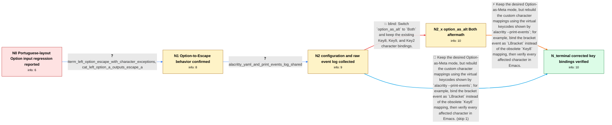

# Review: gh_alacritty_alacritty_6720

**0.12.0 release candidate 1 breaks some MacOS keys (like [] {}) on Portuguese Layout**

- source: https://github.com/alacritty/alacritty/issues/6720
- kind: LLM draft (needs review)
- reviewed: `False`
- graph: `data/github_v0/graphs/gh_alacritty_alacritty_6720.json` · raw thread: `data/github_v0/raw/gh_alacritty_alacritty_6720.json`

## Opening (body)

> I'm trying Alacritty 0.12.0 release candidate 1 on macOS 12.6.3 with a Portuguese keyboard layout and `option_as_alt: OnlyLeft`. I can use the expected Emacs Meta keys, but I cannot type characters such as `[`, `]`, `{`, `}`, and `@`, which require Option or Shift+Option on this layout. Before this, `alt_send_esc = false` together with custom Key8, Key9, and Key2 bindings worked. In Emacs those characters cannot be typed at all. Directly in the terminal, `[` and `]` appear after pressing the key three times, while `{`, `}`, and `@` work.

## Satisfaction conditions

1. Must identify the accepted root cause: Option-to-Escape handling is working, but the reporter's old Key8, Key9, and Key2 bindings no longer match the virtual keycodes emitted for these inputs; the event log demonstrates using the current key name such as LBracket.
2. The diagnosis must be grounded in the collected evidence: Left Option+A produces `^[a` in `cat`, while the supplied configuration and `--print-events` log expose the key-binding mismatch.
3. Must recommend rebuilding the affected mappings from the `virtual_keycode` values reported by `alacritty --print-events`, including the demonstrated LBracket-for-Key8 correction, while retaining the reporter's desired Option-as-Meta behavior.
4. Must not present switching to `option_as_alt: None` or `Both` while keeping the old bindings as the resolution; those choices either lose the desired Meta behavior or leave the required characters unavailable.
5. Must ask the reporter to verify the redefined bracket, brace, and other Option-character bindings in Emacs before declaring the issue resolved.

## Edges

| edge | type | gates / info | payload |
|---|---|---|---|
| `e1_N0__N1` | clarification_only | asks: iterm_left_option_escape_with_character_exceptions, cat_left_option_a_outputs_escape_a | In iTerm2 I set Left Option to send Escape, then add separate mappings for the characters accessed with Option / Typing Left Option+A into `cat` gives `^[a`. |
| `e2_N1__N2` | clarification_only | asks: alacritty_yaml_and_print_events_log_shared | In Emacs everything works except `[`, `]`, `{`, and `}`. I've attached my `alacritty.yml` and an event log fro |
| `e3_N2__N2_x` | solution_only **BLIND** | req_info: portuguese_layout_requires_option_for_brackets_braces_at, legacy_alt_send_esc_false_with_key8_key9_key2_bindings_worked elements: recommends_option_as_alt_both_without_rebinding_keys | Switch `option_as_alt` to `Both` and keep the existing Key8, Key9, and Key2 character bindings. |
| `e4_N2_x__N_terminal` | solution_only | req_info: legacy_alt_send_esc_false_with_key8_key9_key2_bindings_worked, portuguese_layout_requires_option_for_brackets_braces_at, emacs_cannot_type_brackets_braces_or_at, cat_left_option_a_outputs_escape_a, alacritty_yaml_and_print_events_log_shared elements: identifies_stale_or_incorrect_key_names_as_the_problem, uses_print_events_virtual_keycodes_to_rebuild_bindings, gives_lbracket_instead_of_key8_as_the_concrete_pattern, preserves_option_as_meta_behavior, asks_user_to_verify_all_redefined_characters_in_emacs | Keep the desired Option-as-Meta mode, but rebuild the custom character mappings using the virtual keycodes shown by `alacritty --print-events`; for example, bind the bracket event as `LBracket` instead of the obsolete `Key8` mapping, then verify every affected character in Emacs. |
| `e5_N2__N_terminal` | solution_only | req_info: legacy_alt_send_esc_false_with_key8_key9_key2_bindings_worked, portuguese_layout_requires_option_for_brackets_braces_at, emacs_cannot_type_brackets_braces_or_at, cat_left_option_a_outputs_escape_a, alacritty_yaml_and_print_events_log_shared elements: identifies_stale_or_incorrect_key_names_as_the_problem, uses_print_events_virtual_keycodes_to_rebuild_bindings, gives_lbracket_instead_of_key8_as_the_concrete_pattern, preserves_option_as_meta_behavior, asks_user_to_verify_all_redefined_characters_in_emacs | Keep the desired Option-as-Meta mode, but rebuild the custom character mappings using the virtual keycodes shown by `alacritty --print-events`; for example, bind the bracket event as `LBracket` instead of the obsolete `Key8` mapping, then verify every affected character in Emacs. |

## Nodes

| node | terminal | volunteered | images | symptoms |
|---|---|---|---|---|
| `N0` |  | 1 | 0 | In Emacs I cannot type `[`, `]`, `{`, `}`, or `@` on my Portuguese keyboard layout. Directly in the terminal, `[` and `]` appear only after  |
| `N1` |  | 0 | 0 | Left Option works as Meta input: typing Left Option+A into `cat` produces `^[a`. The bracket and brace characters are still unavailable insi |
| `N2` |  | 0 | 0 | Meta shortcuts work in Emacs, but `[`, `]`, `{`, and `}` still cannot be entered with my existing custom bindings. |
| `N2_x` |  | 1 | 0 | With `option_as_alt: Both` and my existing Key8, Key9, and Key2 bindings, I still cannot type `[`, `]`, `{`, `}`, or `@`. |
| `N_terminal` | ✓ | 0 | 0 | After redefining the bindings with the key names reported by `--print-events`, Meta works and I can type all the required brackets, braces,  |

## Machine review (audit pass, adversarially verified)

Auditor verdict: **n/a** · 0 of 0 findings survived independent refutation.

__

## Review checklist

> The graph is the case's ANSWER KEY, not a transcript: edge order need
> not mirror thread chronology. Do not file chronology mismatch as a
> defect; what must be faithful is who knew what, when.

Structural (machine-checked by `scripts/validate.py`, re-verify after edits):

- [ ] validates: schema + info-containment + terminal reachability

Semantic (the defect catalog — check each against the source thread):

- [ ] **Faithful blind paths** — every `is_known_blind_path` edge corresponds
  to an attempt actually falsified in the thread (or a brush-off the
  reporter rejected). No invented failures; no ACCEPTED fix mislabeled as
  a blind path (the most common LLM defect class).
- [ ] **Gettable required info** — every id in any `solution.required_info`
  is obtainable: a clarification on some edge, or in the start node's
  info_state, or volunteered (with matching `volunteered_info` text).
  Engineer-only inference belongs in `info_inferred_by_engineer` /
  `inference_hint`, not in hard required_info.
- [ ] **Measurement-class rule** — handler-initiated measurements the user
  executed (bisections, test builds, config probes, version checks) are
  clarification edges, not solutions; their answers state what the
  measurement showed.
- [ ] **No logistics gates** — `required_elements_for_full_match` encode the
  technical diagnostic→fix chain, not release/packaging/scheduling
  remarks the engineer merely mentioned.
- [ ] **Coherent reveals** — each `user_answer_in_this_oncall` is consistent
  with the thread, delivers what it promises, and stays in the user's
  voice (no future knowledge, no diagnosis the user never made).
- [ ] **Symptoms are observations** — `symptoms_visible` contains only what
  the user can see; no causes or advice.
- [ ] **Terminal semantics** — satisfaction_conditions demand root cause +
  evidence grounding + prohibition of falsified moves + user verification;
  the terminal node is the verified-resolved state.
- [ ] **Image assignment** — referenced attachments exist and sit on the
  right hook (opening / node symptom / clarification evidence).
- [ ] **Persona** — matches the reporter's actual expertise and style.

## How to sign off

1. Edit the graph JSON if needed (authored fields only; keep
   `concrete_example` as the factual record).
2. `uv run scripts/validate.py '<graph path>'`
3. Set `metadata.hitl_reviewed: true` in the graph JSON.
4. Re-run `uv run scripts/make_review_docs.py` to refresh this page.
