# Review: gh_alacritty_alacritty_6720

**0.12.0 release candidate 1 breaks some macOS keys like [] {} on Portuguese layout**

- source: https://github.com/alacritty/alacritty/issues/6720
- kind: LLM draft (needs review)
- reviewed: `True`
- graph: `data/github_v0/graphs/gh_alacritty_alacritty_6720.json` · raw thread: `data/github_v0/raw/gh_alacritty_alacritty_6720.json`

```mermaid
flowchart LR
    N0["<b>N0 Portuguese Option characters broken</b><br/><small>info: 5</small>"]
    N1["<b>N1 working iTerm2 comparison supplied</b><br/><small>info: 7</small>"]
    N1_x["<b>N1_x None or Both workaround aftermath</b><br/><small>info: 8</small>"]
    N2["<b>N2 Option-to-Escape behavior confirmed</b><br/><small>info: 10</small>"]
    N3["<b>N3 configuration and event log collected</b><br/><small>info: 12</small>"]
    N_terminal["<b>terminal bindings corrected and verified</b><br/><small>info: 14</small>"]
    N_terminal_shortcut["<b>terminal direct binding correction</b><br/><small>info: 7</small>"]
    N0 -.->|"❓ iterm_left_option_escape_with_character_exceptions"| N1
    linkStyle 0 stroke:#3b82f6,stroke-width:2px
    N1 ==>|"💥 blind: Work around the issue by selecting `option_as_alt: None` or `option_as_alt: Both` instead of using the left-Option configuration."| N1_x
    linkStyle 1 stroke:#ef4444,stroke-width:2px
    N1_x -.->|"❓ onlyleft_characters_work_in_terminal_but_not_emacs, cat_left_option_a_outputs_escape_a"| N2
    linkStyle 2 stroke:#3b82f6,stroke-width:2px
    N2 -.->|"❓ alacritty_config_and_print_events_log_shared"| N3
    linkStyle 3 stroke:#3b82f6,stroke-width:2px
    N3 ==>|"⚡ Keep the working Option-as-Alt behavior, but replace the old physical `Key8`, `Key9`, and similar binding identifiers with the current virtual keycodes reported by Alacritty's keyboard event log."| N_terminal
    linkStyle 4 stroke:#f97316,stroke-width:2px
    N0 ==>|"🚀 Treat the old custom key names as stale after the input-library behavior change, rebind the affected characters using the current virtual keycodes, and verify that both the characters and Emacs meta commands work. (skip 5)"| N_terminal_shortcut
    linkStyle 5 stroke:#0ea5e9,stroke-width:2px
    class N0 start
    class N1 normal
    class N1_x normal
    class N2 normal
    class N3 normal
    class N_terminal terminal
    class N_terminal_shortcut terminal
    classDef start fill:#fee2e2,stroke:#b91c1c,color:#000
    classDef terminal fill:#dcfce7,stroke:#15803d,color:#000
    classDef normal fill:#fef3c7,stroke:#a16207,color:#000
```

## Opening (body)

> I'm trying Alacritty 0.12.0-rc1 on macOS 12.6.3 with a Portuguese keyboard layout and `option_as_alt: OnlyLeft`. I can use the expected Emacs meta keys, but I cannot type characters such as `[`, `]`, `{`, `}`, and `@`, which require Option or Shift+Option on this layout. Before this, `alt_send_esc = false` together with custom `Key8`, `Key9`, and `Key2` bindings worked. In Emacs I cannot type these characters at all. Directly in the terminal, `[` and `]` appear only after pressing the key three times, while `{`, `}`, and `@` work.

## Satisfaction conditions

1. Must identify the final accepted cause: the custom bindings use key identifiers such as `Key8` and `Key9` that no longer match the current keyboard events; the remaining failure is not that Alacritty cannot send Escape for Option.
2. The diagnosis must be grounded in the observed split: `OnlyLeft` permits the characters in the terminal, Left Option+A produces `^[a` in `cat`, and the failure remains in the explicitly bound characters inside Emacs.
3. Must correct the bindings using the current virtual keycodes reported by Alacritty, including `LBracket` instead of `Key8` as the thread's concrete example, and apply the same method to the other affected characters.
4. Must not present `option_as_alt: None` or `option_as_alt: Both` as the resolution; those choices respectively break the reporter's Option-based Emacs workflow or leave the Portuguese-layout characters unavailable.
5. Must ask the reporter to verify the redefined characters in both the terminal and Emacs, while confirming that Option-based meta commands still work, before declaring the issue resolved.

## Edges

| edge | type | gates / info | payload |
|---|---|---|---|
| `e1_N0__N1` | clarification_only | asks: iterm_left_option_escape_with_character_exceptions | In iTerm2 I set left Option to send Escape, then added mappings that insert the extra characters accessed with |
| `e2_N1__N1_x` | solution_only **BLIND** | req_info: option_as_alt_onlyleft_initially, emacs_meta_keys_work_but_portuguese_option_characters_fail elements: recommends_none_or_both_as_the_workaround | Work around the issue by selecting `option_as_alt: None` or `option_as_alt: Both` instead of using the left-Option configuration. |
| `e3_N1_x__N2` | clarification_only | asks: onlyleft_characters_work_in_terminal_but_not_emacs, cat_left_option_a_outputs_escape_a | With `option_as_alt: OnlyLeft`, I can type those characters directly in the terminal without a problem, but no / Yes. Typing Left Option+A into `cat` gives `^[a`. |
| `e4_N2__N3` | clarification_only | asks: alacritty_config_and_print_events_log_shared | I attached my `alacritty.yml` and an event log where I tried to type those characters. I hope it is not full o |
| `e5_N3__N_terminal` | solution_only | req_info: old_alt_send_esc_false_and_key8_key9_key2_bindings_worked, emacs_meta_keys_work_but_portuguese_option_characters_fail, iterm_left_option_escape_with_character_exceptions, cat_left_option_a_outputs_escape_a, onlyleft_characters_work_in_terminal_but_not_emacs, alacritty_config_and_print_events_log_shared elements: identifies_the_existing_key_identifiers_as_wrong_for_current_events, uses_current_virtual_keycodes_for_the_character_bindings, gives_lbracket_instead_of_key8_as_the_concrete_example, preserves_working_option_based_emacs_meta_behavior, asks_user_to_verify_all_redefined_characters_in_emacs_and_the_terminal | Keep the working Option-as-Alt behavior, but replace the old physical `Key8`, `Key9`, and similar binding identifiers with the current virtual keycodes reported by Alacritty's keyboard event log. |
| `e6_N0__N_terminal_shortcut` | solution_only | req_info: old_alt_send_esc_false_and_key8_key9_key2_bindings_worked, emacs_meta_keys_work_but_portuguese_option_characters_fail elements: identifies_the_custom_binding_key_names_as_the_problem, uses_current_virtual_keycodes_for_the_character_bindings, gives_lbracket_instead_of_key8_as_the_concrete_example, asks_user_to_verify_the_characters_and_emacs_meta_behavior | Treat the old custom key names as stale after the input-library behavior change, rebind the affected characters using the current virtual keycodes, and verify that both the characters and Emacs meta commands work. |

## Nodes

| node | terminal | volunteered | images | symptoms |
|---|---|---|---|---|
| `N0` |  | 3 | 0 | With Alacritty 0.12.0-rc1 and my Portuguese keyboard layout, Emacs accepts my meta keys but I cannot type `[`, `]`, `{`, `}`, or `@` there.  |
| `N1` |  | 1 | 0 | The same Portuguese-layout characters work in iTerm2 when left Option sends Escape and explicit exceptions insert the Option and Shift+Optio |
| `N1_x` |  | 1 | 0 | With `option_as_alt: None`, I have to press Escape instead of Option for Emacs meta commands. With `option_as_alt: Both`, my configured `[`, |
| `N2` |  | 0 | 0 | In a test with `option_as_alt: OnlyLeft`, the characters type normally in the terminal but `[`, `]`, `{`, and `}` still do not type in Emacs |
| `N3` |  | 1 | 0 | Emacs otherwise works normally; the remaining failures are the `[`, `]`, `{`, and `}` characters generated by my custom bindings. |
| `N_terminal` | ✓ | 1 | 0 | After redefining the bindings using the current key names, all of the characters type correctly and my Emacs meta keys still work. |
| `N_terminal_shortcut` | ✓ | 1 | 0 | After redefining the bindings using the current key names, all of the characters type correctly and my Emacs meta keys still work. |

## Machine review (audit pass, adversarially verified)

Auditor verdict: **n/a** · 0 of 0 findings survived independent refutation.

__

## Review checklist

> The graph is the case's ANSWER KEY, not a transcript: edge order need
> not mirror thread chronology. Do not file chronology mismatch as a
> defect; what must be faithful is who knew what, when.

Structural (machine-checked by `scripts/validate.py`, re-verify after edits):

- [ ] validates: schema + info-containment + terminal reachability

Semantic (the defect catalog — check each against the source thread):

- [ ] **Faithful blind paths** — every `is_known_blind_path` edge corresponds
  to an attempt actually falsified in the thread (or a brush-off the
  reporter rejected). No invented failures; no ACCEPTED fix mislabeled as
  a blind path (the most common LLM defect class).
- [ ] **Gettable required info** — every id in any `solution.required_info`
  is obtainable: a clarification on some edge, or in the start node's
  info_state, or volunteered (with matching `volunteered_info` text).
  Engineer-only inference belongs in `info_inferred_by_engineer` /
  `inference_hint`, not in hard required_info.
- [ ] **Measurement-class rule** — handler-initiated measurements the user
  executed (bisections, test builds, config probes, version checks) are
  clarification edges, not solutions; their answers state what the
  measurement showed.
- [ ] **No logistics gates** — `required_elements_for_full_match` encode the
  technical diagnostic→fix chain, not release/packaging/scheduling
  remarks the engineer merely mentioned.
- [ ] **Coherent reveals** — each `user_answer_in_this_oncall` is consistent
  with the thread, delivers what it promises, and stays in the user's
  voice (no future knowledge, no diagnosis the user never made).
- [ ] **Symptoms are observations** — `symptoms_visible` contains only what
  the user can see; no causes or advice.
- [ ] **Terminal semantics** — satisfaction_conditions demand root cause +
  evidence grounding + prohibition of falsified moves + user verification;
  the terminal node is the verified-resolved state.
- [ ] **Image assignment** — referenced attachments exist and sit on the
  right hook (opening / node symptom / clarification evidence).
- [ ] **Persona** — matches the reporter's actual expertise and style.

## How to sign off

1. Edit the graph JSON if needed (authored fields only; keep
   `concrete_example` as the factual record).
2. `uv run scripts/validate.py '<graph path>'`
3. Set `metadata.hitl_reviewed: true` in the graph JSON.
4. Re-run `uv run scripts/make_review_docs.py` to refresh this page.
