# Review: gh_alacritty_alacritty_6744

**Unable to type into the terminal, only return key is accepted?**

- source: https://github.com/alacritty/alacritty/issues/6744
- kind: LLM draft (needs review)
- reviewed: `True`
- graph: `data/github_v0/graphs/gh_alacritty_alacritty_6744.json` · raw thread: `data/github_v0/raw/gh_alacritty_alacritty_6744.json`

```mermaid
flowchart LR
    N0["<b>N0 keyboard input failure reported</b><br/><small>info: 5</small>"]
    N1["<b>N1 default configuration and environment checked</b><br/><small>info: 7</small>"]
    N1_x["<b>N1_x Yabai-disable aftermath</b><br/><small>info: 8</small>"]
    N2["<b>N2 version and winit behavior compared</b><br/><small>info: 11</small>"]
    N3["<b>N3 failure isolated to packaged application</b><br/><small>info: 14</small>"]
    N4["<b>N4 bundle-identity-specific workaround found</b><br/><small>info: 18</small>"]
    N_terminal["<b>terminal resolved after clean system installation</b><br/><small>info: 20</small>"]
    N0 -.->|"❓ dev_null_config_still_shows_failure_and_hitoolbox_trace, yabai_used_with_sip_partially_disabled"| N1
    linkStyle 0 stroke:#3b82f6,stroke-width:2px
    N1 ==>|"💥 blind: Disable Yabai to test whether its macOS window-management integration is preventing Alacritty from receiving keyboard input."| N1_x
    linkStyle 1 stroke:#ef4444,stroke-width:2px
    N1_x -.->|"❓ alacritty_011_accepts_typing, affected_winit_example_prints_hitoolbox_trace_without_visible_characters, winit_latest_master_example_emits_keyboard_and_character_events"| N2
    linkStyle 2 stroke:#3b82f6,stroke-width:2px
    N2 -.->|"❓ updated_winit_cargo_run_accepts_typing, cargo_run_release_accepts_typing, packaged_app_with_same_code_rejects_typing"| N3
    linkStyle 3 stroke:#3b82f6,stroke-width:2px
    N3 ==>|"🔀 ❓macos_ventura_1321 + ⚡Inspect and compare the packaged application's Info.plist because the directly launched release binary works while the .app bundle does not; test whether the bundle identity is what triggers the input failure."| N4
    linkStyle 4 stroke:#a855f7,stroke-width:2px
    N4 ==>|"⚡ Treat the failure as machine-specific macOS state associated with the original application identity, with the exact responsible rule or software left unidentified; reset that system state and verify Alacritty input afterward."| N_terminal
    linkStyle 5 stroke:#f97316,stroke-width:2px
    class N0 start
    class N1 normal
    class N1_x normal
    class N2 normal
    class N3 normal
    class N4 normal
    class N_terminal terminal
    classDef start fill:#fee2e2,stroke:#b91c1c,color:#000
    classDef terminal fill:#dcfce7,stroke:#15803d,color:#000
    classDef normal fill:#fef3c7,stroke:#a16207,color:#000
```

## Opening (body)

> I cannot type into Alacritty; only the Return key is accepted. Deleting my configuration so Alacritty starts with defaults does not change the behavior. It had been working before this started, without any changes to the configuration or application. I am on macOS using an Intel MacBook Pro with a Swedish keyboard. The problem occurs with both a build from master and 0.12 RC1. Running with --print-events produces HIToolbox/AppKit traces involving menu-bar handling.

## Satisfaction conditions

1. Must characterize the accepted diagnosis no more specifically than the evidence permits: the failure was tied to the reporter's prior macOS environment and the org.alacritty application identity, while the exact responsible rule, cache, security state, or third-party component remained unknown.
2. Must ground the diagnosis in the packaging evidence: cargo-run binaries accepted input, the packaged application did not, and changing CFBundleIdentifier from org.alacritty to alacritty restored normal input.
3. Must not present deleting the Alacritty configuration, stopping Yabai, or merely updating winit as the confirmed fix; each was insufficient to explain or resolve the packaged-app failure in this case.
4. Must not claim Fig was the original reporter's root cause; Fig was mentioned only by a different user after the reporter had already resolved the issue through a clean system installation.
5. Must treat the reporter's clean macOS installation as the confirmed resolution and require verification that normal typing works afterward before declaring the issue resolved.

## Edges

| edge | type | gates / info | payload |
|---|---|---|---|
| `e1_N0__N1` | clarification_only | asks: dev_null_config_still_shows_failure_and_hitoolbox_trace, yabai_used_with_sip_partially_disabled | Yes. I ran /Applications/Alacritty.app/Contents/MacOS/alacritty --print-events --config-file=/dev/null. It loa / I have been using Yabai alongside Alacritty, and it requires SIP to be partially disabled. I am not sure wheth |
| `e2_N1__N1_x` | solution_only **BLIND** | req_info: yabai_used_with_sip_partially_disabled elements: mentions_disabling_yabai_or_its_services | Disable Yabai to test whether its macOS window-management integration is preventing Alacritty from receiving keyboard input. |
| `e3_N1_x__N2` | clarification_only | asks: alacritty_011_accepts_typing, affected_winit_example_prints_hitoolbox_trace_without_visible_characters, winit_latest_master_example_emits_keyboard_and_character_events | The latest stable 0.11 does work and I can type in it, although on macOS I need the newer winit Option-key fix / In the affected winit example I could not see the characters I wrote, and it printed a HIToolbox/AppKit trace  / Latest winit master works as expected. It prints KeyboardInput entries and ReceivedCharacter lines such as 'u' |
| `e4_N2__N3` | clarification_only | asks: updated_winit_cargo_run_accepts_typing, cargo_run_release_accepts_typing, packaged_app_with_same_code_rejects_typing | Running the updated branch directly with cargo run works and I am able to type into it. / cargo run --release works too. / The binary launched through cargo works, but after make app and copying target/release/osx/Alacritty.app to /A |
| `e5_N3__N4` | mixed | req_info: cargo_run_release_accepts_typing, packaged_app_with_same_code_rejects_typing elements: focuses_on_the_app_bundle_plist_due_to_binary_vs_app_difference, tests_the_bundle_identifier_as_the_trigger | Inspect and compare the packaged application's Info.plist because the directly launched release binary works while the .app bundle does not; test whether the bundle identity is what triggers the input failure. |
| `e6_N4__N_terminal` | solution_only | req_info: original_org_alacritty_identifier_reproduces_failure, renaming_bundle_identifier_restores_normal_input, cargo_run_release_accepts_typing, packaged_app_with_same_code_rejects_typing, stopping_yabai_services_does_not_restore_input elements: identifies_the_problem_as_specific_to_the_existing_macos_environment_and_original_bundle_identity, acknowledges_that_the_exact_system_rule_or_component_was_not_identified, uses_the_clean_system_install_as_the_reporters_confirmed_resolution, asks_user_to_verify_normal_typing_after_the_system_reset | Treat the failure as machine-specific macOS state associated with the original application identity, with the exact responsible rule or software left unidentified; reset that system state and verify Alacritty input afterward. |

## Nodes

| node | terminal | volunteered | images | symptoms |
|---|---|---|---|---|
| `N0` |  | 2 | 0 | I cannot type normal characters into Alacritty; only the Return key is accepted. The same behavior occurs after deleting my configuration an |
| `N1` |  | 0 | 0 | I still cannot type when Alacritty is launched with /dev/null as its configuration. The event log continues to print HIToolbox traces while  |
| `N1_x` |  | 1 | 0 | After stopping the Yabai services through Brew, I still cannot type into Alacritty. |
| `N2` |  | 0 | 0 | Alacritty 0.11 accepts normal typing, while the affected Alacritty build still does not. The latest winit master example prints KeyboardInpu |
| `N3` |  | 0 | 0 | I can type when the updated code is launched with cargo run or cargo run --release. When I package the same code as Alacritty.app and copy i |
| `N4` |  | 3 | 0 | With the bundle identifier changed from org.alacritty to alacritty, the packaged application accepts normal typing. With the original org.al |
| `N_terminal` | ✓ | 1 | 0 | After reformatting the machine and performing a clean macOS installation, Alacritty accepts normal typing again. |

## Machine review (audit pass, adversarially verified)

Auditor verdict: **n/a** · 0 of 0 findings survived independent refutation.

__

## Review checklist

> The graph is the case's ANSWER KEY, not a transcript: edge order need
> not mirror thread chronology. Do not file chronology mismatch as a
> defect; what must be faithful is who knew what, when.

Structural (machine-checked by `scripts/validate.py`, re-verify after edits):

- [ ] validates: schema + info-containment + terminal reachability

Semantic (the defect catalog — check each against the source thread):

- [ ] **Faithful blind paths** — every `is_known_blind_path` edge corresponds
  to an attempt actually falsified in the thread (or a brush-off the
  reporter rejected). No invented failures; no ACCEPTED fix mislabeled as
  a blind path (the most common LLM defect class).
- [ ] **Gettable required info** — every id in any `solution.required_info`
  is obtainable: a clarification on some edge, or in the start node's
  info_state, or volunteered (with matching `volunteered_info` text).
  Engineer-only inference belongs in `info_inferred_by_engineer` /
  `inference_hint`, not in hard required_info.
- [ ] **Measurement-class rule** — handler-initiated measurements the user
  executed (bisections, test builds, config probes, version checks) are
  clarification edges, not solutions; their answers state what the
  measurement showed.
- [ ] **No logistics gates** — `required_elements_for_full_match` encode the
  technical diagnostic→fix chain, not release/packaging/scheduling
  remarks the engineer merely mentioned.
- [ ] **Coherent reveals** — each `user_answer_in_this_oncall` is consistent
  with the thread, delivers what it promises, and stays in the user's
  voice (no future knowledge, no diagnosis the user never made).
- [ ] **Symptoms are observations** — `symptoms_visible` contains only what
  the user can see; no causes or advice.
- [ ] **Terminal semantics** — satisfaction_conditions demand root cause +
  evidence grounding + prohibition of falsified moves + user verification;
  the terminal node is the verified-resolved state.
- [ ] **Image assignment** — referenced attachments exist and sit on the
  right hook (opening / node symptom / clarification evidence).
- [ ] **Persona** — matches the reporter's actual expertise and style.

## How to sign off

1. Edit the graph JSON if needed (authored fields only; keep
   `concrete_example` as the factual record).
2. `uv run scripts/validate.py '<graph path>'`
3. Set `metadata.hitl_reviewed: true` in the graph JSON.
4. Re-run `uv run scripts/make_review_docs.py` to refresh this page.
