# Review: gh_alacritty_alacritty_7472

**Slow startup after upgrading to 0.13.0**

- source: https://github.com/alacritty/alacritty/issues/7472
- kind: LLM draft (needs review)
- reviewed: `False`
- graph: `data/github_v0/graphs/gh_alacritty_alacritty_7472.json` · raw thread: `data/github_v0/raw/gh_alacritty_alacritty_7472.json`

```mermaid
flowchart LR
    N0["<b>N0 intermittent startup delay reported</b><br/><small>info: 6</small>"]
    N1_x["<b>N1_x reboot and driver-theory aftermath</b><br/><small>info: 9</small>"]
    N1["<b>N1 delay localized to window construction</b><br/><small>info: 10</small>"]
    N2["<b>N2 dependency regression narrowed</b><br/><small>info: 13</small>"]
    N3["<b>N3 raw X11 request evidence collected</b><br/><small>info: 17</small>"]
    N3_x["<b>N3_x caching candidate aftermath</b><br/><small>info: 18</small>"]
    N4["<b>N4 corrected winit behavior verified</b><br/><small>info: 19</small>"]
    N_terminal["<b>terminal startup delay resolved</b><br/><small>info: 21</small>"]
    N0 ==>|"💥 blind: Treat the pause as graphics-driver initialization or a stale system state, reboot the machine, and compare with the previous Alacritty release."| N1_x
    linkStyle 0 stroke:#ef4444,stroke-width:2px
    N1_x -.->|"❓ instrumented_window_build_takes_about_2_33_seconds"| N1
    linkStyle 1 stroke:#3b82f6,stroke-width:2px
    N1 -.->|"❓ alacritty_bisection_first_bad_commit_80d4dacc, first_winit_revision_fast_second_revision_delayed, egl_also_delayed_with_bad_winit_revision"| N2
    linkStyle 2 stroke:#3b82f6,stroke-width:2px
    N2 -.->|"❓ x11trace_delay_follows_xinput_event, xdpyinfo_maps_opcode_140_to_randr, xcb_header_maps_minor_opcode_8_to_get_screen_resources, instrumented_screen_resource_query_takes_about_2_35_seconds"| N3
    linkStyle 3 stroke:#3b82f6,stroke-width:2px
    N3 ==>|"💥 blind: Avoid repeated extension-version work by testing the candidate that caches the RANDR version during X11 initialization."| N3_x
    linkStyle 4 stroke:#ef4444,stroke-width:2px
    N3_x -.->|"❓ patched_winit_test_build_starts_in_about_0_16_seconds"| N4
    linkStyle 5 stroke:#3b82f6,stroke-width:2px
    N4 ==>|"⚡ Fix the winit X11 monitor-enumeration regression by avoiding the blocking RANDR GetScreenResources path and using the non-reprobing current-resource query behavior verified by the reporter."| N_terminal
    linkStyle 6 stroke:#f97316,stroke-width:2px
    N0 ==>|"🚀 Fix the winit X11 monitor-enumeration regression by avoiding the blocking RANDR GetScreenResources path and using the non-reprobing current-resource query behavior. (skip 12)"| N_terminal
    linkStyle 7 stroke:#0ea5e9,stroke-width:2px
    class N0 start
    class N1_x normal
    class N1 normal
    class N2 normal
    class N3 normal
    class N3_x normal
    class N4 normal
    class N_terminal terminal
    classDef start fill:#fee2e2,stroke:#b91c1c,color:#000
    classDef terminal fill:#dcfce7,stroke:#15803d,color:#000
    classDef normal fill:#fef3c7,stroke:#a16207,color:#000
```

## Opening (body)

> After upgrading to Alacritty 0.13.0 and converting my YAML configuration to TOML, the first terminal takes about 3 seconds to start. Subsequent instances start in about 0.17 seconds, but the delay returns after some minutes even when another instance is running. An strace shows a poll waiting about 2.3 seconds, and the verbose log has the same gap after picking the GL config and before reporting the window scale factor. I am using Arch Linux with X11, AwesomeWM, no compositor, and AMD graphics.

## Satisfaction conditions

1. Must identify the final accepted root cause: winit's X11 monitor enumeration issued a blocking RANDR GetScreenResources request, accounting for the roughly 2.3-second startup pause.
2. Diagnosis must be grounded in the collected evidence: the delay is inside window construction, follows the dependency regression, maps to RANDR opcode 140 and GetScreenResources minor opcode 8, and the instrumented screen-resource query consumes about 2.35 seconds.
3. Must recommend the corrected winit X11 behavior that avoids the slow reprobing screen-resource request, rather than treating configuration conversion, font loading, or graphics initialization as the cause.
4. Must not settle on rebooting or a graphics-driver initialization diagnosis; rebooting did not change the delay, EGL was also affected, and the pause occurs before the relevant GL work.
5. Must not present RANDR-version caching alone as the fix because that candidate build was tested and remained delayed.
6. Must have the reporter verify a build containing the corrected X11 query behavior before declaring the issue resolved; the verified patched build started in about 0.16 seconds.

## Edges

| edge | type | gates / info | payload |
|---|---|---|---|
| `e1_N0__N1_x` | solution_only **BLIND** | req_info: alacritty_013_first_start_delayed_about_three_seconds, arch_x11_awesomewm_no_compositor_amd_graphics elements: suggests_reboot_or_driver_initialization, compares_with_previous_alacritty_release | Treat the pause as graphics-driver initialization or a stale system state, reboot the machine, and compare with the previous Alacritty release. |
| `e2_N1_x__N1` | clarification_only | asks: instrumented_window_build_takes_about_2_33_seconds | After applying the timing patch, the log prints `Time to build window 2.333872208s`; the window scale factor i |
| `e3_N1__N2` | clarification_only | asks: alacritty_bisection_first_bad_commit_80d4dacc, first_winit_revision_fast_second_revision_delayed, egl_also_delayed_with_bad_winit_revision | After bisecting, I got commit 80d4dacc as the first revision where the problem appears. / The first winit revision worked without the startup delay. The second winit revision reproduced the delay. / With the second winit revision, EGL is delayed too. |
| `e4_N2__N3` | clarification_only | asks: x11trace_delay_follows_xinput_event, xdpyinfo_maps_opcode_140_to_randr, xcb_header_maps_minor_opcode_8_to_get_screen_resources, instrumented_screen_resource_query_takes_about_2_35_seconds | Using `x11trace`, I notice the delay immediately after a `Generic(35) XInputExtension(131) RawKeyRelease(14)`  / My `xdpyinfo` output says `RANDR (opcode: 140, base event: 89, base error: 147)`. / The header prints `#define XCB_RANDR_GET_SCREEN_RESOURCES 8`, and my server reports RandR version 1.6. / The timing output says `Screen resource 2.351377094s` and `Time to list availabe monitors: 2.37054967s`; the o |
| `e5_N3__N3_x` | solution_only **BLIND** | req_info: strace_poll_waits_about_2_3_seconds, xdpyinfo_maps_opcode_140_to_randr, instrumented_screen_resource_query_takes_about_2_35_seconds elements: tests_randr_version_caching_candidate | Avoid repeated extension-version work by testing the candidate that caches the RANDR version during X11 initialization. |
| `e6_N3_x__N4` | clarification_only | asks: patched_winit_test_build_starts_in_about_0_16_seconds | The patch is good; the delayed startup is gone. My rebuilt Alacritty reaches the window scale factor at about  |
| `e7_N4__N_terminal` | solution_only | req_info: alacritty_013_first_start_delayed_about_three_seconds, strace_poll_waits_about_2_3_seconds, alacritty_bisection_first_bad_commit_80d4dacc, first_winit_revision_fast_second_revision_delayed, egl_also_delayed_with_bad_winit_revision, xdpyinfo_maps_opcode_140_to_randr, xcb_header_maps_minor_opcode_8_to_get_screen_resources, instrumented_screen_resource_query_takes_about_2_35_seconds, patched_winit_test_build_starts_in_about_0_16_seconds elements: identifies_blocking_randr_screen_resource_query, attributes_regression_to_winit_x11_monitor_enumeration, replaces_or_avoids_the_reprobing_get_screen_resources_path, uses_reporter_verification_on_the_patched_build | Fix the winit X11 monitor-enumeration regression by avoiding the blocking RANDR GetScreenResources path and using the non-reprobing current-resource query behavior verified by the reporter. |
| `e8_N0__N_terminal` | solution_only | req_info: alacritty_013_first_start_delayed_about_three_seconds, strace_poll_waits_about_2_3_seconds, alacritty_bisection_first_bad_commit_80d4dacc, first_winit_revision_fast_second_revision_delayed, xdpyinfo_maps_opcode_140_to_randr, xcb_header_maps_minor_opcode_8_to_get_screen_resources, instrumented_screen_resource_query_takes_about_2_35_seconds, patched_winit_test_build_starts_in_about_0_16_seconds elements: identifies_blocking_randr_screen_resource_query, attributes_regression_to_winit_x11_monitor_enumeration, asks_user_to_verify_on_a_build_containing_the_fix | Fix the winit X11 monitor-enumeration regression by avoiding the blocking RANDR GetScreenResources path and using the non-reprobing current-resource query behavior. |

## Nodes

| node | terminal | volunteered | images | symptoms |
|---|---|---|---|---|
| `N0` |  | 3 | 0 | After upgrading to Alacritty 0.13.0, the first startup takes roughly 2.5 to 3 seconds while immediately repeated startups take about 0.17 se |
| `N1_x` |  | 3 | 0 | The delay still occurs after rebooting. Alacritty 0.12.3 starts without the delay, while the current development build still takes about 2.6 |
| `N1` |  | 0 | 0 | The instrumented development build reports that building the window takes about 2.33 seconds. |
| `N2` |  | 0 | 0 | One tested winit revision starts quickly, while the next tested revision has the same multi-second delay. Selecting EGL does not remove the  |
| `N3` |  | 0 | 0 | The X11 trace pauses after the reported event, and the instrumented build spends about 2.35 seconds in the screen-resource operation before  |
| `N3_x` |  | 1 | 0 | The build using the RANDR-version caching candidate still pauses for about 2.4 seconds before reporting the window scale factor. |
| `N4` |  | 0 | 0 | The test build using the proposed winit patch has no delayed startup and exits in about 0.16 seconds. |
| `N_terminal` | ✓ | 0 | 0 | Alacritty starts without the multi-second pause when built with the corrected winit X11 monitor-query behavior. |

## Review checklist

> The graph is the case's ANSWER KEY, not a transcript: edge order need
> not mirror thread chronology. Do not file chronology mismatch as a
> defect; what must be faithful is who knew what, when.

Structural (machine-checked by `scripts/validate.py`, re-verify after edits):

- [ ] validates: schema + info-containment + terminal reachability

Semantic (the defect catalog — check each against the source thread):

- [ ] **Faithful blind paths** — every `is_known_blind_path` edge corresponds
  to an attempt actually falsified in the thread (or a brush-off the
  reporter rejected). No invented failures; no ACCEPTED fix mislabeled as
  a blind path (the most common LLM defect class).
- [ ] **Gettable required info** — every id in any `solution.required_info`
  is obtainable: a clarification on some edge, or in the start node's
  info_state, or volunteered (with matching `volunteered_info` text).
  Engineer-only inference belongs in `info_inferred_by_engineer` /
  `inference_hint`, not in hard required_info.
- [ ] **Measurement-class rule** — handler-initiated measurements the user
  executed (bisections, test builds, config probes, version checks) are
  clarification edges, not solutions; their answers state what the
  measurement showed.
- [ ] **No logistics gates** — `required_elements_for_full_match` encode the
  technical diagnostic→fix chain, not release/packaging/scheduling
  remarks the engineer merely mentioned.
- [ ] **Coherent reveals** — each `user_answer_in_this_oncall` is consistent
  with the thread, delivers what it promises, and stays in the user's
  voice (no future knowledge, no diagnosis the user never made).
- [ ] **Symptoms are observations** — `symptoms_visible` contains only what
  the user can see; no causes or advice.
- [ ] **Terminal semantics** — satisfaction_conditions demand root cause +
  evidence grounding + prohibition of falsified moves + user verification;
  the terminal node is the verified-resolved state.
- [ ] **Image assignment** — referenced attachments exist and sit on the
  right hook (opening / node symptom / clarification evidence).
- [ ] **Persona** — matches the reporter's actual expertise and style.

## How to sign off

1. Edit the graph JSON if needed (authored fields only; keep
   `concrete_example` as the factual record).
2. `uv run scripts/validate.py '<graph path>'`
3. Set `metadata.hitl_reviewed: true` in the graph JSON.
4. Re-run `uv run scripts/make_review_docs.py` to refresh this page.
