# Review: gh_alacritty_alacritty_7501

**Shift+Insert does not paste highlighted text in the first Alacritty terminal after boot**

- source: https://github.com/alacritty/alacritty/issues/7501
- kind: LLM draft (needs review)
- reviewed: `True`
- graph: `data/github_v0/graphs/gh_alacritty_alacritty_7501.json` · raw thread: `data/github_v0/raw/gh_alacritty_alacritty_7501.json`

```mermaid
flowchart LR
    N0["<b>N0 vague Shift+Insert failure reported</b><br/><small>info: 2</small>"]
    N1_x["<b>N1_x tmux-disabled aftermath</b><br/><small>info: 3</small>"]
    N1["<b>N1 reproducible first-terminal-only failure</b><br/><small>info: 9</small>"]
    N2["<b>N2 first candidate patch test</b><br/><small>info: 10</small>"]
    N3["<b>N3 dependency rollback test reproduces failure</b><br/><small>info: 12</small>"]
    N_terminal["<b>terminal reporter verifies current master</b><br/><small>info: 13</small>"]
    N0 ==>|"💥 blind: Treat tmux as the source of the Shift+Insert behavior and disable or bypass it."| N1_x
    linkStyle 0 stroke:#ef4444,stroke-width:2px
    N0 -.->|"❓ first_launch_after_boot_pastes_tilde, second_and_later_terminals_paste_selection, no_prior_selection_content_exists, environment_spectrwm_alacritty_013_x11, launched_from_spectrwm_mod_enter, explicit_shift_insert_paste_selection_binding, tmux_disabled_still_first_launch_failure"| N1
    linkStyle 1 stroke:#3b82f6,stroke-width:2px
    N1_x -.->|"❓ first_launch_after_boot_pastes_tilde, second_and_later_terminals_paste_selection, no_prior_selection_content_exists, environment_spectrwm_alacritty_013_x11, launched_from_spectrwm_mod_enter, explicit_shift_insert_paste_selection_binding"| N1
    linkStyle 2 stroke:#3b82f6,stroke-width:2px
    N1 -.->|"❓ first_linked_patch_test_appeared_to_work"| N2
    linkStyle 3 stroke:#3b82f6,stroke-width:2px
    N2 -.->|"❓ x11_clipboard_080_test_still_fails_first_terminal, rebuilt_binary_confirmed_installed"| N3
    linkStyle 4 stroke:#3b82f6,stroke-width:2px
    N3 ==>|"⚡ Use a current Alacritty git build where the reporter no longer reproduces the Shift+Insert/PasteSelection regression, and verify it with the original clean-boot first-terminal procedure before declaring resolution."| N_terminal
    linkStyle 5 stroke:#f97316,stroke-width:2px
    class N0 start
    class N1_x normal
    class N1 normal
    class N2 normal
    class N3 normal
    class N_terminal terminal
    classDef start fill:#fee2e2,stroke:#b91c1c,color:#000
    classDef terminal fill:#dcfce7,stroke:#15803d,color:#000
    classDef normal fill:#fef3c7,stroke:#a16207,color:#000
```

## Opening (body)

> Where did highlight text; Shift Insert == paste go? I cannot seem to find this. I searched the open issues and do not even see "Insert" in the documentation. Maybe this is a simple fix and I am not seeing it?

## Satisfaction conditions

1. Must characterize the established problem as an Alacritty 0.13 regression in Shift+Insert/PasteSelection on the reporter's X11 setup: only the first Alacritty terminal after boot fails, while the second and later terminals work.
2. Must ground the diagnosis in the clean-boot reproduction, the first-versus-second-terminal comparison, the Spectrwm/X11 environment, and the installed diagnostic-build test rather than assuming ordinary selection-clipboard semantics explain the symptom.
3. Must not blame tmux or recommend disabling it as the fix, since the reporter reproduced the same behavior with and without tmux.
4. Must not claim that the tested x11-clipboard dependency rollback resolved the issue; the first terminal still failed after that rebuild and reboot.
5. Must not merge the other participant's xdotool setup into the reporter's diagnosis or invent an internal mechanism that the thread never established.
6. Must have the reporter verify the original clean-boot first-terminal scenario on a current build before treating the issue as resolved.

## Edges

| edge | type | gates / info | payload |
|---|---|---|---|
| `e1_N0__N1_x` | solution_only **BLIND** | req_info: shift_insert_expected_to_paste_highlighted_text elements: attributes_behavior_to_tmux, recommends_testing_without_tmux | Treat tmux as the source of the Shift+Insert behavior and disable or bypass it. |
| `e2_N0__N1` | clarification_only | asks: first_launch_after_boot_pastes_tilde, second_and_later_terminals_paste_selection, no_prior_selection_content_exists, environment_spectrwm_alacritty_013_x11, launched_from_spectrwm_mod_enter, explicit_shift_insert_paste_selection_binding, tmux_disabled_still_first_launch_failure | After a clean boot, I launch the first Alacritty terminal, highlight some text, and press Shift+Insert. It pas / It only happens the first time Alacritty is launched after a boot. If I close that terminal and open a new one / No, there is no prior content. This is a fresh first terminal after reboot. / I'm running Spectrwm and the packaged Alacritty 0.13.0-2 in my X11 setup. / I start Alacritty from Spectrwm with Mod+Return; the binding runs the alacritty command. / My TOML config explicitly binds Shift+Insert to PasteSelection: { key = "Insert", mods = "Shift", action = "Pa / Yes. I tested with tmux disabled and with tmux enabled; the first-launch failure happens either way. |
| `e3_N1_x__N1` | clarification_only | asks: first_launch_after_boot_pastes_tilde, second_and_later_terminals_paste_selection, no_prior_selection_content_exists, environment_spectrwm_alacritty_013_x11, launched_from_spectrwm_mod_enter, explicit_shift_insert_paste_selection_binding | In the first Alacritty terminal after boot, I highlight text and Shift+Insert pastes only "~". / No. Once I close the first terminal and open a second one, Shift+Insert works, and it keeps working in later t / No. There is no prior selection content because this is a clean first launch after reboot. / I'm using Spectrwm with Alacritty 0.13.0-2 on X11. / Spectrwm launches it with my Mod+Return binding, which runs alacritty. / Shift+Insert is explicitly bound to the PasteSelection action in my TOML config. |
| `e4_N1__N2` | clarification_only | asks: first_linked_patch_test_appeared_to_work | I patched and rebuilt it. It seems to work; Shift+Insert pasted the selected text in my test. |
| `e5_N2__N3` | clarification_only | asks: x11_clipboard_080_test_still_fails_first_terminal, rebuilt_binary_confirmed_installed | I applied the diff, rebuilt, rebooted, and launched Alacritty cleanly. Terminal one still did not paste the se / Yes. The SHA-512 sums for target/release/alacritty and /usr/bin/alacritty were identical. |
| `e6_N3__terminal` | solution_only | req_info: shift_insert_expected_to_paste_highlighted_text, tmux_disabled_still_first_launch_failure, explicit_shift_insert_paste_selection_binding, first_launch_after_boot_pastes_tilde, second_and_later_terminals_paste_selection, environment_spectrwm_alacritty_013_x11, x11_clipboard_080_test_still_fails_first_terminal, rebuilt_binary_confirmed_installed elements: recommends_a_current_build_where_the_regression_is_absent, asks_user_to_verify_on_a_build_containing_the_available_fix, retests_the_first_terminal_after_a_clean_boot, does_not_claim_an_unconfirmed_internal_root_cause | Use a current Alacritty git build where the reporter no longer reproduces the Shift+Insert/PasteSelection regression, and verify it with the original clean-boot first-terminal procedure before declaring resolution. |

## Nodes

| node | terminal | volunteered | images | symptoms |
|---|---|---|---|---|
| `N0` |  | 0 | 0 | Highlighting text and pressing Shift+Insert is not pasting it as I expect. |
| `N1_x` |  | 1 | 0 | With tmux disabled, Shift+Insert still fails in the first Alacritty terminal. |
| `N1` |  | 0 | 0 | After a clean boot, the first Alacritty terminal pastes only "~" when I highlight text and press Shift+Insert, even though there is no prior |
| `N2` |  | 0 | 0 | After patching and rebuilding with the first linked patch, Shift+Insert pasted the highlighted text in my test. |
| `N3` |  | 0 | 0 | After applying the requested dependency diff, rebuilding, installing it, and rebooting, the first Alacritty terminal still does not paste th |
| `N_terminal` | ✓ | 1 | 0 | With my latest master build, highlighting text and pressing Shift+Insert works again, including in the scenario that previously failed. |

## Machine review (audit pass, adversarially verified)

Auditor verdict: **n/a** · 0 of 0 findings survived independent refutation.

__

## Review checklist

> The graph is the case's ANSWER KEY, not a transcript: edge order need
> not mirror thread chronology. Do not file chronology mismatch as a
> defect; what must be faithful is who knew what, when.

Structural (machine-checked by `scripts/validate.py`, re-verify after edits):

- [ ] validates: schema + info-containment + terminal reachability

Semantic (the defect catalog — check each against the source thread):

- [ ] **Faithful blind paths** — every `is_known_blind_path` edge corresponds
  to an attempt actually falsified in the thread (or a brush-off the
  reporter rejected). No invented failures; no ACCEPTED fix mislabeled as
  a blind path (the most common LLM defect class).
- [ ] **Gettable required info** — every id in any `solution.required_info`
  is obtainable: a clarification on some edge, or in the start node's
  info_state, or volunteered (with matching `volunteered_info` text).
  Engineer-only inference belongs in `info_inferred_by_engineer` /
  `inference_hint`, not in hard required_info.
- [ ] **Measurement-class rule** — handler-initiated measurements the user
  executed (bisections, test builds, config probes, version checks) are
  clarification edges, not solutions; their answers state what the
  measurement showed.
- [ ] **No logistics gates** — `required_elements_for_full_match` encode the
  technical diagnostic→fix chain, not release/packaging/scheduling
  remarks the engineer merely mentioned.
- [ ] **Coherent reveals** — each `user_answer_in_this_oncall` is consistent
  with the thread, delivers what it promises, and stays in the user's
  voice (no future knowledge, no diagnosis the user never made).
- [ ] **Symptoms are observations** — `symptoms_visible` contains only what
  the user can see; no causes or advice.
- [ ] **Terminal semantics** — satisfaction_conditions demand root cause +
  evidence grounding + prohibition of falsified moves + user verification;
  the terminal node is the verified-resolved state.
- [ ] **Image assignment** — referenced attachments exist and sit on the
  right hook (opening / node symptom / clarification evidence).
- [ ] **Persona** — matches the reporter's actual expertise and style.

## How to sign off

1. Edit the graph JSON if needed (authored fields only; keep
   `concrete_example` as the factual record).
2. `uv run scripts/validate.py '<graph path>'`
3. Set `metadata.hitl_reviewed: true` in the graph JSON.
4. Re-run `uv run scripts/make_review_docs.py` to refresh this page.
