# Review: gh_ansible_ansible_85864

**ansible.builtin.win_ping: Default Windows temp directory resolution broken with 2.19**

- source: https://github.com/ansible/ansible/issues/85864
- kind: LLM draft (needs review)
- reviewed: `True`
- graph: `data/github_v0/graphs/gh_ansible_ansible_85864.json` · raw thread: `data/github_v0/raw/gh_ansible_ansible_85864.json`

```mermaid
flowchart LR
    N0["<b>N0 win_ping regression reported</b><br/><small>info: 5</small>"]
    N1["<b>N1 failure reproduced with pipelining</b><br/><small>info: 6</small>"]
    N2["<b>N2 endpoint-security block observed</b><br/><small>info: 7</small>"]
    N3["<b>N3 wrapper execution isolated</b><br/><small>info: 11</small>"]
    N_terminal["<b>terminal resolved by narrow internal exclusion</b><br/><small>info: 13</small>"]
    N0 -.->|"❓ pipelined_2192_run_returns_empty_output_deserialization_error"| N1
    linkStyle 0 stroke:#3b82f6,stroke-width:2px
    N1 -.->|"❓ mcafee_endpoint_security_detects_trojan_and_blocks_execution"| N2
    linkStyle 1 stroke:#3b82f6,stroke-width:2px
    N2 ==>|"⚡ Explain how the ansible-core 2.19 PowerShell payload is assembled so the blocked wrapper path can be isolated and reproduced outside the task."| N3
    linkStyle 2 stroke:#f97316,stroke-width:2px
    N3 ==>|"⚡ Treat the failure as an endpoint-security false positive against ansible-core 2.19's PowerShell bootstrap execution path, not as a Windows temp-directory defect; have the security team narrowly exclude or allow the wrapper and verify win_ping afterward."| N_terminal
    linkStyle 3 stroke:#f97316,stroke-width:2px
    class N0 start
    class N1 normal
    class N2 normal
    class N3 normal
    class N_terminal terminal
    classDef start fill:#fee2e2,stroke:#b91c1c,color:#000
    classDef terminal fill:#dcfce7,stroke:#15803d,color:#000
    classDef normal fill:#fef3c7,stroke:#a16207,color:#000
```

## Opening (body)

> After updating ansible-core from 2.18.9 to 2.19.2, my win_ping task no longer returns a successful pong. The verbose output indicates that the Windows temporary path is not completed and the payload cannot be copied to the remote server. The controller is SUSE Linux Enterprise Server 15 SP7, and the opening test had ANSIBLE_KEEP_REMOTE_FILES enabled for debugging. The same playbook worked with ansible-core 2.18.9.

## Satisfaction conditions

1. Must identify the accepted root cause: McAfee/Trellix Endpoint Security terminates ansible-core 2.19's changed PowerShell bootstrap execution path as a trojan, leaving no module output and preventing wrapper-mediated payload copying.
2. The diagnosis must be grounded in the pipelined run's empty stdout/stderr, the endpoint-security detection, and the manual bootstrap pipeline being killed.
3. Must not treat ANSIBLE_KEEP_REMOTE_FILES or the incomplete Windows temp path as the independent root cause; the failure also occurs with pipelining, and the copy failure uses the same blocked wrapper path.
4. The remediation should be a narrow internal exclusion or vendor allowlisting for the detected wrapper path, not a blanket disabling of endpoint protection.
5. Must ask the reporter to rerun win_ping after the exclusion and verify that pong is returned before declaring the issue resolved.

## Edges

| edge | type | gates / info | payload |
|---|---|---|---|
| `e1_N0__N1` | clarification_only | asks: pipelined_2192_run_returns_empty_output_deserialization_error | No, keeping the remote files was only for testing. I retried with ANSIBLE_SSH_PIPELINING=1 on ansible-core 2.1 |
| `e2_N1__N2` | clarification_only | asks: mcafee_endpoint_security_detects_trojan_and_blocks_execution | There is additional security software on this server. McAfee Endpoint Security reports a trojan detection and  |
| `e3_N2__N3` | solution_only | req_info: win_ping_regressed_from_core_2189_to_2192, mcafee_endpoint_security_detects_trojan_and_blocks_execution elements: explains_the_two_stage_powershell_wrapper_path, provides_a_way_to_reproduce_the_blocked_execution_manually | Explain how the ansible-core 2.19 PowerShell payload is assembled so the blocked wrapper path can be isolated and reproduced outside the task. |
| `e4_N3__terminal` | solution_only | req_info: win_ping_regressed_from_core_2189_to_2192, pipelined_2192_run_returns_empty_output_deserialization_error, mcafee_endpoint_security_detects_trojan_and_blocks_execution, manual_bootstrap_pipeline_is_killed_by_endpoint_security elements: identifies_endpoint_security_termination_as_the_root_cause, connects_the_regression_to_the_changed_219_wrapper_entrypoint, recommends_a_narrow_wrapper_exclusion_or_vendor_allowlisting_instead_of_disabling_all_protection, asks_user_to_rerun_win_ping_and_verify_pong_after_the_exclusion, does_not_treat_the_incomplete_temp_path_as_an_independent_ansible_temp_resolution_bug | Treat the failure as an endpoint-security false positive against ansible-core 2.19's PowerShell bootstrap execution path, not as a Windows temp-directory defect; have the security team narrowly exclude or allow the wrapper and verify win_ping afterward. |

## Nodes

| node | terminal | volunteered | images | symptoms |
|---|---|---|---|---|
| `N0` |  | 2 | 0 | The win_ping playbook succeeds with ansible-core 2.18.9, but with 2.19.2 it does not return pong and the verbose run shows an incomplete Win |
| `N1` |  | 0 | 0 | With pipelining enabled and remote-file retention no longer needed, the task still fails: module_stdout and module_stderr are empty and Ansi |
| `N2` |  | 0 | 0 | McAfee Endpoint Security raises a trojan detection during the task and blocks the PowerShell execution. |
| `N3` |  | 2 | 0 | When I manually pipe the retained AnsiballZ_win_ping.ps1 payload through bootstrap_wrapper.ps1, the process is killed by the endpoint-securi |
| `N_terminal` | ✓ | 1 | 0 | After the bootstrap wrapper file was added to our internal security exclusion list, win_ping runs successfully again and returns its result. |

## Machine review (audit pass, adversarially verified)

Auditor verdict: **n/a** · 0 of 0 findings survived independent refutation.

__

## Review checklist

> The graph is the case's ANSWER KEY, not a transcript: edge order need
> not mirror thread chronology. Do not file chronology mismatch as a
> defect; what must be faithful is who knew what, when.

Structural (machine-checked by `scripts/validate.py`, re-verify after edits):

- [ ] validates: schema + info-containment + terminal reachability

Semantic (the defect catalog — check each against the source thread):

- [ ] **Faithful blind paths** — every `is_known_blind_path` edge corresponds
  to an attempt actually falsified in the thread (or a brush-off the
  reporter rejected). No invented failures; no ACCEPTED fix mislabeled as
  a blind path (the most common LLM defect class).
- [ ] **Gettable required info** — every id in any `solution.required_info`
  is obtainable: a clarification on some edge, or in the start node's
  info_state, or volunteered (with matching `volunteered_info` text).
  Engineer-only inference belongs in `info_inferred_by_engineer` /
  `inference_hint`, not in hard required_info.
- [ ] **Measurement-class rule** — handler-initiated measurements the user
  executed (bisections, test builds, config probes, version checks) are
  clarification edges, not solutions; their answers state what the
  measurement showed.
- [ ] **No logistics gates** — `required_elements_for_full_match` encode the
  technical diagnostic→fix chain, not release/packaging/scheduling
  remarks the engineer merely mentioned.
- [ ] **Coherent reveals** — each `user_answer_in_this_oncall` is consistent
  with the thread, delivers what it promises, and stays in the user's
  voice (no future knowledge, no diagnosis the user never made).
- [ ] **Symptoms are observations** — `symptoms_visible` contains only what
  the user can see; no causes or advice.
- [ ] **Terminal semantics** — satisfaction_conditions demand root cause +
  evidence grounding + prohibition of falsified moves + user verification;
  the terminal node is the verified-resolved state.
- [ ] **Image assignment** — referenced attachments exist and sit on the
  right hook (opening / node symptom / clarification evidence).
- [ ] **Persona** — matches the reporter's actual expertise and style.

## How to sign off

1. Edit the graph JSON if needed (authored fields only; keep
   `concrete_example` as the factual record).
2. `uv run scripts/validate.py '<graph path>'`
3. Set `metadata.hitl_reviewed: true` in the graph JSON.
4. Re-run `uv run scripts/make_review_docs.py` to refresh this page.
