# Review: gh_apache_airflow_32928

**Airflow progressive slowness**

- source: https://github.com/apache/airflow/issues/32928
- kind: LLM draft (needs review)
- reviewed: `False`
- graph: `data/github_v0/graphs/gh_apache_airflow_32928.json` · raw thread: `data/github_v0/raw/gh_apache_airflow_32928.json`

```mermaid
flowchart LR
    N0["<b>N0 progressive executor-slot exhaustion reported</b><br/><small>info: 9</small>"]
    N1_x["<b>N1_x version-upgrade aftermath</b><br/><small>info: 10</small>"]
    N2["<b>N2 task logs compared</b><br/><small>info: 11</small>"]
    N3["<b>N3 workload characteristics established</b><br/><small>info: 13</small>"]
    N4["<b>N4 terminal resolved by scheduler recycling shortcut</b><br/><small>info: 11</small>"]
    N_terminal["<b>N_terminal resolved after configuration validation</b><br/><small>info: 15</small>"]
    N0 ==>|"💥 blind: Upgrade from Airflow 2.5.3 to the newer 2.6.3 maintenance release and see whether the progressive scheduler slowdown disappears."| N1_x
    linkStyle 0 stroke:#ef4444,stroke-width:2px
    N1_x -.->|"❓ task_log_comparisons_reveal_no_distinguishing_oddity"| N2
    linkStyle 1 stroke:#3b82f6,stroke-width:2px
    N2 -.->|"❓ many_never_ending_deferrable_triggers_in_use"| N3
    linkStyle 2 stroke:#3b82f6,stroke-width:2px
    N3 ==>|"⚡ Bound the scheduler process lifetime with `AIRFLOW__SCHEDULER__NUM_RUNS` so accumulated in-memory executor bookkeeping is periodically cleared before stale running entries consume all open slots, then monitor through the normal failure window."| N_terminal
    linkStyle 3 stroke:#f97316,stroke-width:2px
    N0 ==>|"🚀 Bound the scheduler process lifetime with `AIRFLOW__SCHEDULER__NUM_RUNS` so accumulated in-memory executor bookkeeping is periodically cleared before stale running entries consume all open slots, then monitor through the normal failure window. (skip 4)"| N4
    linkStyle 4 stroke:#0ea5e9,stroke-width:2px
    class N0 start
    class N1_x normal
    class N2 normal
    class N3 normal
    class N4 terminal
    class N_terminal terminal
    classDef start fill:#fee2e2,stroke:#b91c1c,color:#000
    classDef terminal fill:#dcfce7,stroke:#15803d,color:#000
    classDef normal fill:#fef3c7,stroke:#a16207,color:#000
```

## Opening (body)

> We run Airflow 2.5.3 on EKS with KubernetesExecutor and PostgreSQL metadata. Over 2-3 weeks, executor running-task metrics steadily increase while open slots decrease, until DAG tasks remain queued and no worker pods start. The UI, database, pod logs, CPU, and memory look healthy and show no tasks running. Debug logging shows successfully completed task instances from days earlier still present in the executor's in-memory `self.running` set. Disabling DAGs and marking tasks successful does not recover scheduling, but restarting the scheduler pod resets the metrics and tasks begin executing again. This affects different DAGs and both manual and scheduled runs, and we have not found a reliable reproduction.

## Satisfaction conditions

1. Must identify the established failure mode: completed task-instance keys accumulate in the executor's in-memory running set, reducing reported open slots until the scheduler stops launching work even though the UI and metadata database show no running tasks.
2. Must ground the diagnosis in the observed inverse running/open-slot metrics, stale completed entries in `self.running`, and immediate recovery after scheduler restart.
3. Must recommend bounding the scheduler lifetime with `AIRFLOW__SCHEDULER__NUM_RUNS` or an equivalent periodic scheduler recycle; the reporter-confirmed setting was `100000`, approximately every two hours in this deployment.
4. Must not present upgrading to Airflow 2.6.3 alone as the fix, because the progressive slowdown returned after that upgrade.
5. Must not claim that deferrable tasks were proven to be the cause; retained entries also came from tasks without deferrable operators.
6. Must require monitoring through the deployment's normal 2-3 week failure window before declaring resolution.

## Edges

| edge | type | gates / info | payload |
|---|---|---|---|
| `e1_N0__N1_x` | solution_only **BLIND** | req_info: airflow_253_on_eks_with_kubernetes_executor, progressive_slowness_over_two_to_three_weeks elements: recommends_upgrading_airflow_as_the_complete_remedy | Upgrade from Airflow 2.5.3 to the newer 2.6.3 maintenance release and see whether the progressive scheduler slowdown disappears. |
| `e2_N1_x__N2` | clarification_only | asks: task_log_comparisons_reveal_no_distinguishing_oddity | We've compared logs from different tasks and from separate executions of the same tasks, but we couldn't spot  |
| `e3_N2__N3` | clarification_only | asks: many_never_ending_deferrable_triggers_in_use | Yes, we have quite a few deferrable tasks. Our triggers run in never-ending loops and poll an HTTP endpoint fo |
| `e4_N3__N_terminal` | solution_only | req_info: completed_tasks_remain_in_executor_running_set, executor_running_metric_rises_as_open_slots_fall, scheduler_restart_resets_metrics_and_restores_execution, airflow_263_upgrade_did_not_prevent_slowness, tasks_queue_without_worker_pods_starting elements: sets_scheduler_num_runs_to_a_finite_value, explains_that_periodic_scheduler_recycling_prevents_stale_running_entries_from_accumulating, asks_user_to_monitor_through_the_normal_two_to_three_week_failure_window | Bound the scheduler process lifetime with `AIRFLOW__SCHEDULER__NUM_RUNS` so accumulated in-memory executor bookkeeping is periodically cleared before stale running entries consume all open slots, then monitor through the normal failure window. |
| `e5_N0__N4` | solution_only | req_info: completed_tasks_remain_in_executor_running_set, executor_running_metric_rises_as_open_slots_fall, scheduler_restart_resets_metrics_and_restores_execution, tasks_queue_without_worker_pods_starting elements: sets_scheduler_num_runs_to_a_finite_value, explains_that_periodic_scheduler_recycling_prevents_stale_running_entries_from_accumulating, asks_user_to_monitor_through_the_normal_two_to_three_week_failure_window | Bound the scheduler process lifetime with `AIRFLOW__SCHEDULER__NUM_RUNS` so accumulated in-memory executor bookkeeping is periodically cleared before stale running entries consume all open slots, then monitor through the normal failure window. |

## Nodes

| node | terminal | volunteered | images | symptoms |
|---|---|---|---|---|
| `N0` |  | 2 | 0 | Over 2-3 weeks, executor running tasks gradually increase and open slots decrease until DAG tasks stay queued and no worker pods start. The  |
| `N1_x` |  | 1 | 0 | After Airflow 2.6.3 had been in production for about a week, the running-task count began creeping upward and open slots began falling again |
| `N2` |  | 0 | 0 | The executor slot count still degrades sporadically, and completed task instances are no longer in the database running state by the time I  |
| `N3` |  | 1 | 0 | The progressive loss of executor slots continues across different DAGs; the stale entries are not limited to tasks using deferrable operator |
| `N4` | ✓ | 1 | 0 | With `AIRFLOW__SCHEDULER__NUM_RUNS` set to `100000`, the scheduler loop restarts about every two hours and the progressive scheduling slowdo |
| `N_terminal` | ✓ | 1 | 0 | With `AIRFLOW__SCHEDULER__NUM_RUNS` set to `100000`, the scheduler loop restarts about every two hours and the progressive scheduling slowdo |

## Review checklist

> The graph is the case's ANSWER KEY, not a transcript: edge order need
> not mirror thread chronology. Do not file chronology mismatch as a
> defect; what must be faithful is who knew what, when.

Structural (machine-checked by `scripts/validate.py`, re-verify after edits):

- [ ] validates: schema + info-containment + terminal reachability

Semantic (the defect catalog — check each against the source thread):

- [ ] **Faithful blind paths** — every `is_known_blind_path` edge corresponds
  to an attempt actually falsified in the thread (or a brush-off the
  reporter rejected). No invented failures; no ACCEPTED fix mislabeled as
  a blind path (the most common LLM defect class).
- [ ] **Gettable required info** — every id in any `solution.required_info`
  is obtainable: a clarification on some edge, or in the start node's
  info_state, or volunteered (with matching `volunteered_info` text).
  Engineer-only inference belongs in `info_inferred_by_engineer` /
  `inference_hint`, not in hard required_info.
- [ ] **Measurement-class rule** — handler-initiated measurements the user
  executed (bisections, test builds, config probes, version checks) are
  clarification edges, not solutions; their answers state what the
  measurement showed.
- [ ] **No logistics gates** — `required_elements_for_full_match` encode the
  technical diagnostic→fix chain, not release/packaging/scheduling
  remarks the engineer merely mentioned.
- [ ] **Coherent reveals** — each `user_answer_in_this_oncall` is consistent
  with the thread, delivers what it promises, and stays in the user's
  voice (no future knowledge, no diagnosis the user never made).
- [ ] **Symptoms are observations** — `symptoms_visible` contains only what
  the user can see; no causes or advice.
- [ ] **Terminal semantics** — satisfaction_conditions demand root cause +
  evidence grounding + prohibition of falsified moves + user verification;
  the terminal node is the verified-resolved state.
- [ ] **Image assignment** — referenced attachments exist and sit on the
  right hook (opening / node symptom / clarification evidence).
- [ ] **Persona** — matches the reporter's actual expertise and style.

## How to sign off

1. Edit the graph JSON if needed (authored fields only; keep
   `concrete_example` as the factual record).
2. `uv run scripts/validate.py '<graph path>'`
3. Set `metadata.hitl_reviewed: true` in the graph JSON.
4. Re-run `uv run scripts/make_review_docs.py` to refresh this page.
