# Review: gh_apache_airflow_33688

**Tasks taking too long after updating to Airflow 2.7.0**

- source: https://github.com/apache/airflow/issues/33688
- kind: LLM draft (needs review)
- reviewed: `False`
- graph: `data/github_v0/graphs/gh_apache_airflow_33688.json` · raw thread: `data/github_v0/raw/gh_apache_airflow_33688.json`

```mermaid
flowchart LR
    N0["<b>N0 Airflow 2.7.0 slowdown reported after downgrade</b><br/><small>info: 8</small>"]
    N1["<b>N1 version-comparison logs collected</b><br/><small>info: 9</small>"]
    N2["<b>N2 slowdown reproduced in another unchanged environment</b><br/><small>info: 13</small>"]
    N3["<b>N3 repeated DAG history query captured</b><br/><small>info: 16</small>"]
    N_terminal["<b>N_terminal affected deployments confirm normal performance</b><br/><small>info: 19</small>"]
    N0 -.->|"❓ same_task_logs_show_29_second_gaps_only_on_2_7_0"| N1
    linkStyle 0 stroke:#3b82f6,stroke-width:2px
    N1 -.->|"❓ second_deployment_changed_only_airflow_and_slowed_to_24_minutes, second_deployment_rhel8_python39_local_postgres, airflow_2_7_0_debug_log_contains_repeated_multi_second_internal_gaps"| N2
    linkStyle 1 stroke:#3b82f6,stroke-width:2px
    N2 -.->|"❓ raw_previous_successful_dag_run_query_has_no_result_limit"| N3
    linkStyle 2 stroke:#3b82f6,stroke-width:2px
    N3 ==>|"⚡ Update from Airflow 2.7.0 to a maintenance build containing the DAG-run history query fix, which prevents task startup from repeatedly loading an unbounded set of earlier successful DAG runs, and have affected operators verify their normal runtimes before closing the incident."| N_terminal
    linkStyle 3 stroke:#f97316,stroke-width:2px
    class N0 start
    class N1 normal
    class N2 normal
    class N3 normal
    class N_terminal terminal
    classDef start fill:#fee2e2,stroke:#b91c1c,color:#000
    classDef terminal fill:#dcfce7,stroke:#15803d,color:#000
    classDef normal fill:#fef3c7,stroke:#a16207,color:#000
```

## Opening (body)

> Right after updating from Airflow 2.6.3 to 2.7.0, tasks that used to take about 15 seconds began taking around 10 minutes. More tasks were being queued than completed. We saw this across three projects: two Kubernetes instances and one Docker deployment. In the Docker Compose deployment, the only active DAG had at most four runs, no recently added high-resource DAGs, and used CeleryExecutor. Tasks remained queued for roughly two minutes and then took several more minutes while running. Downgrading that deployment to 2.6.3 made task timing look normal again.

## Satisfaction conditions

1. Must identify the final accepted root cause as Airflow 2.7.0 repeatedly executing an unbounded prior-successful-dag_run history query, which becomes expensive for DAGs with large histories and can create metadata-database backlog and task delays.
2. The diagnosis must be grounded in the version-comparison timestamps, debug startup gaps, repeated-query observation, retained dag_run volume, and the captured SQL without a result limit.
3. Must recommend updating to a build containing the DAG-run query fix rather than treating downgrade as the permanent resolution.
4. Must not settle on the earlier DNS, top-level DAG code, Python pickle, resource-limit, or _PIP_ADDITIONAL_REQUIREMENTS hypotheses; the thread did not validate those as the final cause.
5. Must ask affected users to rerun representative DAGs on a build containing the fix and compare queue and execution times before declaring the issue resolved; the graph surfaces confirmations that normal performance returned.

## Edges

| edge | type | gates / info | payload |
|---|---|---|---|
| `e1_N0__N1` | clarification_only | asks: same_task_logs_show_29_second_gaps_only_on_2_7_0 | For fetch_header on 2.7.0, the log goes from `Job 1180119: Subtask fetch_header` at 18:23:04 to `Running <Task |
| `e2_N1__N2` | clarification_only | asks: second_deployment_changed_only_airflow_and_slowed_to_24_minutes, second_deployment_rhel8_python39_local_postgres, airflow_2_7_0_debug_log_contains_repeated_multi_second_internal_gaps | In our deployment, DAG runs averaged about 2.5 minutes before the 2.7.0 update and about 24 minutes afterward. / We changed Airflow from 2.6.3 to 2.7.0 without changing Python. Our .pex files use Python 3.9. Airflow runs on / With logging_level=DEBUG on 2.7.0, my task log shows `previous_execution_date was called` at 14:23:49, `Loadin |
| `e3_N2__N3` | clarification_only | asks: raw_previous_successful_dag_run_query_has_no_result_limit | For a run scheduled at 12:50, I captured this query: `SELECT dag_run.state, dag_run.id, dag_run.dag_id, dag_ru |
| `e4_N3__N_terminal` | solution_only | req_info: airflow_2_7_0_upgrade_caused_extreme_task_slowdown, downgrade_to_2_6_3_restored_normal_timing, high_frequency_dag_had_about_28000_dag_run_rows, running_dag_runs_repeatedly_requested_prior_successful_history, slowdown_seen_across_three_projects_and_deployment_types, same_task_logs_show_29_second_gaps_only_on_2_7_0, airflow_2_7_0_debug_log_contains_repeated_multi_second_internal_gaps, raw_previous_successful_dag_run_query_has_no_result_limit elements: identifies_repeated_unbounded_prior_dag_run_query_as_the_airflow_2_7_0_regression, recommends_updating_to_a_build_containing_the_dag_run_query_fix, connects_large_dag_run_history_to_metadata_database_backlog_and_task_delays, asks_user_to_verify_on_a_build_containing_the_fix | Update from Airflow 2.7.0 to a maintenance build containing the DAG-run history query fix, which prevents task startup from repeatedly loading an unbounded set of earlier successful DAG runs, and have affected operators verify their normal runtimes before closing the incident. |

## Nodes

| node | terminal | volunteered | images | symptoms |
|---|---|---|---|---|
| `N0` |  | 4 | 0 | After moving from Airflow 2.6.3 to 2.7.0, tasks that previously took about 15 seconds took around 10 minutes, with more tasks entering the q |
| `N1` |  | 0 | 0 | For the same task, my 2.7.0 log has roughly 29-second pauses between the subtask line, the task-command line, and exporting environment vari |
| `N2` |  | 1 | 0 | On another affected deployment, DAG runs increased from about 2.5 minutes to about 24 minutes after changing only Airflow from 2.6.3 to 2.7. |
| `N3` |  | 2 | 0 | With a one-minute DAG and about 28,000 retained dag_run rows, I saw each running DAG run repeatedly request all earlier successful runs; pen |
| `N_terminal` | ✓ | 1 | 0 | After updating to the maintenance build containing the query fix, task performance returned to its previous level and the long queued and ex |

## Review checklist

> The graph is the case's ANSWER KEY, not a transcript: edge order need
> not mirror thread chronology. Do not file chronology mismatch as a
> defect; what must be faithful is who knew what, when.

Structural (machine-checked by `scripts/validate.py`, re-verify after edits):

- [ ] validates: schema + info-containment + terminal reachability

Semantic (the defect catalog — check each against the source thread):

- [ ] **Faithful blind paths** — every `is_known_blind_path` edge corresponds
  to an attempt actually falsified in the thread (or a brush-off the
  reporter rejected). No invented failures; no ACCEPTED fix mislabeled as
  a blind path (the most common LLM defect class).
- [ ] **Gettable required info** — every id in any `solution.required_info`
  is obtainable: a clarification on some edge, or in the start node's
  info_state, or volunteered (with matching `volunteered_info` text).
  Engineer-only inference belongs in `info_inferred_by_engineer` /
  `inference_hint`, not in hard required_info.
- [ ] **Measurement-class rule** — handler-initiated measurements the user
  executed (bisections, test builds, config probes, version checks) are
  clarification edges, not solutions; their answers state what the
  measurement showed.
- [ ] **No logistics gates** — `required_elements_for_full_match` encode the
  technical diagnostic→fix chain, not release/packaging/scheduling
  remarks the engineer merely mentioned.
- [ ] **Coherent reveals** — each `user_answer_in_this_oncall` is consistent
  with the thread, delivers what it promises, and stays in the user's
  voice (no future knowledge, no diagnosis the user never made).
- [ ] **Symptoms are observations** — `symptoms_visible` contains only what
  the user can see; no causes or advice.
- [ ] **Terminal semantics** — satisfaction_conditions demand root cause +
  evidence grounding + prohibition of falsified moves + user verification;
  the terminal node is the verified-resolved state.
- [ ] **Image assignment** — referenced attachments exist and sit on the
  right hook (opening / node symptom / clarification evidence).
- [ ] **Persona** — matches the reporter's actual expertise and style.

## How to sign off

1. Edit the graph JSON if needed (authored fields only; keep
   `concrete_example` as the factual record).
2. `uv run scripts/validate.py '<graph path>'`
3. Set `metadata.hitl_reviewed: true` in the graph JSON.
4. Re-run `uv run scripts/make_review_docs.py` to refresh this page.
