# Review: gh_apache_arrow_36908

**[Python][FlightRPC] Tests segfault on OSX in conda-forge**

- source: https://github.com/apache/arrow/issues/36908
- kind: LLM draft (needs review)
- reviewed: `False`
- graph: `data/github_v0/graphs/gh_apache_arrow_36908.json` · raw thread: `data/github_v0/raw/gh_apache_arrow_36908.json`

```mermaid
flowchart LR
    N0["<b>N0 conda macOS Flight segfault reported</b><br/><small>info: 3</small>"]
    N1["<b>N1 earlier failures and possible leads collected</b><br/><small>info: 5</small>"]
    N2["<b>N2 architecture-specific intermittent crash reproduced</b><br/><small>info: 7</small>"]
    N3["<b>N3 crash isolated and debug backtrace captured</b><br/><small>info: 9</small>"]
    N4["<b>N4 candidate dependency rebuild verified</b><br/><small>info: 11</small>"]
    N_terminal["<b>terminal resolved after Abseil upgrade</b><br/><small>info: 12</small>"]
    N0 -.->|"❓ arrow_10_and_11_also_crashed_in_flight_tests, flight_table_reference_comment_and_grpc_feedstock_issue_noted"| N1
    linkStyle 0 stroke:#3b82f6,stroke-width:2px
    N1 -.->|"❓ native_arm64_flight_tests_pass, x86_64_rosetta_runs_crash_intermittently"| N2
    linkStyle 1 stroke:#3b82f6,stroke-width:2px
    N2 -.->|"❓ crash_persists_with_server_in_separate_process, debug_backtrace_invalid_absl_cord_inside_grpc"| N3
    linkStyle 2 stroke:#3b82f6,stroke-width:2px
    N3 -.->|"❓ candidate_conda_rebuild_full_suite_passes"| N4
    linkStyle 3 stroke:#3b82f6,stroke-width:2px
    N4 ==>|"⚡ Update and rebuild the conda-forge Arrow and gRPC dependency stack with the newer Abseil package, since the intermittent x86 macOS crash is in gRPC's handling of an Abseil Cord and disappears after that dependency upgrade."| N_terminal
    linkStyle 4 stroke:#f97316,stroke-width:2px
    class N0 start
    class N1 normal
    class N2 normal
    class N3 normal
    class N4 normal
    class N_terminal terminal
    classDef start fill:#fee2e2,stroke:#b91c1c,color:#000
    classDef terminal fill:#dcfce7,stroke:#15803d,color:#000
    classDef normal fill:#fef3c7,stroke:#a16207,color:#000
```

## Opening (body)

> The conda-forge macOS test suite has had to skip the PyArrow Flight tests because they segfault. I retried with Arrow 13.0.0, and the failure remains in the first test in test_flight.py: test_flight_client_close terminates Python with a segmentation fault. This is potentially serious because the whole Flight module may be unusable on macOS in the conda packages.

## Satisfaction conditions

1. Must identify the accepted root cause at the level established by the thread: the conda macOS crash was tied to the packaged gRPC/Abseil interaction and resolved by upgrading Abseil, rather than by changing PyArrow Flight's Table ownership.
2. Diagnosis must be grounded in the collected evidence: native arm64 passed, x86_64 under Rosetta crashed intermittently, the crash persisted with a separate long-running server, and LLDB stopped in libgrpc while manipulating an invalid Abseil Cord.
3. Must recommend upgrading Abseil and rebuilding or adopting the updated conda packages, not treating skipped Flight tests as an acceptable permanent workaround.
4. Must not pursue the ConstantFlightServer Table-reference comment as the final fix; it was judged a red herring and does not explain the isolated-client gRPC backtrace.
5. Must have the rebuilt packages run the previously failing Flight tests or full PyArrow suite successfully before declaring the issue resolved.

## Edges

| edge | type | gates / info | payload |
|---|---|---|---|
| `e1_N0__N1` | clarification_only | asks: arrow_10_and_11_also_crashed_in_flight_tests, flight_table_reference_comment_and_grpc_feedstock_issue_noted | I saw the same kind of segfault on osx-64 with Arrow 10 and 11. At that time it stopped in test_flight_list_fl / I had noted conda-forge/grpc-cpp-feedstock issue 281 as potentially related. The ConstantFlightServer test uti |
| `e2_N1__N2` | clarification_only | asks: native_arm64_flight_tests_pass, x86_64_rosetta_runs_crash_intermittently | I ran the Flight tests manually on native aarch64. The result was 63 passed and 9 skipped in 106.74 seconds. / It crashes under Rosetta in an x86_64 environment. The failure is random: repeatedly running an individual tes |
| `e3_N2__N3` | clarification_only | asks: crash_persists_with_server_in_separate_process, debug_backtrace_invalid_absl_cord_inside_grpc | I split the server into a separate file and left it serving forever. Repeated client runs against it still cra / LLDB stops in libgrpc.33.0.0.dylib in grpc_core::StatusGetChildren while incrementing an Abseil Cord refcount. |
| `e4_N3__N4` | clarification_only | asks: candidate_conda_rebuild_full_suite_passes | I tested the rebuilt packages from the feedstock PR. The full PyArrow test suite runs without errors, and the  |
| `e5_N4__N_terminal` | solution_only | req_info: conda_macos_pyarrow_flight_tests_segfault, arrow_10_and_11_also_crashed_in_flight_tests, candidate_conda_rebuild_uses_upgraded_abseil, native_arm64_flight_tests_pass, x86_64_rosetta_runs_crash_intermittently, crash_persists_with_server_in_separate_process, debug_backtrace_invalid_absl_cord_inside_grpc, candidate_conda_rebuild_full_suite_passes elements: identifies_the_conda_abseil_dependency_as_the_effective_root_cause, recommends_upgrading_abseil_and_rebuilding_the_affected_conda_packages, grounds_the_diagnosis_in_the_libgrpc_abseil_cord_backtrace_and_architecture_results, asks_user_to_verify_on_rebuilt_packages_containing_the_dependency_update | Update and rebuild the conda-forge Arrow and gRPC dependency stack with the newer Abseil package, since the intermittent x86 macOS crash is in gRPC's handling of an Abseil Cord and disappears after that dependency upgrade. |

## Nodes

| node | terminal | volunteered | images | symptoms |
|---|---|---|---|---|
| `N0` |  | 1 | 0 | With Arrow 13.0.0 in the conda-forge macOS build, Python terminates with a segmentation fault when the suite reaches test_flight.py::test_fl |
| `N1` |  | 0 | 0 | The conda macOS Flight tests also segfaulted with Arrow 10 and 11, although the particular Flight test at which the suite stopped was not al |
| `N2` |  | 0 | 0 | The Flight tests complete on native arm64, but the x86_64 conda environment under Rosetta intermittently terminates with EXC_BAD_ACCESS; eve |
| `N3` |  | 0 | 0 | With the server running separately and serving indefinitely, repeated client runs still crash at random with EXC_BAD_ACCESS. The debugger st |
| `N4` |  | 1 | 0 | The rebuilt conda packages run the full PyArrow test suite without errors, including the Flight tests that previously segfaulted. |
| `N_terminal` | ✓ | 0 | 0 | After the conda dependency update, the complete PyArrow test suite runs without errors on macOS and the Flight tests no longer segfault. |

## Review checklist

> The graph is the case's ANSWER KEY, not a transcript: edge order need
> not mirror thread chronology. Do not file chronology mismatch as a
> defect; what must be faithful is who knew what, when.

Structural (machine-checked by `scripts/validate.py`, re-verify after edits):

- [ ] validates: schema + info-containment + terminal reachability

Semantic (the defect catalog — check each against the source thread):

- [ ] **Faithful blind paths** — every `is_known_blind_path` edge corresponds
  to an attempt actually falsified in the thread (or a brush-off the
  reporter rejected). No invented failures; no ACCEPTED fix mislabeled as
  a blind path (the most common LLM defect class).
- [ ] **Gettable required info** — every id in any `solution.required_info`
  is obtainable: a clarification on some edge, or in the start node's
  info_state, or volunteered (with matching `volunteered_info` text).
  Engineer-only inference belongs in `info_inferred_by_engineer` /
  `inference_hint`, not in hard required_info.
- [ ] **Measurement-class rule** — handler-initiated measurements the user
  executed (bisections, test builds, config probes, version checks) are
  clarification edges, not solutions; their answers state what the
  measurement showed.
- [ ] **No logistics gates** — `required_elements_for_full_match` encode the
  technical diagnostic→fix chain, not release/packaging/scheduling
  remarks the engineer merely mentioned.
- [ ] **Coherent reveals** — each `user_answer_in_this_oncall` is consistent
  with the thread, delivers what it promises, and stays in the user's
  voice (no future knowledge, no diagnosis the user never made).
- [ ] **Symptoms are observations** — `symptoms_visible` contains only what
  the user can see; no causes or advice.
- [ ] **Terminal semantics** — satisfaction_conditions demand root cause +
  evidence grounding + prohibition of falsified moves + user verification;
  the terminal node is the verified-resolved state.
- [ ] **Image assignment** — referenced attachments exist and sit on the
  right hook (opening / node symptom / clarification evidence).
- [ ] **Persona** — matches the reporter's actual expertise and style.

## How to sign off

1. Edit the graph JSON if needed (authored fields only; keep
   `concrete_example` as the factual record).
2. `uv run scripts/validate.py '<graph path>'`
3. Set `metadata.hitl_reviewed: true` in the graph JSON.
4. Re-run `uv run scripts/make_review_docs.py` to refresh this page.
