# Review: gh_apache_arrow_44342

**[Python] Segmentation fault occurs on libarrow load when using the pyarrow 17.0.0 arm64 wheel**

- source: https://github.com/apache/arrow/issues/44342
- kind: LLM draft (needs review)
- reviewed: `False`
- graph: `data/github_v0/graphs/gh_apache_arrow_44342.json` · raw thread: `data/github_v0/raw/gh_apache_arrow_44342.json`

```mermaid
flowchart LR
    N0["<b>N0 ARM import-order-sensitive crash reported</b><br/><small>info: 5</small>"]
    N1["<b>N1 alternate allocator selected but crash remains</b><br/><small>info: 6</small>"]
    N2["<b>N2 nightly reproduces only after prior imports</b><br/><small>info: 7</small>"]
    N2_x["<b>N2_x no-PyArrow-action brush-off rejected</b><br/><small>info: 8</small>"]
    N3["<b>N3 candidate wheel verified by downgrade comparison</b><br/><small>info: 9</small>"]
    N_terminal["<b>terminal ARM wheel no longer crashes</b><br/><small>info: 11</small>"]
    N0 -.->|"❓ selecting_mimalloc_still_segfaults"| N1
    linkStyle 0 stroke:#3b82f6,stroke-width:2px
    N1 -.->|"❓ nightly_complex_import_crashes_but_direct_pyarrow_import_succeeds"| N2
    linkStyle 1 stroke:#3b82f6,stroke-width:2px
    N2 ==>|"💥 blind: Conclude that no PyArrow change is warranted because importing PyArrow alone succeeds and the crash requires a complicated third-party dependency sequence."| N2_x
    linkStyle 2 stroke:#ef4444,stroke-width:2px
    N2_x -.->|"❓ provided_arm_candidate_imports_successfully_and_downgrade_recrashes"| N3
    linkStyle 3 stroke:#3b82f6,stroke-width:2px
    N3 ==>|"⚡ Build Linux ARM PyArrow wheels without jemalloc and use the resulting wheel instead of relying on a runtime allocator selection, because loading the statically bundled jemalloc code is implicated in the import-time crash."| N_terminal
    linkStyle 4 stroke:#f97316,stroke-width:2px
    class N0 start
    class N1 normal
    class N2 normal
    class N2_x normal
    class N3 normal
    class N_terminal terminal
    classDef start fill:#fee2e2,stroke:#b91c1c,color:#000
    classDef terminal fill:#dcfce7,stroke:#15803d,color:#000
    classDef normal fill:#fef3c7,stroke:#a16207,color:#000
```

## Opening (body)

> Importing PyArrow 17.0.0 from the ARM wheel can reliably segfault in my application when libarrow.so is loaded. Under gdb, the crashing thread is jemalloc_bg_thd in jemalloc's background_thread_entry. This only happens on ARM, goes away if I downgrade PyArrow, and is extremely sensitive to the order in which other Python extension modules are imported before PyArrow. Reordering or adding an unrelated import can make it disappear. Rebuilding and preloading libarrow.so also made the crash disappear, so I have not been able to obtain a useful debug build.

## Satisfaction conditions

1. Must identify the accepted cause at the level established by the thread: the Linux ARM wheel's statically bundled jemalloc is implicated in the import-time jemalloc background-thread crash; the precise internal jemalloc defect was not proven.
2. Must recommend disabling or omitting jemalloc at build time for Linux ARM wheels, rather than treating runtime selection of mimalloc as sufficient.
3. Diagnosis must be grounded in the gdb backtrace, the continued crash after selecting mimalloc, the nightly reproduction, and the successful candidate-wheel versus released-wheel downgrade comparison.
4. Must not dismiss the issue merely because `import pyarrow` succeeds in isolation; the reporter reproducibly triggered it after a specific sequence of extension-module imports and correlated it with PyArrow wheel versions.
5. Must have the affected reporter verify the exact failing import sequence on a wheel containing the build-time change before treating the issue as resolved.

## Edges

| edge | type | gates / info | payload |
|---|---|---|---|
| `e1_N0__N1` | clarification_only | asks: selecting_mimalloc_still_segfaults | I configured the allocator to mimalloc in the linked workflow, but the ARM wheel test still segfaults. |
| `e2_N1__N2` | clarification_only | asks: nightly_complex_import_crashes_but_direct_pyarrow_import_succeeds | With PyArrow 18.0.0.dev445, `python -c "import cupy; import cudf;"` still exits with `Segmentation fault (core |
| `e3_N2__N2_x` | solution_only **BLIND** | req_info: failure_sensitive_to_prior_extension_import_order, nightly_complex_import_crashes_but_direct_pyarrow_import_succeeds elements: declines_a_pyarrow_change_based_on_standalone_import | Conclude that no PyArrow change is warranted because importing PyArrow alone succeeds and the crash requires a complicated third-party dependency sequence. |
| `e4_N2_x__N3` | clarification_only | asks: provided_arm_candidate_imports_successfully_and_downgrade_recrashes | I installed the provided Python 3.12 aarch64 wheel, `pyarrow-18.0.0.dev452-cp312-cp312-manylinux_2_28_aarch64. |
| `e5_N3__N_terminal` | solution_only | req_info: arm64_pyarrow17_import_sequence_segfault, gdb_crash_in_jemalloc_background_thread_entry, earlier_pyarrow_versions_do_not_crash, failure_sensitive_to_prior_extension_import_order, selecting_mimalloc_still_segfaults, nightly_complex_import_crashes_but_direct_pyarrow_import_succeeds, provided_arm_candidate_imports_successfully_and_downgrade_recrashes elements: disables_jemalloc_at_build_time_for_arm_wheels, distinguishes_removing_jemalloc_from_merely_selecting_another_allocator, connects_the_fix_to_the_jemalloc_background_thread_crash, asks_user_to_verify_on_a_build_containing_the_change | Build Linux ARM PyArrow wheels without jemalloc and use the resulting wheel instead of relying on a runtime allocator selection, because loading the statically bundled jemalloc code is implicated in the import-time crash. |

## Nodes

| node | terminal | volunteered | images | symptoms |
|---|---|---|---|---|
| `N0` |  | 2 | 0 | My application reliably segfaults while loading libarrow.so from the PyArrow 17.0.0 ARM wheel after several other Python extension modules h |
| `N1` |  | 0 | 0 | The same ARM wheel test still segfaults after I configure PyArrow to use mimalloc. |
| `N2` |  | 1 | 0 | With the latest nightly wheel, running the application import sequence still segfaults with the same jemalloc_bg_thd backtrace. Starting a f |
| `N2_x` |  | 1 | 0 | The complex import sequence segfaults with both PyArrow 17.0.0 and the current nightly, while it works with PyArrow versions older than 17.0 |
| `N3` |  | 0 | 0 | The failing import sequence completes successfully with the provided ARM candidate wheel. After I reinstall PyArrow 17.0.0, the same command |
| `N_terminal` | ✓ | 0 | 0 | The previously failing extension-module import sequence completes without a segmentation fault when I use an ARM wheel built without jemallo |

## Review checklist

> The graph is the case's ANSWER KEY, not a transcript: edge order need
> not mirror thread chronology. Do not file chronology mismatch as a
> defect; what must be faithful is who knew what, when.

Structural (machine-checked by `scripts/validate.py`, re-verify after edits):

- [ ] validates: schema + info-containment + terminal reachability

Semantic (the defect catalog — check each against the source thread):

- [ ] **Faithful blind paths** — every `is_known_blind_path` edge corresponds
  to an attempt actually falsified in the thread (or a brush-off the
  reporter rejected). No invented failures; no ACCEPTED fix mislabeled as
  a blind path (the most common LLM defect class).
- [ ] **Gettable required info** — every id in any `solution.required_info`
  is obtainable: a clarification on some edge, or in the start node's
  info_state, or volunteered (with matching `volunteered_info` text).
  Engineer-only inference belongs in `info_inferred_by_engineer` /
  `inference_hint`, not in hard required_info.
- [ ] **Measurement-class rule** — handler-initiated measurements the user
  executed (bisections, test builds, config probes, version checks) are
  clarification edges, not solutions; their answers state what the
  measurement showed.
- [ ] **No logistics gates** — `required_elements_for_full_match` encode the
  technical diagnostic→fix chain, not release/packaging/scheduling
  remarks the engineer merely mentioned.
- [ ] **Coherent reveals** — each `user_answer_in_this_oncall` is consistent
  with the thread, delivers what it promises, and stays in the user's
  voice (no future knowledge, no diagnosis the user never made).
- [ ] **Symptoms are observations** — `symptoms_visible` contains only what
  the user can see; no causes or advice.
- [ ] **Terminal semantics** — satisfaction_conditions demand root cause +
  evidence grounding + prohibition of falsified moves + user verification;
  the terminal node is the verified-resolved state.
- [ ] **Image assignment** — referenced attachments exist and sit on the
  right hook (opening / node symptom / clarification evidence).
- [ ] **Persona** — matches the reporter's actual expertise and style.

## How to sign off

1. Edit the graph JSON if needed (authored fields only; keep
   `concrete_example` as the factual record).
2. `uv run scripts/validate.py '<graph path>'`
3. Set `metadata.hitl_reviewed: true` in the graph JSON.
4. Re-run `uv run scripts/make_review_docs.py` to refresh this page.
