# Review: gh_apache_arrow_44448

**[C++] cross-compilation issues with 18.0.0rc0: inclusion of `<nmmintrin.h>` resp. mis-detection of `grpc_cpp_plugin`**

- source: https://github.com/apache/arrow/issues/44448
- kind: LLM draft (needs review)
- reviewed: `False`
- graph: `data/github_v0/graphs/gh_apache_arrow_44448.json` · raw thread: `data/github_v0/raw/gh_apache_arrow_44448.json`

```mermaid
flowchart LR
    N0["<b>N0 x86 SIMD header selected for arm64 target</b><br/><small>info: 3</small>"]
    N1["<b>N1 cross-build configuration and regression history collected</b><br/><small>info: 5</small>"]
    N2["<b>N2 processor mismatch diagnosed</b><br/><small>info: 7</small>"]
    N3["<b>N3 SIMD issue cleared and gRPC plugin failure exposed</b><br/><small>info: 9</small>"]
    N4["<b>N4 cross-compilation plugin requirements established</b><br/><small>info: 13</small>"]
    N5["<b>N5 proposed Arrow patch verified</b><br/><small>info: 14</small>"]
    N_terminal["<b>terminal cross-compilation succeeds</b><br/><small>info: 16</small>"]
    N0 -.->|"❓ full_conda_cmake_invocation_shared, cross_build_worked_for_arrow_since_v0_17"| N1
    linkStyle 0 stroke:#3b82f6,stroke-width:2px
    N1 ==>|"⚡ Diagnose the x86-header failure by comparing the requested cross-compilation target with Arrow's CMake processor output, and correct the conda-side cross-compilation configuration so Arrow sees arm64 rather than x86_64."| N2
    linkStyle 1 stroke:#f97316,stroke-width:2px
    N2 ==>|"⚡ Apply the established conda-side CMake cross-compilation correction so the target is recognized as arm64 and the x86-only SIMD header is no longer selected."| N3
    linkStyle 2 stroke:#f97316,stroke-width:2px
    N3 -.->|"❓ grpc_failure_build_log_shared, grpc_package_split_observed_since_1_52, cross_compilation_mandatory_for_supported_conda_targets, conda_supplies_build_and_target_grpc_packages"| N4
    linkStyle 3 stroke:#3b82f6,stroke-width:2px
    N4 -.->|"❓ candidate_arrow_patch_cross_build_succeeds"| N5
    linkStyle 4 stroke:#3b82f6,stroke-width:2px
    N5 ==>|"⚡ Make Arrow cross-compilation use an explicitly supplied, build-machine `grpc_cpp_plugin` executable instead of requiring the target imported by gRPC's native-build CMake configuration."| N_terminal
    linkStyle 5 stroke:#f97316,stroke-width:2px
    class N0 start
    class N1 normal
    class N2 normal
    class N3 normal
    class N4 normal
    class N5 normal
    class N_terminal terminal
    classDef start fill:#fee2e2,stroke:#b91c1c,color:#000
    classDef terminal fill:#dcfce7,stroke:#15803d,color:#000
    classDef normal fill:#fef3c7,stroke:#a16207,color:#000
```

## Opening (body)

> I'm testing Arrow 18.0.0rc0 in conda-forge. Our osx-arm64 package is cross-compiled from osx-64, and the build fails while compiling utf8.cc because simd.h includes `<nmmintrin.h>`, which Clang says is only for x86 and x64. The command line defines `ARROW_HAVE_RUNTIME_SSE4_2` even though the target is arm64 and I configured `ARROW_SIMD_LEVEL=NONE`. This looks related to the recent SIMD changes.

## Satisfaction conditions

1. Must identify both established causes in the cross-compilation chain: the initial conda CMake setup caused Arrow to report x86_64 instead of the arm64 target and select x86 SIMD headers, while correct cross-compilation then exposed that gRPC omits its plugin imported target in cross-compiling mode.
2. The Arrow-side fix must support an explicitly supplied, runnable `grpc_cpp_plugin` from the build environment while continuing to use target-architecture gRPC libraries.
3. Diagnosis must be grounded in the shared CMake invocation and processor mismatch, the missing-plugin Ninja log, and the separate build and target gRPC environments.
4. Must not present the maintainer's withdrawn CMAKE_SYSTEM_NAME guess as the established cure for the processor-detection problem.
5. Must not treat disabling cross-compilation as a valid resolution because the affected conda-forge target platforms lack native runners.
6. Must require verification on an affected osx-arm64 cross-build containing the Arrow change before declaring the issue resolved.

## Edges

| edge | type | gates / info | payload |
|---|---|---|---|
| `e1_N0__N1` | clarification_only | asks: full_conda_cmake_invocation_shared, cross_build_worked_for_arrow_since_v0_17 | Sure. I extracted the full CMake call from the conda-forge logs. It uses Ninja, system dependencies, `ARROW_SI / Yes, definitely a regression. Conda-forge has cross-compiled osx-arm64 from osx-64 since Arrow v0.17, and to m |
| `e2_N1__N2` | solution_only | req_info: osx_arm64_cross_compiled_from_osx_64, runtime_sse42_defined_despite_simd_level_none, full_conda_cmake_invocation_shared elements: compares_requested_arm64_target_with_reported_x86_64_processor, connects_processor_misdetection_to_x86_simd_selection, does_not_present_the_withdrawn_system_name_guess_as_the_established_cure | Diagnose the x86-header failure by comparing the requested cross-compilation target with Arrow's CMake processor output, and correct the conda-side cross-compilation configuration so Arrow sees arm64 rather than x86_64. |
| `e3_N2__N3` | solution_only | req_info: osx_arm64_cross_compiled_from_osx_64, cmake_input_says_arm64_but_arrow_reports_x86_64, processor_misdetection_selects_x86_simd elements: requires_arrow_cmake_to_recognize_the_arm64_target, avoids_selecting_x86_runtime_simd_for_the_arm64_target | Apply the established conda-side CMake cross-compilation correction so the target is recognized as arm64 and the x86-only SIMD header is no longer selected. |
| `e4_N3__N4` | clarification_only | asks: grpc_failure_build_log_shared, grpc_package_split_observed_since_1_52, cross_compilation_mandatory_for_supported_conda_targets, conda_supplies_build_and_target_grpc_packages | Here is the conda-forge build result containing it: https://<redacted-host>/conda-forge/feedstock-builds/_buil / I did a quick check of our package contents and also found that this layout was introduced in gRPC 1.52. We've / Yes, cross-compilation is required and cannot be removed. We do not have native runners for linux-aarch64, lin / We supply both: libgrpc in the build environment, where its plugins can execute, and libgrpc in the host envir |
| `e5_N4__N5` | clarification_only | asks: candidate_arrow_patch_cross_build_succeeds | Thanks a lot! I started a new conda-forge job with the proposed change. Update: it works! 🥳 |
| `e6_N5__N_terminal` | solution_only | req_info: osx_arm64_cross_compiled_from_osx_64, cross_compilation_mandatory_for_supported_conda_targets, conda_supplies_build_and_target_grpc_packages, processor_misdetection_selects_x86_simd, grpc_failure_build_log_shared, candidate_arrow_patch_cross_build_succeeds elements: identifies_that_grpc_does_not_import_its_plugin_target_during_cross_compilation, allows_a_runnable_build_machine_grpc_cpp_plugin_to_be_supplied_explicitly, keeps_target_architecture_grpc_libraries_separate_from_the_build_machine_plugin, asks_user_to_verify_on_a_build_containing_the_fix | Make Arrow cross-compilation use an explicitly supplied, build-machine `grpc_cpp_plugin` executable instead of requiring the target imported by gRPC's native-build CMake configuration. |

## Nodes

| node | terminal | volunteered | images | symptoms |
|---|---|---|---|---|
| `N0` |  | 0 | 0 | My osx-arm64 cross-build of Arrow 18.0.0rc0 fails in simd.h because `<nmmintrin.h>` reports that it is only meant for x86 and x64. The faili |
| `N1` |  | 0 | 0 | The osx-arm64 cross-build still fails when the x86-only `<nmmintrin.h>` header is included. |
| `N2` |  | 0 | 0 | The build configuration intended for arm64 is still compiling with the x86 SSE4.2 definition and reaches the x86-only header. |
| `N3` |  | 2 | 0 | After correcting the CMake cross-compilation setup, the `<nmmintrin.h>` failure is gone, but Ninja now says `src/arrow/flight/gRPC::grpc_cpp |
| `N4` |  | 0 | 0 | The cross-build still stops because `gRPC::grpc_cpp_plugin` is unavailable while generating the Flight protobuf sources. |
| `N5` |  | 0 | 0 | The conda-forge osx-arm64 cross-build completes successfully when I test the proposed Arrow patch. |
| `N_terminal` | ✓ | 0 | 0 | The osx-arm64 conda-forge cross-build completes with the corrected CMake target detection and the Arrow change for using the build-machine g |

## Review checklist

> The graph is the case's ANSWER KEY, not a transcript: edge order need
> not mirror thread chronology. Do not file chronology mismatch as a
> defect; what must be faithful is who knew what, when.

Structural (machine-checked by `scripts/validate.py`, re-verify after edits):

- [ ] validates: schema + info-containment + terminal reachability

Semantic (the defect catalog — check each against the source thread):

- [ ] **Faithful blind paths** — every `is_known_blind_path` edge corresponds
  to an attempt actually falsified in the thread (or a brush-off the
  reporter rejected). No invented failures; no ACCEPTED fix mislabeled as
  a blind path (the most common LLM defect class).
- [ ] **Gettable required info** — every id in any `solution.required_info`
  is obtainable: a clarification on some edge, or in the start node's
  info_state, or volunteered (with matching `volunteered_info` text).
  Engineer-only inference belongs in `info_inferred_by_engineer` /
  `inference_hint`, not in hard required_info.
- [ ] **Measurement-class rule** — handler-initiated measurements the user
  executed (bisections, test builds, config probes, version checks) are
  clarification edges, not solutions; their answers state what the
  measurement showed.
- [ ] **No logistics gates** — `required_elements_for_full_match` encode the
  technical diagnostic→fix chain, not release/packaging/scheduling
  remarks the engineer merely mentioned.
- [ ] **Coherent reveals** — each `user_answer_in_this_oncall` is consistent
  with the thread, delivers what it promises, and stays in the user's
  voice (no future knowledge, no diagnosis the user never made).
- [ ] **Symptoms are observations** — `symptoms_visible` contains only what
  the user can see; no causes or advice.
- [ ] **Terminal semantics** — satisfaction_conditions demand root cause +
  evidence grounding + prohibition of falsified moves + user verification;
  the terminal node is the verified-resolved state.
- [ ] **Image assignment** — referenced attachments exist and sit on the
  right hook (opening / node symptom / clarification evidence).
- [ ] **Persona** — matches the reporter's actual expertise and style.

## How to sign off

1. Edit the graph JSON if needed (authored fields only; keep
   `concrete_example` as the factual record).
2. `uv run scripts/validate.py '<graph path>'`
3. Set `metadata.hitl_reviewed: true` in the graph JSON.
4. Re-run `uv run scripts/make_review_docs.py` to refresh this page.
